# **MFC: 소개**
> *참조: [Microsoft Docs MFC 데스크톱 애플리케이션 (한국어)](https://docs.microsoft.com/ko-kr/cpp/mfc/)*

MFC(Microsoft Foundation Class)는 1992년에 마이크로소프트에서 소개한 윈도우 OS 데스크톱 프로그램 개발을 위한 C++ 객체지향 라이브러리이다. 이후 마이크로소프트에서는 여러 다른 종류의 어플리케이션 프레임워크를 출시하였으나, MFC는 현재까지도 개발 관련 분야에서 여전히 널리 사용되고 있다. 특히 C++ 라이브러리라는 점이 C 언어와 최적의 호환성을 보여주기 때문에 펌웨어 혹은 임베디드 분야에서는 MFC 수요가 상당한 편이다.

## MFC 구조
MFC와 같은 어플리케이션 프레임워크의 대표적인 기능 중 하나로 그래픽 사용자 인터페이스, 일명 GUI를 제공하는 것이다. 응용 프로그램에 GUI를 사용하기 위해서는 MFC 라이브러리 프레임워크가 어떻게 구성되어야 하는지 알아야 한다. 이들은 상당히 추상적인 개념인 관계로, MFC 구조의 이해를 돕기 위해 메모장 프로그램을 예시로 들어 설명한다. 

<div style="background-color:white; border:solid 3px #808e95; text-align: center; border-radius:0.5em;">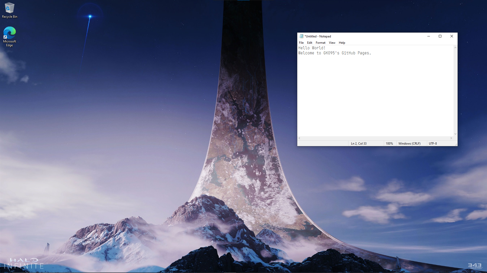</div><center style="font-weight: bold;">그림 1. MFC 구조 설명을 위한 예시.</center>


### 문서
`CDocument` 클래스의 객체인 문서(document)는 MFC 구조 중에서 가장 작은 요소이며, 응용 프로그램이 가지는 텍스트 데이터 혹은 이미지나 오디오와 같은 미디어 자료를 가리킨다. 위의 메모장 예시에서 문서는 아래에 해당한다.

```
Hello World!
Welcome to GKO95's GitHub Pages.
```

### 뷰
`CView` 클래스의 객체인 뷰(view)는 문서를 어떻게 보여줄 것인지 혹은 처리할 것인지 등의 상호작용 방식을 결정한다. 마치 이미지 파일을 사진으로 볼 수 있는 반면, 메모장으로 열어 이미지 파일을 구성하는 자료를 텍스트로 확인할 수도 있는 이치이다. 문서를 담고있기 때문에 문서 창(document window)라고 부르기도 한다. 위의 메모장 예시에서 뷰는 아래에 해당한다.

<div style="background-color:white; border:solid 3px #808e95; text-align: center; border-radius:0.5em; margin-left:auto; margin-right: auto; width: fit-content">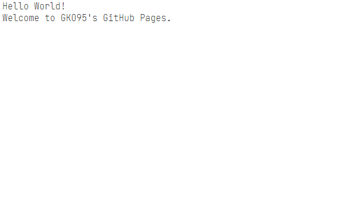</div><center style="font-weight: bold;">그림 2. 메모장의 뷰(view) 구조물.</center>

### 프레임 창
우선 윈도우 OS에서 창(window)란 무엇인지 확실히 짚고 갈 필요가 있다. 영어를 공부하면 아시다시피, window는 창문을 의미한다: 우리는 창문 너머 무언가를 바라보는데, 바로 윈도우 OS 명칭이 이런 사각형 창문에서 따온 이름이다. 그리고 동일한 이유로 직사각형 모양의 프로그램 GUI를 어플리케이션 창(application window)라고 부른다.

프레임 창(frame window)은 뷰 구조물을 담을 수 있는 테두리(frame)를 제공한다. 그러나 MFC에서는 프레임 창을 생성하는 클래스가 크게 두 가지로 나뉘어지며, 이는 각각 SDI 및 MDI로 구별된다:

* 단일 문서 인터페이스(Single Document Interface; SDI)는 하나의 문서만을 처리하도록 되어있으며, `CFrameWnd` 클래스로부터 객체화된다. 메모장 프로그램이 바로 SDI 형식에 해당한다.

* 다중 문서 인터페이스(Multiple Document Interface; MDI)는 여러 문서들을 하나의 프로그램에서 처리할 수 있도록 하며, `CMDIFrameWnd` 및 `CMDIChildWnd` 클래스로부터 객체화된다. 여기서 `CMDIFrameWnd` 클래스가 프레임 창의 본체이며, `CMDIChildWnd` 클래스를 자식으로 두어 각 문서들을 보여준다. 비주얼 스튜디오가 MDI 형식의 프로그램 중 하나이다.

<div style="background-color:white; border:solid 3px #808e95; text-align: center; border-radius:0.5em; margin-left:auto; margin-right: auto; width: fit-content">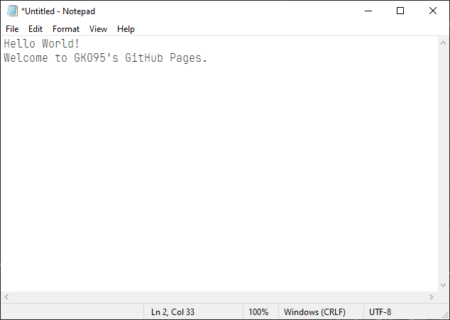</div><center style="font-weight: bold;">그림 3. 메모장의 프레임 창(frame window) 구조물.</center>

### 어플리케이션
`CWinApp` 클래스 객체인 어플리케이션(application)은 본격적으로 프로그램을 초기화하고 실행하는 역할을 담당한다. 그래픽 사용자 인터페이스를 마련하여도 어플리케이션이 해당 창을 호출하여 실행하지 않으면 GUI가 없는 프로그램이 되거나, 일반적으로 프로그램이 즉시 종료된다. 위의 메모장 예시에서 어플리케이션은 아래에 해당한다.

<div style="background-color:white; border:solid 3px #808e95; text-align: center; border-radius:0.5em; margin-left:auto; margin-right: auto; width: fit-content">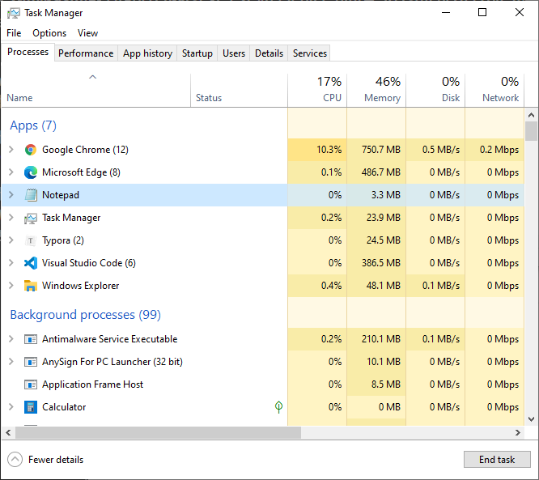</div><center style="font-weight: bold;">그림 4. 메모장의 어플리케이션(frame window) 구조물.</center>

### 쓰레드
`CWinThread` 클래스 객체인 쓰레드(thread) 여러 작업을 동시에 진행할 수 있도록 한다. 비록 GUI 요소가 아니지만 어플리케이션 객체를 생성하는 `CWinApp` 클래스의 기반 클래스로 상당한 중요성을 가진다. 다시 말해, 어플리케이션은 쓰레드 중 하나이지만 가장 핵심이 되는 쓰레드이다.

## MFC 리소스
리소스(resource)는 어플리케이션을 사용하기 위해 필요한 데이터와 정보를 제공한다. 비트맵 이미지 및 아이콘, 마우스 포인터, 메뉴와 툴바, 다이얼로그 창 등이 MFC의 리소스에 해당한다.

| 리소스        | 설명                                |
|:------------:|------------------------------------|
| Accelerator  | 프로그램 전용 단축키                        |
| Bitmap       | 비트맵 이미지                            |
| Cursor       | 마우스 포인터                            |
| Dialog       | 다이얼로그 (일명 팝업창)                     |
| HTML         | HTML 파일                               |
| Icon         | 프로그램 아이콘                           |
| Menu         | 텍스트로 구성된 프로그램 기본 컨트롤바              |
| Ribbon       | *Menu* 그리고 *Toolbar* 리소스가 병합된 컨트롤바 |
| String Table | 사전등록 문자열 목록; 각 문자열마다 할당된 ID로 호출    |
| Toolbar      | 비트맵 및 아이콘으로 구성된 프로그램 보조 컨트롤바       |
| Version      | 프로그램 버전 정보                         |

여기서 메뉴와 툴바의 차이점이 명확하지 않아 잘 구분이 되지 않을 수 있다. 비주얼 스튜디오를 예를 들어보면 메뉴는 아래와 같다.

<div style="background-color:white; border:solid 3px #808e95; text-align: center; border-radius:0.5em;"></div><center style="font-weight: bold;">그림 5. 비주얼 스튜디오 메뉴 리소스.</center>

메뉴는 각 프레임 창마다 하나만 가질 수 있는 특징이 있으며, 주로 프로그램 옵션 및 설정에 자주 사용된다. 메모장 프로그램에도 메뉴 리소스가 존재하는 것을 확인할 수 있다.

한편, 비주얼 스튜디오에서 툴바는 아래와 같다.

<div style="background-color:white; border:solid 3px #808e95; text-align: center; border-radius:0.5em;">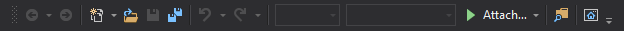</div><center style="font-weight: bold;">그림 6. 비주얼 스튜디오 툴바 리소스.</center>

비트맵 이미지나 아이콘이 버튼을 구성하고 있으며, 일반적으로 도구의 접근성을 제공하기 위해 사용된다. 그러한 이유로 메뉴와 달리, 하나의 프레임 창에 여러 개의 툴바를 삽입할 수 있다. 메모장 프로그램에서는 툴바가 존재하지 않는다.

다이얼로그 창이란, 규모가 작은 프레임 창으로 대체로 어플리케이션에서 사용자에게 알림이나 메시지를 전달므로써 대화(dialog)하기 위해 사용된다. 비록 다이얼로그 창은 `CWnd:CDialog` 클래스로 프레임 창인 `CWnd:CFrameWnd`와 다르지만 형제 클래스로서 유사한 기능성을 가진다. 다이얼로그 창은 소규모 프로그램을 개발하는 데에도 흔히 사용되며, 아래는 비주얼 스튜디오에서 나타나는 다이얼로그 창을 활용한 예시 중 하나이다. 

<div style="background-color:white; border:solid 3px #808e95; text-align: center; border-radius:0.5em; margin-left:auto; margin-right: auto; width: fit-content">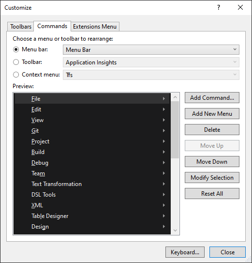</div><center style="font-weight: bold;">그림 7. 비주얼 스튜디오 다이얼로그 리소스.</center>

이처럼 MFC에는 여러 종류의 리소스가 존재하며, 이들은 `.rc` 확장자 파일에서 모두 관리된다. 리소스들을 접근하기 위해서는 각각에 부여된 ID를 호출하며 이들은 `Resource.h` 헤더 파일에 자동적으로 기입된다. 리소스 파일과 헤더 파일의 연동은 아래의 코드로부터 이루어진다.

```cpp
1 TEXTINCLUDE 
BEGIN
    "resource.h\0"
END
```

`.rc` 파일과 `Resource.h` 헤더 파일은 비주얼 스튜디오에서 MFC 프로젝트를 생성하면 기본적으로 생성되는 파일들이며, 아래는 리소스 파일과 해당 헤더 파일의 일부를 보여준다.

```cpp
IDD_ABOUTBOX DIALOGEX 0, 0, 170, 62
STYLE DS_SETFONT | DS_MODALFRAME | DS_FIXEDSYS | WS_POPUP | WS_CAPTION | WS_SYSMENU
CAPTION "About MFC Application"
FONT 8, "MS Shell Dlg"
BEGIN
    ICON            IDR_MAINFRAME,IDC_STATIC,14,14,21,20
    LTEXT           "MFC Application, Version 1.0",IDC_STATIC,42,14,114,8,SS_NOPREFIX
    LTEXT           "Copyright (C) 2020",IDC_STATIC,42,26,114,8
    DEFPUSHBUTTON   "OK",IDOK,113,41,50,14,WS_GROUP
END
```

```cpp
#define IDD_ABOUTBOX				100
```

`IDD_ABOUTBOX`는 다이얼로그 창의 ID 중 하나이며, 위의 예시에서는 `IDD_ABOUTBOX`에 고유번호 양의 정수 `100`이 할당되었다. 그러므로 해당 다이얼로그를 호출하기 위해서는 문자열 `IDD_ABOUTBOX` 혹은 정수형 `100`을 기입하면 된다. 그렇지만 문자형과 정수형 ID는 고정된 값이 아니며 개발자가 원하는대로 변경해서 사용할 수 있다. 단, 문자열 및 정수형 ID는 절대 중복되어서는 안되며, 문자열 ID는 리소스 파일에 명시된 ID와 반드시 동일한 명칭을 가져야 한다.

### 컨트롤
MFC에서 컨트롤(control)이란, 데이터를 입력 혹은 수정할 수 있는 상호작용 가능한 리소스를 가리킨다. 일반적으로 다이얼로그 창의 버튼이나 텍스트 등으로 사용되는데, 대표적으로  버튼을 생성하는 `CButton`, 입력란을 생성하는 `CEdit`, 텍스트를 생성하는 `CStatic` 클래스 등이 있다. 컨트롤은 창을 생성하는 `CWnd` 클래스로부터 파생되었으므로, 하나의 창(window)처럼 다루면 된다.

컨트롤 또한 리소스이기 때문에 리소스 파일 및 `Resource.h` 헤더 파일에 ID를 가지고 있다.

# **MFC: 프로젝트 생성**
> *본 내용부터 실질적인 MFC 프로그래밍을 소개하므로, 반드시 C++ 내용을 숙지하도록 한다.*

위의 내용은 MFC 프레임워크에 대한 매우 기본적인 내용이다. 그 외에도 프레임워크 실행 단계, 메시지, 디바이스 컨텍스트 등 중요한 내용들을 아직 설명하지 않았으나, 기본적인 MFC 어플리케이션이 어떻게 구성되어 있는지 알아보는 것도 차후 내용을 이해하는데 큰 도움이 될 수 있다. 그러므로 본 장에서는 직접 비주얼 스튜디오에서 MFC 프로젝트를 생성 및 기본적인 코드과 API를 설명한다.

## 비주얼 스튜디오

[비주얼 스튜디오](https://visualstudio.microsoft.com/downloads/)(Visual Studio)는 마이크로소프트에서 개발한 윈도우 OS의 대표적인 IDE이다. 비주얼 스튜디오는 총 세 가지의 에디션이 존재하며, 무료 버전인 커뮤니티 에디션으로도 MFC 프로젝트를 생성할 수 있다. 통합 개발 환경인 만큼 다른 프로그래밍 언어도 함께 지원하므로 여러 종류의 구성요소를 제공한다. 그 중에서 MFC 프로젝트를 위해서는 "Desktop development with C++"를 선택한다.

<div style="background-color:white; border:solid 3px #808e95; text-align: center; border-radius:0.5em;">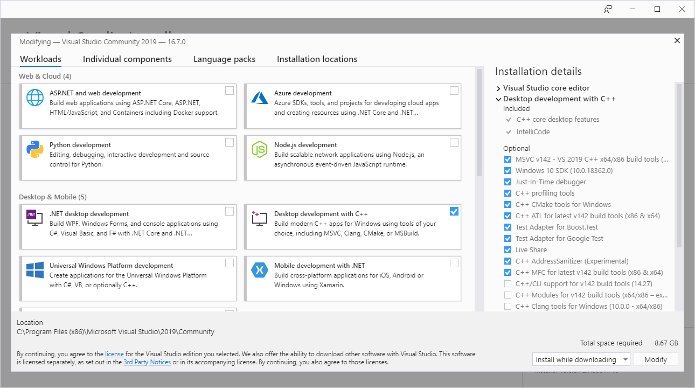</div><center style="font-weight: bold;">그림 8. 비주얼 스튜디오 MFC 프로젝트를 위한 구성요소.</center>

만일 한국어 지원을 원한다면 "Language packs" 탭에서 한국어를 함께 선택하면 된다.

비주얼 스튜디오를 실행하면 아래와 같은 시작화면이 나타난다. 새로운 프로젝트를 생성하려면 오른쪽 하단의 "Create a new project" 버튼을 클릭한다.

<div style="background-color:white; border:solid 3px #808e95; text-align: center; border-radius:0.5em;">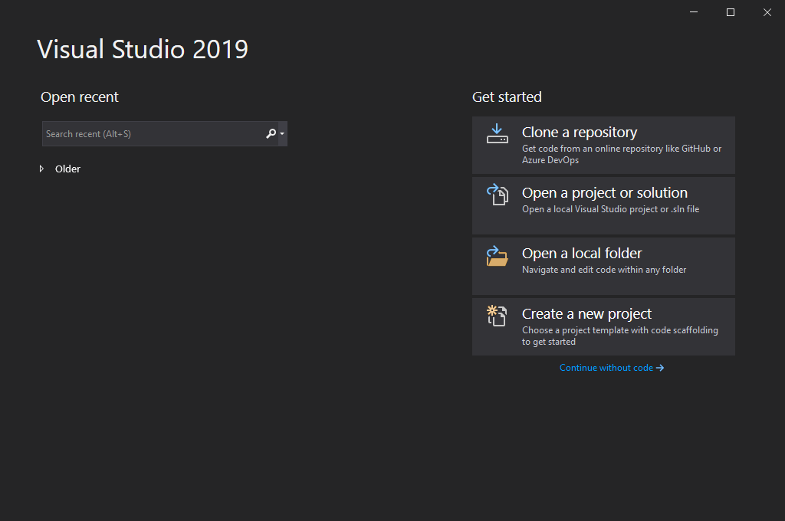</div><center style="font-weight: bold;">그림 9. 비주얼 스튜디오 시작화면.</center>

MFC는 윈도우 OS 어플리케이션을 위한 C++ 객체지향 라이브러이다. MFC 프로젝트를 생성하기 위해서는 아래의 필터를 설정하던가 직접 "MFC App" 옵션을 선택한다.

<div style="background-color:white; border:solid 3px #808e95; text-align: center; border-radius:0.5em;">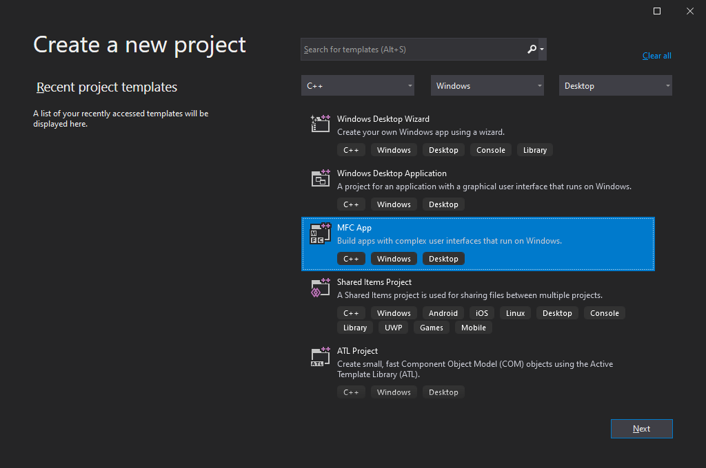</div><center style="font-weight: bold;">그림 10. 비주얼 스튜디오 MFC 프로젝트 생성 (1단계).</center>

프로젝트 및 솔루션 이름을 선정한다. 여기서 프로젝트란, 소스 코드와 컴파일러 설정 등의 실질적인 코딩 내용을 관리하는 `.vcxproj` 확장자 파일이며, 솔루션은 여러 프로젝트 파일을 하나의 폴더처럼 담는 `.sln` 파일이다. 비주얼 스튜디오에서 프로젝트는 `.sln` 파일로 열기를 권장한다.

<div style="background-color:white; border:solid 3px #808e95; text-align: center; border-radius:0.5em;">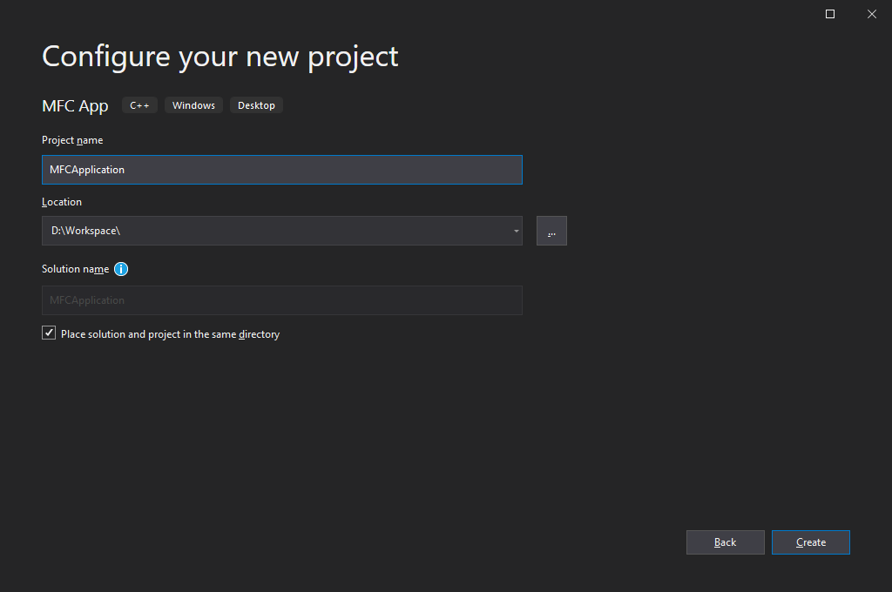</div><center style="font-weight: bold;">그림 11. 비주얼 스튜디오 MFC 프로젝트 생성 (2단계).</center>

프로젝트 생성 버튼을 클릭하면 MFC 어플리케이션 설정 창이 나타난다. 본 장은 MFC 어플리케이션 프로젝트를 생성하는 방법과 API들을 설명하기 위함으로 가장 기본적인 어플리케이션 종류, 즉 Application type: `Dialog based`를 선택한다. 

<div style="background-color:white; border:solid 3px #808e95; text-align: center; border-radius:0.5em;">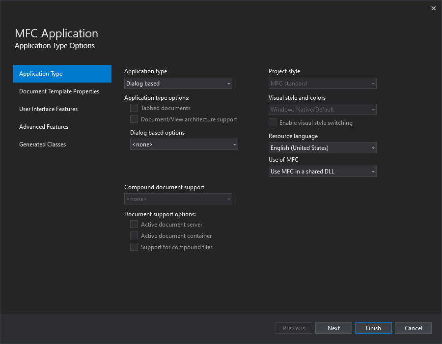</div><center style="font-weight: bold;">그림 12. 비주얼 스튜디오 MFC 프로젝트 생성 (3단계).</center>

비록 SDI나 MDI가 아닌 다이얼로그 창을 선택하였으나 간단하면서도 넓은 활용도를 가지는 어플리케이션 종류이다. SDI 및 MDI 어플리케이션이 아닌 관계로 Document Template Properties 단계는 비활성화 되어있다.

User Interface Feature 단계에서는 기본적인 프레임 창 구성을 설정한다. 다음은 다이얼로그 기반 어플리케이션을 생성할 시 기본설정 스타일이다.
* 두꺼운 프레임 (Thick frame): 프레임 창이 두꺼운 테두리를 가진다.
* 시스템 메뉴 (System menu): 아이콘, 최소화(Minimize box) 및 최대화(Maximize box) 그리고 닫기(close) 버튼을 제공하는 어플리케이션 최상단의 프레임 창 제어요소이다.
* About 상자 (About box): 프로그램 기본 정보를 제공하는 다이얼로그 창이다.

<div style="background-color:white; border:solid 3px #808e95; text-align: center; border-radius:0.5em;">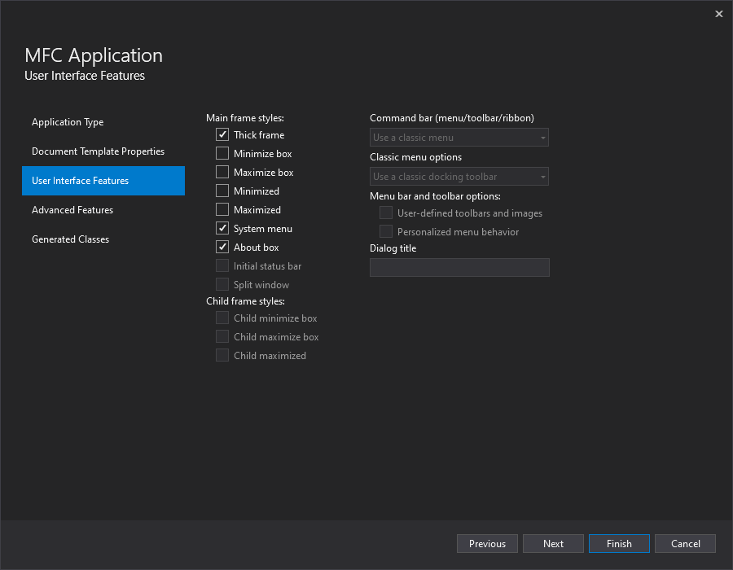</div><center style="font-weight: bold;">그림 13. 비주얼 스튜디오 MFC 프로젝트 생성 (4단계).</center>

Advanced Features는 MFC 프로젝트에서 추가적인 고급 옵션 설정을 다룬다. 다음은 다이얼로그 기반 어플리케이션을 생성할 시 기본설정 기능들이다.
* 프린트 및 프린트 미리보기 (Print and print preview)
* 액티브엑스 컨트롤 (ActiveX controls)
* 공통 컨트롤 선정 (Common Control Manifest)
* 재시작 관리자 지원 (Support Restart Manager)
* 이전 문서 다시열기 (Reopen previously open documents)
* 어플리케이션 복구 지원 (Support application recovery)

하지만 가장 기본적인 MFC 개념 및 원리 설명이 목적이므로 이번 프로젝트에서는 해당 고급 옵션을 아래와 같이 모두 해제한다.

<div style="background-color:white; border:solid 3px #808e95; text-align: center; border-radius:0.5em;">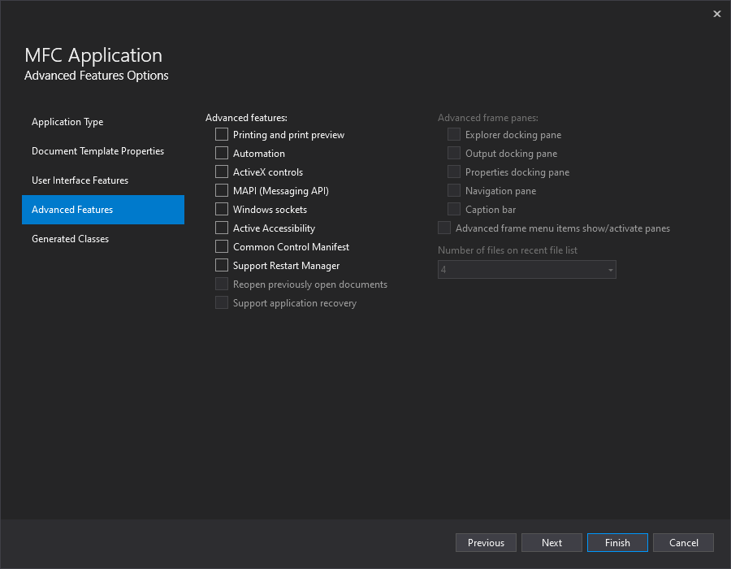</div><center style="font-weight: bold;">그림 14. 비주얼 스튜디오 MFC 프로젝트 생성 (5단계).</center>

MFC 어플리케이션 설정 마지막 단계로 Generate Classes가 있다. C++ 객체지향 라이브러리이기 때문에 객체를 기반으로 어플리케이션이 실행되며, 다이얼로그 기반 어플리케이션은 기본적으로 두 개의 클래스가 생성된다: 어플리케이션의 `CWinApp` 그리고 다이얼로그 창의 `CDialog`(혹은 확장된 기능을 가진 `CDialogEx`)가 있다. 해당 단계에서는 각 클래스의 이름을 선정하는 작업이며, 이해를 돕기 위해 기본명칭인 `CMFCApplicationApp` 그리고 `CMFCApplicationDlg`를 그대로 사용하였다.

<div style="background-color:white; border:solid 3px #808e95; text-align: center; border-radius:0.5em;">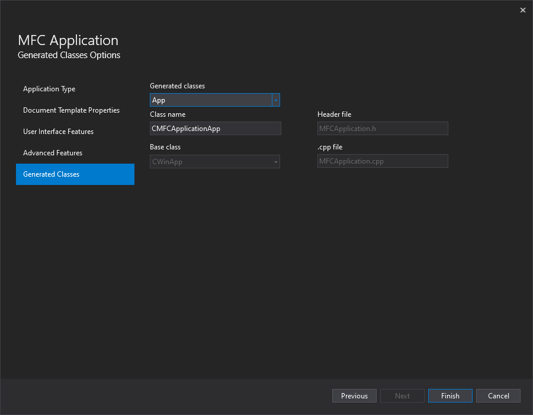</div><center style="font-weight: bold;">그림 15. 비주얼 스튜디오 MFC 프로젝트 생성 (6단계).</center>

프로젝트 설정을 완료하면 MFC 어플리케이션에서 설정한 내용대로 `CWinApp`을 기반으로 한 `CMFCApplicationApp` 어플리케이션 클래스와 `CDialogEx`을 기반으로 한 `CMFCApplicationDlg` 다이얼로그 클래스가 생성된 것을 확인할 수 있다.

<div style="background-color:white; border:solid 3px #808e95; text-align: center; border-radius:0.5em;">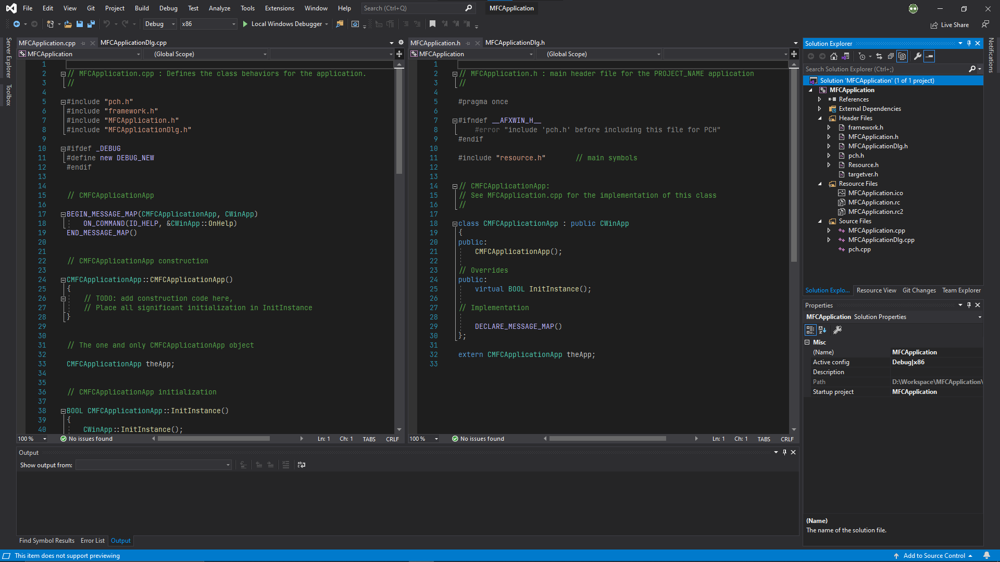</div><center style="font-weight: bold;">그림 16. 비주얼 스튜디오 MFC 프로젝트.</center>

그 외에도 솔루션 탐색기를 보면 추가적인 파일이 생성된 것을 볼 수 있다.

| 파일 | 설명 |
|:-:|---|
| `pch.h` | [컴파일된 헤더](/docs/programming/ko/PRGMING_Cpp/#컴파일된-헤더) |
| `Resource.h` | 리소스 헤더 파일 |
| `framework.h` | MFC 동작을 위한 요소 호출 |
| `targetver.h` | OS에 따른 MFC 컨트롤 버전 선택 |
| `MFCApplication.rc` | 리소스 파일 (시스템 자동기입) |
| `res/MFCApplication.rc2` | 리소스 파일 (부가적 수동기입) |
| `res/MFCApplication.ico` | 기본 아이콘 파일 |

여기서 `.rc2` 파일은 개발자가 추가적인 리소스를 추가하고자 할 때 `.rc`를 건들지 않고 안전하게 추가하고자 할 때 사용된다. `.rc2` 확장자는 아래와 같이 간접적으로 프로젝트의 `.rc` 리소스 파일에 추가된다. 즉, `.rc2` 확장자 파일은 외부 리소스를 불러오기 위해 사용된다.

```cpp
#include "res\MFCApplication.rc2"  // non-Microsoft Visual C++ edited resources
```

`.rc` 리소스 파일을 클릭하면 비주얼 스튜디오에서 리소스 뷰를 보여준다. 이는 해당 파일 안에 어떠한 리소스가 들어있는지 텍스트가 아닌 시각적으로 보여준다. 아래는 다이얼로그 리소스를 비주얼 스튜디오에서 열었을 때의 모습이다.

<div style="background-color:white; border:solid 3px #808e95; text-align: center; border-radius:0.5em;">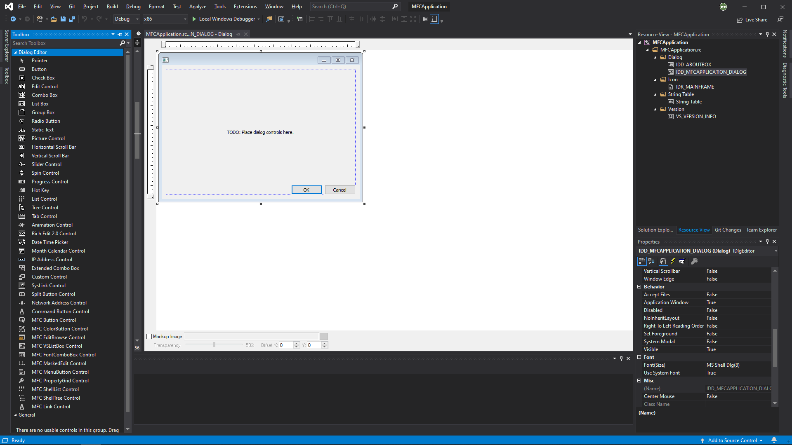</div><center style="font-weight: bold;">그림 18. 비주얼 스튜디오 MFC 다이얼로그 리소스.</center>

Toolbox에는 다이얼로그에 삽입할 수 있는 여러가지 컨트롤들이 존재하며, 이와 함께 속성에서 스타일을 변경하여 다이얼로그를 꾸밀 수 있다.

## MFC 프로젝트 분석
이전 부문에서 설명한 절차를 따라 가장 기초적인 다이얼로그 기반 MFC 프로젝트를 생성하였다. 이제부터 각 코드와 API가 MFC 어플리케이션 생성에 어떠한 역할을 하는지 하나씩 알아보는 차례를 갖는다.

먼저 C++ 프로그래밍 언어에는 [`WinMain()` 시작점](/docs/programming/ko/PRGMING_Cpp/#winmain-함수)이 있다는 점을 다시 한 번 언급할 필요가 있다; MFC 어플리케이션은 전통적인 `main()` 시작점이 아닌 `WinMain()` 시작점에서부터 프로그램이 실행된다. 그러나 MFC 프로젝트에는 `WinMain()` 시작점을 찾아볼 수가 없으며, 이는 MFC 라이브러리가 내부적으로 시작점을 꾸며주기 때문에 코드 상으로 드러나지 않는 것이다. 그리고 이에 직접 관여하는 클래스가 바로 `CWinApp`이다.

### `CWinApp` 클래스
MFC 어플리케이션을 실행할 때 가장 먼저 수행되는 코드가 바로 `CWinApp` 클래스 객체화이다. 객체가 없으면 프로그램을 실행하는 프로세스가 생성되지 않기 때문이다.

```cpp
CMFCApplicationApp theApp;
```

그러면 자동적으로 객체의 생성자가 수행된다.

```cpp
CMFCApplicationApp::CMFCApplicationApp()
{
    // TODO: add construction code here,
    // Place all significant initialization in InitInstance
}
```

`CWinApp`의 객체화 및 생성자 이후부터 본격적으로 `WinMain()` 시작점이 동작한다. 그 중에서 가장 우선적으로 실행되는 메소드가 바로 `InitInstance()`이다. 해당 메소드는 객체 초기화하는데 사용된다.

```cpp
BOOL CMFCApplicationApp::InitInstance()
{
    CWinApp::InitInstance();

    ...

}
```

여기서 `CWinApp::InitInstance()` 메소드가 객체 초기화를 담당하는 가상 메소드이다. 하지만 가상 메소드가 `CMFCApplicationApp::InitInstance()`로 오버라이딩 되어 객체 초기화 기능이 상실된다. 이러한 이유로 내부에 `CWinApp`의 메소드를 별개로 호출한 것이다.

아래는 MFC 어플리케이션에서 명령 프롬프트(command prompt)나 파워셸(powershell)과 같은 셸을 관리할 수 있는 객체를 생성한다. 하지만 MFC 어플리케이션에서 셀을 사용하지 않는다면 해당 코드는 삭제해도 무관하다.

```cpp
    // Create the shell manager, in case the dialog contains
    // any shell tree view or shell list view controls.
    CShellManager *pShellManager = new CShellManager;

    // Delete the shell manager created above.
    if (pShellManager != nullptr)
    {
        delete pShellManager;
    }
```

MFC 어플리케이션에는 비주얼 관리자(visual manager)가 존재한다. 어플리케이션 컨트롤이 어떻게 나타나는지 결정하는 데 사용되며 [여기](https://docs.microsoft.com/ko-kr/cpp/mfc/visualization-manager?view=msvc-160)를 클릭하여 MFC 라이브러리에서 제공하는 일부 예시를 볼 수 있다. 아래는 기본 비주얼 스타일인 "Window Native/Default"를 적용시키는 코드이다. 그러나 "Window Native/Default" 스타일을 그대로 사용할 경우, 위의 코드는 생략해도 된다.

```cpp
    // Activate "Windows Native" visual manager for enabling themes in MFC controls
    CMFCVisualManager::SetDefaultManager(RUNTIME_CLASS(CMFCVisualManagerWindows));
```

MFC 어플리케이션은 프로그램 설정과 같은 일부 데이터를 레지스트리(registry)에 저장할 수 있다. 이 또한 선택적인 코드이므로 만일 레지스트리를 사용하지 않을 시에는 응용 프로그램 용량을 줄이기 위해 해당 코드를 삭제하는 것을 권장한다.

```cpp
    // Standard initialization
    SetRegistryKey(_T("Local AppWizard-Generated Applications"));
```

모든 초기 설정이 완료되었으면 다이얼로그 창을 띄워 GUI를 활성화한다. 아래는 MFC 프로젝트 설정 과정에서 선정한 `CMFCApplicationDlg` 다이얼로그 창 클래스를 객체화하여 `DoModal()` 함수로 GUI를 띄어준다.

```cpp
    CMFCApplicationDlg dlg;
    m_pMainWnd = &dlg;
    INT_PTR nResponse = dlg.DoModal();
    if (nResponse == IDOK)
    {
        // TODO: Place code here to handle when the dialog is
        //  dismissed with OK
    }
    else if (nResponse == IDCANCEL)
    {
        // TODO: Place code here to handle when the dialog is
        //  dismissed with Cancel
    }
    else if (nResponse == -1)
    {
        // TODO: Place code here to handle when the dialog is
        //  dismissed with the others
    }
```

만일 다이얼로그 창이 OK 및 Cancel 버튼을 가진다면 클릭 시 `CDialog.DoModal()` 메소드가 종료된다. 다이얼로그 창이 닫히는 동시 메소드는 클릭된 버튼에 따라 정수형을 반환된다. OK 버튼을 클릭하면 `IDOK`(정수형 1), Cancel 버튼을 클릭하면 `IDCANCEL`(정수형 2)가 반환된다.

### `CDialog` 클래스
MFC 어플리케이션은 `CWinApp`의 객체에서 `CDialog` 클래스를 객체화하여 다이얼로그 창을 생성하였다. 이번 내용은 객체화된 다이얼로그 창이 어떠한 절차를 걸쳐 프로그램에 나타나는지 설명한다.

다이얼로그를 생성하면 우선 객체의 생성자가 실행된다.

```cpp
CMFCApplicationDlg::CMFCApplicationDlg(CWnd* pParent /*=nullptr*/)
    : CDialogEx(IDD_MFCAPPLICATION_DIALOG, pParent)
{
    m_hIcon = AfxGetApp()->LoadIcon(IDR_MAINFRAME);
}
```

이는 아이콘 리소스를 `m_hIcon` 맴버로 할당하는 코드이며, 주의해야 할 점은 절대로 `m_hIcon`를 메소드 내의 지역 변수로 정의하지 말아야 한다는 것이다. 지역 변수는 스택 메모리에 할당되므로 메소드가 끝나는 즉시 할당 해제되어 데이터가 사라진다. 이러한 이유로 리소스는 클래스 맴버에 할당하여 호출해야 한다.

`CWinApp`와 유사하게 `CDialog`에서도 객체를 초기화하는 `OnInitDialog()` 메소드가 존재한다. 이 또한 가상 메소드이므로 `CDialog` 클래스에서 직접 호출할 필요가 있다. 이후에 실행되는 다음 코드는 About 상자를 시스템 메뉴에 추가하는 작업이다.

```cpp
    // Add "About..." menu item to system menu.
    
    // IDM_ABOUTBOX must be in the system command range.
    ASSERT((IDM_ABOUTBOX & 0xFFF0) == IDM_ABOUTBOX);
    ASSERT(IDM_ABOUTBOX < 0xF000);
    
    CMenu* pSysMenu = GetSystemMenu(FALSE);
    if (pSysMenu != nullptr)
    {
        BOOL bNameValid;
        CString strAboutMenu;
        bNameValid = strAboutMenu.LoadString(IDS_ABOUTBOX);
        ASSERT(bNameValid);
        if (!strAboutMenu.IsEmpty())
        {
            pSysMenu->AppendMenu(MF_SEPARATOR);
            pSysMenu->AppendMenu(MF_STRING, IDM_ABOUTBOX, strAboutMenu);
        }
    }
```

위의 코드는 MFC 어플리케이션 시스템 메뉴 우클릭 시 `About MFCApplication...` 옵션이 나타나게 된다. 반면 코드가 없으면 해당 옵션은 나타나지 않는다.

<div style="background-color:white; border:solid 3px #808e95; text-align: center; border-radius:0.5em; margin-left:auto; margin-right: auto; width: fit-content">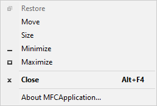</div><center style="font-weight: bold;">그림 7. MFC 어플리케이션 시스템 메뉴.</center>

아래의 코드는 생성자에서 할당받은 아이콘 리소스를 다이알로그 리소스에 적용시킨다.

```cpp
    // Set the icon for this dialog.  The framework does this automatically
    //  when the application's main window is not a dialog
    SetIcon(m_hIcon, TRUE);         // Set big icon
    SetIcon(m_hIcon, FALSE);        // Set small icon
```

GUI에서 반영될 추가적으로 초기화할 데이터가 있으면 `OnInitDialog()` 내에 삽입하면 된다.

시스템 메뉴 우클릭 시, `OnSysCommand()` 메소드가 실행된다. `OnSysCommand()` 또한 가상 메소드로부터 오버라이딩 된 것이다. 기존의 `CDialog::OnSysCommand()` 가상 메소드가 없을 시에는 `About MFCApplication...` 옵션 이외의 모든 시스템 메뉴 기능이 동작하지 않는다.

```cpp
void CMFCApplicationDlg::OnSysCommand(UINT nID, LPARAM lParam)
{
    if ((nID & 0xFFF0) == IDM_ABOUTBOX)
    {
        CAboutDlg dlgAbout;
        dlgAbout.DoModal();
    }
    else
    {
        CDialogEx::OnSysCommand(nID, lParam);
    }
}
```
