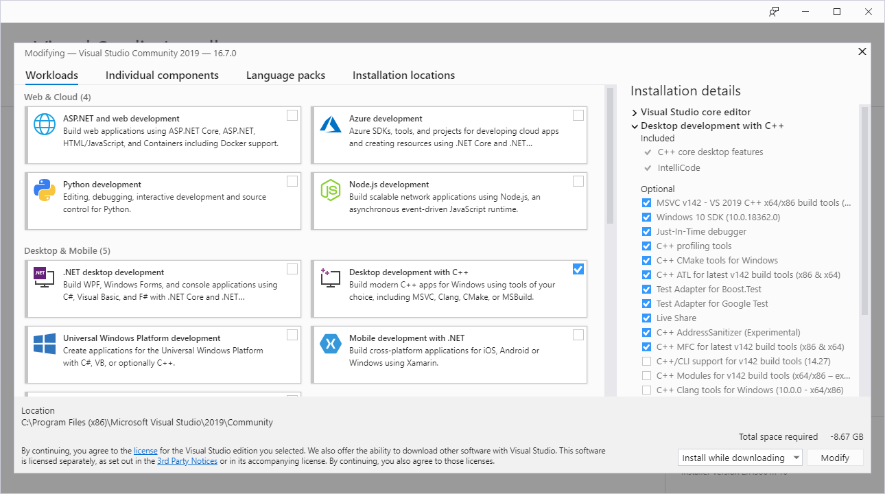
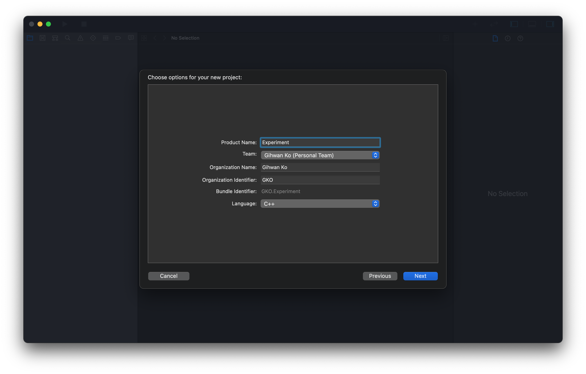

# **C++: INTRO**
> *Refernce: [Microsoft Docs C++ Language Documentation](https://docs.microsoft.com/en-us/cpp/cpp/)*

C++ is a general-purpose low-level programming language based on C language. While C is a procedural programming language that executes codes top-to-bottom, C++ allows object-oriented programming as well; thus, C++ is called a hybrid language. C++, an extension of C language, guarantees a wide range of applications from various features.

## Compiled Language
There are two different categories of program languages based on its execution: compiled language and interpreted language.

An interpreter allows a computer to reads the source code written in English and execute directly, mostly benefitting from cross-platform support that can run the program on a different system and architecture. Python is one of the best examples of an interpreted language. However, a compiler generates an object file written in machine-friendly code by translating from English-written source code.

C++ language is a compiled language that doesn't support cross-platform, but it processes faster than interpreted language due to its optimization to the current system.

### Compiler
C++ language categorizes its compiler version by the year of standard released by the International Organization for Standardization(ISO); C++11 and C++17 is the most renowned version. This document introduces C++ language based on the C++11 compiler at minimum.

### Preprocessor
A preprocessor is responsible for optimizing the source code before the compiler translates to binary code. A command for a preprocessor is called *preprocessor directive* and has octothorpe `#` at its prefix.

| DIRECTIVES | EXAMPLE               | DESCRIPTION                                          |
| :--------------------- | --------------------- | ------------------------------------------------ |
| `#include`             | `#include <iostream>` | Includes header file to the script.               |
| `#define`              | `#define SQUARE`      | Defines new macro for the project. |
| `#pragma`              | `#pragma once`        | Provides additional options for the compiler.      |

A preprocessor does not read C++ language source code nor follows C++ language syntax. It only processes its directives, removes comments, and provides optimized source code to the compiler. A preprocessor directive isn't necessary but makes the coding easier and convenient. The preprocessor resides within the compiler program.

# **C: INSTALL**
A compiler for C++ is essential when developing with C++ programming language, and there are various C++ compilers available designed by different companies and organizations. The compilation method may differ depending on the compiler, but it doesn't matter for general users as every compiler observes the same ISO standard that defines the working mechanism.

An integrated development environment is a software development program that provides a source code editor and program build tools, compiling source codes to an executable program. This chapter introduces the installation and configuration of an IDE for a C++ language project.

## Visual Studio
[Visual Studio](https://visualstudio.microsoft.com/downloads/) is the most renowned IDE for Windows OS developed by Microsoft, which uses the MSVC compiler. There are three editions for Visual Studio, and the free community edition is enough for development. The IDE provides various components to support different languages as well; for C++ programming, select the "Desktop development with C++" workload.

<div style="background-color:white; border:solid 3px #808e95; text-align: center; border-radius:0.5em;"></div><center style="font-weight: bold;">Figure 1. Workload for C++ programming on Visual Studio.</center>

Visual Studio will start with the window shown below. To create a new project for C++ language, select the "Create a new project" button.

<div style="background-color:white; border:solid 3px #808e95; text-align: center; border-radius:0.5em;"></div><center style="font-weight: bold;">Figure 2. Startup window of Visual Studio.</center>

Since C++ can create various applications, there are many different kinds of projects available from Visual Studio as well. To create a C project, follow the procedure below:

1. Select the language as C++ and choose the "Console App" option.

<div style="background-color:white; border:solid 3px #808e95; text-align: center; border-radius:0.5em;"></div><center style="font-weight: bold;">Figure 3. Creating a C++ project on Visual Studio (step 1).</center>

2. Designate names for the project and solution. Here, the project is a `.vcxproj` extension file that manages its source codes and compilation options, and the solution is a `.sln` extension file that can contain multiple projects. It is recommended to open the solution file on Visual Studio unless you only want to open a single project.

<div style="background-color:white; border:solid 3px #808e95; text-align: center; border-radius:0.5em;"></div><center style="font-weight: bold;">Figure 4. Creating a C++ project on Visual Studio (step 2).</center>

3. Use the project automatically prepared by Visual Studio.

<div style="background-color:white; border:solid 3px #808e95; text-align: center; border-radius:0.5em;"></div><center style="font-weight: bold;">Figure 5. Creating a C++ project on Visual Studio (step 3).</center>

The three-step procedure above for creating a C++ console application is the simplest method. To create an empty C++ project, refer to the installation section on the *PRGMING_C* document.

Visual Studio can run a C language program in two different ways: debugging mode (`F5`) and without debugging mode (`Ctrl+F5`). Debugging mode is used to inspect the problem and visualize the process, otherwise run without debugging is recommended.

## Xcode
[Xcode](https://developer.apple.com/download/release/) is the most renowned IDE for macOS developed by Apple, which uses the clang compiler. Xcode supports various languages, and just like Visual Studio, Xcode has a project option for C++ language.

Start Xcode, then create a new project by selecting `File > New > Project...`.

<div style="background-color:white; border:solid 3px #808e95; text-align: center; border-radius:0.5em;"></div><center style="font-weight: bold;">Figure 7. Startup window of Xcode.</center>

There are various projects available for developing an application for Apple's product. To create a C++ project, follow the procedure below:

1. Since the computer is macOS, select the macOS tab, then the Command Line Tool to execute a terminal-based program.

<div style="background-color:white; border:solid 3px #808e95; text-align: center; border-radius:0.5em;"></div><center style="font-weight: bold;">Figure 8. Creating a C++ project on Xcode (step 1).</center>

2. Name a project in the Product Name and select the Language as C++.

<div style="background-color:white; border:solid 3px #808e95; text-align: center; border-radius:0.5em;"></div><center style="font-weight: bold;">Figure 9. Creating a C++ project on Xcode (step 2).</center>

3. Designate a path for the project.

<div style="background-color:white; border:solid 3px #808e95; text-align: center; border-radius:0.5em;"></div><center style="font-weight: bold;">Figure 10. Creating a C++ project on Xcode (steo 3).</center>

4. The left panel shows there is the `main.cpp` source file under the `Experiment` folder with minimum codes required to run the program.

<div style="background-color:white; border:solid 3px #808e95; text-align: center; border-radius:0.5em;"></div><center style="font-weight: bold;">Figure 11. Creating a C++ project on Xcode (step 4).</center>

Xcode can run a C++ language program in two different ways: debugging mode and without debugging mode. Hotkey for both are `⌘+R` and whether to debug or not is configured on project setting. Debugging mode is used to inspect the problem and visualize the process, otherwise run without debugging is recommended.

## Terminal
Linux OS has G++ (GNU Compiler Collection for C++) compiler installed by default but without an IDE. However, IDE is not essential when compiling a source code, which is possible on a terminal as well. With the increasing number of projects starting to use a single-board computer (SBC) like Raspberry Pi, knowing how to develop software in Linux OS became crucial.

This section uses the code from *Figure 10. Creating a C++ project on Xcode (step 4)* to the `main.cpp` source file to show how to compile on Linux OS.

<div style="background-color:white; border:solid 3px #808e95; text-align: center; border-radius:0.5em;"></div><center style="font-weight: bold;">Figure 12. Example code for G++ compiler.</center>

Suppose the `main.c` source file is at `~/Workspace/Cpp/Experiment` directory.

<div style="background-color:white; border:solid 3px #808e95; text-align: center; border-radius:0.5em;"></div><center style="font-weight: bold;">Figure 13. Creating C++ language program using G++ compiler (step 1).</center>

Run a terminal and move to the directory where the source file is; change the current directory with the `cd` command. Enter the following command to compile the source code with GCC compiler.

<div style="background-color:white; border:solid 3px #808e95; text-align: center; border-radius:0.5em;"></div><center style="font-weight: bold;">Figure 14. Creating C++ language program using G++ compiler (step 2).</center>

The command is ordering to compile the `main.cpp` source file and outputs (`-o`) the `main` object file. It is one of the simple commands of GCC compiler, and linking external libraries is also possible by adding more options.

The directory now has an object file called `main`, compiled from the source code.

<div style="background-color:white; border:solid 3px #808e95; text-align: center; border-radius:0.5em;"></div><center style="font-weight: bold;">Figure 15. Creating C++ language program using G++ compiler (step 3).</center>

To execute an object file from a terminal, place `./` followed by the file name.

<div style="background-color:white; border:solid 3px #808e95; text-align: center; border-radius:0.5em;"></div><center style="font-weight: bold;">Figure 16. Creating C++ language program using G++ compiler (step 4).</center>

Here, the command `./` represents the current directory. Without this command, a terminal wouldn't be able to find the `main` file unless the directory is specified by the environment variable.

# **C++: BASIC**
Every programming language has its own rules to be observed and fundamental data that works as a basis of the program. Failed to observe this causes either error or unexpected results. As for the beginning of the practical coding, this chapter will introduce basic knowledge of C++ language coding.

## Header File
A header file is a `.h` (C compatible) or `.hpp` (C++ exclusive) extension file responsible for letting the script know the existence of data or functionalities. Commonly paired with a `.c` source file, header files can let the other source files to use the data and functionalities defined by its pair.

C++ language has header files for the source codes already compiled for developers to use, aka. a library. These libraries that come along with a compiler is called the standard library. Following are the header files for some of the C standard library:

| HEADER FILES | SYNTAX                | DESCRIPTION                                                      |
| ------------ | --------------------- | ------------------------------------------------------------ |
| `iostream`      | `#include <iostream>`  | Defines standard input/output function:<br />`operator >>`, `operator <<` |
| `string`     | `#include <string>` | Defines text-based string processing functions:<br />`append()`, `length()` |
| `cmath`       | `#include <cmath>`   | Defines common mathematical functions:<br />`exp()`, `cos()` |
| `chrono`       | `#include <chrono>`   | Defines date and time-handling functions:<br />`system_clock()`, `duration()` |

There are two different ways of including a header file to the source code: angled brackets `<>` and double quotations `""`.

```cpp
#include <iostream>
#include "header.hpp"
```

The difference between these twos is where the preprocessor should search for the header file from:

* `#include <header.hpp>`
    : search directories pre-designated by the system, compiler, or IDE; this syntax is used to include a system header.
* `#include "header.hpp"`
    : search from the current local directories where the source file is located. If failed to find the header, automatically search from pre-designated directories, just like `#include <header.hpp>` does; this syntax is used to include a user-defined header.

### Precompiled Header
A precompiled header is a header file that compiles into an intermediate form that is faster to process for a compiler. Because it reduces compilation time, a precompiled header is used on the project that includes many header files or a header file with enormous data.

However, using a precompiled header is not always beneficial because it takes more time to prepare for compilation. For a header file that is small or subject to change frequently, a precompiled header is unnecessary.

| PRECOMPILED HEADER | COMPILER                              |
| ------------------ | ------------------------------------- |
| `stdafx.h`         | Visual Studio 2015 (msvc14) and below |
| `pch.h`            | Visual Studio 2017 (msvc15) and above |

## Statement Terminator
The "statement" in programming represents a code that executes or processes data. In C++ language, every statement needs to end with a statement terminator denoted by a semicolon `;`.

One of the common mistakes made by C++ language beginners is the absence of a statement terminator. Therefore, developers need to keep this in mind when programming with languages based on C (such as C++ and C#).

## Comment
Comment in a programming language is not executed and is commonly used to write down information related to the programming on source codes. There exist two comments in C++ language: line comment and block comment.

* **Line comment**
    : a comment worth a single line of code, declared by `//`.
* **Block comment**
    : a comment with multiple lines of code, declared by `/* */`.

```cpp
/*
BLOCK COMMENT:
multiple line of comment can be placed here.
*/  
// LINE COMMENT: for a single line of code.
```

## Identifier
An identifier is a name used to identify data in programming. In other words, it is just a user-defined name. C++ language has the following rules when naming an identifier:

* Only alphabet, number, and underscore `_` is allowed.
* First letter cannot start with a number.
* Blank space is prohibited.

## Namespace
The namespace is a code space that distinguishes from the others to guarantee the uniqueness of identifiers. It is the same concept as placing files (data) with the same name in different folders (namespace).

The `namespace` keyword declares the namespace and stores the data inside the code block `{}`. Use the scope resolution operator `::` to access the data inside the namespace. However, namespaces must not share the same name with other namespaces.

```cpp
int variable;

namespace namespace1 {
	int function1() {...}
}

namespace namespace2 {
	int variable, fucntion() {...}
}

// CALLING FUNCTION LOCATED IN DIFFERENT NAMESPACE.
namespace1::function();
namespace2::function();

// CALLING VARIABLE LOCATED IN AND OUT OF NAMESPACE.
variable;
namespace2::variable;
```

### Global Namespace
The global namespace is a code space that doesn't belong to any namespace; thus, it is also called "*namespace*. Data from the global namespace is accessed by placing the scope resolution operator before its identifier.

```cpp
::variable;
```

The scope resolution operator is a counterpart of the path separator `/` in the UNIX operating system that also represents the root directory when placed leftmost.

```makefile
# UNIX DIRECTORY & PATH SEPARATOR (/)
/Users/gko95/Documents
```

```cpp
// C++ NAMESPACE & SCOPE RESOLUTION (::)
::std::endl
```

The above syntax is identical to `std::endl` not included in any namespace.

### `using` Keyword
The `using` keyword makes accessing data inside the namespace simple. Technically, data becomes available without needing to specify the namespace. The keyword can either simplify individual data (`using` declaration) or the whole namespace (`using` directive).

```cpp
// USING DECLARATION: INDIVIDUAL DATA
using namespace1::function();

// USING DIRECTIVE: THE WHOLE NAMESPACE
using namespace namespace2;
```

However, the overuse of the `using` keyword has the potential to cause a naming collision as the compiler cannot tell which data the code is referencing.

## Input & Output
C++ language has input and output for a text-based terminal available from the `std` namespace in the `iostream` header file, using extraction `>>` and insertion operator `<<` respectively.

| INPUT/OUTPUT | SYNTAX                         | DESCRIPTION                            |
| ------------ | ------------------------------ | -------------------------------------- |
| `std::cin`   | `std::cin >> variable;`        | Insert data to the `variable` from a console.  |
| `std::cout`  | `std::cout << "Hello World!";` | Prints data on a console |

```cpp
int variable;

std::cout << "Enter the value: "
std::cin >> variable;

std::cout << "Hello World!" << variable << std::endl;
```

```
Enter the value: 10
Hello World!10
```

### New-Line Manipulator
A new-line manipulator `std::endl` is the C++ Standard Library that ends and begins a new line.

```cpp
std::cout << "Hello" << std::endl << "World!"; 
```

```
Hello
World!
```

## Data Type
A data type is one of the crucial factors which determines the type and byte size of the data. A well-implemented data type can make a program efficient on both memory and processing time. C++ language has several numbers of built-in data type as follows:

| IDENTIFIER | DATA TYPE              | DESCRIPTION                                                  |
| ---------- | ---------------------- | ------------------------------------------------------------ |
| `int`      | Integer                | 32-bits precision integer number.<br />Size: 4 bytes         |
| `float`    | Floating point number  | Real number with a decimal point.<br />Size: 4 bytes          |
| `double`   | Double-precision float | Float with a doubled precision and memory.<br />Size: 8 bytes  |
| `char`     | Character: `''`        | A single character, such as `'A'` or `'?'`.<br />Size: 1 byte  |
| `string`   | String: `""`           | A series of characters, available from the `std` namespace.<br />Size: N/A (varies by the length) |
| `bool`     | Boolean                | Non-zero represents `true` while zero is `false`.<br />Size: 1 byte |
| `auto`     | Automatic              | Automatically selected by the compiler.<br />Useful for declaring new variable with complex data type. |
| `void`     | Void                   | Non-specific data type.<br />Size: 1 byte                    |

### `sizeof()` Operator
The `sizeof()` function returns allocated memory size of the type or data in bytes.

```cpp
sizeof(int);		// SIZE: 4 BYTE
sizeof(char);		// SIZE: 1 BYTE
```

## Variable
Variable is a container for data that can be assigned using the assignment operator `=`. C++ language must designate a variable with one of the data types, which can only have data with that data type.

The example code below tells a compiler the existence of the `variable` integer variable. The variable has also allocated memory at the same time to store a value, called *definition* in programming.

```cpp
/* DEFINITION OF THE "variable" VARIABLE */
int variable = 3;
```
A variable may not have any variable but let a compiler know its existence, called *declaration* in programming.

```cpp
/* DECLARATION OF THE "variable" VARIABLE */
int variable;
```

According to the [ISO standard for C++](https://www.iso.org/standard/68564.html), the definition and declaration are the same in general. The detailed documentation is on § 3.1.2 as follows:

> A declaration is a definition unless it declares a function without specifying the function’s body (8.4), it contains the extern specifier (7.1.1) or a linkage-specification25 (7.5) and neither an initializer nor a function- body, it declares a static data member in a class definition (9.2, 9.4), it is a class name declaration (9.1), it is an opaque-enum-declaration (7.2), it is a template-parameter (14.1), it is a parameter-declaration (8.3.5) in a function declarator that is not the declarator of a function-definition, or it is a typedef declaration (7.1.3), an alias-declaration (7.1.3), a using-declaration (7.3.3), a static_assert-declaration (Clause 7), an attribute- declaration (Clause 7), an empty-declaration (Clause 7), a using-directive (7.3.4), an explicit instantiation declaration (14.7.2), or an explicit specialization (14.7.3) whose declaration is not a definition.

Below is a list of cases when a declaration is not a definition in C++ language.
* Forward declaration of a function and class
* Declaration of parameters for a function and template
* `using` declaration and directive
* `alias` declaration
* `extern` declaration
* `typedef` declaration
* Et cetera

Printing the declared variable above will still show a value, indicating it stores the data despite not having assigned yet. A defined variable does not need to specify the data type as a compiler already knows what type of data it stores. Programming languages, in general, locates assigned data (ex. variable) on the left and assignee (ex. a constant value or another variable) on the right. Otherwise will cause an error or function improperly.

### Initialization
Initialization is the first assignment to a variable where it commonly occurs in the *definition* process.

```cpp
/* VARIABLE INITIALIZATION */
int variable = 3;
```

Many believe a definition is equivalent to "declaration + initialization" due to the example code above, but this is a huge misunderstanding. As previously mentioned, a declaration is also considered as a definition in general. The code below is also a definition but without initializing any value.

```cpp
/* VARIABLE DEFINITION; BUT WITHOUT INITIALIZATION */
int variable;
```

### Local & Global Variable
There are three types of variable in C++ language:

* **Local variable** is a variable defined within the code block, such as namespaces, functions, and classes. A local variable releases data when escapes from the code block and unavailable to use outside. It may have the same name as other variables defined outside the code block.

  ```cpp
  int main() {
      // Insert code here...

      /* LOCAL VARIABLE */
      int variable;

      return 0;
  }
  ```

* **Global variable** is a variable that does not belong to any code blocks within the script. A global variable can be used with local variables inside other code blocks without any special syntax. Be cautious when using a global variable as it can cause an error related to variable confliction.

  ```cpp
  /* GLOBAL VARIABLE */
  int variable;

  int main() {
      // Insert code here...

      return 0;
  }
  ```

* **Static variable** is a variation of a local variable that retains the data even after escaping from the code block. The data last left off is continued when re-entering the code block. The `static` keyword declares a static variable.

  ```cpp
  int main() {
      // Insert code here...

      /* STATIC VARIABLE */
      static int variable;

      return 0;
  }
  ```

### Constant Variable
A constant variable is a variable that cannot change its value after initialization. The `const` keyword declares variable as a constant.

```cpp
/* CONSTANT DEFINITION */
const int variable = 1;
```

## Data Type Casting
Data type casting force-changes data type stored in a variable into other desired type. Casting the small size data to a compatible but larger size data type is called *implicit* casting. Implicit casting is a natural data type conversion automatically done by a compiler as no data loss occurs.

```cpp
short A = 1;	// 2 BYTES INTEGER
int B = A;		// 4 BYTES INTEGER
```

On the other hand, *explicit* casting risks data loss/corruption upon converting data type. Traditional C-style casting syntax uses parenthesis `()` as follows:

```cpp
float A = 1.9;  // 4 BYTES FLOAT
int B = (int)A; // 4 BYTES INTEGER - INCOMPATIBLE: only returns its integer value.
```

```
1
```

However, starting from C++11 introduced four new operators for casting to complement what traditional syntax lacked. Hence, C++ recommends using these four operators when converting data type.

### `static_cast` Operator
The `static cast` operator is casting for a general implicit and explicit data type conversion.

```cpp
int variable = 3;
static_cast<double>(variable);
```

### `constant_cast` Operator
The `constant_cast` operator is casting exclusively for converting data type or changing the value of the constant variable, using call by reference introduced in the *C++: POINTER* chapter.

```cpp
const int A = 3;                // OLD: A = 3
int *B = const_cast<int *>(&A);
*B = 1;                         // NEW: A = 1
```

### `dynamic_cast` Operator
The `dynamic_cast` operator is casting for processing polymorphism. Refer to the *C++: OBJECT-ORIENTED PROGRAMMING* chapter for the detail as it is about converting the class and object.

```cpp
derivedClass *A = new derivedClass;
baseClass *B = dynamic_cast<baseClass *>(A);
```

### `reinterpret_cast` Operator
The `reinterpret_cast` operator is casting for data type conversion of the pointer introduced in the *C++: POINTER* chapter.

```cpp
int *variable = 3
reinterpret_cast<double *>(variable)
```

Beware, use the `reinterpret_cast` operator with caution as it has a high potential for data loss compared to the other three.

## Operator
An operator is the simplest form of the data processing unit that manipulates the value of operands. It is placed before, after, or between the operands.

### Arithmetic Operator
The arithmetic operator mainly focuses on processing numeric data types. Following is a list of arithmetic operators used by numeric data type:

|             NAME             | OPERATOR | DESCRIPTION                                                  |
| :--------------------------: | -------- | ------------------------------------------------------------ |
|           Addition           | `+`      | -                                                            |
|         Subtraction          | `-`      | -                                                            |
|        Multiplication        | `*`      | -                                                            |
|           Division           | `/`      | When both operands are integer: an integer dividend without a remainder.<br/>When at least one operand is real (float or double): a real dividend (float or double). |
| Remainder (Modulus Division) | `%`      | Remainder only returns an integer.                              |

For easier readability, you may place blank spaces between numbers and operators which does not affect its output.

### Assignment Operator
The assignment operator is another operation used within numeric data types. Following is a list of assignment operators used by numeric data type:

| OPERATOR | EXAMPLE  | EQUIVALENT  |
| -------- | -------- | ----------- |
| `+=`     | `x += 1` | `x = x + 1` |
| `-=`     | `x -= 1` | `x = x - 1` |
| `*=`     | `x *= 1` | `x = x * 1` |
| `/=`     | `x /= 1` | `x = x / 1` |
| `%=`     | `x %= 1` | `x = x % 1` |

Although not an assignment operator, the similar increment and decrement operator has identical meaning as follows:

| OPERATOR    | EXAMPLE   | DESCRIPTION       |
| ----------- | --------- | ----------------- |
| `++` prefix | `x = y++` | `x = y; y = y+1;` |
| `++` suffix | `x = ++y` | `y = y+1; x = y;` |
| `--` prefix | `x = y--` | `x = y; y = y-1;` |
| `--` suffix | `x = --y` | `y = y-1; x = y;` |

### Relational Operator
The relational operator is used to compare the relation of two values, returning either `true` or `false` boolean value. Following is a list of relational operators:

| OPERATOR | DESCRIPTION              |
| -------- | ------------------------ |
| `<`      | Lesser than              |
| `<=`     | Lesser than or equal to  |
| `>`      | Greater than             |
| `>=`     | Greater than or equal to |
| `==`     | Equal to                 |
| `!=`     | Not equal to             |

### Logical Operator
The logical operator consist of AND, OR, and NOT logic. Consider `true` and `false` as binary counterpart of 1 and 0.

| OPERATOR | LOGIC | DESCRIPTION                                                |
| -------- | ----- | ---------------------------------------------------------- |
| `&&`     | AND   | `true` when all arguments are `true`, else `false`.    |
| `||`     | OR    | `true` when at least one argument is `true`, else `false`. |
| `!`      | NOT   | Changes `true` to `false` and vice versa.                  |

### Escape Character
Escape character `\` is used to escape from a sequence of characters and execute certain operations within text-based data. In the introduction on string data type, `\n` is used to change to a new line.

```cpp
printf("Hello\nWorld!!");
```

```
Hello
World!
```

| SYNTAX | DESCRIPTION    |
| ------ | -------------- |
| `\n`   | New line       |
| `\t`   | Horizontal tab |
| `\\`   | Backslash      |
| `\b`   | Backspace      |
| `\'`   | Single quote   |
| `\"`   | Double quote   |

# **C++: CONDITIONAL AND LOOP**
Conditional and iteration (or loop) statements are two of the most commonly used in programming. The "statement" in programming represents a code that executes or processes data. This chapter introduces a list of conditional and iteration statements in C++ language programming.

## `if` Statement
Conditional `if` statement runs code if the condition holds. When the condition evaluates `true`, the indented codes are carried out but otherwise ignored.

```cpp
if (condition)
{
	statements;
}

// SIMPLIFIED STATEMENT
if (condition) statement;
```

The `if` statement can locate inside another `if` statement, called "nested `if`". Use a code block (`{}`) to distinguish between `if` statements to avoid possible misinterpretation made by a compiler.

```cpp
if (condition)
{
    if (condtion)
    { 
        statements;
    } 
}
```

### `else` Statement
A conditional `else` statement cannot be used alone and must be followed by an `if` condition. The statement contains code that executes when evaluated `false`.

```cpp
if (condition)
{
    statements;
}
else
{
    statements; 
}
```

### `else if` Statement
A conditional `else if` statement is a combination of `else` and `if` conditions; when the first condition evaluates `false`, the `else if` statement provides a new condition different from the previous one. 

```cpp
if (condition) {
    statements;
}
else if (condition) {
    statements;
}
else {
    statements;
}
```

However, this statement is different from the chain of `else`-`if` conditional statement as that is a combination of two sets of conditions. On the other hand, `else if` conditional statement is a continuation of an existing evaluation instead of starting new conditioning.

### Ternary Operator
A conditional statement can be simplified using the ternary operator shown below:

```cpp
condition ? return_true : return_false;
```

The vocabulary *ternary* indicates the statement takes three arguments. The ternary operator should not be overused as it reduces readability but useful on variable assignment.

## `switch` Statement
Conditional `switch` statement evaluates whether a variable matches a value assigned to the `case` keyword and executes the corresponding code if true. After execution, the `break` statement must locate to prevent further evaluation of the next `case` keyword.

If no condition matches, the statement automatically executes codes under the `default` keyword that is optional. The `default` keyword does not require the `break` statement as opposed to the `case` keyword.

```cpp
switch (argument)
{
    case value1:
        statements;
        break;
    case value2:
        statements;
        break;
    default:
        statements;
}
```

Multiple `case` keywords may share the same code as follows:

```cpp
switch (argument)
{
    case value1:
    default:
        statements;
        break;
    case value2:
    case value3:
        statements;
        break;
    case value4:
        statements;
        break;
}
```

### `break` Statement
The `break` statement is to end a loop prematurely. When encountered in the loop, the `break` statement escapes from the current loop but does not escape from the nesting loop.

### `continue` Statement
The `continue` statement skips the rest of the code below in the loop and jumps back to the conditioning part. It maintains the iteration rather than escaping from it like the `break` statement.

## `while` Loop
A `while` loop statement repeatedly executes statements inside (aka. iterate) as long as the condition holds. The loop ends once the condition evaluates `false`.

```cpp
while (condition)
{
    statements;
}

// SIMPLIFIED STATEMENT
while (condition) statement;
```

### `do`-`while` Statement
The `do`-`while` loop statement is similar to the `while` loop statement, but the former executes code first then evaluates, and the latter is vice versa.

```cpp
do
{
    statements
} while (condition);
```

## `for` Loop
The `for` loop statement repeatedly executes statements inside (aka. iterate) as long as the condition holds. Its local variable changes as specified on each iteration, which commonly uses integer increment.

```cpp
for (variable; condition; increment) {
    statements;
}

// SIMPLIFIED STATEMENT
for (variable; condition; increment) statement;
```

### Range-based `for` Loop
C++11 introduced a new variation of the `for` loop that iterates execution while in range. The range is generally given by the Sequence Container, which is the data that can sequence its elements individually.

```cpp
for (variable : range) {
	statements;
}

// SIMPLIFIED STATEMENT
for (variable : range) statement;
```

Refer to the next chapter, *C++: CONTAINER*, to know more about the container data in C++ language.

# **C++: CONTAINER**
C++ has a Container that can store collection of data. The container that can sequence stored data one-by-one is called sequence container. The most widely used (sequence) containers are array and vector.

## Array
Array is a sequence container used to store an indexed of item of same data type. To declare an array, bracket `[]` is used to define the size of the container how many value it can store:

```cpp
// DECLARATION
int arr[size];
```

and curly bracket `{}` is for assigning value to each element in sequence:

```cpp
// INITIALIZATION 1
int arr[size] = {value1, value2, ... };

// INITIALIZATION 2
int arr[] = {value1, value2, ... };
```

Upon initialization, a number of initialized value should not exceed than its declared size, thou it may be smaller which fills leftover with `0` or `NULL` value. The declared size cannot be changed afterward, but leaving the array size empty will automatically set to fit the content.

Calling array itself does not show the whole elements inside the array; instead it returns the memory address the array data is assigned to (aka. pointer) and is equivalent to the memory address of its first element.

```cpp
int arr[3] = {value1, value2, valu3};

arr;		// >> OUTPUT: 0139F854
&arr[0];	// >> OUTPUT: 0139F854
&arr[1];	// >> OUTPUT: 0139F858 ( = 0139F854 + 4 BYTES from integer data type)
```

This will be explained later on next chapter *C++: POINTER* in detail, so just understand there is such a thing.

Because of this characteristic of array data, array definition cannot be done as a whole; unlike initialization, definition after declaration must be done element-by-element. Each element can be accessed using a bracket `[]` with index starting from 0.

```cpp
int arr[3];

// DEFINITION
arr[0] = value1;
arr[1] = value2;
arr[2] = value3;
```

### Length of Array

When `sizeof()` operator is used on the array, it returns the total assigned byte size considering its data type, thus "$\mathrm{data \ type \ byte} \times \mathrm{number \ of \ elements}$". Hence, divided by data type byte results array length:

```cpp
int arr[3];

sizeof(arr)/sizeof(int);	// >> OUTPUT: 3 ( = LENGTH OF ARRAY)
```

### Multi-dimensional Array

Array can contain another array as an element, under the condition these arrays shares the same length. Multi-dimensional array can also be initialized without definite size but limited to its first boundary only.

```cpp
// INITIALIZATION 1
int arr[size1][size2] = { {value11, value12, ... }, {value21, value22, ...}, ... };

// INITIALIZATION 2
int arr[     ][size2] = { {value11, value12, ... }, {value21, value22, ...}, ... };
```

## Array Class

Array class is one of the C++ Standard Library that can also provide C-style array as introduced above, but with better accessibility and handling such as sequencing. To use array class, `<array>` header needs to be included.

```cpp
#include <array>

// DECLARATION
std::array<int, 3> arr;
```

Since there is not performance difference between these two, developer may freely choose which method to use unless sequencing matters.

*Reference: http://www.cplusplus.com/reference/array/*

## Vector Class

Vector is a sequence container much like an array but has a feature where it can change its size dynamically since the data is stored in separate memory where developer has to allocate manually (and dynamically). Thankfully, the memory management is all done by the system, thus no need to worry about allocation.

```cpp
#include <vector>

// DECLARATION
std::vector<int> vec;
```

Benefit of using the vector is container size can be flexibly (or dynamically) changed, due to its memory allocation property. When it comes to performance speed, array is much faster than vector.

*Reference: http://www.cplusplus.com/reference/vector/*

# **C++: FUNCTION**

C/C++ language is executed based around a single key function called `main()`. Understanding the concept of functions is important in C/C++ languages, which can also be used to create and implement custom function to serve specific purpose.

## Function

Function is an independent block of code which can process the data and present newly processed data once it’s called, allowing dynamic program scripting. The programming based around use of custom functions is called *functional programming*.

Function can be distinguished by its declaration with parenthesis after its name; `function()`. Its definition is stated inside a code block (`{}`), which is executed when called.

```cpp
// FUNCTION DEFINITION(AKA. IMPLEMENTATION)
float function(int arg1, float arg2)
{
	return arg1 + arg2;
}

function(1, 3.0);		// >> OUTPUT: 4.0
```

Because C++ programming is executed from top to bottom sequentially, function won't be executable unless it is defined firsthand. This creates difficulty with script and function management when the project becomes larger.

Function has a prototype used to let compiler know the function's existence recognizing its definition. Prototype shares same syntax of function declaration of its definition but without a code block.

```cpp
// FUNCTION PROTOTYPE (AKA. FORWARD DECLARATION)
float function(int arg1, float arg2);

function(1, 3.0);		// >> OUTPUT: 4.0

// FUNCTION DEFINITION (AKA. IMPLEMENTATION)
float function(int arg1, float arg2)
{
	return arg1 + arg2;
}
```

However, defining a function inside another function (aka nested function) is invalid in C/C++ language.

### `return` Statement

The `return` statement is a function-exclusive statement that outputs indicated data under the data type declared on the function. Once the `return` statement is executed, the function ends immediately despite there are codes still left inside.

If the function is a `void` data type, function can be returned by `return;` statement alone without any data to return.

### Parameter & Argument

Following are the difference between parameters and arguments that is referred significantly when discussing function.

**Parameter**
Parameter is a function-internal local variable: because parameters is a function-exclusive local variable, it cannot be called from outside.

| OPERATOR | SYNTAX      | DESCRIPTION                                                                                                       |
|:--------:|:-----------:|-------------------------------------------------------------------------------------------------------------------|
| `=`      | `arg=value` | Parameter `arg` is assigned `value` by default when no other value is passed. Must locate after normal parameter. |

**Argument**
Argument is a value or object being passed to the function parameter and those passed values and objects will be processed by the function code. However, argument is independent from parameter: change on parameter does not affect value or object passed as argument.

Examples below show how function parameter and argument works:

```cpp
float function(int arg1, float arg2);

function(1);             // >> OUTPUT: 3.0
function(1, 3.0);        // >> OUTPUT: 4.0

float function(int arg1, float arg2 = 2.0)
{
	return arg1 + arg2;
}
```

However, passing container such as array cannot be passed using the syntax above, requiring different method. There are two possible methods available: argument as an array, and as a memory address (pointer).

```cpp
void function(int arg[]);

int arr[3] = {value1, value2, value3};
function(arr);              // PASSING ARRAY TO FUNCTION ARGUMENT

// ACCEPT ARGUMENT AS AN ARRAY
void function(int arg[]) {
    statements;
	return;
}
```

----

```cpp
void function(int *arg);

int arr[3] = {value1, value2, value3};
function(arr);              // PASSING ARRAY TO FUNCTION ARGUMENT

// ACCEPT ARGUMENT AS A POINTER
void function(int *arg) {
    statements;
	return;
}
```

This is possible because array itself returns a memory address. Again, pointer will be explanation on next chapter in detail.

### Function Overloading

Multiple functions with the same name can exist as long as they are unique in arguments (such as number of arguments and its data type). This is called function overloading and these functions can have their own separate definition. Function data type does not overload functions.

```c++
float function(int arg1, float arg2);		// PROTOTYPE OF OVERLOADED FUNCTION 1
float function(float arg1, float arg2);		// PROTOTYPE OF OVERLOADED FUNCTION 2

function(1, 3.0);		// >> OUTPUT: 4.0
function(1.0, 3.0);		// >> OUTPUT: -2.0

// DEFINITION OF OVERLOADED FUNCTION 1
float function(int arg1, float arg2) {
	return arg1 + arg2;
}

// DEFINITION OF OVERLOADED FUNCTION 2
float function(float arg1, float arg2) {
	return arg1 - arg2;
}
```

## Entry Point

Entry point is the startup function where a program execution begins. There are three major entry points that can to be discussed in C++.

### `main()` Function

As the only entry point available in traditional C++ console application, a project must have one and only `main()` function within the project. Creating multiple `main()` functions or not having any `main()` function will cause error on running the program.

```cpp
int main(int argc, char **argv /* ALTERNATIVE: char *argv[] */) {

    return 0;
}
```

According to C++ standard, `main()` function must return `int` data: `EXIT_SUCCESS` (traditionally `0`) and `EXIT_FAILURE`. When return value is omitted by the programmer, the compiler implicitly insert `return 0;` at the end of the entry point.

Entry point `main()` function can have arguments mentioned above: argument count `argc` and argument vector `argv`. These arguments are apparent when executed through command-line:

```
./app.exe option1 option2
```

| Arguments | Data        |
| --------- | ----------- |
| `argv[0]` | `./app.exe` |
| `argv[1]` | `option1`   |
| `argv[2]` | `option2`   |

This indicates `argc` is always greater than 0 as the first element is an executing program.

Meanwhile, Windows OS has its exclusive entry point called `wmain()` function which supports wide character arguments encoded in UTF-16 Unicode (where UTF-8 Unicode encodes common character such as English and numbers).

```cpp
int wmain(int argc, wchar_t **argv /* ALTERNATIVE: wchar_t *argv[] */) {

    return 0;
}
```

C/C++ language is originated from UNIX platform which is different from Windows platform. Meaning, certain language characters (e.g. Greek, Cyrillic characters) may not be fully supported due to different encoding on `main()` entry point.

### `WinMain()` Function

The startup `WinMain()` function is an entry point for the application framework such as Win32 and MFC.

```cpp
int WinMain(HINSTANCE 	hInstance,
            HINSTANCE	hPrevInstance,
            LPSTR		lpCmdLine,
            int			nCmdShow)
{
    /* ENTERS MESSAGE LOOP:
    	WILL EXIT BY "return MSG.wParam;" */
    
    // QUIT WinMain() if failed to enter message loop.
    return 0;
}
```

The core functionality of `WinMain()` function is entering a message retrieval-and-dispatch loop, called Message Loop. More information on how framework application works, *PRGMING_MFC.md* is highly recommended for the reference and *PRGMING_Qt.md* for additional universal framework mechanism.

When receiving a `WM_QUIT` message will terminate the Loop and exit the application by returning the `WM_QUIT`'s *wParam* parameter. Failed to enter the Loop will continue to `return 0;` statement in case above, exiting application program.

*Reference: https://docs.microsoft.com/en-us/windows/win32/api/winbase/nf-winbase-winmain*

### `DllMain()` Function

The startup `DllMain()` function is an entry point for the dynamic linked library.

```cpp
int DllMain(_In_ HINSTANCE hinstDLL,
            _In_ DWORD     fdwReason,
            _In_ LPVOID    lpvReserved)
{
    
	return 0;
}
```

*Reference: https://docs.microsoft.com/en-us/windows/win32/dlls/dllmain*

## Recursion Function

Recursive function is a function that calls itself (recursion). Factorial $!$ in mathematic is the best example of recursive function implementation.

```cpp
// EXAMPLE: FACTORIAL "!"
int factorial(int num) {
    // BASE CASE: a case when to escape from the recursion.
    if (num == 1)
        return (1);
    else
        return (num * factorial(num-1));
}
```

Recursion can occur indirectly by multiple number of functions calling one to another, then back to the beginning.

## Callback Function

Aka. "call-after" function, it is a function that is passed as an argument to other function (calling function) which expects the argument (callback function) to execute on some time.

Do not try to understand the script below for now as this requires understanding of a pointer which will be dealt on *C++: POINTER § Function Pointer*.

```cpp
// CALLING FUNCTION
float FUNC(float (*callback)(int, float), int arg1, float arg2) {
	float var = callback(arg1, arg2);		// FUNCTION CALLBACK
    return var;
}

// CALLBACK FUNCTION
float function(int arg1, float arg2) {
	return arg1 + arg2;
}

// THEREFORE...
FUNC(&function, 1, 3.0);	// >> OUTPUT: 4.0
```

# **C++: POINTER**

Starting from *C++: Array* chapter, a new data called "pointer" was mentioned quite often. Pointer is very important concept in C/C++ programming language and is one of the commonly used data to develop advanced program.

This chapter mainly focuses on the pointer and its application that can improve performance and functionality of previously mentioned programming, especially on function.

## Pointer

Pointer is a variable that stores memory address of where the value is located, rather than the value itself. Despite being a memory address, pointer also must to be distinguished by a data type of value. When declaring pointer, compound specifier `*` (aka. asterisk) is placed between data type and identifier:

``` cpp
// POINTER DECLARATION
int* ptr;				// WARNING C4700: unintialized local variable 'ptr' used
```

Memory address can be called from non-pointer variable as well using ampersand (`&`) operator:

```cpp
// NON-POINTER DECLARATION
int variable;
&variable;				// >> OUTPUT: 0139F854
```

Since this hexadecimal memory address cannot be written by hand, the only way to either define or initialize the pointer is by assigning already existing memory address. Beware, data type must matched when defining pointer.

```cpp
// POINTER INITIALIZATION
int variable = 3;
int* ptr = &variable;

std::cout << ptr;		// >> OUTPUT: 0139F854	(ADDRESS)
std::cout << *ptr;		// >> OUTPUT: 3			(VALUE)
```

As seen above, it is possible to return value assigned to the pointer by placing dereference (`*`) operator. While pointer declaration also used asterisk, they are different existence but only sharing the same symbol.

|          OPERATOR          |  VARIABLE   |     RETURN     |
| :------------------------: | :---------: | :------------: |
| Address-on (`&`) Operator  | Non-pointer | Memory address |
| Contents-of (`*`) Operator |   Pointer   |     Value      |

Interestingly, any changes made on variable is also affects contents of the pointer as the pointer shares the same memory address. This feature is the most important when it comes to using pointer in C/C++.

### Null Pointer

Null pointer is a pointer that points to nothing. This can be done by assigning pointer with `nullptr` keyword:

```cpp
int* ptr = nullptr;		// >> OUTPUT: 00000000
```

### Void Pointer

Void pointer is a pointer with no specific data type (thus, `void`). This has advantage of being able to point to any kind of data type value by using static casting.

```cpp
// POINTER DECLARATION
void* ptr;

int variable;
static_cast<int*>(ptr) = &variable;
```

### Function Pointer

Pointer can also be assigned with function, called function pointer. This pointer points to the first line function execution, similar to array pointing to its first element. Function pointer is initialized as below:

```cpp
void function(int, int);

// FUNCTION POINTER INITIALIZATION
void (*ptr)(int, int) = function;

void function(int arg1, int arg2) {
	statements;
    return 0;
}
```

When assigning function pointer, not only should function data type is considered but also the parameters and its number. Failed to meet all these conditions cause compilation error.

While function returns value when used with parenthesis `function()`, function also returns memory address to its starting point when used without parentheses `function`. 

## Reference

Reference is a variable that aliases already existing variable. This can be thought as a constant pointer to the variable, with constant pointer declaration `*` applied by the compiler automatically.

```cpp
// REFERENCE DECLARATION
int variable;
int &ref = variable;
```

Reference must be declared and defined at the same time as reference is deemed as constant pointer; reference that is assigned once cannot be re-assigned afterward.

Unlike pointer that has its own memory address to store the memory address of another, reference shares the memory address and its value of the original variable. Instead, reference takes some space on the stack.

Reference is implemented in (1) passing arguments to function parameters, and (2) assigning return type at the function's end: this is where the term *call by reference* is derived from.

## Handle

*This article is specifically for intermediate-level developer for libraries such as MFC.*

Handle is a unique identifier for the specific data. The handle obtained from the specific data cannot be used to represent other data that includes same handle type. While handle can be integral type and stores certain information, it is generally the pointer that is defined as the name such as `HANDLE`. 

When expressed using the pointer:

```cpp
// RETURN OBJECT POINTER BY ID
void * GetHandle(UINT ID) {

	char variable = findObjectByID(ID);

	return reinterpret_cast<void *>(variable);	// RETURN POINTER
}
```

The function returns memory address of `variable` as void pointer.

The code above can be simplified by replacing certain portion using `typedef` aliasing:

```cpp
// RETURN OBJECT HANDLE(POINTER) BY ID
typedef void * HANDLE;
HANDLE GetHandle(UINT ID) {

	dType obj = findObjectByName(ID);

	return reinterpret_cast<HANDLE>(obj);	// RETURN HANDLE(POINTER)
}
```

Using a handle provides an opaque (concealing) wall between user code and internal representation. Advantage of using handle is the same user code can be implemented despite any update has been made in the library.

*Reference: https://stackoverflow.com/questions/902967/what-is-a-windows-handle*

# **C++: DYNAMIC MEMORY**

Memory management is one of the crucial factors in C/C++ programming language. Dynamic memory allocation is one of the management for greater memory efficiency. And because this concept is closely related to the pointer, understanding the concept cannot be neglected.

## Stack Structure

Stack is a linear LIFO (Last-In-First-Out) data structure; the first entered data is last to be freed from the memory structure. It is a main memory structure used by the compiler which automatically allocates and deallocates data upon declaration and destruction of data (e.g. variables and functions).

The reason compiler uses stack memory structure is due to its fast memory access. However, stack memory has a drawback that its size is fixed and cannot be expanded.

One of the example of stack structure characteristic can be seen on property of local variable; variable defined inside a scope such as function or namespace cannot be used outside the scope.

### Queue Structure

As opposite to stack structure, queue is a linear FIFO (First-In-First-Out) data structure. The first entered data is first to be released from the memory structure. The best example of queue memory structure is a serial communication port.

## Dynamic Allocation

While stack memory is fast but its memory capacity is fixed, there is also heap memory that is resizable though slower access speed. Heap memory is irrelevant to heap data structure and stores data in random heap memory location.

Allocating data to heap memory is done by developer manually, thus dynamic allocation. However, since dynamically allocated memory is not managed by the compiler, developer needs to be cautious on deallocating data manually afterward as well.

Dynamic allocation and deallocation to heap memory is done using `new` keyword and `delete` keyword:

```cpp
// DYNAMIC ALLOCATION
int* ptr1 = new int;
int* ptr2 = new int();

// DYNAMIC DEALLOCATION
delete ptr1;
delete ptr2;
```

The difference between former and latter dynamic allocation is default-initialization and value-initialization.

* **Default-initialization**: initialized with undetermined value.
* **Value-initialization**: initialized with value inside parentheses (data type), or construction call (class).

Dynamic allocation and deallocation of array data is similar to the method above:

```cpp
// DYNAMIC ALLOCATION  (ARRAY)
int* ptr = new int[];

// DYNAMIC DEALLOCATION (ARRAY)
delete[] ptr;
```

This process is extremely important as failed to do so will cause (1) memory leak and (2) dangling pointer.

### Memory Leak

Memory leak is caused by mismanagement of heap memory when dynamically allocated data is not released (deallocated) and accumulated that no more heap memory space is available. Shortage of memory will eventually lead to system failure.

Prevent memory leak by deallocating data on heap memory using `delete` keyword:

```cpp
delete ptr;
```

### Dangling Pointer

By deallocating data on heap memory prevents memory leak from happening. While the data addressed by the pointer is gone, the pointer still holds the address that now points to nothing. This is called dangling pointer and calling this pointer may result segmentation fault, aka. SEGFAULT.

To prevent this, it is advised to assign `nullptr` so the pointer would point at least to nothing than pointing aimlessly after deleting the heap memory data.

```cpp
// PROPER DEALLOCATION: DELETE DATA ON ADDRESS -> NULLIFY ADDRESS
delete ptr;
ptr = nullptr;
```

# **C++: STRING**

Conventional C language does not have a string data type that can hold the string data specifically; it uses array of character data type with extra byte at the end for null terminator `\0`. However, C++ has standard library for string data type.

## String

C-Style string, an array of character with null terminator, is expressed as follows:

```cpp
// C-STYLE STRING
char arr[] = "Hello";
char* ptr = "World!";
```

Despite C++ having its own string data, C-Style string is still used on number of C/C++ libraries.

## String Data Type

C++ string data type is included in `string.h` header which is part of the `iostream.h` header, and under the standard namespace `std`. C++ recommends usage of string data type over conventional C-style string.

```cpp
// C++ STRING
std::string str = "Hello World!";
```

### String Array

An array cannot have elements with different size; for a string data type that can store text with various length, the only possible way to for array to contain collection of array is by storing pointer to the string.

```cpp
std::string arr[] = {"Hello", "World!"};
```


# **C++: OBJECT-ORIENTED PROGRAMMING**

Previous chapter have introduced conditional and loop statements and functions for processing code. As a hybrid programming language, C++ supports object-oriented programming (abbrev. OOP) paradigm.

## Object

Previous chapters have introduced variable (which can store data) and function (which can process data). Object, aka. instance, is a block of data which encapsulate these variables and functions as members of a single identity, called *member variable* (or *member field*) and *method* respectively.

The programming based around use of a custom objects is called *object-oriented programming*.

```cpp
std::string x = "Hello World!";
std::cout << x.length();
// Using "length()" method that returns number of characters.
```

```
12
```

### Encapsulation

Encapsulation is the core concept in object which...

1. combines variables and functions into a single object
2. restrict direct access to these variables and functions to prevent accidental modification from external code. 

### State & Behavior

Object has a properties called state and behavior which is frequently coined in C++:

* **State** of an object is a data stored in object *member variable* (or *member field*), accessed by `object.field` format.
* **Behavior** of an object is an action that can be done by object *method*, accessed by `object.method()` format.


## Class

Class is used to create objects (aka. instance), hence can be deemed as a blueprint of the object. Classes are created using keyword `class` and inside defines variables and functions which becomes member variable and methods for the object.

Class requires semicolon `;` at the end of the code block, and creating an instance from a class is called *instantiation*.

```cpp
// CREATING CLASS
class CLASS{
public:
    // MEMBER VARIABLE (AKA. MEMBER FIELD)
    int field1 = 1;
    float field2 = 3.0;
    
    // METHOD (AKA. MEMBER FUNCTION)
    float method(int arg) {
        return field1 + field2 - arg;
    }
};

// INSTANTIATION
CLASS instance;

// THEREFORE...
instance.field1;         // >> OUTPUT: 1
instance.field2;         // >> OUTPUT: 3.0
instance.method(2);      // >> OUTPUT: 2.0 (= 1 + 3.0 - 2)
```

### Constructor

Constructor is a special method automatically executed whenever instantiation has occurred and can define the number of arguments to pass to the instance. Name of a constructor must be same as the class name and does not require data type.

One of the common usage of constructor is initialization of member fields upon instantiation. There are two different initialization methods on constructor: (1) direct initialization and (2) list initialization.

```cpp
// CREATING CLASS
class CLASS {
public:
    // CONSTRUCTOR
    CLASS(int arg1, float arg2)
    {
        field1 = arg1; field2 = arg2;	// DIRECT INITIALIZATION
        statements;
    }
    
    int field1;
    float field2;
    
    float method(int arg) {
        return field1 + field2 - arg;
    }    
};

// INSTANTIATION
CLASS instance(1, 3.0);
```

----

```cpp
// CREATING CLASS
class CLASS {
public:
    // CONSTRUCTOR
    CLASS(int arg1, float arg2)
        : field1(arg1), field2(arg2)	// LIST INITIALIZATION
    {
    	statements;
    }
    
    int field1;
    float field2;
    
    float method(int arg) {
        return field1 + field2 - arg;
    }
};

// INSTANTIATION
CLASS instance(1, 3.0);
```

The advantage on using member initializer list is it can initialize the constant member field that is impossible when initialized directly.

Constructor is an optional member function and can be defined when developer wants. However, when constructor that takes argument(s) is presented, parenthesis `()` is required upon instantiation. Multiple constructor is allowed per class as long as rule of function overloading is observed.

### Destructor

Destructor is a special method automatically executed whenever instance is released (every time object is destroyed either systematically by compiler or manually by developer). Name of a destructor must be same as the class name with tilde `~` prefix and does not require data type.

```cpp
class CLASS {
public:
    // DESTRUCTOR
    ~CLASS() {
    	statements;
    }
    
    int field1 = 1;
    float field2 = 3.0;
    
    float method(int arg) {
        return field1 + field2 - arg;
    }
};
```

Destructor is an optional member function and can be defined when developer wants. Only one destructor is allowed per class and does not take any argument.

### Constant Object

Constant object is an object that cannot change the value of members after instantiation. Because of property of constant data, initialization of the member variables are done using constructor.

Following is a syntax used to create a constant object from a class:

```cpp
// INSTANTIATION: CONSTANT OBJECT
const CLASS instance;
```

Constant object can only access constant member variables and constant methods, while non-constant object can access both constant and non-constant members. Beware, declaration of a constant method is only available within the class and `const` keyword is located at suffix instead.

```cpp
// CREATING CLASS
class CLASS {
public: 
    int field1 = 1;
    float field2 = 3.0;
    
    float method1(int arg) {
        return field1 + field2 - arg;
    }
    
    // DECLARATION: CONSTANT METHOD
    void method2(int arg) const {
        statements;
    }
};
```

## Access Specifier

Access specifier in class defines accessibility to class members from the elsewhere. There are three access specifiers in C++: public, private, and protected.

| A.MODIFIER | KEYWORD     | DESCRIPTION                                                  |
| ---------- | ----------- | ------------------------------------------------------------ |
| Public     | `public`    | Members are accessible from the code outside the class.      |
| Private    | `private`   | Members are accessible only within the class.                |
| Protected  | `protected` | Members are accessible from derived class but still restricted from outside the class; refer to inheritance. |

## Friend Function

Friend function is a special function which can access private members of an objects. To declare friend function, place the prototype inside the class definition with `friend` keyword.

```cpp
class CLASS {
private:
    int field1 = 1;
    float field2 = 3.0;
    
    float method1(int arg) {
        return field1 + field2 - arg;
    }

    // FRIEND PROTOTYPE
    friend void function(CLASS &instance);
};

// FRIEND DEFINITION
void function(CLASS &instance) {
	instance.field1 = 2;
}

// INSTANTIATION
CLASS instance;
function(instance);

// THEREFORE...
instance.field1;	// >> OUTPUT: 2
instance.field2;	// >> OUTPUT: 3.0
instance.method(2);	// >> OUTPUT: 3.0 (= 2 + 3.0 - 2)
```

Because friend function is not a member, the function is called just like any other functions. Still, the fact that prototype was defined with members of the class grants access to the private members due to encapsulation.

## Pointer to Class

Object can be instantiated using pointer instead of variable. When assigned to a pointer, members are accessed via arrow member selection (`->`) operator.

```cpp
class CLASS {
public:
    CLASS(int arg1, float arg2)
        : field1(arg1), field2(arg2) { }
    ~CLASS() { }
    
    int field1;
    float field2;
    
    float method1(int arg) {
        return field1 + field2 - arg;
    }
};

// INSTANTIATION (POINTER)
CLASS instance(1, 3.0);
CLASS *ptr = &instance;

// THEREFORE...
instance->field1;		// >> OUTPUT: 1
instance->field2;		// >> OUTPUT: 3.0
instance->method(2);	// >> OUTPUT: 2.0 (= 1 + 3.0 - 2)
```

### Dynamic Object

Dynamic object is another method of instantiating a class, but the data is stored in heap memory instead of stack memory. This is a common method of instantiation when it comes to framework library to prevent releasing objects.

```cpp
// DYNAMIC OBJECT
CLASS *instance = new CLASS(1, 3.0);
```

### Identity

Identity is a third property of an object which distinguishes itself from others, commonly by using memory address to the object itself. Every object has an implicit `this` pointer which points to the address of itself and can be used to access its own member.

```cpp
class CLASS {
public:
    CLASS(int arg1, float arg2)
        : field1(arg1), field2(arg2) { }
    ~CLASS() { }
    
    int field1;
    float field2;
    
    float method1(int arg) {
        // USAGE OF THIS POINTER
        return (this->field1) + (this->field2) - arg;
    }
};
```

For those who are familiar with Python, consider `this` pointer as C++ version of `self` keyword.

## Inheritance

Inheritance is an act of base class providing member variables and methods to derived class. When the same name of members exists on both base class and derived class, members from base class are overridden by derived class's.

```cpp
// CREATING BASE CLASS
class BASECLASS {
public:
    BASECLASS() { std::cout << "BASE CLASS: Constructor" << std::endl; }
    ~BASECLASS() { std::cout << "BASE CLASS: Destructor" << std::endl; }
    
    int field1 = 1;
    float field2 = 3.0;
};

// CREATING DERIVED CLASS
class DERIVEDCLASS
    : public BASECLASS {
public:
    DERIVEDCLASS() { std::cout << "DERIVED CLASS: Constructor\n" << std::endl; }
    ~DERIVEDCLASS() { std::cout << "\nDERIVED CLASS: Destructor" << std::endl; }
    
    float field2 = 7.0;
    char field3 = 'A';
};


// INSTANTIATION
DERIVEDCLASS instance;
std::cout << instance.field1 << ", " << instance.field2 << ", " << instance.field3 << std::endl;
```

```
"BASE CLASS: Constructor"
"DERIVED CLASS: Constructor"

1, 7.0, A

"DERIVED CLASS: Destructor"
"BASE CLASS: Destructor"
```

### Type of Inheritance

There are three different types of class inheritance on OOP in C++ language:


| INHERITANCE | DESCRIPTION                                                  |
| :---------: | ------------------------------------------------------------ |
|   Public    | Private members of base class are not inherited nor accessible.<br />Public and protected members of the base class becomes public and protected members in derived class respectively. |
|   Private   | Private members of base class are not inherited nor accessible.<br />Public and protected members of the base class becomes private members in derived class. |
|  Protected  | Private members of base class are not inherited nor accessible.<br />Public and protected members of the base class becomes protected members in derived class. |


```cpp
// INHERITING BASECLASS1 (PUBLIC) & BASECLASS2 (PROTECTED)
class DERIVEDCLASS
    : public BASECLASS1, protected BASECLASS2
{
    statements;
};
```

## Polymorphism

Polymorphism means "having many forms", which in C++ programming means having different functionality based on the situation and usage. Polymorphism is one of the important features in OOP and is categorized into two types:

* Compile-time Polymorphism
    : polymorphism achieved on compilation (aka. static polymorphism).
* Run-time Polymorphism
    : polymorphism achieved on run-time (aka. dynamic polymorphism).

One of the compile-time polymorphism has been introduced already; *function overloading* which functions differently according to passed arguments.

### Operator Overloading

Overloading operator is another compile-time polymorphism which is customizing operator to function differently on certain classes or portion of the script. Just like function overloading, a single operator can have multiple implementation as long as the arguments are unique. Overloaded operators are exclusive to the class and won't be applied elsewhere.

The `operator` keyword is used to specify the operator for customization. Declaring and defining operator functionality follows syntax identical to member function.

```cpp
// CREATING CLASS
class CLASS {
public:
    // OPERATOR OVERLOADING 1
    void operator [] (int arg1, int arg2) {
    	statements;
    }
    
    // OPERATOR OVERLOADING 2
    CLASS operator + (const CLASS &arg) {
        statements;
        return arg;
    }
};
```

On the second operator overloading, `CLASS` type argument is referenced to the member function parameter and constant `const` keyword makes the parameter read-only. The parameters can access `CLASS` object passed from argument but cannot modify it due to constant property.

### Function Overriding

Overriding function is a run-time polymorphism where derived class redefine member inherited from the base class. The difference between overloading and overriding is, the formal *selects* functionality when the latter *redefines* functionality.

Virtual function is a special function specifically designed for function overriding, and is declared by `virtual` keyword. Declaration of the virtual function is only necessary in base class but not in derived class.

```cpp
// CREATING BASE CLASS
class BASECLASS {
public:
    // VIRTUAL FUNCTION
    virtual void polymorph() {
    	statements1;
    }	
};

// CREATING DERIVED CLASS
class DERIVEDCLASS1
    : public BASECLASS {
public:	
    // OVERRIDDEN FUNCTION
    void polymorph() {
    	statements2;
    }  
};
```

Virtual function can have its definition implemented on base class for either (1) using behavior directly from base class or (2) using behavior from derived class in case no function override has occurred. Meanwhile, virtual function without any definition implemented is called **pure virtual function**.

```cpp
// PURE VIRTUAL FUNCTION
virtual void polymorph() = 0;
```

Because pure virtual function has no definition in base class, it is a virtual function that *must be* overridden when inherited to derived class. Failed to do so will cause a compilation error.

Base class that has at least one pure virtual function is called **abstract class**. Due to the property pure virtual function has, abstract class cannot create its own instances and can only be used to create derived classes.

## Class in Files

For easier and efficient management of the project, creating a class as files is recommended. On Visual Studio 2019, the class file can be created by right clicking either *Source Files* or *Header Files* filter and select *Add >> Class...*. A new window will pop up shown as follows:

<div style="background-color:white; border:solid 3px #808e95; text-align: center; border-radius:0.5em;"></div><center style="font-weight: bold;">Figure #. Adding class in Visual Studio 2019</center>
Class name typed on "**C<u>l</u>ass Name:**" automatically fills "**.h <u>f</u>ile:**" and "**.c<u>p</u>p file:**" with the same name. Click OK button to create two files: header file and source file in the project's *Header Files* and *Source Files* filter respectively.

Despite having separated into two different files, the class can be imported to the C++ script using `#include` directive.

```cpp
#include "ClassName.h"

int main() {

    // CALLING CLASS FROM "ClassName" CLASS FILES.
    ClassName instance(1, 3.0);
    
    return 0;
}
```

The header file is created as `.h` extension which is compatible for both C/C++ language, while `.hpp` extension is C++ exclusive. Generalizing default extension as `.h` is fine, but it is recommended to specify header extension distinguish base language.

### Class Header File

Class header file (.h) contains declaration of the class member fields and member functions:

```cpp
// HEADER "ClassName.h"
class ClassName {
public:
    ClassName(int arg1, float arg2);
    ~CLASS() { }
    
    int field1;
    float field2;
    float method(int arg3);
};
```

### Class Source File

Source file (.cpp) contains implementation and initialization of the class member which is declared in the header file. Declaration of the class must be imported to the class source code using `#include` directives:

```cpp
// SOURCE "ClassName.cpp"
#include "ClassName.h"

ClassName::ClassName(int arg1, float arg2)
	: field1(arg1), field2(arg2)
{
   statements;
}

ClassName::~ClassName()
{
   statements;
}

float ClassName::method(int arg3)
{
    return field1 + field2 - arg3;
}
```

# **C++: USER-DEFINED DATA TYPE**

Commonly used data type such as `int`, `float`, `char`, and more are already defined in `iostream.h` header. Developer may create and use custom data type based on these pre-defined data types.

## Structure

Structure groups multiple member variables under a single structure tag, regardless of data type of member variable.

```cpp
// STRUCTURE DECLARATION
struct STRUCTURE {
    int   field1;
    float field2;
};

// VARIABLE INITIALIZATION
STRUCTURE variable = {1, 3.0};
```

----

```cpp
// STRUCTURE DECLARATION & VARIABLE DECLARATION
struct STRUCTURE {
    int	  field1;
    float field2;
} varialbe;

// VARIABLE ASSIGNMENT
variable.field1 = 1;
variable.field2 = 3.0;
```

----

```cpp
// STRUCTURE INITIALIZATION
struct STRUCTURE {
    int   field1;
    float field2;
} 	varialbe = {1, 3.0};
```

Some C++ project may have structure variable assignment as `struct studenName student1;`. This syntax is still valid but `struct` keyword is not needed anymore starting from C++11 upon variable declaration.

## Union

Union groups multiple member variables under a single structure tag and shares memory address, regardless of data type of member variable. In other word, union is mainly used to present single data in different types of data (such as `int`, `char`, `bool`, et cetera). Because of this, union only requires value assignment on one member field.

```cpp
// UNION DECLARATION
union UNION {
    int  field1;
    char field2[2];
};

// VARAIBLE DECLARATION & ASSIGNMENT
UNION variable;
variable.field1 = 22136;    // >> OUTPUT: 22136		(0x 00 00 56 78)

variable.field2[0];         // >> OUTPUT: 'x'		(0x -- -- -- 78)
variable.field2[1];         // >> OUTPUT: 'V'		(0x -- -- 56 --)
```

----

```cpp
// UNION DECLARATION & VARIABLE DECLARATION
union UNION {
    int  field1;
    char field2[2];
} variable;

// VARAIBLE DECLARATION & ASSIGNMENT
variable.field1 = 22136;    // >> OUTPUT: 22136		(0x 00 00 56 78)

variable.field2[0];         // >> OUTPUT: 'x'		(0x -- -- -- 78)
variable.field2[1];         // >> OUTPUT: 'V'		(0x -- -- 56 --)
```

Since union shares a single memory location to store the value, data allocation size is set based on the member with data type of largest byte size. Member fields with smaller byte-size data type is represented as a portion of the overall.

## Enumeration

Enumeration means "action of mentioning a number of things one by one", thus is a user-defined data type which can only be assigned with a single enumerators that has corresponding integer.

```cpp
// ENUMERATION DELCARATION
enum ENUMERATION {
    enumerator1,    // = 0
    enumerator2,    // = 1
    enumerator3     // = 2
};

// VARIABLE INITIALIZATION
ENUMERATION variable = enumerator1;		// >> OUTPUT: 0
```

----

```cpp
// ENUMERATION DELCARATION & VARIABLE DECLARATION
enum ENUMERATION {
    enumerator1,    // = 0
    enumerator2,    // = 1
    enumerator3     // = 2
} variable;

// VARIABLE ASSIGNMENT
variable = enumerator1;		// >> OUTPUT: 0
```

----

```cpp
// ENUMERATION INITIALIZATION
enum ENUMERATION {
    enumerator1,    // = 0
    enumerator2,    // = 1
    enumerator3     // = 2
} variable = enumerator1;	// >> OUTPUT: 0
```

As a default, integer 0 is assigned to the first enumerator which is incremented by one on next enumerator. While enumerator itself must be unique which cannot share name, same integer value can be assigned to different enumerators using assignment (`=`) operator.

```cpp
enum ENUMERATION {
    enumerator1 = 2,    // >> OUTPUT: 2
    enumerator2,        // >> OUTPUT: 3
    enumerator3 = 1,    // >> OUTPUT: 1
    enumerator4,        // >> OUTPUT: 2
    enumerator5	        // >> OUTPUT: 3
};
```

Uniqueness of enumerators is global and must be observed even across enumerations. Hence, enumerator with the same name cannot exist under different enumeration, else would can cause compilation error.

```cpp
enum ENUMERATION1 {
	enumerator1,
    enumerator2
};

enum ENUMERATION2 {
	enumerator2,		// COMPILATION ERROR: MULTIPLE "enumerator2" EXIST!
    enumerator3
};
```

### Enumeration Class

Enumeration has a problem where enumerator must be globally unique and cannot share the same name despite located in different enumeration. Enumeration class, on the other hand, allows shared name of enumerator across the enumeration class.

```cpp
enum class ENUMERATION1 {
    enumerator1,
    enumerator2
};

enum class ENUMERATION2 {
    enumerator2,		// NO COMPILATION ERROR: "enumerator2" IS LOCAL!
    enumerator3
};
```

Enumeration class is recommended than enumeration as enumerator conflict can be prevented.

## Typedef Declaration

The `typedef` keyword is used to create an alias name for existing data type, providing better readability.

```cpp
typedef int dtypeName;
```

While this is not officially supported in C++ programming language, structure and union can be declared without tag as part of the C programming syntax. This is called *anonymous structure* and *anonymous union* which is for a single use:

```cpp
// ANONYMOUS STRUCTURE
typedef struct {
	int 	field1;
	float 	field2;
} variable1;

// ANONYMOUS UNION
typedef union {
	int		field1;
	float	field2;
} variable2;
```

## Type Alias Declaration

Previously on *C++: BASIC § Namespace* has introduced `using` keyword to simplify the code by reducing repetitive typing of namespace. The `using` keyword is also used on customizing data type to create an alias name for existing data type, serving better readability.

```cpp
using dtypeName = int;
```

There is no difference between type alias declaration and typedef declaration, meaning two are actually equivalent.

# **C++: TEMPLATE**

Template provides developer a format of functions or classes regardless of its data type. Hence, template is used to define multiple number of similar functions and classes in efficient way.

## Function Template

A template for a function is created using the following syntax:

```cpp
// FUNCTION TEMPLATE DECLARATION
template <class T, class U>
U function(T arg1, U arg2) {
    statements;
    return something;
}

// CALLING FUNCTION TEMPLATE (PARAMETERIZED FUNCTION)
function<int, float>(1, 3.0)
```

### `typename` Keyword

The `typename` keyword is used to explicitly tell compiler that trailing identifier is in fact a type. In template declaration, however, it is an alternative synonym for `class` keyword used in template parameters.

```cpp
// FUNCTION TEMPLATE DECLARATION (USING "typename" KEYWORD)
template <typename T, typename U>
U function(T arg1, U arg2) {
    statements;
    return something;
}
```

## Class Template

A template for a class is created using the following syntax:	

```cpp
// CLASS TEMPLATE DECLARATION
template <class T, class U>
class CLASS {
public:
    CLASS(T arg1, U arg2)
        : field1(arg1), field2(arg2) { }
    ~CLASS() { }
    
    T field1;
    U field2;
    
    U method1(T arg) {
        return field1 + field2 - arg;
    }
};

// CALLING CLASS TEMPLATE (PARAMETERIZED CLASS)
CLASS<int, float> instance(1, 3.0);
```

Built-in parameterized classes were previously introduced in *C++: CONTAINER § Array Class* and *§ Vector Class*.

```cpp
std::array<int, 3> arr;      // ARRAY CLASS : <class T, size_t N>
std::vector<int> vec;        // VECTOR CLASS: <class T>
```

### Class Template in Files

Creating a class template in two separate files is not official, since class template is not a class but a *template*. While there is a workaround, it isn't highly recommended.

```cpp
// HEADER "ClassName.h"
template<class T, class U>
class ClassName
{
public:
	ClassName(T arg1, U arg2);
	~ClassName();

	T field1;
	U field2;

	U method(T arg3);
};
```

```cpp
// SOURCE "ClassName.cpp"
#include "ClassName.h"

template<class T, class U>
ClassName<T, U>::ClassName(T arg1, U arg2)
	: field1(arg1), field2(arg2) { }

template<class T, class U>
ClassName<T, U>::~ClassName() { }

template<class T, class U>
U ClassName<T, U>::method(T arg3) {
	return field1 + field2 - arg3;
}
```

```cpp
// SOURCE "main.cpp"
#include <iostream>
#include "ClassName.h"
#include "ClassName.cpp"  // REQUIRED TO PREVENT LINKING ERROR!

int main() {
    
    // INSTANTIATION
    CLASS<int, double> instance(1, 3.0);
    
    return 0;
}
```

## Template Specialization

Some implementation of function template or class template may need to be defined separately for special occasion. Template specialization allows creating separate definition for specific data type despite already having the template.

```cpp
// FUNCTION TEMPLATE DECLARATION
template <class T, class U>
U function(T arg1, U arg2) {
    statements;
    return something;
}

// FUNCTION TEMPLATE SPECIALIZATION
template <>
bool function<char>(int arg1, float arg2) {
    statements;
    return something;
}
```

## Template Alias

Previously in *C++: USER-DEFINED DATA TYPE § Type Alias* explained on declaring data type with different alias name. This concept can be applied the same in aliasing new name for a template.

```cpp
template <class T, class U>
U function(T arg1, U arg2) {
    statements;
    return something;
}

// ALIASING TEMPLATE
template <class X, class Y>
    using aliasName = function<X, Y>;
```

# **C++: EXCEPTION**

Exception is a problem encountered during a program execution (not during compilation). C++ programming language offers keyword and blocks for controlling exceptions: `throw`, `try`, and `catch`. Through exception handling, stable program can be compiled and executed without any halt or crash.

## `try`/`catch` Blocks

Two code block pair, `try` block and `catch` block, is used to handle exception occurred during runtime. Following paragraphs explains what each code block is responsible for on exception handling.

The `try` block is a code block that attempts whether the code contains exception or not. If it encounters an exception inside the block, the remaining code won't be executed but skipped to corresponding exception `catch` block.

The `catch` block is a code block that contains code to be executed when exception occurred in `try` block. While there can only be one `try` block, multiple `catch` block can exist for different exceptions. If there is no `catch` block with corresponding exception, compilation error will occur (which is not an exception).

```cpp
// TRY BLOCK
try {
	statements;
}
catch(const std::out_of_range &e) {
	// CATCH: ERROR FOR ACCESSING ELEMENT OUT OF RANGE
}
catch(const std::exception &e) {
	// CATCH: ERROR FOR EVERY EXCEPTION
}
```

## `throw` Keyword

The `throw` keyword is used to manually halt execution and "throws" expression to `catch` keyword. Either expression such as numerical data, text data can follow behind, or may have no expression at all.

However, the `catch` exception handler cannot check the thrown value, but only its parameter type. 

```cpp
// TRY BLOCK
try {
    statements;
	throw expression;
}
catch(int e) {
	// CATCH: INTEGER EXPRESSION
}
catch(char e) {
	// CATCH: CHARACTER EXPRESSION
}
```

For exception handler to catch every exception and parameter type, place ellipsis `...` between parentheses.

```c++
catch(...) {
	// CATCH: EVERY EXCEPTION & PARAMETER TYPE
}
```

### Error Output

Standard output stream for error `std::cerr`, similar to standard output stream `std::cout`, prints text on the console terminal but exclusively designed for error such as exception.

```cpp
std::cerr << "Hello World!"
```

The difference between `std::cout` and `std::cerr` is they are streamed separately.

# **C++: FILE MANAGEMENT**

C++ programming language can read and write external file to save or import data. This chapter is mainly focused on accessing and modifying `.txt` extension text file.

Reading and writing external text file requires following additional header file:

|   HEADER    | DESCRIPTION                     |
| :---------: | ------------------------------- |
| `fstream.h` | Input/output file stream class. |

Inside the header file includes `std::ifstream` and `std::ofstream` object which is responsible for data input to the program and data output from program respectively.

## Opening Files

The file first needs to be opened to either read or write. Opening the file is done using `open()` method which is included in both `std::ifstream` (for reading) and `std::ofstream` (for writing). 

```cpp
#include <fstream>

std::ifstream file;
file.open("sample.txt");

/* EQUIVALENT:
std::ifstream file("sample.txt");
*/
```

File that is opened can now be read and written by the program.

## Reading Files

While there are several methods on reading the file, the best example is using `std::getline()` function. Execution of once will only extract a single text line, thus to extract every line requires loop statement.

The `std::ifstream` object is used since reading means text data input to the program.

```cpp
#include <fstream>

std::ifstream file("sample.txt");
while (getline(file, line)) {
	std::cout << line << std::endl;
}
```

## Writing Files

Writing text to the file is done using insertion (`<<`) operator followed by the data to be written. The `std::ofstream` object is used since writing means text data output from the program.

```cpp
#include <fstream>

std::ofstream file("sample.txt");
file << "Hello World!\n";
```

### Creating Files

New file can be created using the same method of writing file which does not bound by just writing on existing file. Creating file is simply done by designating file name is doesn't exist on the specified path.

```cpp
#include <fstream>

std::ofstream file("path\\new_file.txt");
file << "Hello World!\n";
```

## Closing Files

After opening the file, it should be closed manually. Just like opening with `open()` method, opened file is closed using `close()` method:

```cpp
#include <fstream>

std::ofstream file("sample.txt");
statements;
file.close();
```

# **C++: PREPROCESSOR**

C/C++ program language compiler processes the script into two divided stages: preprocessing and compilation. On the stage of preprocessing, preprocessor directive such as `#include` is taken care of by the compiler.

This chapter will introduce useful and commonly used preprocessor directives that is actually being implemented on development.

## Macro Definition

Macro is a fragment of code that is given a name (aka. identifier). A fragment of code can be a simple data (e.g. number, character, string) or an expression with arguments. The formal and latter is respectively called *object-like* and *function-like* macro.

The benefit of macro is it cannot be changed on runtime. The defined macro can be used on the script passed from a header file through `#include` directive.

### `#define` Directive

The `#define` directive is used to create macro:

```cpp
#define SOMETHING       value                // MACRO
#define ANYTHING(x, y)  (x * SOMETHING - y)  // MACRO WITH ARGUMENTS
```

### `#undef` Directive

In some cases, macro can cause naming collision that cannot be fixed on compilation stage. This macro can be removed by `#undef` directive:

```cpp
#undef SOMETHING
```

### Predefined Macros

Compilers have common standard and compiler-specific predefined macros available for developers.

* MSVC: [Microsoft Docs - Predefined Macros](https://docs.microsoft.com/en-us/cpp/preprocessor/predefined-macros)
* GCC: [GCC Online Documentation - Predefined Macros](https://gcc.gnu.org/onlinedocs/cpp/Predefined-Macros.html)
* Others: https://sourceforge.net/p/predef/wiki/Compilers/

## Conditional Inclusion

Preprocessor has a conditional directives that are used for conditional compilation. These directives are not to be used as a substitution of `if` and `else` conditional statement.

```cpp
#if		SOMETHING > value
	statements;
#elif	SOMETHING < value
	statements;
#else
	statements;
#endif
```

### Macro Condition

Conditional inclusion can check condition whether the macro is already defined or not:

```cpp
// IF COMPILED ON 64-BIT ARM OR x64
#ifdef	_WIN64
	statments;
#endif

// IF NOT COMPILED ON 64-BIT ARM OR x64
#ifndef	_WIN64
	statements;
#endif
```

## Pragma Directive

Pragma directive is used to configure features and options for a compiler. Each compiler differs from each other, and this makes pragma a non-standard compiler-specific preprocessor directive.

* MSVC: [Microsoft Docs - Pragma Directives and the Pragma Keyword](https://docs.microsoft.com/en-us/cpp/preprocessor/pragma-directives-and-the-pragma-keyword)
* GCC: [GCC Online Documentation - Pragmas](https://gcc.gnu.org/onlinedocs/gcc/Pragmas.html)

This chapter mainly focuses on pragma directive from MSVC as it is the most common and widely used C/C++ compiler provided by Microsoft Visual Studio.

### `#pragma once`

The `#pragma once` pragma directive is extremely useful upon compilation by only including the header file once instead of multiple time on every inclusion. 

```cpp
#pragma once
```

Through this pragma directive can reduce compilation time. Additionally, because it prevents multiple inclusion can this pragma function as *include guard*.

The following code is an example of include guard without using `#pragma once` pragma directive:

```cpp
// "header.h"
#ifndef HEADER_FILE
#define HEADER_FILE

#endif	/* HEADER_FILE */
```

If `header.h` has not been processed, the compiler defines the `HEADER_FILE` for the first time. However, upon second encounter, compiler will not process the header file again because of the macro conditioning.

### `#pragma region`

Though it does not affect any on compilation, `#pragma region` and `#pragma endregion` pair supports expanding and collapsing code block on Visual Studio Code Editor:

```cpp
#pragma region REGIONNAME
	statements;
#pragma endregion
```

# **C++: RANDOM**

Randomization may be necessary in some programming such as game development and statistical modeling. Random number generation requires following additional header file:

|   HEADER    | DESCRIPTION                                                  |
| :---------: | ------------------------------------------------------------ |
| `cstdlib.h` | Contains general purpose function such as random number, communication, et cetera. |

## `rand()` Function

The `rand()` function is a pseudo random number generator; it generates number randomly, but generated numbers are always same on every program execution.

```cpp
#include <cstdlib>

for (int index = 0; index < 3; index++) {
    std::cout << rand() << " ";
}

// >> OUTPUT: 1 7 4 (1ST EXECUTION)
// >> OUTPUT: 1 7 4 (2ND EXECUTION)
// >> OUTPUT: 1 7 4 (3RD EXECUTION)
```

## `srand()` Function

The `srand()` function does not generate random number but only determines the randomness based on the argument of seed. Each seed will provide randomness unique from others.

However, `rand()` function is still required to generate random number. Thus, numbers are always generated in same pattern on every program execution in spite of having `srand()` function.

```cpp
#include <cstdlib>

srand(98);	// SEED FOR RANDOMNESS

for (int index = 0; index < 3; index++) {
    std::cout << rand() << " ";
}

// >> OUTPUT: 8 7 5 (1ST EXECUTION)
// >> OUTPUT: 8 7 5 (2ND EXECUTION)
// >> OUTPUT: 8 7 5 (3RD EXECUTION)
```

## Truly Random Number

For different randomness requires renewed seed on each program execution. The best method for seed renewal is using timestamp which is an integer representation of data and time.

Timestamp can be acquired using `time()` function included in `ctime.h` header. To get the timestamp of an executed time of a `time()` function, pass the number 0 as its argument.

```cpp
#include <cstdlib>
#include <ctime>

srand(time(0));	// TIMESTAMP AS SEED FOR RANDOMNESS

for (int index = 0; index < 3; index++) {
    std::cout << rand() << " ";
}

// >> OUTPUT: 4 0 0 (1ST EXECUTION)
// >> OUTPUT: 3 9 2 (2ND EXECUTION)
// >> OUTPUT: 5 7 1 (3RD EXECUTION)
```