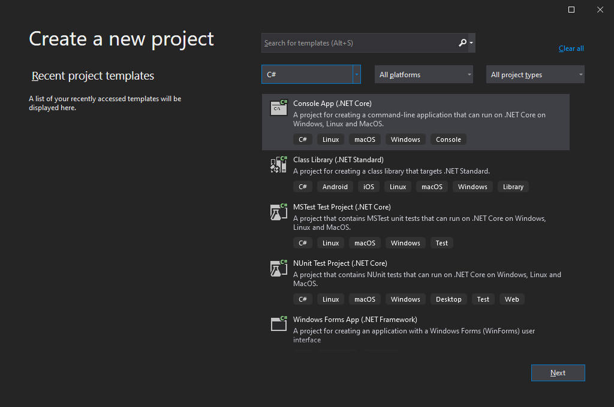
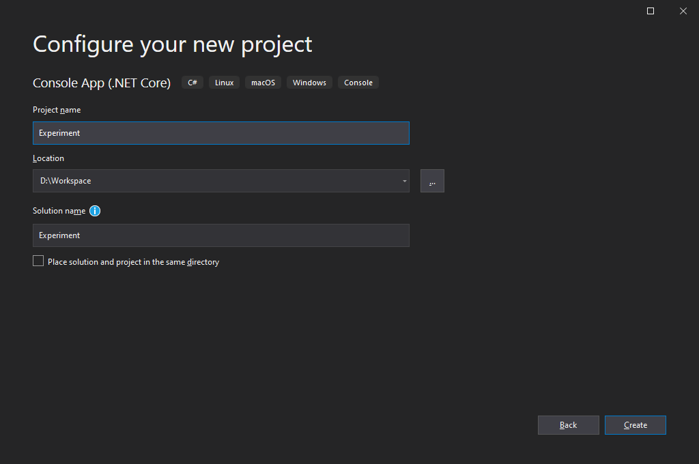
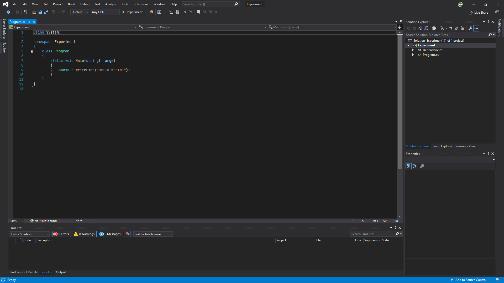

# **C#: INTRO**
> *Reference: [Microsoft Docs C# Language Documentation](https://docs.microsoft.com/en-us/dotnet/csharp/)*

C# (pronounced as "C sharp") is object-oriented programming (OOP) language developed by Microsoft to counter against another OOP language called Java by Oracle. While being similar to Java, it implements a lot of familiar concepts from C/C++ language. The language supports convenience on development by providing an enormous amount of various libraries from the .NET framework.

## .NET
.NET (successor of the .NET Core) is an open-source software framework by Microsoft. The framework is for developing and running C# applications, available in Windows, Linux, and macOS operating systems.

The framework is constituted by CoreFX (FCL) and CoreCLR (CRL). The following table briefly describes FCL and CLR:

| COMPONENTS                    | DESCRIPTION                                                     |
|-------------------------------|-----------------------------------------------------------------|
| Framework Class Library (FCL) | Provides a standard library for developing the .NET application. |
| Common Language Runtime (CLR) | Compiles and executes the .NET application using the JIT compiler.       |

<div style="background-color:white; border:solid 3px #808e95; text-align: center; border-radius:0.5em;"></div><center style="font-weight: bold;">Figure 1. .NET Common Language Infrastructure (CLI)<sub><i>Ref: <a href="https://commons.wikimedia.org/wiki/File:Overview_of_the_Common_Language_Infrastructure.svg">Wikipedia</a></i></sub></center>

.NET implements Common Language Infrastructure (CLI) that is standardized by ISO and ECMA. The standardization specifies that CLI should allow multiple high-level programming languages and support cross-platform despite having different architectures.

### Assembly
C/C++ language uses a compiler such as MSVC, GCC, and Clang to generates the `.exe` executable file or `.dll` library file from the source code to a machine-readable binary code.

> These binary files do not need any more compilation to execute the application: thus called *ahead-of-time (AOT) compilation*. 

On the other hand, the .NET Compiler Platform (C# compiler aliased "Roslyn") translates the source code to the Common Intermediate Language (CIL) instead of binary code. The CLI refers to a bytecode that is not machine-readable but machine-independent code supporting cross-platform.

> The bytecode file requires additional compilation on runtime to execute the application, translating from bytecode to binary code: thus called *runtime* or *just-in-time (JIT) compilation*.

Assembly, therefore, is a *bytecode file* in C# language. Just like binary executable in C/C++ language, there are two different types of assembly: process assemblies `.exe` and library assemblies `.dll`. Because assembly is not a binary code file, the C# application won't execute without the .NET (more specifically, CoreCLR).

### .NET Framework
The .NET Framework is a predecessor of .NET that is deprecated in November 2020. The .NET Framework is only available on the desktop version of Windows OS.

## Object-Oriented Programming
C# is object-oriented programming (abbrev. OOP) language that focuses on program development using data called "object (aka. instance)." Though explained in detail later, it is crucial to understand the concept of object and class in C# language.

### Object
Object (aka. instance) is an independent unit of data composed of members called *field* and *method*. Members of an object are accessed using the member access operator `.`:

| MEMBER   | SYNTAX              | DESCRIPTION                                                                                 |
|----------|---------------------|---------------------------------------------------------------------------------------------|
| Field    | `object.field`      | A member that stores value.                                                          |
| Method   | `object.method()`   | A member that processes and/or outputs data.                                           |
| Property | `object.property()` | A method specifically designed to output field value without directly accessing the member; this protects the member field from accidental modification. |

### Class
The class creates an object where fields and methods are all defined inside the code block. Members cannot be accessed directly from the class but only from an object. Creating an instance from the class is called *instantiation*.

### `static` Modifier
The `static` access modifier (or access specifier) keyword allows the member accessible from the class without instantiation. Thought convenient to use since it doesn't need an object, the `static` access modifier can make the code a bit more complicating due to its property.

## Entry Point
Unlike C/C++ language, C# has a lot of code blocks `{}` but every .NET application starts from the `static void Main()` entry point.

```csharp
using System;

namespace PROJECT
{
    class Program
    {
        static void Main(string[] args)
        {
            // Insert code here...
        }
    }
}
```

Most of the examples in this document will not have the full code shown above, but only the expression or statements that are necessary. However, be sure to know that the code only functions when inside the `static void Main()` entry point.

# **C#: INSTALL**
Although the .NET supports cross-platform, this chapter introduces mainly on installation and preparation for Windows OS. And if possible, focuses on utilizing .NET Core rather than .NET Framework.

An integrated development environment (IDE) is a software development program that provides a source code editor and program build tools, compiling source codes to an executable program. Since C# is the language developed by Microsoft, there is one most suitable IDE.

## Visual Studio
[Visual Studio](https://visualstudio.microsoft.com/downloads/) is the most renowned IDE for Windows OS developed by Microsoft, which uses the MSVC compiler. There are three editions for Visual Studio, and the free community edition is enough for development. The IDE provides various components to support different languages as well; for C++ programming, select the ".NET desktop development" workload.

<div style="background-color:white; border:solid 3px #808e95; text-align: center; border-radius:0.5em;"></div><center style="font-weight: bold;">Figure 2. Workload for C# programming on Visual Studio.</center>

Visual Studio will start with the window shown below. To create a new project for C# language, select the "Create a new project" button.

<div style="background-color:white; border:solid 3px #808e95; text-align: center; border-radius:0.5em;"></div><center style="font-weight: bold;">Figure 3. Startup window of Visual Studio.</center>

Since C# can create various applications, there are many different kinds of projects available from Visual Studio as well. To create a C# project, follow the procedure below:

1. Select the language as C# and choose the "Console App (.NET Core)" option.

<div style="background-color:white; border:solid 3px #808e95; text-align: center; border-radius:0.5em;"></div><center style="font-weight: bold;">Figure 4. Creating a C# project on Visual Studio (step 1).</center>

2. Designate names for the project and solution. Here, the project is a `.vcxproj` extension file that manages its source codes and compilation options, and the solution is a `.sln` extension file that can contain multiple projects. It is recommended to open the solution file on Visual Studio unless you only want to open a single project.

<div style="background-color:white; border:solid 3px #808e95; text-align: center; border-radius:0.5em;"></div><center style="font-weight: bold;">Figure 5. Creating a C# project on Visual Studio (step 2).</center>

3. Use the project automatically prepared by Visual Studio.

<div style="background-color:white; border:solid 3px #808e95; text-align: center; border-radius:0.5em;"></div><center style="font-weight: bold;">Figure 6. Creating a C# project on Visual Studio (step 3).</center>

The three-step procedure above for creating a C++ console application is the simplest method. To create an empty C++ project, refer to the installation section on the *PRGMING_C* document.

Visual Studio can run a C# language program in two different ways: debugging mode (`F5`) and without debugging mode (`Ctrl+F5`). Debugging mode is used to inspect the problem and visualize the process, otherwise run without debugging is recommended.

# **C#: BASIC**
Every programming language has its own rules to be observed and fundamental data that works as a basis of the program. Failed to observe this causes either error or unexpected results. As for the beginning of the practical coding, this chapter will introduce basic knowledge of C# language coding.

## Statement Terminator
The "statement" in programming represents a code that executes or processes data. In C# language, every statement needs to end with a statement terminator denoted by a semicolon `;`.

One of the common mistakes made by C# language beginners is the absence of a statement terminator. Therefore, developers need to keep this in mind when programming with languages based on C (such as C++ and C#).

## Comment
Comment in a programming language is not executed and is commonly used to write down information related to the programming on source codes. There exist two comments in C# language: line comment and block comment.

* **Line comment**
    : a comment worth a single line of code, declared by `//`.
* **Block comment**
    : a comment with multiple lines of code, declared by `/* */`.

```csharp
/*
BLOCK COMMENT:
multiple line of comment can be placed here.
*/  
// LINE COMMENT: for a single line of code.
```

## Identifier
An identifier is a name used to identify data in programming. In other words, it is just a user-defined name. C# language has the following rules when naming an identifier:

* Only alphabet, number, and underscore `_` is allowed.
* First letter cannot start with a number.
* Blank space is prohibited.

## Namespace
The namespace is a code space that distinguishes from the others to guarantee the uniqueness of identifiers. It is the same concept as placing files (data) with the same name in different folders (namespace).

The `namespace` keyword declares the namespace and stores the data inside the code block `{}`. Use the member access operator `.` to access the data inside the namespace. However, namespaces must not share the same name with other namespaces.

```csharp
namespace NAMESPCAE1
{
	class Program{
        static void Main(){
            /* CALLING CLASS AND MEMBERS FROM ANOTHER NAMESPACE */
            NAMESPACE2.CLASS.field;
            NAMESPACE3.NAMESPACE4.CLASS.method();
        }
    }
    
    /* NESTED NAMESPACE */
    namespace NAMESPACE2
    {
        static class CLASS { public var field; }
    }
}

/* NAMESPACE INDEPENDENT FROM NAMESPACE1 */
namespace NAMESPACE3
{
    namespace NAMESPACE4
    {
	    static class CLASS { public void method() statement; }
    }
}
```

### Global Namespace
The global namespace (aka. root namespace) is a code space that doesn't belong to any namespace. Data from the global namespace is accessed by placing the `global` keyword and namespace alias qualifier `::` before its identifier.

```csharp
global::variable;
```

### `using` Declaration
The `using` keyword makes accessing data inside the namespace simple. Technically, data becomes available without needing to specify the namespace.

```csharp
/* USING DECLARATION: "System" NAMESPACE */
using System;
```

However, the overuse of the `using` keyword has the potential to cause a naming collision as the compiler cannot tell which data the code is referencing. Hence, C# supports aliasing namespace that is not available in C/C++.

Namespace aliasing either references namespace or data types such as class, structure, and more. The formal can call the data using the qualifier `::`, but the latter can only call the data already chosen.

```csharp
// NAMESPACE ALIASING: REFERENCING NAMESPACE
using scope1 = System;            // "System" namespace
scope1::Console.WriteLine("First Line");

// NAMESPACE ALIASING: REFERENCING TYPE
using scope2 = System.Console;    // "System.Console" class
scope2.WriteLine("Second Line");
```

## Input & Output
C# language has two outputs for a text-based terminal available as methods of the `System.Console` class:

| OUTPUT                | SYNTAX                      | DESCRIPTION                             |
|-----------------------|-----------------------------|-----------------------------------------|
| `Console.Write()`     | `Console.Write("Text")`     | Print text to a terminal without a new line. |
| `Console.WriteLine()` | `Console.WriteLine("Text")` | Print text to a terminal with a new line.  |

```csharp
class Program{
    static void Main(){
        System.Console.Write("Hello");
        System.Console.Write("World!");
        System.Console.WriteLine("Spam");
        System.Console.WriteLine("Egg");
    }
}
```

```
HelloWorld!Spam
Egg
```

Meanwhile, there are three inputs for a text-based terminal available as methods of the same class:

| INPUT                | RETURN         | DESCRIPTION                                         |
|----------------------|----------------|-----------------------------------------------------|
| `Console.Read()`     | Integer        | Read the input of a single character in ASCII.      |
| `Console.ReadLine()` | String         | Read the input for a single line of text as a string.  |
| `Console.ReadKey()`  | ConsoleKeyInfo | Read the input of a single keypress on a keyboard. |

```csharp
using System;

class Program{
    static void Main(){
        Console.Write("Console.Read: ");
            int value1 = Console.Read();
            Console.WriteLine(">>> {0}\n", value1);
        
        Console.Write("Console.ReadLine: ");
            string value2 = Console.ReadLine();
            Console.WriteLine(">>> {0}\n", value2);
        
        Console.Write("Console.ReadKey: ");
            ConsoleKeyInfo value3 = Console.ReadKey();
            Console.WriteLine(">>> {0}", value3);
    }
}
```

```
Console.Read: Ko
>>> 75

Console.ReadLine: Hello World!
>>> Hello World!

Console.ReadKey:  
>>> Spacebar
```

### Placeholder
A placeholder designates where data should locate within the text using zero-based integers surrounded by a curly bracket. The data that comes after the formatted text goes to the placeholder in ascending order.

```csharp
System.Console.Write("First: {0}, Second: {1}, Return to {0}.", 3, 'G');
```

```
First 3, Second G, Return to 3.
```

### Escape Character
Escape character `\` is used to escape from a sequence of characters and execute certain operations within text-based data. In the introduction on string data type, `\n` is used to change to a new line.

```csharp
System.Console.Write("Hello\nWorld!");
```

```
Hello
World!
```

| SYNTAX | DESCRIPTION    |
| ------ | -------------- |
| `\n`   | New line       |
| `\t`   | Horizontal tab |
| `\\`   | Backslash      |
| `\b`   | Backspace      |
| `\'`   | Single quote   |
| `\"`   | Double quote   |

## Data Type
A data type is one of the crucial factors which determines the type and byte size of the data. A well-implemented data type can make a program efficient on both memory and processing time. C# language has several numbers of built-in data type as follows:

| IDENTIFIER | DATA TYPE               | DESCRIPTION                                                                                            |
|------------|-------------------------|--------------------------------------------------------------------------------------------------------|
| `int`      | Integer                 | 32-bits precision integer number.<br />Size: 4 bytes                                                   |
| `float`    | Floating point number   | Real number with decimal points<br />Size: 4 bytes (suffixes `f` or `F`)                               |
| `double`   | Double-precision float  | Float with doubled precision and memory.<br />Size: 8 bytes (suffixes `d` or `D` or none)              |
| `decimal`  | Highest-precision float | Float with greater precision and memory<br/>Size: 16 bytes (suffixes `m` or `M`)                       |
| `char`     | Character: `''`         | A single character, such as `'A'` or `'?'`.<br />Size: 2 bytes                                         |
| `string`   | String: `""`            | A series of characters, such as `"Hello World!"`<br />Size: N/A (varies by the length)                 |
| `bool`     | Boolean                 | Non-zero represents `true` while zero is `false`.<br />Size: 1 byte                                    |
| `var`      | Automatic               | Automatically selected by the compiler.<br />Useful for declaring new variable with complex data type. |
| `void`     | Void                    | Non-specific data type.<br />Size: 1 byte                                                              |

### `sizeof()` Operator
The `sizeof()` function returns allocated memory size of the type or data in bytes.

```cpp
sizeof(int);		// SIZE: 4 BYTE
sizeof(char);		// SIZE: 2 BYTE
```

## Variable
Variable is a container for data that can be assigned using the assignment operator `=`. C# language must designate a variable with one of the data types, which can only have data with that data type.

The example code below tells a compiler the existence of the `variable` integer variable. The variable has also allocated memory at the same time to store a value, called *declaration* or *definition* in programming.

```csharp
/* "variable" VARIABLE DECLARATION */
int variable;
```

Unlike C/C++ language, the ECMA-334 standard does not distinguish the difference between declaration and definition but rather considers them the same instead. It is because the OOP C# language compiler is different from the compiler for C/C++ language.

A defined variable does not need to specify the data type as a compiler already knows what type of data it stores. Programming languages, in general, locates assigned data (ex. variable) on the left and assignee (ex. a constant value or another variable) on the right. Otherwise will cause an error or function improperly.

### Initialization
Initialization is the first assignment to a variable where it commonly occurs in the *definition* process.

```csharp
/* VARIABLE INITIALIZATION */
int variable = 3;
```

### Local & Global Variable
There are three types of variable in C# language:

* **Local variable** is a variable defined within the code block, such as namespaces, functions, and classes. A local variable releases data when escapes from the code block and unavailable to use outside. It may have the same name as other variables defined outside the code block.

  ```csharp
  class Program {
      static void Main() {
          // Insert code here...

          /* LOCAL VARIABLE */
          int variable;
      }
  }
  ```

* **Global variable** is officially not supported in C# language. Conceptually, a variable that does not belong to any code blocks within the script, but C# is an OOP language that cannot declare a variable outside the code block.

* **Static variable** is a variable with the `static` access modifier that is accessible directly from the class without instantiation. Unlike a local variable, it retains the data even after escaping from the code block, making a static variable an alternative to a global variable in C# language.

  ```csharp
  class Program {

      /* STATIC VARIABLE: "public" keyword makes accessible from outside. */
      public static int variable;

      static void Main() {
          // Insert code here...

      }
  }
  ```

### Constant Variable
A constant variable is a variable that cannot change its value after initialization. The `const` keyword declares variable as a constant.

```csharp
/* CONSTANT DEFINITION */
const int variable = 1;
```

### Static Variable

Static variable is a special local variable which maintain its value even when escaped and re-entered a function code block. The keyword `static` is used to declare it as a static variable.

```c#
static int variable = 3;
```

## Data Type Conversion
Data type conversion changes data type stored in a variable into other desired type. Conversion from the small size data to a compatible but larger size data type is called *implicit* conversion. Implicit conversion is a natural data type conversion automatically done by a compiler as no data loss occurs.

```csharp
short A = 1;    // 2 BYTES INTEGER
int B = A;      // 4 BYTES INTEGER
```

On the other hand, *explicit* conversion (aka. casting) risks data loss/corruption upon converting data type. Traditional C-style casting syntax uses parenthesis `()` as follows:

```cpp
float A = 1.9f;  // 4 BYTES FLOAT
int B = (int)A;  // 4 BYTES INTEGER - INCOMPATIBLE: only returns its integer value.
```

```
1
```

### Helper Class Conversion
A helper class is a class that *helps* do something by providing specific functionalities. The `System.Convert` is one of the helper classes for converting data type.

```csharp
int    ivalue = System.Convert.ToInt32(Console.ReadLine());
bool   bvalue = System.Convert.ToBoolean(Console.ReadLine());
double dvalue = System.Convert.ToDouble(Console.ReadLine());
```

### `is` Operator
The `is` operator asserts whether the given data is compatible with another data type in C# language.

```csharp
variable is Type;
```

If the `variable` is compatible with the `Type` data type, the statement returns the `true` boolean value, otherwise `false`.

## Operator
An operator is the simplest form of the data processing unit that manipulates the value of operands. It is placed before, after, or between the operands.

### Arithmetic Operator
The arithmetic operator mainly focuses on processing numeric data types. Following is a list of arithmetic operators used by numeric data type:

|             NAME             | OPERATOR | DESCRIPTION                                                  |
| :--------------------------: | -------- | ------------------------------------------------------------ |
|           Addition           | `+`      | -                                                            |
|         Subtraction          | `-`      | -                                                            |
|        Multiplication        | `*`      | -                                                            |
|           Division           | `/`      | When both operands are integer: an integer dividend without a remainder.<br/>When at least one operand is real (float or double): a real dividend (float or double). |
| Remainder (Modulus Division) | `%`      | Remainder only returns an integer.                              |

For easier readability, you may place blank spaces between numbers and operators which does not affect its output.

### Assignment Operator
The assignment operator is another operation used within numeric data types. Following is a list of assignment operators used by numeric data type:

| OPERATOR | EXAMPLE  | EQUIVALENT  |
| -------- | -------- | ----------- |
| `+=`     | `x += 1` | `x = x + 1` |
| `-=`     | `x -= 1` | `x = x - 1` |
| `*=`     | `x *= 1` | `x = x * 1` |
| `/=`     | `x /= 1` | `x = x / 1` |
| `%=`     | `x %= 1` | `x = x % 1` |

Although not an assignment operator, the similar increment and decrement operator has identical meaning as follows:

| OPERATOR    | EXAMPLE   | DESCRIPTION       |
| ----------- | --------- | ----------------- |
| `++` prefix | `x = y++` | `x = y; y = y+1;` |
| `++` suffix | `x = ++y` | `y = y+1; x = y;` |
| `--` prefix | `x = y--` | `x = y; y = y-1;` |
| `--` suffix | `x = --y` | `y = y-1; x = y;` |

### Relational Operator
The relational operator is used to compare the relation of two values, returning either `true` or `false` boolean value. Following is a list of relational operators:

| OPERATOR | DESCRIPTION              |
| -------- | ------------------------ |
| `<`      | Lesser than              |
| `<=`     | Lesser than or equal to  |
| `>`      | Greater than             |
| `>=`     | Greater than or equal to |
| `==`     | Equal to                 |
| `!=`     | Not equal to             |

### Logical Operator
The logical operator consist of AND, OR, and NOT logic. Consider `true` and `false` as binary counterpart of 1 and 0.

| OPERATOR | LOGIC | DESCRIPTION                                                |
| -------- | ----- | ---------------------------------------------------------- |
| `&&`     | AND   | `true` when all arguments are `true`, else `false`.        |
| `||`     | OR    | `true` when at least one argument is `true`, else `false`. |
| `!`      | NOT   | Changes `true` to `false` and vice versa.                  |

# **C#: CONDITIONAL AND LOOP**
Conditional and iteration (or loop) statements are two of the most commonly used in programming. The "statement" in programming represents a code that executes or processes data. This chapter introduces a list of conditional and iteration statements in C# language programming.

## `if` Statement
Conditional `if` statement runs code if the condition holds. When the condition evaluates `true`, the indented codes are carried out but otherwise ignored.

```csharp
if (condition)
{
	statements;
}

// SIMPLIFIED STATEMENT
if (condition) statement;
```

The `if` statement can locate inside another `if` statement, called "nested `if`". Use a code block `{}` to distinguish between `if` statements to avoid possible misinterpretation made by a compiler.

```csharp
if (condition)
{
    if (condtion)
    { 
        statements;
    } 
}
```

### `else` Statement
A conditional `else` statement cannot be used alone and must be followed by an `if` condition. The statement contains code that executes when evaluated `false`.

```csharp
if (condition)
{
    statements;
}
else
{
    statements; 
}
```

### `else if` Statement
A conditional `else if` statement is a combination of `else` and `if` conditions; when the first condition evaluates `false`, the `else if` statement provides a new condition different from the previous one. 

```csharp
if (condition) {
    statements;
}
else if (condition) {
    statements;
}
else {
    statements;
}
```

However, this statement is different from the chain of `else`-`if` conditional statement as that is a combination of two sets of conditions. On the other hand, `else if` conditional statement is a continuation of an existing evaluation instead of starting new conditioning.

### Ternary Operator
A conditional statement can be simplified using the ternary operator shown below:

```csharp
condition ? return_true : return_false;
```

The vocabulary *ternary* indicates the statement takes three arguments. The ternary operator should not be overused as it reduces readability but useful on variable assignment.

### `as` Operator
The `as` operator converts the given data to another data type in C# language; the operator returns `null` if the conversion is invalid.

```csharp
/* "as" OPERATOR */
variable as Type;
```

The example above attempts to convert the `variable` data to the `Type` data type. The operator is equivalent to the expression below.

```csharp
/* EQUIVALENCE OF THE "as" OPERATOR */
variable is Type ? (Type)variable : (Type)null;
```

## `switch` Statement
Conditional `switch` statement evaluates whether a variable matches a value assigned to the `case` keyword and executes the corresponding code if true. After execution, the `break` statement must locate to prevent further evaluation of the next `case` keyword.

If no condition matches, the statement automatically executes codes under the `default` keyword that is optional. The `default` keyword does not require the `break` statement as opposed to the `case` keyword.

```csharp
switch (argument)
{
    case value1:
        statements;
        break;
    case value2:
        statements;
        break;
    default:
        statements;
}
```

Multiple `case` keywords may share the same code as follows:

```csharp
switch (argument) {
    case value1:
    default:
        statements;
        break;
    case value2:
    case value3:
        statements;
        break;
    case value4:
        statements;
        break;
}
```

### `break` Statement
The `break` statement is to end a loop prematurely. When encountered in the loop, the `break` statement escapes from the current loop but does not escape from the nesting loop.

### `continue` Statement
The `continue` statement skips the rest of the code below in the loop and jumps back to the conditioning part. It maintains the iteration rather than escaping from it like the `break` statement.

## `while` Loop
A `while` loop statement repeatedly executes statements inside (aka. iterate) as long as the condition holds. The loop ends once the condition evaluates `false`.

```csharp
while (condition)
{
    statements;
}

// SIMPLIFIED STATEMENT
while (condition) statement;
```

## `do`-`while` Statement
The `do`-`while` loop statement is similar to the `while` loop statement, but the former executes code first then evaluates, and the latter is vice versa.

```csharp
do
{
    statements
} while (condition);
```

## `for` Loop
The `for` loop statement repeatedly executes statements inside (aka. iterate) as long as the condition holds. Its local variable changes as specified on each iteration, which commonly uses integer increment.

```csharp
for (variable; condition; increment) {
    statements;
}

// SIMPLIFIED STATEMENT
for(variable; condition; increment) statement;
```

### Infinite `for` Loop
The `for` loop can run an infinite loop using the following syntax:

```csharp
for ( ; ; ) { 
	statements;
}
```

## `foreach` Loop
The `foreach` loop statement iterates execution while in range. The range is generally given by the Collection, which is the data that can sequence its elements individually.

```csharp
foreach (variable in range) {
	statements;
}

// SIMPLIFIED STATEMENT
foreach (variable in range) statement;
```

Refer to the next chapter, *C#: COLLECTION*, to know more about the collection data in C# language.

# **C#: COLLECTION**
C# has a Collection that can store multiple data of the same type at once. While the most common and general collection is an array, there are various other collections available in .NET that are worth knowing.

## Array

Array is a collection used to store an indexed of item of same data type. Bracket `[]` is placed after the data type to declare an array.

```c#
// ARRAY DECLARATION
int[] arr;
```

Creating and defining size of an array is done by `new` keyword used for instantiation:

```c#
// INITIALIZATION
int[] arr = new int[size];
```

which creates array filled with element of `0` or `NULL` value. Elements can be assigned with value after initialization by accessing individually using bracket `[]`:

```c#
int[] arr = new int[size];

// ASSIGNMENT: ELEMENTWISE
arr[0] = value1;
arr[1] = value2;
```

To assign values on initialization instead, curly bracket `{}` is used to assign values to each element in sequence. Following is a three different methods of assignment with explanation:

```c#
// ASSIGNMENT 1
int[] arr = new int[size] {value1, value2, ... };

// ASSIGNMENT 2
int[] arr = new int[] {value1, value2, ... };

// ASSIGNMENT 3
int[] arr = {value1, value2, ... };
```

1. `// ASSIGNMENT 1`: values must be fulfilled on every elements in the array, else results compilation error.
2. `// ASSIGNMENT 2`: initial array size can dynamically designated based on the number of assigned value.
3. `// ASSIGNMENT 3`: more simplified version of "`// ASSIGNMENT 2`" method.

Calling array itself does not return a sequence of elements within; instead will return the information of array data. Only a single element at a time can be called.

```c#
int[] arr = new int[size] {value1, value2, ... };

System.Console.WriteLine(arr);
System.Console.WriteLine(arr[0]);
```

```
System.Int32[]
value1
```

### `new` Keyword

The `new` operator is used to create new instance of a type.

> While in C/C++ represented dynamic allocation, in C# is used on most of the classes to create instance.

### Multi-dimensional Array

Multi-dimensional array can be declared and initialized that holds values under subarrays which shares the same length:

```c#
// MULTI-DIMENSIONAL 1
int[ , ] arr = new int[3,2] { {value1, value2}, {value3, value4}, {value5, value6} };

// MULTI-DIMENSIONAL 2
int[ , ] arr = new int[ , ] { {value1, value2}, {value3, value4}, {value5, value6} };

// MULTI-DIMENSIONAL 3
int[ , ] arr = { {value1, value2}, {value3, value4}, {value5, value6} };
```

Since multi-dimensional array is created from a single declaration, array data is stored in a single block of memory.

### Jagged Array

Jagged array can have another arrays as its elements irrelevant to its size.

```c#
int[][] arr = new int[3][] {
    new int[] {3}, 
    new int[] {1, 4, 1}, 
    new int[] {5, 9}
};
```

Because the array contains already declared stored in separate memory location, jagged array implements more than single block of memory.

## Collection

*To better understand this section, it is recommended to read chapter "C#: GENERIC" beforehand.*

Collection is an advanced version of array that can shrink and extend size flexibly to accommodate any number of data, each of them having unique special features.

Collection is divided into two categories: generic and non-generic collection. While the term "generic" will be introduced on later chapter, brief explanation is its data type can be designated upon declaration using angled bracket (`<>`).

```c#
using System.Collections.Generic;

// DECLARATION OF GENERIC COLLECTION (EXAMPLE)
Collection<int> collectionName = new Collection<int>();
```

### Lists

List is a generic collection similar to array but its flexible sizing allows inserting and removing the elements more dynamic. This can be considered as C# version of `std::vector` class in C++ language.

```c#
using System.Collections.Generic;

// DECLARATION OF LIST COLLECTION (EMPTY)
List<int> LIST = new List<int>();
```

----

```c#
using System.Collections.Generic;

// INITIALIZATION OF LIST COLLECTION
List<int> LIST = new List <int>() {3, 1, 4, 1, 5};

System.Console.WriteLine(LIST[0]);
```

```
3
```

### Sorted List

Sorted list is a variation of the list generic collection where elements are paired in `{key, value}` format. Here, key is a unique element identifier used to access the element value instead of integer index.

Sorted list automatically sorts elements by the key.

```c#
using System.Collections.Generic;

// DECLARATION OF SORTED LIST COLLECTION (EMPTY)
SortedList<string, int> SLIST = new SortedList<string, int>();
```

----

```c#
using System.Collections.Generic;

// INITIALIZATION OF SORTED LIST COLLECTION
SortedList<string, int> SLIST = new SortedList<string, int>() { {"B", 3}, {"A", 1} };

System.Console.WriteLine(SLIST["B"]);
```

```
3
```

### Dictionary

Dictionary is a variation of the list generic collection where elements are paired in `{key, value}` format. Here, key is a unique element identifier used to access the element value instead of integer index.

Dictionary do not sorts elements by the key.

```c#
using System.Collections.Generic;

// DECLARATION OF DICTIONARY COLLECTION (EMPTY)
Dictionary<string, int> DICT = new Dictionary<string, int>();
```

----

```c#
using System.Collections.Generic;

// INITIALIZATION OF DICTIONARY COLLECTION
Dictionary<string, int> DICT = new Dictionary<string, int>() { {"B", 3}, {"A", 1} };

System.Console.WriteLine(DICT["B"]);
```

```
3
```

### BitArray

BitArray is another variation of list collection that stores bit data either 0 (`false`) and 1 (`true`). Because the data type is already defined as Boolean, BitArray collection is non-generic. The size of the BitArray cannot be changed after declaration.

```c#
using System.Collections;

// DECLARATION OF BIRARRAY COLLECTION
BitArray BITARR = new BitArray(4);
```

----

```c#
using System.Collections;

// INITIALIZATION OF BIRARRAY COLLECTION
bool[] arr = new bool[4] {false, true, false, true};
BitArray BITARR = new BitArray(arr);

System.Console.WriteLine(BITARR[0]);
```

```
False
```

### Stack

Stack is a LIFO (Last In First Out) memory-structured generic collection where last element to append (push) to the collection is to come out (pop) first. Stack collection cannot use bracket (`[]`) to access individual elements.

```c#
using System.Collections.Generic;

// DECLARATION OF STACK COLLECTION (EMPTY)
Stack<int> STACK = new Stack<int>();
```

----

```c#
using System.Collections.Generic;

// INITIALIZATION OF STACK COLLECTION
int[] arr = new bool[4] {1, 2, 3, 4};
Stack<int> STACK = new Stack<int>(arr);

System.Console.WriteLine(STACK.Pop());
System.Console.WriteLine(STACK.Pop());
```

```
4
3
```

### Queue

Queue is a FIFO (First In First Out) memory-structured generic collection where last element to append (push) to the collection is to come out (pop) first. Queue collection cannot use bracket (`[]`) to access individual elements.

```c#
using System.Collections.Generic;

// DECLARATION OF QUEUE COLLECTION (EMPTY)
Queue<int> QUEUE = new Queue<int>();
```

----

```c#
using System.Collections.Generic;

// INITIALIZATION OF QUEUE COLLECTION
int[] arr = new bool[4] {1, 2, 3, 4};
Queue<int> QUEUE = new Queue<int>(arr);

System.Console.WriteLine(STACK.Dequeue());
System.Console.WriteLine(STACK.Dequeue());
```

```
1
2
```

### HashSet

HashSet is a generic collection where elements are unique and does not allow duplicates. HashSet provides high-performance mathematical set operations, but the collection cannot use bracket (`[]`) to access individual elements.


```c#
using System.Collections.Generic;

// DECLARATION OF HASHSET COLLECTION (EMPTY)
HashSet<int> HSET = new HashSet<int>();
```

----

```c#
using System.Collections.Generic;

// INITIALIZATION OF HASHSET COLLECTION
int[] arr = new bool[6] {1, 2, 3, 4, 1, 3};
HashSet<int> HSET = new HashSet<int>(arr);

System.Console.WriteLine(HSET.Count);
```

```
4
```


# **C#: METHOD**

C# language is executed based around a single key method called `Main()`. Understanding the concept of method is important in C# languages, which can also be used to create and implement custom method to serve specific purpose.

## Method

Method one of the component comprising an object, and is a block of code responsible for processing passed data and presenting newly processed data once the method is called.

Method can be distinguished by its declaration with parenthesis after its name; `method()`. Its definition is stated inside a code block (`{}`), which is executed when called.

```c#
// METHOD DEFINITION
static double method(int arg1, double arg2)
{
    return arg1 + arg2;
}

method(1, 3.0);		// >> OUTPUT: 4.0
```

Because C# language paradigm is OOP means method do not requires forward declaration (aka. prototype) to call the method. However, defining a method inside another method (aka nested method) is invalid in C# language.

### `return` Statement

The `return` statement is a method-exclusive statement that outputs indicated data under the data type declared on the method. Once the `return` statement is executed, the method ends immediately despite there are codes still left inside.

If the method is a `void` data type, method can be returned by `return;` statement alone without any data to return.

### Parameter & Argument

Following are the difference between parameters and arguments that is referred significantly when discussing function.

**Parameter**
Parameter is a method-internal local variable: because parameters is a method-exclusive local variable, it cannot be called from outside.

| OPERATOR |    SYNTAX     | DESCRIPTION                                                  |
| :------: | :-----------: | ------------------------------------------------------------ |
|   `=`    | `arg = value` | Parameter `arg` is assigned `value` by default when no other value is passed. Must locate after normal parameter. |

**Argument**
Argument is a value or object being passed to the method parameter and those passed values and objects will be processed by the method code. However, argument is independent from parameter: change on parameter does not affect value or object passed as argument.

| OPERATOR |    SYNTAX    | DESCRIPTION                                                  |
| :------: | :----------: | ------------------------------------------------------------ |
|   `:`    | `arg: value` | Assign argument `value` to method parameter namely `arg`. Does not have to follow parameter order. |

Examples below show how function parameter and argument works:

```c#
using System;

class Program
{
    static void Main(string[] args)
    {
        Console.WriteLine(method(1, 3.0));                // >> OUTPUT: 4.0
        Console.WriteLine(method(1));                     // >> OUTPUT: 8.0
        Console.WriteLine(method(arg2: 3.0, arg1: 1));    // >> OUTPUT: 4.0
    }
    
    static double method(int arg1, double arg2 = 7.0)
    {
        return arg1 + arg2;
    }
}
```

There are three different method of passing arguments to parameters: call by value, reference and output.

* **By Value**

    Requiring no special syntax, call by value passes only the value of the argument. In other word, argument and parameter are separate identities. Hence, changes made on parameter does not affect variable passed as an argument.

    ```c#
    using System.Console;
    
    class Program
    {
        static void Main(string[] args)
        {
            int A = 1;
            int B = 3;
            
            Console.WriteLine(A, B);    // >> OUTPUT: 4 (1 + 3.0)
            Console.WriteLine(A, B);    // >> OUTPUT: 4 (1 + 3.0)
        }
        
        static int method(int arg1, int arg2)
        {
            arg1 += arg2;
            return arg1;
        }
    }
    ```

* **By Reference**

    Using `ref` keyword, call by reference passes the address of the variable of argument. In other word, argument and parameter are a single identity. Hence, changes made on parameter does affect variable passed as an argument.

    ```c#
    using System.Console;
    
    class Program
    {
        static void Main(string[] args)
        {
            int A = 1;
            int B = 3;
            
            Console.WriteLine(ref A, ref B);    // >> OUTPUT: 4 (1 + 3.0)
            Console.WriteLine(ref A, ref B);    // >> OUTPUT: 7 ((1 + 3.0) + 3.0)
        }
        
        static int method(ref int arg1, ref int arg2)
        {
            arg1 += arg2;
            return arg1;
        }
    }
    ```

    ---

    Using `in` keyword, call by reference passes the address of the variable of argument but the parameter is read-only and unmodifiable. Simply put, argument and parameter are a single constant identity. Hence, no changes can be made on parameter which eventually not affecting variable passed as an argument.

    ```c#
    using System.Console;
    
    class Program
    {
        static void Main(string[] args)
        {
            int A = 1;
            int B = 3;
            
            Console.WriteLine(in A, in B);    // COMPILATION ERROR: CANNOT EXECUTE "arg1 += arg2;" STATEMENT!
        }
        
        static int method(in int arg1, in int arg2)
        {
            arg1 += arg2;
            return arg1;
        }
    }
    ```

    ```
    Cannot assign to variable 'in int' because it is a readonly variable
    ```

    ----

    Using `out` keyword, call by reference passes the address of the variable of argument but only uninitialized argument is allowed. This is mainly used on method whose purpose is to initialized the variable called by reference, and must initialize the value before end of the method.

    ```c#
    using System.Console;
    
    class Program
    {
        static void Main(string[] args)
        {
            int A, B;    // UNINITIALIZED VARIABLE
            
            Console.WriteLine(out A, out B);              // >> OUTPUT: 4 (1 + 3.0)
            Console.WriteLine("A: {0}, B: {1}", A, B);    // >> OUTPUT: "A: 4, B: 3"
        }
        
        static int method(out int arg1, out int arg2)
        {
            arg1 = 1; arg2 = 3;
            arg1 += arg2;
            return arg1;
        }
    }
    ```

### Method Overloading

Multiple functions with the same name can exist as long as they are unique in arguments (such as number of arguments and its data type). This is called function overloading and these functions can have their own separate definition. Function data type does not overload functions.

```c#
using System;

class Program
{
	static void Main(string[] args)
    {
        Console.WriteLine(method(1, 3));        // >> OUTPUT: 4
        Consoel.WriteLine(method(1.0, 3.0));    // >> OUTPUT: -2.0
    }
    
    // DEFINITION OF OVERLOADED METHOD 1
    static double method(int arg1, int arg2)
    {
        return arg1 + arg2;
    }
    
    // DEFINITION OF OVERLOADED METHOD 2
    static double method(double arg1, double arg2)
    {
        return arg1 - arg2;
    }
}
```

## Entry Point

Entry point is the starting point where a program execution begins. In C# programming language, the entry point is `Main()` *static* method. A project must have one and only `Main()` static function within the project. Creating multiple `Main()` method or not having any `Main()` method will cause error on running the program.

```c#
class Program
{
    // ENTRY POINT: Main() METHOD WITH PARAMETER
    static void Main(string[] args)
    {
    	statements;
    }
}
```

Entry point `Main()` static method can have argument which is apparent when executed through command-line:

```
./app.exe option1 option2
```

| Arguments | Data      |
| --------- | --------- |
| `args[0]` | `option1` |
| `args[1]` | `option2` |

# **C#: OBJECT-ORIENTED PROGRAMMING**

Object-oriented programming (OOP) is a programming paradigm based on usage of objects to structure the program. This chapter is mainly focuses on object and class in detail which was briefly explained on the very beginning of the document *C#: INTRO*.

## Objects

Previous chapters have introduced variable (which can store data) and method (which can process data). Object, aka. instance, is a block of data which encapsulate these variables and methods as members of a single identity, called *member variable* (or *member field*) and *method* respectively.

Object also has a method called *property* whose purpose is to return field value generally restricted on directly access from external code.

The programming based around use of a custom objects is called *object-oriented programming*.

```c#
string x = "Hello World!";
System.Console.WriteLine(x.Length);
// Accessing "Length" field that stores number of characters.
```

### Encapsulation

Encapsulation is the core concept in object which...

1. combines variables and method into a single object
2. restrict direct access to these variables and methods to prevent accidental modification from external code. 

## Class

Class is used to create objects (aka. instance), hence can be deemed as a blueprint of the object. Classes are created using keyword `class` and inside defines variables and methods which becomes member variable and methods for the object. Act of creating an instance from a class is called *instantiation*.

```c#
// CREATING CLASS
class CLASS
{
    public int field1 = 1;
    public double field2 = 3.0;
    
    public double method(int arg)
    {
        return field1 + field2 - arg;
    }
}

// INSTANTIATION
CLASS instance = new CLASS();

// THEREFORE...
instance.field1;       // >> OUTPUT: 1
instance.field2;       // >> OUTPUT: 3.0
instance.method(2);    // >> OUTPUT: 2.0 (= 1 + 3.0 - 2)
```

### Constructor

Constructor is a special method automatically executed whenever instantiation has occurred and can define the number of arguments to pass to the instance. Name of a constructor must be same as the class name and does not require data type.

One of the common usage of constructor is initialization of member fields upon instantiation.

```c#
// CREATING CLASS
class CLASS
{
    // CONSTRUCTOR
    public CLASS(int arg1, double arg2)
    {
        field1 = arg1;
        field2 = arg2;
    }
    
    public int field1 = 1;
    public double field2 = 3.0;
    
    public double method(int arg)
    {
        return field1 + field2 - arg;
    }
}

// INSTANTIATION
CLASS instance = new CLASS(1, 3.0);
```

Constructor is an optional member method and can be defined when developer wants. However, when constructor that takes argument(s) is presented, parenthesis `()` is required upon instantiation. Multiple constructor is allowed per class as long as rule of function overloading is observed.

### Finalizer

Finalizer (aka. destructor) is a special method automatically executed whenever instance is released (every time object is destroyed either systematically by compiler or manually by developer). Name of a destructor must be same as the class name with tilde `~` prefix and does not require data type.

```c#
// CREATING CLASS
class CLASS
{
    // DESTRUCTOR
    ~CLASS()
    {
        statements
    }
    
    public int field1 = 1;
    public double field2 = 3.0;
    
    public double method(int arg)
    {
        return field1 + field2 - arg;
    }
}

// INSTANTIATION
CLASS instance = new CLASS(1, 3.0);
```

Destructor is an optional member method and can be defined when developer wants. Only one destructor is allowed per class and does not take any argument and modifier.

### `this` Keyword

The `this` keyword is used within a class to refer the current class itself.

```c#
// CREATING CLASS
class CLASS{
    private int field;
    
    public int method(){
    	return this.field;
    }
}
```

## Static Class

Class itself cannot use the its members directly and need to create instance to access them. However, declaring the class itself as static allows the class to access the members without needing any instantiation. Hence, it is impossible to create an instance from the static class.

```c#
// CREATING STATIC CLASS
static class CLASS
{
    public static int field1 = 1;
    public static double field2 = 3.0;
    
    public static double method(int arg)
    {
        return field1 + field2 - arg;
    }
}

// THEREFORE...
CLASS.field1;       // >> OUTPUT: 1
CLASS.field2;       // >> OUTUPT: 3.0
CLASS.method(2);    // >> OUTPUT: 2.0 (= 1 + 3.0 - 2)

// [ERROR] INSTANTIATION
CLASS instance = new CLASS();
```

```
Error	CS0723	Cannot declare a variable of static type 'CLASS'
Error	CS0712	Cannot create an instance of the static class 'CLASS'
```

Static class is generally used as a collection of member for specific purpose which does not (or should not) need instantiation; e.g., `Math`, `Array`, `String`, `DataTime`, `Console`, and more.

### Static Constructor

Static constructor is executed when any static member is called even when it is not instantiated.

```c#
// CREATING STATIC CLASS
static class CLASS
{
    // STATIC CONSTRUCTOR
    public static CLASS()
    {
        statements;
    }
    
    public static int field1 = 1;
    public static double field2 = 3.0;
    
    public static double method(int arg)
    {
        return field1 + field2 - arg;
    }
}
```

Static constructor is an optional member method and can be defined when developer wants. Only one static constructor is allowed per class and does not take any argument and modifier.

## Modifier

Modifier keywords are used to define characteristic of object members upon member declaration.

1. **Static** modifier (`static` keyword)
    : a modifier used to declare either static member which can be used without instantiation, or static class that only has static members.

    ```c#
    // STATIC MEMBER FIELD
    static int field = 3;
    
    // STATIC MEMBER METHOD
    static void method() { statements; }
    ```

2. **Constant** modifier (`const` keyword)
    : a static modifier used to declare constant member field; constant member only allows value assignment through initialization. This also means constant member must be initialized with value upon declaration.

    ```c#
    // CONSTANT (STATIC) MEMBER FIELD
    const int field = 3;
    ```

3. **Read-Only** modifier (`readonly` keyword)
    : a non-static modifier used to declare semi-constant member field; read-only member allows value assignment using both initialization and on constructor. This also means read-only member does not have to be initialized upon declaration.

    ```c#
    // READ-ONLY (NON-STATIC) MEMBER FIELD
    readonly int field;
    ```

4. **Sealed** modifier (`sealed` keyword)
    : a modifier used on base class or member of the base class to prevent derived class from inheriting.

    ```c#
    // SEALED MEMBER
    sealed int field;
    ```

5. **Virtual**-**Override** modifier pair (`virtual` and `override` keyword)
    : a modifier used for method overriding; `virtual` modifier allows base class method to be overridden, and `override` modifier on derived class overrides inherited virtual method from base class.

    ```c#
    // VIRTUAL METHOD
    virtual void method() { statements; }
    
    // OVERRIDDEN METHOD
    override void method() { statements; }
    ```

6. **Abstract** modifier (`abstract` keyword)
    : a virtual modifier specifically for method without any implementation (or definition); this modifier can be used on class as well to declare abstract class.

    ```c#
    // ABSTRACT METHOD
    abstract void method();
    ```

### Access Modifier

Access modifier is used to define characteristic of object members on access authorization. There are four different access modifiers available in C# classes: public, private, protected, and internal.

| A.MODIFIER | KEYWORD     | DESCRIPTION                                                  |
| ---------- | ----------- | ------------------------------------------------------------ |
| Public     | `public`    | Accessible from the code outside the class.                  |
| Private    | `private`   | Accessible only within the class.                            |
| Protected  | `protected` | Accessible from derived class but still restricted from outside the class; refer to inheritance. |
| Internal   | `internal`  | Accessible only within the assembly.                         |

## Inheritance

Inheritance is an act of base class providing member variables and methods to derived class. When the same name of members exists on both base class and derived class, members from base class are overridden by derived class's.

```c#
using System;

// CREATING BASE CLASS
class BASECLASS
{
    public BASECLASS() { Console.WriteLine("BASE CLASS: Constructor"); }
    ~BASECLASS() { Console.WriteLine("BASE CLASS: Destructor"); }
    
    public int field1 = 1;
    public double field2 = 3.0;
}

// CREATING DERIVED CLASS
class DERIVEDCLASS
    : BASECLASS
{
    public DERIVEDCLASS() { Console.WriteLine("DERIVED CLASS: Constructor\n"); }
    ~DERIVEDCLASS() { Console.WriteLine("\nDERIVED CLASS: Destructor"); }
    
    public double field2 = 7.0;
    public char field3 = 'A';
}

// INSTANTIATION
DERIVEDCLASS instance = new DERIVEDCLASS();
Console.WriteLine("{0}, {1}, {2}", instance.field1, instance.field2, instance.field3);
```

```
"BASE CLASS: Constructor"
"DERIVED CLASS: Constructor"

1, 7.0, A

"DERIVED CLASS: Destructor"
"BASE CLASS: Destructor"
```

Derived class in C# generally cannot inherit from multiple base classes; a derived class can inherit only a single base class. For multiple inheritance, refer to *interface*.

## Polymorphism

Polymorphism means "having many forms", which in C# programming means having different functionality based on the situation and usage. Polymorphism is one of the important features in OOP and is categorized into two types:

* Compile-time Polymorphism
    : polymorphism achieved on compilation (aka. static polymorphism).
* Run-time Polymorphism
    : polymorphism achieved on run-time (aka. dynamic polymorphism).

One of the compile-time polymorphism has been introduced already; *method overloading* which functions differently according to passed arguments.

### Operator Overloading

Overloading operator is another compile-time polymorphism which is customizing operator to function differently on certain classes or portion of the script. Just like method overloading, a single operator can have multiple implementation as long as the arguments are unique. Overloaded operators are exclusive to the class and won't be applied elsewhere.

The `operator` keyword is used to specify the operator for customization. Declaring and defining operator functionality follows syntax identical to static method.

```c#
// CREATING CLASS
class CLASS
{
    // OPERATOR OVERLOADING
    public static int operator + (CLASS arg1, CLASS arg2)
    {
        return arg1.field + arg2.field;
    }
    
    public int field;
}
```

### Method Overriding

Overriding method is a run-time polymorphism where derived class redefine member inherited from the base class. The difference between overloading and overriding is, the formal *selects* functionality when the latter *redefines* functionality.

Virtual method is a special method specifically designed for method overriding, and is declared by `virtual` keyword. Declaration of the virtual method is only necessary in base class but not in derived class.

```c#
// CREATING BASE CLASS
class BASECLASS
{
    // VIRTUAL METHOD
    public virtual void polymorph() { statements1; }
};

// CREATING DERIVED CLASS
class DERIVEDCLASS1
    : BASECLASS
{
    // OVERRIDE METHOD
    public override void polymorph() { statements2; }
};
```

Virtual method with definition implemented on base class can either (1) use behavior directly from base class or (2) use behavior from derived class in case no function override has occurred. Meanwhile, virtual method without any definition implemented is called **abstract method**.

```c#
// ABSTRACT METHOD
public abstract void polymorph();
```

Because abstract method has no definition in base class, it is a virtual method that *must be* overridden when inherited to derived class. Failed to do so will cause a compilation error.

### Abstract Class

Abstract class is a special class declared using `abstract` keyword, designed not meant for class instantiation but as a base class purely to inherit members to derived class. Attempting to instantiate causes compilation error.

```c#
// CREATING ABSTRACT CLASS
abstract class CLASS
{
    public int field1 = 1;
    public double field2 = 3.0;
    
    // ABSTRACT METHOD
    public abstract void polymorph();
}

// [ERROR] INSTANTIATION
CLASS instance = new CLASS();
```

```
Error	CS0144	Cannot create an instance of the abstract class or interface 'CLASS'
```

Abstract class can have multiple members with different access modifier too. However, inherited non-abstract derived class *must* include actual implementation for the abstract member declared on the base class.

### Interface

Interface is a variation of abstract class where all its member are nonetheless `abstract` and `public` by default. There is no need to and is not allowed to specify the modifier. Interface can have methods and properties but cannot have member field.

```c#
// CREATING INTERFACE
class interface INTERFACE
{
    int property {get; set;}
    void polymorph();
}

// CREATING DERIVED CLASS
class DERIVEDCLASS
    : INTERFACE
{
    public DERIVEDCLASS(int arg) { property = arg; }
    public void polymorph()
    {
        statements;
    }
}
```

Unlike derived class inherited from abstract class which needs `override` modifier to corresponds to `virtual` or `abstract` modifier, interface does not need such modifiers when overriding method.

Multiple interface can inherit their members to a single derived class, using the following syntax:

```c#
class DERIVEDCLASS
    : INTERFACE1, INTERFACE2
{
    // ...
}
```

## Properties

Property is a member used to supports data hiding by dividing a single field into two separate portions: `getter`, and `setter`. The property looks similar to methods but properties do not have a pair of parenthesis, behaving just like member field.

| ACCESSOR | KEYWORD | DESCRIPTION                                     |
| -------- | ------- | ----------------------------------------------- |
| Getter   | `get`   | Member for getting the value from member field. |
| Setter   | `set`   | Member for setting the value to member field.   |

```c#
using System;

// CREATING CLASS
class CLASS
{
    private int field;
    
    // PROPERTY
    public int property
    {
        get => field;            // GETTER IMPLEMENTATION
        set => field = value;    // SETTER IMPLEMENTATION
        
        /* EQUIVALETN:
        get { return field; }
        set {field = value; }
        */
    }
}

// INSTANTIATION
CLASS instance = new CLASS();

instance.method = 1;
instance.method;        // >> OUTPUT: 1
```

The property syntax itself explains it cannot pass more than a single data as an argument. While there exists an argument means there is also a (auto-defined) parameter that should accept the passed argument, pre-declared as `value` keyword.

Separating code using property encapsulate sensitive code that shouldn't be modified by the user (such as `setter`), while providing constant access to the method via `getter` method despite any changes were made on `setter`.

### Auto-Implemented Property

Simplified version of property is available, called "auto-implemented property". However, custom statements cannot be implemented on this particular property.

```c#
// PROPERTY
public int property {get; set;}

/* EQUIVALENT:
string field;
public int property{
    get => field;
    set => field = value;
}
*/
```

## Indexer

Indexer member allows instance to be indexed just like array. Similar to property which uses both `getter` and `setter` accessors, indexer stores data in collection object declared in private member field.

```c#
using System;

// CREATING CLASS
class CLASS
{
    // COLLECTION FOR INDEXER
    private int[] arr = new int[2];
    
    // INDEXER
    public int this[int index]
    {
        get => arr[index];
        set => arr[index] = value;
    }
}

// INSTANTIATION
CLASS instance = new CLASS();

instance[0] = 1;        // >> OUTPUT: 1
instance[1] = 3;        // >> OUTPUT: 3
```

# **C#: USER-DEFINED DATA TYPE**

Commonly used value type such as `int`, `float`, `char`, and more are already defined in `iostream.h` header. Developer may create and use custom data type based on these pre-defined data types.

## Structure

Structure groups multiple member variables under a single structure tag, regardless of value type of member variable. 

```c#
// CREATING STRUCTURE
public struct STRUCTURE
{
    public int    field1;
    public double field2;
    
    public double method(int arg)
    {
        return field1 + field2 - arg;
    }
}

// VARIABLE DECLARATION
STRUCTURE variable;

variable.field1 = 1;
variable.field2 = 3.0;
System.Console.WriteLine(variable.method(2));    // >> OUTPUT: 2.0 (= 1 + 3.0 - 2)
```

----

```c#
// CREATING STRUCTURE w/ CONSTRUCTOR
public struct STRUCTURE
{
    public STRUCTURE(int arg1, double arg2)
    { field1 = arg1; field2 = arg2; }
    
    public int    field1;
    public double field2;
    
    public double method(int arg)
    {
        return field1 + field2 - arg;
    }
}

// VARIABLE INITIALIZATION
STRUCTURE variable = new STRUCTURE(1, 3.0);

System.Console.WriteLine(variable.method(2));    // >> OUTPUT: 2.0 (= 1 + 3.0 - 2)
```

Class and structure do share similarity but have distinct differences:

| CLASS                                      | STRUCTURE                                                    |
| ------------------------------------------ | ------------------------------------------------------------ |
| Allocated on heap memory (reference type). | Allocated on stack memory (value type; e.g. `int`, `double`). |
| Inheritance is allowed.                    | Inheritance is not allowed.                                  |
| May initialized member fields.             | May not initialize member fields.                            |

## Enumeration

Enumeration means "action of mentioning a number of things one by one", thus is a user-defined data type which can only be assigned with a single enumerators that has corresponding integer.

```cpp
// ENUMERATION DELCARATION
enum ENUMERATION {
    enumerator1,    // = 0
    enumerator2,    // = 1
    enumerator3     // = 2
};

// VARIABLE INITIALIZATION
ENUMERATION variable = ENUMERATION.enumerator1;

System.Console.WriteLine(variable);         // >> OUTPUT: enumerator1
System.Console.WriteLine((int)variable);    // >> OUTPUT: 0
```

As a default, integer 0 is assigned to the first enumerator which is incremented by one on next enumerator. While enumerator itself must be unique which cannot share name, same integer value can be assigned to different enumerators using assignment (`=`) operator.

```cpp
enum ENUMERATION {
    enumerator1 = 2,    // >> OUTPUT: 2
    enumerator2,        // >> OUTPUT: 3
    enumerator3 = 1,    // >> OUTPUT: 1
    enumerator4,        // >> OUTPUT: 2
    enumerator5	        // >> OUTPUT: 3
};
```

# **C#: GENERICS**

Generics (aka. template in C++) provides a format of code regardless of considering what data type it uses. Hence, generics are used to define multiple number of similar functions or classes in efficient way.

## Generic Methods

A generic for a method is created using the following syntax:

```c#
// GENERIC METHOD DECLARATION
static U method<T, U>(T arg1, U arg2)
{
    statements;
    return something;
}

// CALLING GENERIC METHOD (PARAMETERIZED METHOD)
method<int, double>(1, 3.0);
```

## Generic Classes

A generic for a class is created using the following syntax:

```c#
// GENERIC CLASS DECLARATION
class CLASS<T, U>
{
    public CLASS(T arg1, U arg2) { field1 = arg1,=; field2 = arg2; }
    ~CLASS() { }
    
    T field1;
    U field2;
    
    U method(T arg)
    {
        return field1 + field2 - arg;
    }
}

// CALLING GENERIC CLASS (PARAMETERIZED CLASS)
CLASS<int, double> instance = new CLASS(1, 3.0);
```

# **C#: EXCEPTION**

Exception is a problem encountered during a program execution (not during compilation). C# programming language offers keyword and blocks for controlling exceptions: `throw`, `try`, and `catch`. Through exception handling, stable program can be compiled and executed without any halt or crash.

## `try`/`catch` Blocks

Two code block pair, `try` block and `catch` block, is used to handle exception occurred during runtime. Following paragraphs explains what each code block is responsible for on exception handling.

The `try` block is a code block that attempts whether the code contains exception or not. If it encounters an exception inside the block, the remaining code won't be executed but skipped to corresponding exception `catch` block.

The `catch` block is a code block that contains code to be executed when exception occurred in `try` block. While there can only be one `try` block, multiple `catch` block can exist for different exceptions. If there is no `catch` block with corresponding exception, compilation error will occur (which is not an exception).

```c#
// TRY BLOCK
try
{
	statements;
}
catch(IndexOutOfRangeException e)
{
	// CATCH: ERROR FOR ACCESSING ELEMENT OUT OF RANGE
}
catch(DivideByZeroException e)
{
	// CATCH: ERROR FOR ATTEMPTING TO DIVIDE BY ZERO
}
```

For exception handler to catch every exception, place ellipsis `Exception` between parentheses.

```cpp
catch(Exception e)
{
	// CATCH: EVERY PARAMETER TYPE & EXCEPTION
}
```

## `throw` Keyword

The `throw` keyword is used to manually halt execution and "throws" expression to `catch` keyword. It throws the exception instance created from `System.Exception` reference type (aka. class), hence requires `new` operator and designate which exception to throw.

```c#
try
{
    statements;
    
    // THROW EXCEPTION: "INDEX OUT OF RANGE"
	throw new IndexOutOfRangeException("Error Message!");
}
catch(IndexOutOfRangeException e) { statements; }
catch(DivideByZeroException e)    { statements; }
```

### Re-throw Exception

Caught exception can be thrown again to another `try`/`catch` code block pair and let them handle the exception instead:

```c#
class Program
{
    static void Main(string[] args)
    {
        try { method(); }                // RECEIVED RE-THROWN EXCEPTION
        catch (Exception e) { System.Console.WriteLine(e.Message) }
    }
    
    static void method()
    {
        try { throw new IndexOutOfRangeException("Error Message!"); }
        catch(Exception e) { throw; }    // RE-THROW EXCEPTION: method() -> Main()
    }
}
```

```
Error Message!
```

## `finaly` Block

The optional `final` block is executed after the `catch` block no matter what exception has occurred, including when exception was caught.

```c#
try { statements; }

catch(IndexOutOfRangeException e) { statements; }
catch(DivideByZeroException e)    { statements; }

// POST-EXECUTION AFTER TRY/CATCH
finally
{
	statements;
}
```

# **C#: FILE MANAGEMENT**

C# programming language can read and write external file to save or import data. This chapter is mainly focused on accessing and modifying `.txt` extension text file.

Unlike other languages like C/C++ and Python, C# does not have to specify opening and closing of the file. This makes managing the file much easier since programmer just have to write the code that needs working by inserting inside the API alone.

## Reading Files

Below is one example of reading, in other word, extracting the whole file content to a variable. The core method is `System.IO.File.ReadAllText()`:

```c#
static void Main(){
    string output = System.IO.File.ReadAllText("./sample.txt");
    System.Console.WriteLine(output);
}
```

## Writing Files

Writing the file is can be done using `System.IO.File.WriteAllText()` method:

```c#
static void Main(){
    string input = "Hello World!";
    System.IO.File.WriteAllText("./sample.txt", input);
}
```

If such file does not exist, the method creates the file; when there is a file, it is overwritten.

### Creating File

Creating the file is also possible by using `System.IO.File.Create()` method:

```c#
static void Main(){
    System.IO.File.FileStream file = System.IO.File.Create("./sample.txt");
}
```