# **C: 소개**

C 언어는 유닉스(UNIX) 컴퓨터를 위한 소프트웨어 제작을 위해 개발된 *B* 언어의 후속작이다. 현재 C 언어는 가장 널리 사용되고 있는 프로그래밍 언어로 C++, C#, 파이썬, 자바 등 여러 프로그래밍 언어에 영향을 주었다. C 언어의 다른 프로그래밍 언어에 비해 매우 빠른 처리 속도와 훌륭한 호환성을 가지고 있어 소프트웨어 및 펌웨어 개발에 여전히 사용되고 있다.

## 컴파일 언어

프로그래밍 언어를 실행하는 방법에는 크게 두 가지로 나뉘어진다: 컴파일 언어와 인터프리트 언어이다.

인터프리터(interpreter)는 영문으로 작성된 소스 코드를 컴퓨터가 곧바로 해독하여 실행하며, 인터프리터가 있는 한 하나의 소스 코드를 서로 다른 시스템에서 동일하게 실행할 수 있는 장점을 가진다(일명 크로스 플랫폼; cross platform). 대표적인 인터프리트 언어로는 파이썬(Python)이 있다. 반면, 컴파일러(compiler)는 소스 코드를 컴퓨터 운영체제와 아키텍처에 따라 이진코드로 번역한 부산물을 생성하여 실행한다. 

C 언어는 컴파일 언어이며, 크로스 플랫폼이 지원되지 않는 단점이 있지만 컴파일러의 최적화로 인해 인터프리터보다 실행 속도가 매우 빠르다.

### 컴파일러

C 언어의 컴파일러는 국제표준기구(ISO)에서 표준을 발표한 년도에 따라 버전이 나뉘어진다. 가장 널리 사용되고 있는 버전으로는 ANSI C(일명 C89)와 C99가 있다. 본 문서는 최소한 ANSI C를 기준으로 삼아 C 프로그래밍 언어에 대하여 설명한다.

### 전처리기

전처리기(preprocessor)는 컴파일러가 소스 코드를 이진코드 컴퓨터 언어로 변역하기 전의 컴파일 작업 준비하는 역할을 이행한다. 전처리기가 수행하는 명령어는 해쉬 기호(`#`)로 표시되며, 이를 전처리기 지시문(preprocessor directive)라고 부른다.

| 전처리기 지시문 | 예시                  | 설명                                              |
| :-------------: | --------------------- | ------------------------------------------------- |
|   `#include`    | `#include <iostream>` | 스크립트에 헤더 파일을 추가한다.                  |
|    `#define`    | `#define SQUARE`      | 스크립트 내에서 사용할 수 있는 매크로를 정의한다. |
|    `#pragma`    | `#pragma once`        | 컴파일러에 추가적 설정을 제공한다.                |

전처리기는 C 언어를 읽지 않을 뿐더러 C 언어 문법을 따르지 않는다. 오로지 전처리기 지시문을 처리하고 주석을 없애는 등의 작업을 하여 컴파일러에 제공한다. 전처리기 지시문은 필수요소가 아니지만 프로그래밍을 더 편리하도록 한다. 전처리기는 컴파일러의 일부 중 하나이다.

# **C: 설치**

C 프로그래밍 언어로 개발하기 위해서는 C 컴파일러가 반드시 필요하며, 컴파일러 제작 회사 및 목적에 따라 종류가 다양하다. 어떤 컴파일러를 사용하는지에 따라 소스 코드를 실행 프로그램으로 컴파일하는 방식이 다를 수가 있으나, 모든 컴파일러는 동일한 ISO 표준에 따라 동작하므로 일반적인 경우에는 어떠한 컴파일러를 사용하던 상관이 없다.

통합 개발 환경(integrated development environment; IDE)은 코드 편집기 기능을 제공하며 컴파일러를 통해 실행 가능한 프로그램을 생성한다. 그러므로 본 장에서는 IDE 설치 및 초기설정 위주에 대하여 설명한다.

## 비주얼 스튜디오

[비주얼 스튜디오](https://visualstudio.microsoft.com/downloads/)(Visual Studio)는 마이크로소프트에서 개발한 윈도우 OS의 대표적인 IDE이며 MSVC 컴파일러를 제공한다. 비주얼 스튜디오는 총 세 가지의 에디션이 존재하며, 무료 버전인 커뮤니티 에디션으로도 충분하다. 통합 개발 환경인 만큼 다른 프로그래밍 언어도 함께 지원하므로 여러 종류의 구성요소를 제공한다. 그 중에서 C 프로그래밍 언어를 위해 "Desktop development with C++"를 선택한다.

<div style="background-color:white; border:solid 3px #808e95; text-align: center; border-radius:0.5em; padding:0.5em 0 0.5em 0;"></div><center style="font-weight: bold;">그림 1. 비주얼 스튜디오 C 프로그래밍을 위한 구성요소.</center>

C++ 구성요소를 선택한 이유는 C++ 컴파일러가 C 프로그래밍 언어 또한 컴파일하기 때문이다. 이러한 이유로 공식적으로 순수 C 프로그래밍 언어 구성요소가 따로 존재하지 않는다. 만일 한국어 지원을 원한다면 Language packs 탭에서 한국어를 함께 선택하면 된다.

비주얼 스튜디오를 실행하면 아래와 같은 시작화면이 나타난다. 새로운 프로젝트를 생성하려면 오른쪽 하단의 Create a new project 버튼을 클릭한다.

<div style="background-color:white; border:solid 3px #808e95; text-align: center; border-radius:0.5em; padding:0.5em 0 0.5em 0;"></div><center style="font-weight: bold;">그림 2. 비주얼 스튜디오 시작화면.</center>

위에서 언급하였듯이 비주얼 스튜디오는 공식적으로 C 프로그래밍 언어에 대한 선택 옵션이 존재하지 않으므로, 프로젝트 생성 메뉴에서 C 프로그래밍 언어 선택은 찾을 수 없다. 그러므로 C 언어 프로젝트 생성을 위해서는 아래의 절차를 따라야 한다:

1. 프로그래밍 언어를 C++로 선택하여 Empty Project(빈 프로젝트)를 클릭한다.

<div style="background-color:white; border:solid 3px #808e95; text-align: center; border-radius:0.5em; padding:0.5em 0 0.5em 0;">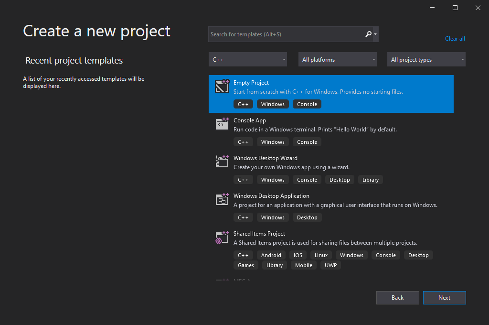</div><center style="font-weight: bold;">그림 3. 비주얼 스튜디오 C 프로젝트 생성 (1단계).</center>

2. 프로젝트 및 솔루션 이름을 선정한다. 여기서 프로젝트란, 소스 코드와 컴파일러 설정 등의 실질적인 코딩 내용을 관리하는 `.vcxproj` 확장자 파일이며, 솔루션은 여러 프로젝트 파일을 하나의 폴더처럼 담는 `.sln` 파일이다. 비주얼 스튜디오에서 프로젝트는 `.sln` 파일로 열기를 권장한다.

<div style="background-color:white; border:solid 3px #808e95; text-align: center; border-radius:0.5em; padding:0.5em 0 0.5em 0;">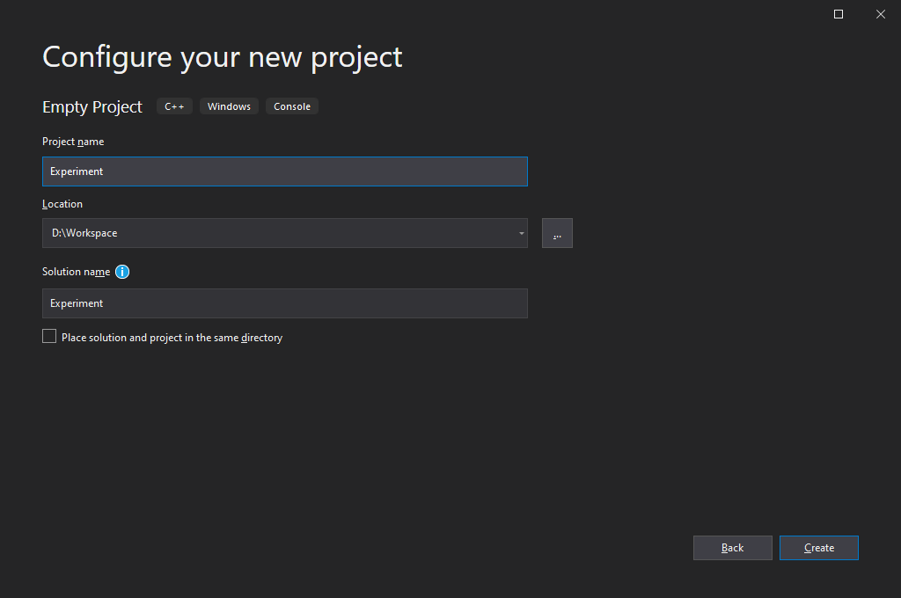</div><center style="font-weight: bold;">그림 4. 비주얼 스튜디오 C 프로젝트 생성 (2단계).</center>

3. 오른쪽의 솔루션 탐색기(Solution Explorer)에서 소스 파일(Source Files)에 오른쪽 클릭하여 `추가 > 새 항목`을 클릭한다.

<div style="background-color:white; border:solid 3px #808e95; text-align: center; border-radius:0.5em; padding:0.5em 0 0.5em 0;">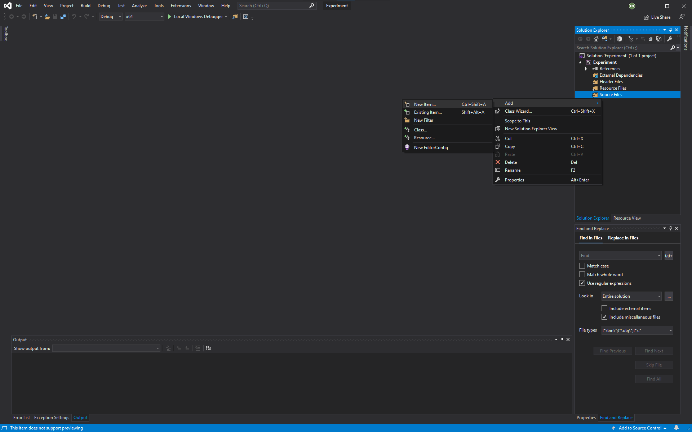</div><center style="font-weight: bold;">그림 4. 비주얼 스튜디오 C 프로젝트 생성 (3단계).</center>

4. 새 항목 추가 창에서 C++ 파일을 선택하나, 파일 이름에서 확장자를 C++ 소스 파일 확장자의 `.cpp`에서 C 소스 파일 확장자인 `.c`로 변경한다.

<div style="background-color:white; border:solid 3px #808e95; text-align: center; border-radius:0.5em; padding:0.5em 0 0.5em 0;">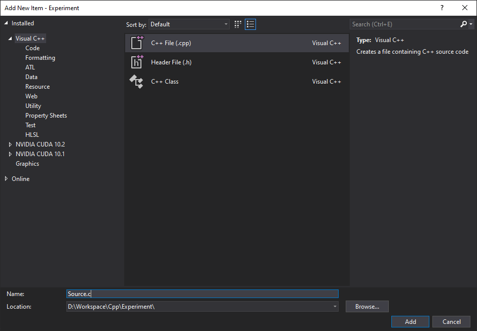</div><center style="font-weight: bold;">그림 5. 비주얼 스튜디오 C 프로젝트 생성 (4단계).</center>

단, 빈 프로젝트를 통해 추가된 소스 파일인 만큼 내부에는 어떠한 기본적인 코드가 작성되어 있지 않는다. 아래의 코드를 소스 파일에 붙여넣으며, 코드에 대한 설명은 차후 진행될 예정이다.

```c
#include <stdio.h>

int main() {
    // 여기서부터 코드 입력...
    printf("Hello, World!\n");
    return 0;
}
```

비주얼 스튜디오에서 C 언어 프로그램을 실행하는 방법에는 두 가지가 존재한다: 디버그(debug) 모드(`F5`)와 일반 실행 모드(`Ctrl+F5`)이다. 프로그램에 문제가 발생하여 하나씩 짚어보아야 할 경우 디버깅 모드를 사용하지만, 그렇지 않은 경우에는 일반 실행 모드를 사용할 것을 권장한다.

### CRT Security Warning

C Run-time Library (CRT)는 ISO C99 표준 라이브러리를 내포하고 있는 C++ 표준 라이브러리이다. 그 중에서 비주얼 스튜디오의 MSVC 컴파일러는 안정성 문제를 고려하여 일부 기능의 사용을 제한하였으며, 대신 접미사 `_s`가 붙은 더욱 안정된 기능을 제공한다. 사용이 제한된 기능을 사용하려 할 시, 안정성 경고와 관련된 `C4996` 컴파일 작업 오류이 나타난다.

CRT 안정성 경고는 흔히 C 언어 프로그래밍에 자주 목격된다. 그러나 이는 사실상 "경고"이므로 무시하고 컴파일 할 수 있으며, 아래의 코드를 입력하면 된다.

```c
#define _CRT_SECURE_NO_WARNINGS
```

## 엑스코드

[엑스코드](https://developer.apple.com/download/release/)(Xcode)는 애플에서 개발한 macOS의 대표적인 IDE이며 Clang을 기본 컴파일러로 사용한다. 엑스코드 또한 다른 프로그래밍 언어를 지원하는데, 비주얼 스튜디오와 달리 엑스코드는 C 프로그램 언어 선택 옵션이 존재한다.

엑스코드를 실행한 다음, 새로운 프로젝트를 `File > New > Project...`로 통해 생성한다.

<div style="background-color:white; border:solid 3px #808e95; text-align: center; border-radius:0.5em; padding:0.5em 0 0.5em 0;"></div><center style="font-weight: bold;">그림 6. 엑스코드 시작화면.</center>

본격적인 엑스코드 창이 나타나게 되는데, 애플 제품의 어플리케이션 제작에 특화되어 있으며 프로젝트 종류도 여러 가지가 있다. C 언어 프로젝트 생성을 위해서는 아래의 절차를 따라야 한다:

1. 사용하고 있는 컴퓨터가 macOS 운영체제이므로, macOS 탭에서 가장 간단한 터미널 형식의 프로그램을 위해 Command Line Tool을 선택한다.

<div style="background-color:white; border:solid 3px #808e95; text-align: center; border-radius:0.5em; padding:0.5em 0 0.5em 0;"></div><center style="font-weight: bold;">그림 7. 엑스코드 C 프로젝트 생성 (1단계).</center>

2. Product Name에는 프로젝트 이름을 선정하고, Language에는 C로 선택한다.

<div style="background-color:white; border:solid 3px #808e95; text-align: center; border-radius:0.5em; padding:0.5em 0 0.5em 0;">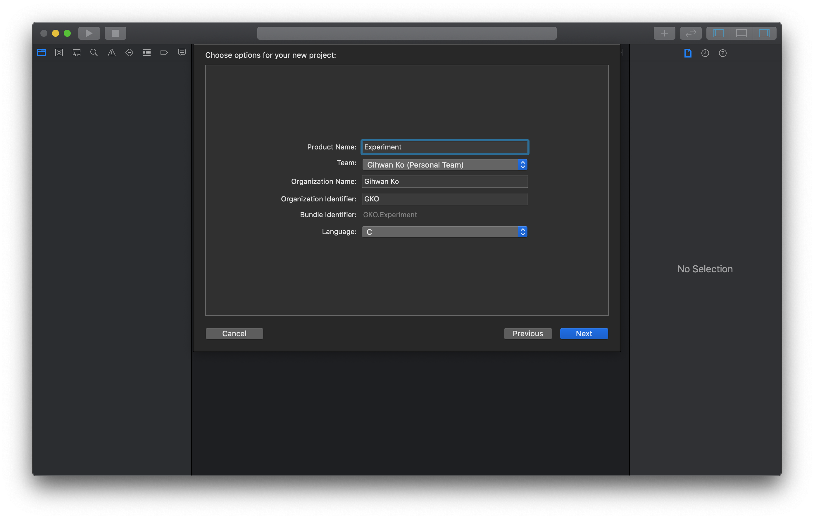</div><center style="font-weight: bold;">그림 7. 엑스코드 C 프로젝트 생성 (2단계).</center>

3. 프로젝트를 저장할 경로를 고른다.

<div style="background-color:white; border:solid 3px #808e95; text-align: center; border-radius:0.5em; padding:0.5em 0 0.5em 0;">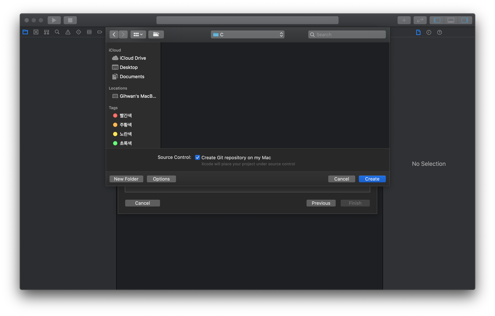</div><center style="font-weight: bold;">그림 8. 엑스코드 C 프로젝트 생성 (3단계).</center>

4. 왼쪽 패널에는 Experiment 폴더 아래에 `main.c`라는 C 소스 파일이 생성되어 있으며, 최소한의 기본 코드가 작성되어 있다.

<div style="background-color:white; border:solid 3px #808e95; text-align: center; border-radius:0.5em; padding:0.5em 0 0.5em 0;">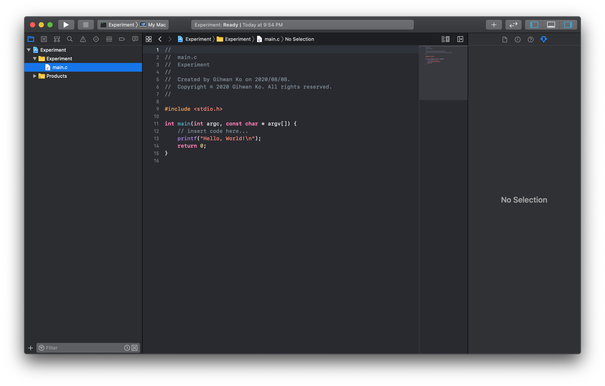</div><center style="font-weight: bold;">그림 9. 엑스코드 C 프로젝트 생성 (4단계).</center>

엑스코드에서 C 언어 프로그램 실행 모드는 한 가지만 존재하며, 단축키는 `⌘+R`이다. 프로그램에 문제가 발생하여 검토가 필요한 경우, 관측하고자 하는 코드에 중단점(breakpoint)을 설정하여 디버깅을 한다. 활성화된 중단점을 모두 비활성화하여 프로그램을 일반적으로 실행하기 위해서는 단축키 `⌘+Y`로 중단점 활성화 토글을 한다.

## 터미널

리눅스 OS는 기본적으로 GCC 컴파일러가 설치되어 있으나, 위의 비주얼 스튜디오와 엑스코드를 사용할 수 없다. IDE는 컴파일에 반드시 필요한 요소가 아니며, 터미널에서도 컴파일 작업이 가능하다. 최근에는 라즈베리파이와 같은 단일 보드 컴퓨터(single-board computer; SBC)를 사용한 팀 프로젝트가 많아져, 본 내용과 같은 리눅스 사용법은 큰 도움이 될 수 있다.

간단한 예시를 보여주기 위해, *그림 9. 엑스코드 C 프로젝트 생성 (4단계)*에 나온 코드를 그대로 가져와 `main.c`라는 소스 파일에 저장하였다.

<div style="background-color:white; border:solid 3px #808e95; text-align: center; border-radius:0.5em; padding:0.5em 0 0.5em 0;">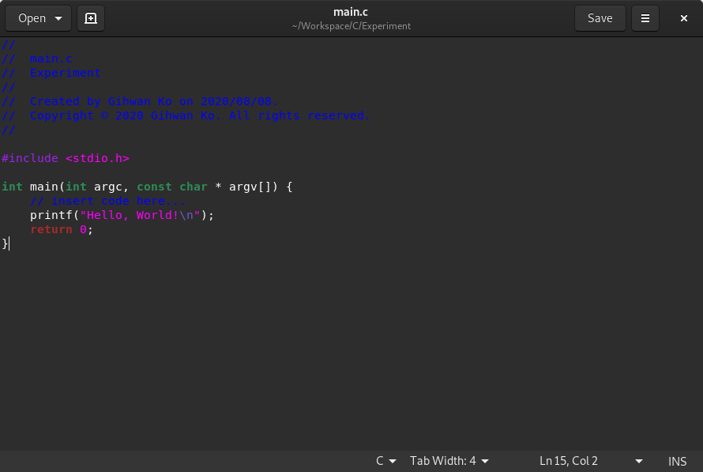</div><center style="font-weight: bold;">그림 10. GCC 컴파일 작업 예시 코드.</center>

위의 `main.c` 소스 파일은 `~/Workspace/C/Experiment` 경로에 저장되었다고 하자.

<div style="background-color:white; border:solid 3px #808e95; text-align: center; border-radius:0.5em; padding:0.5em 0 0.5em 0;">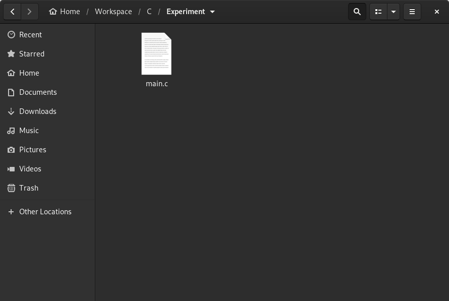</div><center style="font-weight: bold;">그림 11. GCC 컴파일러의 C 언어 프로그램 생성 (1단계).</center>

터미널을 실행하여 소스 파일이 위치한 경로로 이동한다. 터미널에서 경로 이동은 `cd` 명령어를 사용한다. 소스 파일을 컴파일하기 위해서는 아래의 명령어를 입력한다.

<div style="background-color:white; border:solid 3px #808e95; text-align: center; border-radius:0.5em; padding:0.5em 0 0.5em 0;">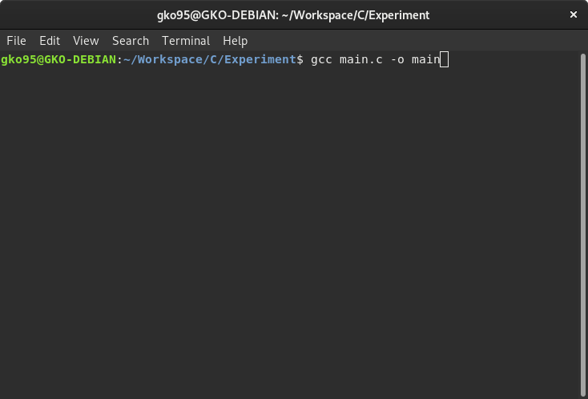</div><center style="font-weight: bold;">그림 12. GCC 컴파일러의 C 언어 프로그램 생성 (2단계).</center>

본 명령어을 해석하면 `main.c` 소스 파일을 컴파일하여 이진 파일을 생성(`-o`)하는데, 생성된 이진 파일 이름은 `main`이라고 지정한다는 의미이다. 해당 예시는 GCC 컴파일러의 매우 간단한 예시 중 하나이며, 프로젝트 성질에 따라 외부 라이브러리 링크와 관련된 옵션도 추가할 수 있다.

소스 파일이 위치한 폴더를 다시 한 번 확인하면 컴파일로 생성된 `main` 이진 파일을 확인할 수 있다.

<div style="background-color:white; border:solid 3px #808e95; text-align: center; border-radius:0.5em; padding:0.5em 0 0.5em 0;">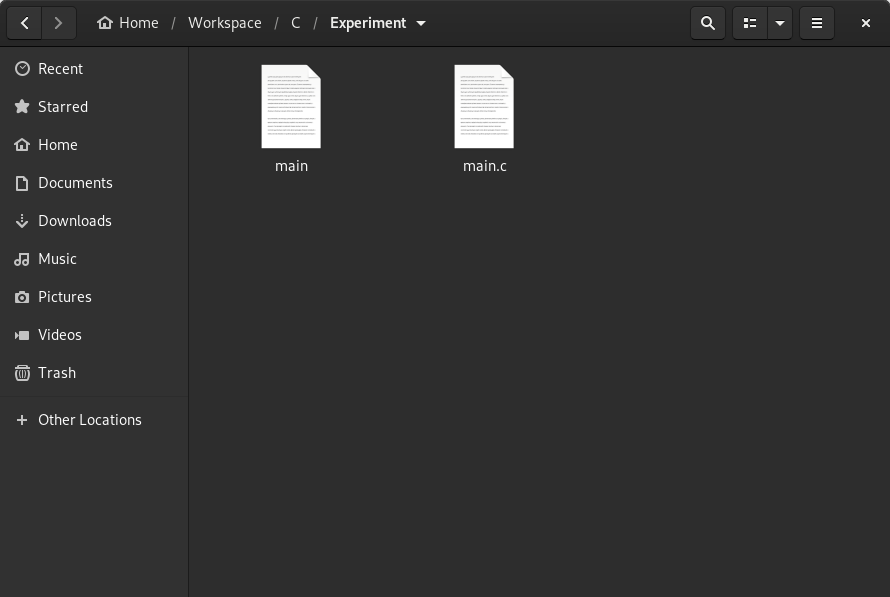</div><center style="font-weight: bold;">그림 13. GCC 컴파일러의 C 언어 프로그램 생성 (3단계).</center>

이진 파일 `main`을 실행하기 위해서는 터미널에서 `./`와 함께 실행 파일 이름을 입력한다.

<div style="background-color:white; border:solid 3px #808e95; text-align: center; border-radius:0.5em; padding:0.5em 0 0.5em 0;">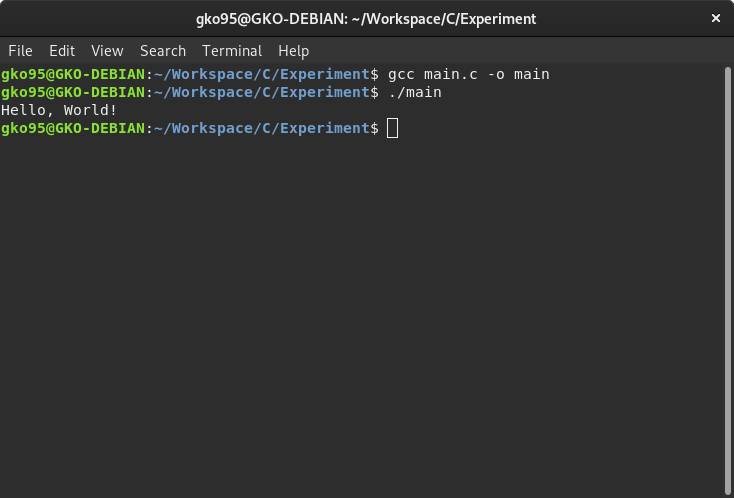</div><center style="font-weight: bold;">그림 14. GCC 컴파일러의 C 언어 프로그램 생성 (4단계).</center>

여기서 `./`은 현재 경로를 의미한다. 현재 경로를 표시하는 구문이 없으면 리눅스 터미널은 `main`이란 파일과 전혀 연관이 없는 환경 변수에서 찾으려고 하며, 결국 파일을 찾지 못해 실행하지 못한다.

# **C: 기초**

각 프로그래밍 언어마다 준수되어야 할 규칙과 기반이 되는 데이터들이 존재한다. 이를 어길 시에는 프로그램에 오류가 발생하거나 정상적인 동작을 보장할 수 없다.  실질적인 프로그래밍에 있어, 본 장에서는 C 프로그램 코딩에 기초적인 정보 제공을 목표로 한다.

## 헤더 파일

헤더 파일(header file)은 데이터 혹은 기능의 존재를 알리는 역할을 하며 `.h` 확장자를 가진다. 통상적으로 헤더 파일은 동일한 이름의 소스 파일과 짝을 이루며, 소스 파일에서 작성된 데이터와 코드를 헤더 파일로 통해 다른 소스 파일에서도 사용할 수 있도록 한다.

프로그래밍 언어에서 흔히 사용되는 데이터와 기능들은 바로 사용할 수 있도록 미리 컴파일되어 있다. 이를 표준 라이브러리(standard library)라고 하며, 아래의 헤더 파일는 일부 표준 라이브러리를 소스 파일에 사용하게 한다.

| 헤더 파일 | 구문                | 설명                                                      |
|:------------:| --------------------- | ------------------------------------------------------------ |
| `stdio`      | `#include <stdio.h>`  | 표준 입출력 함수를 정의한다:<br />`printf()`, `scanf()` |
| `stdlib`     | `#include <stdlib.h>` | 메모리 할당, 예외처리와 같은 여러 기능을 정의한다:<br />`rand()`, `malloc()` |
| `math`       | `#include <math.h>`   | 수학적 계산 관련 함수를 정의한다:<br />`exp()`, `cos()` |
| `time`       | `#include <time.h>`   | 날짜 및 시간 처리 함수를 정의한다:<br />`time()`, `clock()` |

소스 파일에 헤더 파일을 불러오는 방식에는 두 가지가 존재하며, 홑화살괄호(`<>`)와 큰 따옴표(`""`)가 있다.

```c
#include <stdio.h>
#include "header.h"
```

이 둘은 전처리기가 헤더 파일을 어느 위치에서 찾을 것인지 차이점을 가진다.

* `#include <header.h>`
    : 컴파일러 혹은 IDE에서 지정한 경로를 위주로 헤더 파일을 찾으며, 일반적으로 시스템 헤더 파일에 사용된다.
* `#include "header.h"`:
    : 현재 소스 파일이 위치한 경로를 위주로 헤더 파일을 찾는다. 만일 찾지 못하였을 시, ` #include <header.h>`와 같이 지정된 경로에서 헤더 파일을 재탐색한다. 일반적으로 사용자 정의 헤더 파일에 사용된다.

### 컴파일된 헤더
컴파일된 헤더(precompiled header)는 컴파일러에서 더 빠른 속도로 처리할 수 있도록 중간체 형태로 컴파일된 헤더 파일이다. 컴파일 시간을 줄일 수 있는 장점을 가져 수많은 헤더 파일을 가진 프로젝트 혹은 큰 용량을 가진 헤더 파일에 효율적이다.

하지만 컴파일된 헤더를 사용하면 컴파일 작업 자체에는 시간이 다소 걸리는 단점이 있다. 그러므로 용량이 작은 프로젝트나 자주 수정을 해야 하는 헤더 파일이 있다면 컴파일된 헤더 파일은 오히려 비효율적이다. 

| 컴파일된 헤더 | 컴파일러                              |
|:------------------:| ------------------------------------- |
| `stdafx.h`         | 비주얼 스튜디오 2015 (msvc14) 혹은 이전 버전 |
| `pch.h`            | 비주얼 스튜디오 2017 (msvc15) 혹은 이후 버전 |

## 문장 종단자
프로그래밍에서 문장(statement)이란, 실질적으로 무언가를 실행하는 코드를 의미한다. C 언어에서는 모든 문장의 끝에는 항상 문장 종단자(statement terminator)가 위치해야 하며 세미콜론(`;`) 기호를 사용한다.

많은 프로그래밍 입문자가 가장 많이 저지르는 실수 중 하나로 문장 종단자를 잊어버리고 컴파일을 진행하는 것이다. 그러므로 C 기반 언어(C++과 C# 포함)에는 세미콜론을 넣는 것을 습관화해야 한다.

## 주석

주석(comment)은 프로그래밍에 있어 실행되지 않는 부분이며, 흔히 어떠한 정보를 간략히 스크립트 내에 입력하는데 사용된다. C 언어에는 두 가지의 주석이 존재하며, 이들은 각각 "한줄 주석"과 "블록 주석"이라 부른다.

* **한줄 주석**
    : 코드 한 줄을 차지하는 주석이며, 두 개의 슬래시(`//`)로 표시된다.
* **블록 주석**
    : 코드 여러 줄을 차지하는 주석이며, 한 쌍의 슬래시와 별표(`/* */`)로 표시된다.

```c
/*
블록 주석:
코드 여러 줄을 차지하는 주석이다.
*/  
// 한줄 주석: 코드 한 줄을 차지하는 주석이다.
```

## 입력 & 출력

C 언어는 다음과 같은 텍스트 기반의 입력 및 출력 함수를 가진다. 아래는 출력 함수를 우선적으로 나열였다.

| 출력      | 구문                            | 설명                                                  |
|:-----------:| --------------------------------- | ------------------------------------------------------------ |
| `putchar()` | `putchar('A');`                   | 문자 하나를 터미널에 출력한다.                      |
| `puts()`    | `puts("Text");`                   | 일련의 문자들(일명 문자열)을 터미널에 출력하며, 자동 줄바꿈이 된다. |
| `printf()`  | `printf("format", var);`          | 일련의 문자들(일명 문자열)을 터미널에 출력하며, 형식 지원이 된다. |
| `fprintf()` | `fprintf(stream, "format", var);` | 출력 함수 `printf()`의 확장된 개념으로, `stream`에서 스트림 선택이 가능하다. 여기서 `printf(...)`는 `fprintf(stdout, ...)`와 동일하며, `stdout`는 *표준 출력 스트림*을 의미한다. |

```c
// "putchar()" 출력 함수
putchar('A');

// "puts()" 출력 함수
puts("Hello World!");

// "printf()" 출력 함수
float variable = 3.14159;
printf("variable: %.2f", variable);
```

```
AHello World!
variable: 3.14
```

출력 함수와 마찬가지로, 터미널을 통해 데이터를 받는 입력 함수에도 여러 종류가 존재한다.

| 입력       | 반환                        | 설명                                                  |
|:-----------:| ----------------------------- | ------------------------------------------------------------ |
| `getchar()` | 문자                     | 맨 앞에 있는 문자를 입력으로 받는다.                      |
| `gets()`    | 문자열 (일명 문자 배열) | 일련의 문자(일명 문자열)을 입력으로 받는다.    |
| `scanf()`   | 지정 형식               | 지정된 형식에 맞게 입력을 받는다. 문자열을 제외한 입력을 받을 모든 데이터는 주소 연산자(`&`)가 필요하다. |

```c
// "getchar()" 입력 함수
char variable1;
variable1 = getchar();

// "gets()" 츨력 함수
char variable2[20];
gets(variable2);

// "scanf()" 출력 함수
float variable3; char variable4[10];
scanf("%f %3s", &variable3, variable4);
```

```
A
>>> variable1 = 'A'

Hello World!
>>> variable2 = "Hello World!"

3.0 Program
>>> variable3 = 3.000000
>>> variable4 = "Pro"
```

### 형식 지정자

형식 지정자(format specifier)는 입출력 함수에서 데이터를 어떻게 받아들일 것인지 지정한다. 그러나 형식 지정자가 `scanf()` 입력 함수에서 사용되는지, 혹은 `printf()` 출력 함수에서 사용하는지에 따라 데이터는 달리 처리된다.

* 입력 측에서 형식 지정자를 사용하면 본래 데이터의 성질이나 값이 변한다. 대표적인 예로 일련의 문자에서 원하는 부분만 추출한 작업이 있다(`Program`에서 `Pro`만 추출).

* 출력 측에서 형식 지정자를 사용하면 본래 데이터의 성질과 값은 그대로 유지되나, 어떻게 표시되는지만 달라진다. 대표적인 예로 소수점 버림 작업이 있다(`3.14159`에서 `3.14`로 소수 두 자리만 표시).

```c
int variable;
printf("입력: ");
scanf("%5d", &variable);

printf("%3d", variable);
```

```
입력: 1234567
12345			// 지정된 "%3d" 형식에 따라 "123"이라고 표시되지 않는다.
```

| 형식   | 설명       |
|:----:|----------|
| `%d` | 정수 (십진수) |
| `%f` | 부동소수점수   |
| `%c` | 문자       |
| `%s` | 문자열      |
| `%x` | 십육진수     |

> 위의 예시에서의 `%3d` 형식은 앞 혹은 뒤의 세 자리만 추출하는 게 아니며, 숫자 3은 오히려 최소 표시 자릿수를 의미한다. 즉, 형식 지정자가 `%7d`이었으면 `0012345`로 최소 일곱 자리로 정수를 표시한다.

## 식별자
식별자(identifier)는 프로그래밍을 구성하는 데이터(일명 구성체; construct)를 구별하기 위해 사용되는 명칭이다. 다시 말해, 식별자는 개발자가 데이터에 직접 붙여준 이름이다. C 언어에서 식별자를 선정하는데 아래의 규칙을 지켜야 한다.

* 오직 영문, 숫자, 밑줄(`_`)만 허용된다.
* 첫 문자는 숫자로 시작할 수 없다.
* 공백은 허용되지 않는다.

## 자료형
자료형은 프로그래밍에서 자료 형식과 바이트 크기를 결정하는 매우 중요한 구성요소 중 하나이다. 자료형에 따라 프로그램의 메모리 및 처리속도에 효율을 보여줄 수 있다. 아래는 C 프로그래밍 언어가 가지는 자료형이다.

| 식별자 | 자료형              | 설명                                                  |
|:----------:| ---------------------- | ------------------------------------------------------------ |
| `int`      | 정수                | 32비트 단정도 정수.<br />크기: 4 바이트         |
| `float`    | 부동소수점수  | 소수점을 포함한 실수.<br />크기: 4 바이트          |
| `double`   | 배정도 부동소수점수 | 배의 메모리를 가진 배정도 실수.<br />크기: 8 바이트  |
| `char`     | 문자: `''`        | 단일 문자: `'A'` 및 `'?'`.<br />크기: 1 바이트  |
| `bool`     | 논리형                | 논리의 참과 거짓을 `true`(0이 아닌 정수)와 `false`(정수 0)로 표시.<br />크기: 1 바이트 |
| `void`     | 보이드                   | 불특정 자료형.<br />크기: 1 바이트                    |

### `sizeof()` 연산자

`sizeof()` 연산자는 자료형이나 데이터가 차지하고 있는 메모리 용량을 확인하기 위해 사용하며, 단위는 바이트(byte)이다.

```c
sizeof(int);		// 크기: 4 바이트
sizeof(char);		// 크기: 1 바이트
```

## 변수
변수(variable)는 할당 기호(`=`)를 사용하여 데이터를 할당할 수 있는 저장공간이다. C 언어의 변수는 자료형이 정해져 있으며, 해당하는 자료형 데이터만 할당받을 수 있다. 

아래의 예시는 `variable`이란 식별자를 가진 변수가 정수 자료형만 할당받을 수 있는 존재임을 알리는데, 이를 프로그래밍에서는 *선언(declaration)*이라고 부른다.

```c
// 변수 "variable"의 선언
int variable;
```
한 번 선언된 변수는 컴파일러가 어떠한 데이터 종류를 할당받을 수 있는지 알고 있으므로 더이상 자료형을 표시할 필요가 없다.

선언된 변수에 값을 부여하는 것을 *할당(assignment)*라고 하는데, 포괄적인 용어로는 *정의(definition)*이라고 칭한다. 아래는 `variable` 정수형 변수에 숫자 1을 할당한다.

```c
// 변수 "variable"의 정의
variable = 1;
```

거의 모든 프로그래밍 언어는 할당 연산자를 기준으로 왼쪽에는 피할당자(변수), 오른쪽에는 할당자(데이터 혹은 변수)를 놓는다. 반대로 위치시키면 오류가 발생하거나 원치 않는 결과가 도출될 수 있다.

이 두 절차를 하나로 통합할 수 있으며, 이를 *초기화(initialization)*라고 부른다.

```c
// 변수 "variable"의 초기화
int variable = 1;
```

### 지역 변수 & 전역 변수

C 언어에는 크게 세 종류의 변수로 나뉘어진다.

* **지역 변수(local variable)**는 함수(function)나 클래스(class)와 같은 코드 블록 내부에서 선언된 변수이다. 지역 변수에 저장된 데이터는 코드 블록 밖에서는 소멸되므로 외부에서 사용할 수 없다. 그러므로 지역 변수는 외부에서 선언된 변수의 이름을 가질 수 있다.

* **전역 변수(global variable)**는 스크립트 내에서 어떠한 코드 블록에도 속하지 않은 외부에 선언된 변수이다. 코드 블록 내부에 있는 지역 변수와 함께 사용하기 위해서는 `extern` 키워드로 변수를 선언한다. 단, 변수의 충돌로 인한 예상치 못한 결과와 오류를 방지하기 위해 가급적 전역 변수의 사용은 피하도록 한다.

  ```c
  // 전역 변수 선언
  extern int variable;
  ```

* **정적 변수(static variable)**는 특수한 지역 변수로 함수나 클래스와 같은 코드 블록을 탈출하여도 데이터가 소멸되지 않고 보존된다. 그러므로 해당 코드 블록을 재실행하면 탈출 직전의 데이터를 이어서 사용할 수 있다. 정적 변수는 `static` 키워드로 선언한다.

  ```c
  // 정적 변수 선언
  static int variable;
  ```

### 상수 변수
상수 변수(constant variable)는 초기화 이후 변경할 수 없는 특별한 변수이다. 상수 변수는 `const` 키워드를 통해 선언한다.

```c
const int variable = 1;
```

## 자료형 변환
자료형 변환은 변수 혹은 데이터의 자료형을 다른 자료형으로 강제로 바꾸는 작업이다. 만일 유사한 자료형을 작은 크기에서 큰 크기로 변환할 시, 이를 *암시적* 자료형 변환이라고 한다. 암시적 자료형 변환은 데이터 손실이 없기 때문에 컴파일러에서 자연적으로 처리된다.

```c
short A = 1;	// 2 바이트 정수형
int B = A;		// 4 바이트 정수형
```

이에 반대되는 *명시적* 자료형 변환은 데이터 손실의 위험을 감수하며 데이터의 자료형을 바꾼다. C 언어 형식의 명시적 자료형 변환은 아래와 같이 소괄호(`()`)를 활용한다.

```c
float A = 1.9;  // 4 바이트 부동소수점
int B = (int)A; // 4 바이트 정수형 - 완전 호환 불가: 정수 부분만 반환된다.
```

```
1
```

## 연산자
연산자(operator)는 피연산자의 데이터를 조작할 수 있는 가장 간단한 데이터 처리요소이다. 연산자는 피연산자의 접두부, 접미부, 혹은 두 데이터 사이에 위치시켜 사용한다.

### 산술 연산자
산술 연산자(arithmetic operator)는 숫자 자료형을 처리하는 데 집중한다. 다음은 숫자 자료형에 사용되는 산술 연산자의 목록이다.

|             이름             | 연산자 | 설명                                                  |
| :--------------------------: |:--------:| ------------------------------------------------------------ |
|           덧셈           | `+`      | -                                                            |
|         뺄셈          | `-`      | -                                                            |
|        곱셈        | `*`      | -                                                            |
|           나눗셈           | `/`      | 두 피연산자가 정수일 경우: 정수형 몫만 반환된다.<br/>피연산자 중 실수가 있을 경우: `float` 혹은 `double` 실수로 반환된다. |
| 나머지 (모듈로 연산) | `%`      | 나눗셈의 나머지를 정수형으로 반환한다.                              |
    
산술 연산을 쉽게 읽을 수 있도록 숫자 사이에 공백을 넣어도 된다. 이 공백은 숫자나 산술 연산에 아무런 영향을 주지 않는다.

### 할당 연산자
할당 연산자(assignment operator)는 숫자 자료형에 사용되는 또다른 연산자이다. 이에 대한 설명은 아래의 도표를 참고한다.

| 연산자 | 예시  | 동일  |
|:--------:| -------- | ----------- |
| `+=`     | `x += 1` | `x = x + 1` |
| `-=`     | `x -= 1` | `x = x - 1` |
| `*=`     | `x *= 1` | `x = x * 1` |
| `/=`     | `x /= 1` | `x = x / 1` |
| `%=`     | `x %= 1` | `x = x % 1` |

비록 할당 연산자는 아니지만, 이와 유사한 증감 연산자(increment & decrement)는 C 기반 언어에서 다음과 같은 표현식을 의미한다.

| 연산자    | 예시   | 설명       |
| ----------- | --------- | ----------------- |
| `++` 접두사 | `x = y++` | `x = y; y = y+1;` |
| `++` 접미사 | `x = ++y` | `y = y+1; x = y;` |
| `--` 접두사 | `x = y--` | `x = y; y = y-1;` |
| `--` 접미사 | `x = --y` | `y = y-1; x = y;` |

### 비교 연산자
비교 연산자(relational operator)는 두 데이터 간의 비교 조건을 확인하며, 이에 대한 결과로 참(`true`) 혹은 거짓(`false`) 논리값을 반환한다. 비교 연산자는 아래의 도표에서 확인할 수 있다.

| 미만 | 이하 | 동일 | 상이 | 이상 | 초과 |
|:----:|:----:|:----:|:----:|:----:|:----:|
| `<`  | `<=` | `==` | `!=` | `>=` | `>`  |

### 논리 연산자
논리 연산자(logical operator)에는 논리곱, 논리합, 그리고 보수가 있다. 논리 연산자를 사용할 시, `true`와 `false` 논리값을 각각 이진수의 1과 0으로 간주하면 된다.

| 연산자 | 논리 | 설명                                                |
|:--------:| ----- | ---------------------------------------------------------- |
| `&&`     | 논리곱   | 모든 인수가 `true`이면 `true`이고, 그렇지 않으면 `false`이다.    |
| `||`     | 논리합    | 하나 이상의 인수가 `true`이면 `true`이고, 그렇지 않으면 `false`이다. |
| `!`      | 보수   | `true`를 `false`로 변경 혹은 `false`를 `true`로 변경한다.                   |

### 탈출 문자
탈출 문자(escape character)는 백슬래시 기호(`\`)를 사용하며, 문자열로부터 탈출하여 텍스트 데이터 내에서 특정 연산을 수행하도록 한다. 아래는 탈출 문자 중에서 흔히 사용되는 줄바꿈(`\n`)이다.

```c
printf("안녕하세요.\n처음 뵙겠습니다!");
```

```
안녕하세요.
처음 뵙겠습니다!
```

| 구문 | 설명           |
|:----:| -------------- |
| `\n` | 줄바꿈       |
| `\t` | 탭 |
| `\\` | 백슬래시      |
| `\b` | 백스페이스      |
| `\'` | 작은 따옴표    |
| `\"` | 큰 따옴표      |

# **C: 조건 및 루프**
조건문 및 반복문(혹은 루프문)은 프로그래밍에 가장 흔히 사용되는 코드 문장(statement) 중 하나이다. 여기서 문장이란, 실질적으로 무언가를 실행하는 코드를 의미한다. 본 장에서는 C 프로그래밍의 조건에 따라 실행하는 조건문(conditional statement)과 반복적으로 실행하는 반복문(loop statement)을 소개한다.

## `if` 조건문
`if` 조건문은 조건이 참일 경우 코드를 실행한다. 조건이 `true`일 때 문장이 수행되지만 그렇지 않으면 무시된다.

```c
if (condition)
{
	statements;
}

// 간략화된 문장
if (condition) statement;
```

`if` 조건문 안에 또다른 `if` 조건문을 넣을 수 있으며, 이를 *네스티드(nested)* `if` 조건문이라고 부른다. 이러한 경우, 코드 블록(`{}`)을 사용하여 두 `if` 조건문의 경계를 명확히 구별하기를 권장한다.

```c
if (condition)
{
    if (condtion)
    { 
        statements;
    } 
}
```

### `else` 조건문
`else` 조건문은 단독으로 사용될 수 없으며 반드시 `if` 조건문 이후에 사용되어야 한다. 실행문에는 조건부가 `false`로 평가되었을 경우 호출되는 코드가 포함되어 있다.

```c
if (condition)
{
    statements;
}
else
{
    statements; 
}
```

### `else if` Statement
`else if` 조건문은 `else`와 `if` 조건문의 조합으로 첫 번째 조건이 거짓일 경우, 첫 번째 조건과 다른 새로운 조건을 제시한다.

```c
if (condition)
{
    statements;
}
else if (condition)
{
    statements;
}
else
{
    statements;
}
```

하지만 우선 소개된 `else`-`if` 연쇄 조건문은 두 조건부가 함께 사용되는 점과 비교해 `else if` 조건문은 여전히 하나의 조건부에서 처리되므로, 이 둘은 구체적으로 서로 다른 조건문임을 명시해야 한다.

### 조건 연산자
조건문은 아래와 같이 조건 연산자(ternary operator; `?:`)를 사용하여 간략히 표현될 수 있다.

```c
condition ? true_return : false_return;
```

조건 연산자는 영어로 *ternary operator*로, 이는 세 가지 인수를 사용하는 것을 의미한다. 조건 연산자는 가독성을 감소시키므로 과용해서는 안되지만 변수 할당에는 유용하다.

## `switch` 조건문
`switch` 조건문은 건네받은 데이터를 `case` 키워드에서 제공하는 값과 일치하는지 비교하며, 참일 경우 코드를 실행한다. 참 조건 이후, 더 이상의 조건 평가를 방지하기 위해 모든 `case` 키워드에는 `break`라는 탈출문이 필요하다.

모든 경우에 조건이 부합하지 않을 시, `default` 키워드에 연동된 문장이 실행되며, `switch` 조건문에는 반드시 있어야 한다. 그러나 `case` 키워드와 달리 `break` 탈출문을 필요로 하지 않는다.

```c
switch (argument)
{
    case value1:
        statements;
        break;
    case value2:
        statements;
        break;
    default:
        statements;
}
```

`switch` 조건문은 복수의 경우가 하나의 실행문을 공유할 수 있다.

```c
switch (argument)
{
    case value1:
    default:
        statements;
        break;
    case value2:
    case value3:
        statements;
        break;
    case value4:
        statements;
        break;
}
```

### `break` 문
`break` 문(일명 탈출문)은 반복이 완료되기 전에 루프를 조기 종료하는데 사용된다. 루프 내부에서 탈출문을 마주치는 즉시 현재 루프에서 탈출하지만 그 바깥 루프로부터는 탈출하지 않는다.

### `continue` 문
`continue` 문은 반복문 내에서 나머지 실행문을 전부 건너뛰고 다시 조건 판정부분으로 돌아가게 한다. 이는 반복문을 종료하는 `break` 문과 달리 반복문의 루프를 유지한다.

## `while` 반복문
`while` 반복문은 조건이 유지되는 한 내부 코드를 반복적으로 실행한다. 조건이 `false`임이 판정되면 반복문을 종료한다.

```c
while (condition)
{
    statements;
}

// 간략화된 문장
while (condition) statement;
```

### `do`-`while` 반복문
`do`-`while` 반복문은 `while` 반복문과 유사한다. 그러나 후자는 조건을 먼저 확인하고 문장을 실행하였으면, 전자는 문장을 우선 실행하고 조건을 확인한다.

```c
do
{
    statements
} while (condition);
```

## `for` 반복문
`for` 반복문은 선언된 지역 변수가 조건에 만족하는 한 지속적으로 반복한다. 한 번 반복할 때마다 지역 변수에는 반복문에 명시된 대로 변화가 발생하며, 일반적으로 정수형 증감을 사용한다.

```c
for (variable; condition; increment) {
    statements;
}

// 간략화된 문장
for (variable; condition; increment) statement;
```

# **C: 배열**
C 언어는 여러 데이터를 하나의 변수에 저장하는 배열(array)을 생성할 수 있다. 배열은 여러 데이터를 한 번에 관리하는 편리성을 제공한다. 배열은 *포인터*와 밀접한 관계가 있으며, 이에 대해서는 차후 설명할 예정이다. 본 장에서는 포인터 언급을 최소화하며 배열에 대하여 설명할 것이다.

## 배열
배열(array)은 동일한 자료형의 데이터를 순번대로 담는 저장공간이다. 배열을 선언할 시, 대괄호(`[]`) 안에는 얼마나 많은 데이터를 담을 수 있는지 용량을 정해야 한다.

```c
// 배열 선언
int arr[size];
```

단, 배열 용량을 결정할 때는 변수를 사용할 수 없다(상수 변수 제외). 이는 배열의 크기는 정적이며, 선언 이후 크기를 줄이거나 늘릴 수 없다는 의미이다.

배열의 초기화는 중괄호(`{}`)를 사용하여 데이터를 순번에 맞게 배열 요소에 할당한다.

```c
// 초기화 1
int arr[size] = {value1, value2, ... };

// 초기화 2: 배열 용량을 지정하지 않은 채 초기화하면, 배열 크기는 데이터 개수만큼이다.
int arr[] = {value1, value2, ... };
```

초기화가 이루어질 시, 할당되는 데이터 개수는 선언된 배열 용량을 초과해서는 안된다. 그렇지만 데이터 개수가 용량을 미치지 못할 경우 나머지 요소에는 `0` 혹은 `NULL` 값이 할당된다.

배열 자체를 호출하면 할당된 데이터를 불러오지 않으며, 그 대신 배열이 저장된 메모리 주소(즉, 포인터)가 반환된다. 여기서 배열의 메모리 주소는 첫 번째 요소의 주소와 일치한다.

```c
int arr[3] = {value1, value2, valu3};

arr;		// >> 출력: 0x0139F854
&arr[0];	// >> 출력: 0x0139F854
&arr[1];	// >> 출력: 0x0139F858 ( = 0139F854 + 정수형 4 바이트)
```

자세한 내용은 다음 장 *C: 포인터*에서 다루게 될 것이므로, 지금으로써는 이러한 개념이 있다는 정도로만 이해하면 된다.

위에서 설명한 배열의 특징으로 인해, 배열은 초기화 이외에는 한꺼번에 할당이 불가능하다. 그렇지만 각 요소당 할당은 가능하며, 요소 순번은 0번부터 시작하며 대괄호(`[]`)로 호출한다.

```c
int arr[3];

// 배열의 개별 요소 할당
arr[0] = value1;
arr[1] = value2;
arr[2] = value3;
```

### 배열의 크기

When `sizeof()` operator is used on the array, it returns the total assigned byte size considering its data type, thus "$\mathrm{data \ type \ byte} \times \mathrm{number \ of \ elements}$". Hence, divided by data type byte results array length:

```c
int arr[3];

sizeof(arr)/sizeof(int);	// >> OUTPUT: 3 ( = LENGTH OF ARRAY)
```

### 다차원 배열

Array can contain another array as an element, under the condition these arrays shares the same length. Multi-dimensional array can also be initialized without definite size but limited to its first boundary only.

```c
// INITIALIZATION 1
int arr[size1][size2] = { {value11, value12, ... }, {value21, value22, ...}, ... };

// INITIALIZATION 2
int arr[     ][size2] = { {value11, value12, ... }, {value21, value22, ...}, ... };
```

## 문자열

C language does not have a string data type, but represented using array of character with null terminator `\0` at the end:

```c
// C-형식 문자열
char arr[] = "Hello";
char* ptr = "World!";
```

The following list shows several string functions available in C programming language:

| 함수   | 예시               | 설명                                                  |
| ---------- | --------------------- | ------------------------------------------------------------ |
| `strcat()` | `strcat(str1, str2);` | Append `str2` string at the end of `str1` string variable.   |
| `strcpy()` | `strcpy(str1, str2);` | Copy `str2` string to `str1` string variable.                |
| `strlen()` | `strlen(str);`        | Return the length of `str` string, excluding null terminator. |

# **C: 함수**

C/C++ language is executed based around a single key function called `main()`. Understanding the concept of functions is important in C/C++ languages, which can also be used to create and implement custom function to serve specific purpose.

## 함수

Function is an independent block of code which can process the data and present newly processed data once it’s called, allowing dynamic program scripting. The programming based around use of custom functions is called *functional programming*.

Function can be distinguished by its declaration with parenthesis after its name; `function()`. Its definition is stated inside a code block (`{}`), which is executed when called.

```c
// FUNCTION DEFINITION(AKA. IMPLEMENTATION)
float function(int arg1, float arg2)
{
	return arg1 + arg2;
}

function(1, 3.0);		// >> OUTPUT: 4.0
```

Because C/C++ programming is executed from top to bottom sequentially, function won't be executable unless it is defined firsthand. This creates difficulty with script and function management when the project becomes larger.

Function has a prototype used to let compiler know the function's existence recognizing its definition. Prototype shares same syntax of function declaration of its definition but without a code block.

```c
// FUNCTION PROTOTYPE (AKA. FORWARD DECLARATION)
float function(int arg1, float arg2);

function(1, 3.0);		// >> OUTPUT: 4.0

// FUNCTION DEFINITION (AKA. IMPLEMENTATION)
float function(int arg1, float arg2)
{
	return arg1 + arg2;
}
```

However, defining a function inside another function (aka nested function) is invalid in C/C++ language.

### `return` Statement

The `return` statement is a function-exclusive statement that outputs indicated data under the data type declared on the function. Once the `return` statement is executed, the function ends immediately despite there are codes still left inside.

If the function is a `void` data type, function can be returned by `return;` statement alone without any data to return.

### Parameter & Argument

Following are the difference between parameters and arguments that is referred significantly when discussing function.

**Parameter**
Parameter is a function-internal local variable: because parameters is a function-exclusive local variable, it cannot be called from outside.

| OPERATOR |   SYNTAX    | DESCRIPTION                                                  |
| :------: | :---------: | ------------------------------------------------------------ |
|   `=`    | `arg=value` | Parameter `arg` is assigned `value` by default when no other value is passed. Must locate after normal parameter. |

**Argument**
Argument is a value or object being passed to the function parameter and those passed values and objects will be processed by the function code. However, argument is independent from parameter: change on parameter does not affect value or object passed as argument.

Examples below show how function parameter and argument works:

```c
float function(int arg1, float arg2);

function(1);             // >> OUTPUT: 3.0
function(1, 3.0);        // >> OUTPUT: 4.0

float function(int arg1, float arg2 = 2.0)
{
	return arg1 + arg2;
}
```

However, passing container such as array cannot be passed using the syntax above, requiring different method. There are two possible methods available: argument as an array, and as a memory address (pointer).

```c
void function(int arg[]);

int arr[3] = {value1, value2, value3};
function(arr);              // PASSING ARRAY TO FUNCTION ARGUMENT

// ACCEPT ARGUMENT AS AN ARRAY
void function(int arg[]) {
    statements;
	return;
}
```

----

```c
void function(int *arg);

int arr[3] = {value1, value2, value3};
function(arr);              // PASSING ARRAY TO FUNCTION ARGUMENT

// ACCEPT ARGUMENT AS A POINTER
void function(int *arg) {
    statements;
	return;
}
```

This is possible because array itself returns a memory address. Again, pointer will be explanation on next chapter in detail.

## Entry Point

Entry point is the startup function where a program execution begins. There are three major entry points that can to be discussed in C++.

### `main()` Function

As the only entry point available in traditional C++ console application, a project must have one and only `main()` function within the project. Creating multiple `main()` functions or not having any `main()` function will cause error on running the program.

```c
int main(int argc, char **argv /* ALTERNATIVE: char *argv[] */) {

    return 0;
}
```

According to C++ standard, `main()` function must return `int` data: `EXIT_SUCCESS` (traditionally `0`) and `EXIT_FAILURE`. When return value is omitted by the programmer, the compiler implicitly insert `return 0;` at the end of the entry point.

Entry point `main()` function can have arguments mentioned above: argument count `argc` and argument vector `argv`. These arguments are apparent when executed through command-line:

```
./app.exe option1 option2
```

| Arguments | Data        |
| --------- | ----------- |
| `argv[0]` | `./app.exe` |
| `argv[1]` | `option1`   |
| `argv[2]` | `option2`   |

This indicates `argc` is always greater than 0 as the first element is an executing program.

Meanwhile, Windows OS has its exclusive entry point called `wmain()` function which supports wide character arguments encoded in UTF-16 Unicode (where UTF-8 Unicode encodes common character such as English and numbers).

```c
int wmain(int argc, wchar_t **argv /* ALTERNATIVE: wchar_t *argv[] */) {

    return 0;
}
```

C/C++ language is originated from UNIX platform which is different from Windows platform. Meaning, certain language characters (e.g. Greek, Cyrillic characters) may not be fully supported due to different encoding on `main()` entry point.

## Recursion Function

Recursive function is a function that calls itself (recursion). Factorial $!$ in mathematic is the best example of recursive function implementation.

```c
// EXAMPLE: FACTORIAL "!"
int factorial(int num) {
    // BASE CASE: a case when to escape from the recursion.
    if (num == 1)
        return (1);
    else
        return (num * factorial(num-1));
}
```

Recursion can occur indirectly by multiple number of functions calling one to another, then back to the beginning.

## External Function


## Callback Function

Aka. "call-after" function, it is a function that is passed as an argument to other function (calling function) which expects the argument (callback function) to execute on some time.

Do not try to understand the script below for now as this requires understanding of a pointer which will be dealt on *C: POINTER § Function Pointer*.

```c
// CALLING FUNCTION
float FUNC(float (*callback)(int, float), int arg1, float arg2) {
	float var = callback(arg1, arg2);		// FUNCTION CALLBACK
    return var;
}

// CALLBACK FUNCTION
float function(int arg1, float arg2) {
	return arg1 + arg2;
}

// THEREFORE...
FUNC(&function, 1, 3.0);	// >> OUTPUT: 4.0
```

# **C: POINTER**

Starting from *C: Array* chapter, a new data called "pointer" was mentioned quite often. Pointer is very important concept in C/C++ programming language and is one of the commonly used data to develop advanced program.

This chapter mainly focuses on the pointer and its application that can improve performance and functionality of previously mentioned programming, especially on function.

## Pointer

Pointer is a variable that stores memory address of where the value is located, rather than the value itself. Despite being a memory address, pointer also must to be distinguished by a data type of value. When declaring pointer, compound specifier `*` (aka. asterisk) is placed between data type and identifier:

``` c
// POINTER DECLARATION
int* ptr;				// WARNING C4700: unintialized local variable 'ptr' used
```

Memory address can be called from non-pointer variable as well using ampersand (`&`) operator:

```c
// NON-POINTER DECLARATION
int variable;
&variable;				// >> OUTPUT: 0139F854
```

Since this hexadecimal memory address cannot be written by hand, the only way to either define or initialize the pointer is by assigning already existing memory address. Beware, data type must matched when defining pointer.

```c
// POINTER INITIALIZATION
int variable = 3;
int* ptr = &variable;

printf("%x",  ptr);		// >> OUTPUT: 0139F854	(ADDRESS)
printf("%d", *ptr);		// >> OUTPUT: 3			(VALUE)
```

As seen above, it is possible to return value assigned to the pointer by placing dereference (`*`) operator. While pointer declaration also used asterisk, they are different existence but only sharing the same symbol.

|          OPERATOR          |  VARIABLE   |     RETURN     |
| :------------------------: | :---------: | :------------: |
| Address-on (`&`) Operator  | Non-pointer | Memory address |
| Contents-of (`*`) Operator |   Pointer   |     Value      |

Interestingly, any changes made on variable is also affects contents of the pointer as the pointer shares the same memory address. This feature is the most important when it comes to using pointer in C/C++.

### Null Pointer

Null pointer is a pointer that points to nothing. This can be done by assigning pointer with `nullptr` keyword:

```c
int* ptr = nullptr;		// >> OUTPUT: 00000000
```

### Void Pointer

Void pointer is a pointer with no specific data type (thus, `void`). This has advantage of being able to point to any kind of data type value by using static casting.

```c
// POINTER DECLARATION
void* ptr;

int variable;
(int*)ptr = &variable;
```

### Function Pointer

Pointer can also be assigned with function, called function pointer. This pointer points to the first line function execution, similar to array pointing to its first element. Function pointer is initialized as below:

```c
void function(int, int);

// FUNCTION POINTER INITIALIZATION
void (*ptr)(int, int) = function;

void function(int arg1, int arg2) {
	statements;
    return 0;
}
```

When assigning function pointer, not only should function data type is considered but also the parameters and its number. Failed to meet all these conditions cause compilation error.

While function returns value when used with parenthesis `function()`, function also returns memory address to its starting point when used without parentheses `function`. 

# **C: USER-DEFINED DATA TYPE**

Commonly used data type such as `int`, `float`, `char`, and more are already defined in `stdio.h` header. Developer may create and use custom data type based on these pre-defined data types.

## Structure

Structure groups multiple member variables under a single structure tag, regardless of data type of member variable.

```c
// STRUCTURE DECLARATION
struct STRUCTURE {
    int   field1;
    float field2;
};

// VARIABLE INITIALIZATION
struct STRUCTURE variable1 = {1, 3.0};
struct STRUCTURE variable2 = {.field2 = 3.0, .field1 = 1};
```

----

```c
// STRUCTURE DECLARATION
struct STRUCTURE {
    int   field1;
    float field2;
};

// VARIABLE DECLARATION
struct STRUCTURE variable;

// VARIABLE ASSIGNMENT
variable = (struct STRUCTURE) {1, 3.0};
```

## Union

Union groups multiple member variables under a single structure tag and shares memory address, regardless of data type of member variable. In other word, union is mainly used to present single data in different types of data (such as `int`, `char`, `bool`, et cetera). Because of this, union only requires value assignment on one member field.

```c
// UNION DECLARATION
union UNION {
    int  field1;
    char field2[2];
};

// VARAIBLE DECLARATION & ASSIGNMENT
union UNION variable;
variable.field1 = 22136;    // >> OUTPUT: 22136		(0x 00 00 56 78)

variable.field2[0];         // >> OUTPUT: 'x'		(0x -- -- -- 78)
variable.field2[1];         // >> OUTPUT: 'V'		(0x -- -- 56 --)
```

Since union shares a single memory location to store the value, data allocation size is set based on the member with data type of largest byte size. Member fields with smaller byte-size data type is represented as a portion of the overall.

### Array Union

When declaring array from union, that array can store different types of data due to the nature of union able to express single data into other data types.

```c
// UNION DECLARATION
union UNION {
    int   field1;
    float field2;
};

// ARRAY DECLARATION
union UNION arr[3];
```

## Typedef Declaration

The `typedef` keyword is used to create an alias name for existing data type, providing better readability

```c
typedef int dtypeName;
```

While this is not officially supported in C++ programming language, structure and union can be declared without tag as part of the C programming syntax. This is called *anonymous structure* and *anonymous union* which is for a single use:

```c
// TYPEDEF STRUCTURE
typedef struct {
	int 	field1;
	float 	field2;
} STRUCTURE;

// TYPEDEF UNION
typedef union {
	int		field1;
	float	field2;
} UNION;

// VARIABLE DECLARATION
STRUCTURE variable1;
UNION     variable2;
```

## User-Defined Data Pointer

C language do not support object-oriented programming paradigm. Despite not having a concept called object and class, it can still be implemented similarly on user-defined data.

When user-defined data is assigned by pointer, members can be accessed using arrow member selection (`->`) operator. This method is generally used when the user-defined data needs to be passed as function argument.

```c
// TYPEDEF STRUCTURE
typedef struct {
    int   field1;
    float field2;
} STRUCTURE;

// VARIABLE & POINTER DECLARATION
STRUCTURE variable;
STRUCTURE* ptr = &variable;

// THEREFORE...
ptr->field1 = 1;
ptr->field2 = 3.0;
```

# **C: DYNAMIC MEMORY**

Memory management is one of the crucial factors in C/C++ programming language. Dynamic memory allocation is one of the management for greater memory efficiency. And because this concept is closely related to the pointer, understanding the concept cannot be neglected.

## Stack Structure

Stack is a linear LIFO (Last-In-First-Out) data structure; the first entered data is last to be freed from the memory structure. It is a main memory structure used by the compiler which automatically allocates and deallocates data upon declaration and destruction of data (e.g. variables and functions).

The reason compiler uses stack memory structure is due to its fast memory access. However, stack memory has a drawback that its size is fixed and cannot be expanded.

One of the example of stack structure characteristic can be seen on property of local variable; variable defined inside a scope such as function or namespace cannot be used outside the scope.

### Queue Structure

As opposite to stack structure, queue is a linear FIFO (First-In-First-Out) data structure. The first entered data is first to be released from the memory structure. The best example of queue memory structure is a serial communication port.

## Dynamic Allocation

While stack memory is fast but its memory capacity is fixed, there is also heap memory that is resizable though slower access speed. Heap memory is irrelevant to heap data structure and stores data in random heap memory location.

Allocating data to heap memory is done by developer manually, thus dynamic allocation. However, since dynamically allocated memory is not managed by the compiler, developer needs to be cautious on deallocating data manually afterward as well. Dynamic allocation requires `stdlib.h` header.

| FUNCTION    | EXAMPLE               | DESCRIPTION                                                  |
| ----------- | --------------------- | ------------------------------------------------------------ |
| `malloc()`  | `malloc(size);`       | Allocate `size`-byte heap memory block; memory uninitialized, resulting `SEGFAULT` error. |
| `calloc()`  | `calloc(num, size);`  | Allocate `size`-byte heap memory blocks ($\times$ `num`) contiguously; initialized to 0 but slower than `malloc()`. |
| `realloc()` | `realloc(ptr, size);` | Reallocate to `size`-byte heap memory block.                 |
| `free()`    | `free(ptr);`          | Release dynamically allocated memory.                        |

```c
#include <stdlib.h>

// DYNAMIC ALLOCATION
int* ptr = malloc(10);

// REALLOCATION (10 -> 20 BYTES)
ptr = realloc(ptr, 20);

// DYNAMIC DEALLOCATION
free(ptr);
```

### Dynamic Array

Dynamic array is an array that can change its size dynamically. This implementation is widely used to allow expansion of array size as needed. As common array is static, thus cannot change size after declaration or even define size using non-constant integer.

Dynamic array is generally managed using structure, allow keeping track of array size and current capacity possible.

```c
#include <stdlib.h>

// TYPEDEF STRUCTURE
typedef struct {
    char* arr;
    int   size;        // ASSIGNED
    int   capacity;    // CAPACITY
} dyn_arr;

// VARIABLE DECLARATION
dyn_arr variable;

// DYNAMIC ARRAY (1 BYTE)
variable.arr = calloc(1, sizeof(*variable.arr));
variable.capacity = 1;

// RESIZE DYNAMIC ARRAY (1 + 5 BYTES)
variable.arr = realloc(variable.arr, (variable.capacity + 5) * sizeof(*variable.arr));
variable.capacity += 5;
```

### Memory Leak

Memory leak is caused by mismanagement of heap memory when dynamically allocated data is not released (deallocated) and accumulated that no more heap memory space is available. Shortage of memory will eventually lead to system failure.

Prevent memory leak by deallocating data on heap memory using `delete` keyword:

```c
free(ptr);
```

### Dangling Pointer

By deallocating data on heap memory prevents memory leak from happening. While the data addressed by the pointer is gone, the pointer still holds the address that now points to nothing. This is called dangling pointer and calling this pointer may result segmentation fault, aka. `SEGFAULT`.

To prevent this, it is advised to assign `nullptr` so the pointer would point at least to nothing than pointing aimlessly after deleting the heap memory data.

```c
// PROPER DEALLOCATION: DELETE DATA ON ADDRESS -> NULLIFY ADDRESS
free(ptr);
ptr = NULL;
```

# **C: FILE MANAGEMENT**

C language can read and write external file to save or import data. This chapter is mainly focused on accessing and modifying `.txt` extension text file.

## Opening Files

The file first needs to be opened to either read or write. Opening the file is done using `fopen()` function which returns pointer to `FILE` data type. The `mode` argument must be selected to specify whether the file is for read or write:

```c
FILE* fptr = fopen("sample.txt", mode);
```

| MODE   | DESCRIPTION                                     |
| ------ | ----------------------------------------------- |
| `"r"`  | Open for reading (file must exist)              |
| `"w"`  | Open for writing (create file if not exist)     |
| `"a"`  | Open for append (create file if not exist)      |
| `"r+"` | Open for reading and writing from beginning     |
| `"w+"` | Open for reading and writing, overwriting file  |
| `"a+"` | Open for reading and writing, appending to file |

## Reading Files

C languages has three different version of file reading functions, similar to input (from file to program) functions:

| INPUT      | SYNTAX                     | DESCRIPTION                                                  |
| ---------- | -------------------------- | ------------------------------------------------------------ |
| `fgetc()`  | `fgetc(fptr);`             | Returns the next character from the selected `fptr` file stream. |
| `fgets()`  | `fgets(buff,n,fptr)`       | Stores `n-1` long characters to buffer (ex. `char buff[100];`) with null terminator at the end. |
| `fscanf()` | `fscanf(fptr,format,vars)` | Stores data, separated by space or new line, to variables with matching format specifier; requires address (`&`) operator, except for string. |

```
<sample.txt>
Hello World!
65 3.14159
```

```cpp
FILE* fptr = fopen("sample.txt", "r");

// FGETC()
char var1;
var1 = fgets(fptr);    // >> RESULT: var1 = H

// FGETS()
char buff[10];
fgets(buff, 7, fptr);  // >> RESULT: buff = "ello W"

// FSCANF()
char[10] var2; int var3; float var4;
fscanf(fptr, "%s %d %f", var2, &var3, &var4);    // >> RESULT: var2 = "orld!", var3 = 65, var4 = 3.141590
```

## Writing Files

C languages has three different version of file writing functions, similar to output (from program to file) functions:

| OUTPUT      | SYNTAX               | DESCRIPTION                                                  |
| ----------- | -------------------- | ------------------------------------------------------------ |
| `fputc()`   | `fputc(char,fptr);`  | Writes a single character on a selected `fptr` file stream.  |
| `fputs()`   | `fputs(str,fptr);`   | Writes sequence of characters (aka. string) on a selected `fptr` file stream. |
| `fprintf()` | `fprintf("%d",var);` | Writes sequence of characters (aka. string) on a selected `fptr` file stream, with format support. |

```c
FILE* fptr = fopen("sample.txt", "w");

// FPUTC()
fgets('A', fptr);

// FPUTS()
fgets("Hello World!\n", fptr);

// FPRINTF()
fprintf(fptr, "%d %.2f %s", 1, 3.14159, "Program");
```

```
<sample.txt>
AHello World!
1 3.14 Program
```

### Creating Files

New file can be created using the same method of writing file which does not bound by just writing on existing file. Creating file is simply done by designating file name is doesn't exist on the specified path.

```c
FILE* fptr = fopen("path\\new_file.txt", "w");
fgets("Hello World!\n", fptr);
```

## Closing Files

After opening the file, it should be closed manually. Just like opening with `fopen()` function, opened file is closed using `fclose()` function:

```c
fclose(fptr);
```

The function returns 0 if closed successfully, else returns EOF (end of file).

# **C: EXCEPTION**

Exception is a problem encountered during a program execution (not during compilation). C programming language offers macro and functions for controlling exceptions: `errno`, `perror()`, and `strerror()`. Through exception handling, stable program can be compiled and executed without any halt or crash.

## Error Number

The macro `errno`, short for "error number", is a global variable defined inside `errno.h` header file. The macro must first be initialized to 0 before using, and is automatically assigned with new error number if anything goes wrong.

Following script is one of the best example of `errno` by attempting to open a non-existing file:

```c
#include <errno.h>    // ERRNO HEADER
extern int errno;     // ERRNO DECLARATION (GLOBAL)

int main(){
    // INITIALIZATION
    errno = 0;
    
    // ATTEMPT TO OPEN (NON-EXISTING) FILE
    FILE* fptr = fopen("./non_existance.txt", "r");
    
    // FAILED TO OPEN...
    if (fptr == NULL) {
        // ERROR NAME: ENOENT 2 (No such file or directory)
        fprintf(stderr, "Error opening file. Error code: %d\n", errno);
        exit(-1);
    }

    fclose(fptr);
    return 0;
}
```

```
Error opening file. Error code: 2
```

### Standard Error Stream

Previously on *C: BASIC § Input & Output* first introduced the most common output stream called *standard output* `stdout`. There are other kinds of stream, specifically designed for streaming error, namely *standard error* `stderr`.

```c
fprintf(stderr, "Hello World!");
```

These difference on stream allows control of streaming data from program to target devices/locations, such as console and file.

## Error Description

Error type can be expressed and stored as integer number using `errno` macro. However, these error can also be shown on console terminal in human-readable English, describing what is the cause of the error. This can be done using `perror()` function, without a need of `errno.h` header file.

```c
int main(){
    
    FILE* fptr = fopen("./non_existance.txt", "r");
    if (fptr == NULL) {
        // ERROR NAME: ENOENT 2 (No such file or directory)
        perror("ERROR Description");
        exit(-1);
    }

    fclose(fptr);
    return 0;
}
```

```
ERROR Description: No such file or directory
```

# **C: PREPROCESSOR**

C/C++ program language compiler processes the script into two divided stages: preprocessing and compilation. On the stage of preprocessing, preprocessor directive such as `#include` is taken care of by the compiler.

This chapter will introduce useful and commonly used preprocessor directives that is actually being implemented on development.

## Macro Definition

Macro is a fragment of code that is given a name (aka. identifier). A fragment of code can be a simple data (e.g. number, character, string) or an expression with arguments. The formal and latter is respectively called *object-like* and *function-like* macro.

The benefit of macro is it cannot be changed on runtime. The defined macro can be used on the script passed from a header file through `#include` directive.

### `#define` Directive

The `#define` directive is used to create macro:

```cpp
#define SOMETHING       value                // MACRO
#define ANYTHING(x, y)  (x * SOMETHING - y)  // MACRO WITH ARGUMENTS
```

### `#undef` Directive

In some cases, macro can cause naming collision that cannot be fixed on compilation stage. This macro can be removed by `#undef` directive:

```cpp
#undef SOMETHING
```

### Predefined Macros

Compilers have common standard and compiler-specific predefined macros available for developers.

* MSVC: [Microsoft Docs - Predefined Macros](https://docs.microsoft.com/en-us/cpp/preprocessor/predefined-macros)
* GCC: [GCC Online Documentation - Predefined Macros](https://gcc.gnu.org/onlinedocs/cpp/Predefined-Macros.html)
* Others: https://sourceforge.net/p/predef/wiki/Compilers/

## Conditional Inclusion

Preprocessor has a conditional directives that are used for conditional compilation. These directives are not to be used as a substitution of `if` and `else` conditional statement.

```cpp
#if		SOMETHING > value
	statements;
#elif	SOMETHING < value
	statements;
#else
	statements;
#endif
```

### Macro Condition

Conditional inclusion can check condition whether the macro is already defined or not:

```cpp
// IF COMPILED ON 64-BIT ARM OR x64
#ifdef	_WIN64
	statments;
#endif

// IF NOT COMPILED ON 64-BIT ARM OR x64
#ifndef	_WIN64
	statements;
#endif
```

## Pragma Directive

Pragma directive is used to configure features and options for a compiler. Each compiler differs from each other, and this makes pragma a non-standard compiler-specific preprocessor directive.

* MSVC: [Microsoft Docs - Pragma Directives and the Pragma Keyword](https://docs.microsoft.com/en-us/cpp/preprocessor/pragma-directives-and-the-pragma-keyword)
* GCC: [GCC Online Documentation - Pragmas](https://gcc.gnu.org/onlinedocs/gcc/Pragmas.html)

This chapter mainly focuses on pragma directive from MSVC as it is the most common and widely used C/C++ compiler provided by Microsoft Visual Studio.

### `#pragma once`

The `#pragma once` pragma directive is extremely useful upon compilation by only including the header file once instead of multiple time on every inclusion. 

```cpp
#pragma once
```

Through this pragma directive can reduce compilation time. Additionally, because it prevents multiple inclusion can this pragma function as *include guard*.

The following code is an example of include guard without using `#pragma once` pragma directive:

```cpp
// "header.h"
#ifndef HEADER_FILE
#define HEADER_FILE

#endif	/* HEADER_FILE */
```

If `header.h` has not been processed, the compiler defines the `HEADER_FILE` for the first time. However, upon second encounter, compiler will not process the header file again because of the macro conditioning.

### `#pragma region`

Though it does not affect any on compilation, `#pragma region` and `#pragma endregion` pair supports expanding and collapsing code block on Visual Studio Code Editor:

```cpp
#pragma region REGIONNAME
	statements;
#pragma endregion
```
