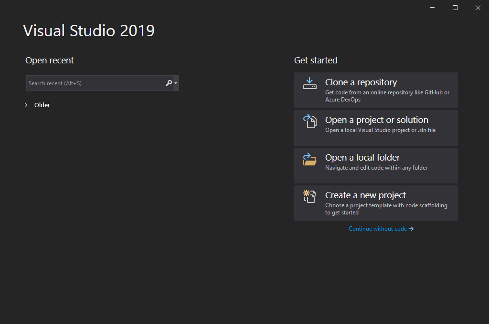
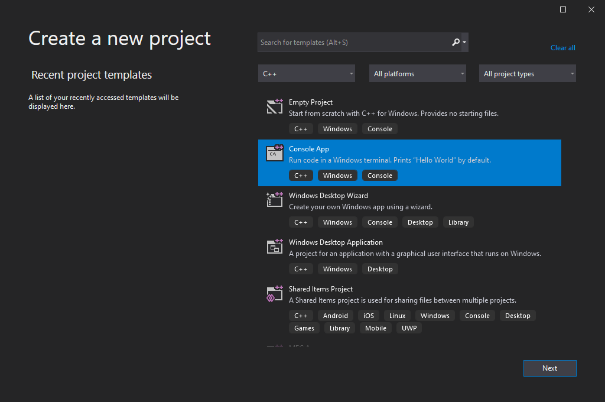
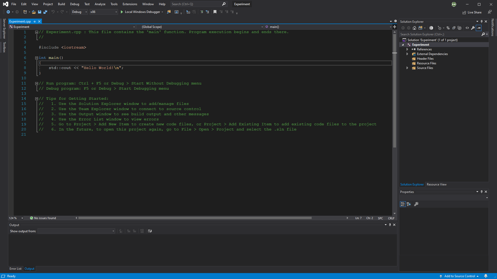
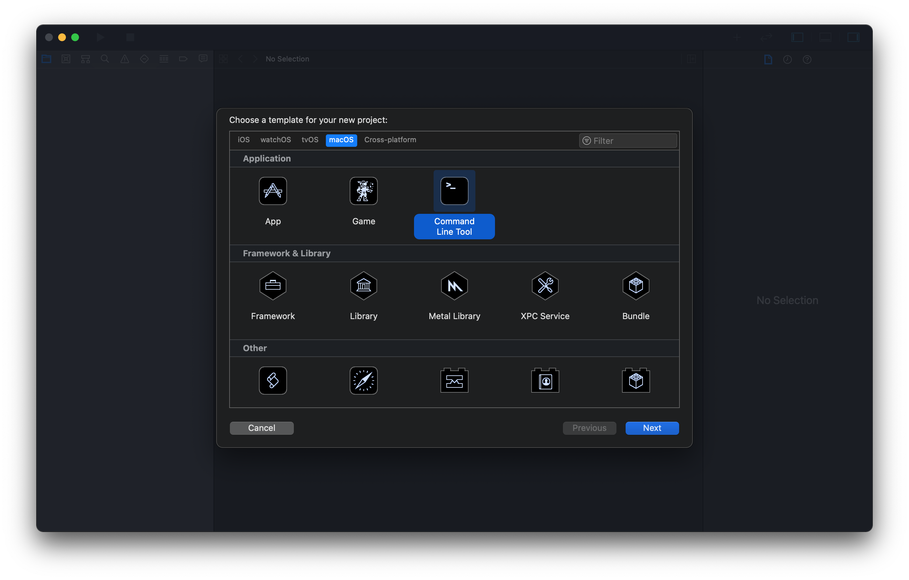
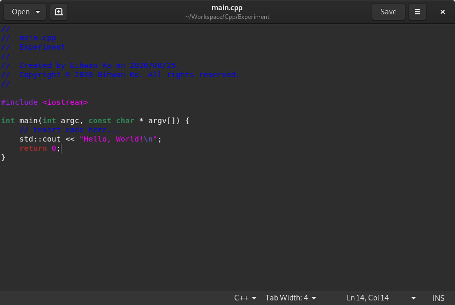

# **C++: 소개**

C++ 프로그래밍 언어는 C 언어에서 기반된 범목적(general-purpose) 저급(low-level) 프로그래밍 언어이다. 코드를 순서대로 실행하는 절차적 프로그래밍 언어인 C와 달리, 객체지향적 프로그래밍도 지원하는 C++를 하이브리드 언어라고 부른다. C 언어의 확장판으로 볼 수 있는 C++ 프로그래밍 언어는 더 많은 기능을 제공하므로써 폭넓은 활용도를 보장한다.

## 컴파일 언어

프로그래밍 언어를 실행하는 방법에는 크게 두 가지로 나뉘어진다: 컴파일 언어와 인터프리트 언어이다.

인터프리터(interpreter)는 영문으로 작성된 소스 코드를 컴퓨터가 곧바로 해독하여 실행하며, 인터프리터가 있는 한 하나의 소스 코드를 서로 다른 시스템에서 동일하게 실행할 수 있는 장점을 가진다(일명 크로스 플랫폼; cross platform). 대표적인 인터프리트 언어로는 파이썬(Python)이 있다. 반면, 컴파일러(compiler)는 소스 코드를 컴퓨터 운영체제와 아키텍처에 따라 이진코드로 번역한 부산물을 생성하여 실행한다. 

C++ 언어는 컴파일 언어이며, 크로스 플랫폼이 지원되지 않는 단점이 있지만 컴파일러의 최적화로 인해 인터프리터보다 실행 속도가 매우 빠르다.

### 컴파일러

C++ 언어의 컴파일러는 국제표준기구(ISO)에서 표준을 발표한 년도에 따라 버전이 나뉘어진다. 가장 널리 사용되고 있는 버전으로는 C++98과 C++11, 그리고 가장 최신인 C++17이 존재한다. 상당한 C++ 프로그래밍 교재들이 C++98 표준을 기반으로 설명하나, 본 문서는 최소한 다양한 기능들이 추가된 C++11 표준을 기준으로 C++ 프로그래밍 언어에 대하여 설명한다.

### 전처리기

전처리기(preprocessor)는 컴파일러가 소스 코드를 이진코드 컴퓨터 언어로 변역하기 전의 컴파일 작업 준비하는 역할을 이행한다. 전처리기가 수행하는 명령어는 해쉬 기호(`#`)로 표시되며, 이를 전처리기 지시문(preprocessor directive)라고 부른다.

| 전처리기 지시문 | 예시                  | 설명                                              |
| :-------------: | --------------------- | ------------------------------------------------- |
|   `#include`    | `#include <iostream>` | 스크립트에 헤더 파일을 추가한다.                  |
|    `#define`    | `#define SQUARE`      | 스크립트 내에서 사용할 수 있는 매크로를 정의한다. |
|    `#pragma`    | `#pragma once`        | 컴파일러에 추가적 설정을 제공한다.                |

전처리기는 C++ 언어를 읽지 않을 뿐더러 C++ 언어 문법을 따르지 않는다. 오로지 전처리기 지시문을 처리하고 주석을 없애는 등의 작업을 하여 컴파일러에 제공한다. 전처리기 지시문은 필수요소가 아니지만 프로그래밍을 더 편리하도록 한다. 전처리기는 컴파일러의 일부 중 하나이다.

# **C++: 설치**

C++ 프로그래밍 언어로 개발하기 위해서는 C++ 컴파일러가 반드시 필요하며, 컴파일러 제작 회사 및 목적에 따라 종류가 다양하다. 어떤 컴파일러를 사용하는지에 따라 소스 코드를 실행 프로그램으로 컴파일하는 방식이 다를 수가 있으나, 모든 컴파일러는 동일한 ISO 표준에 따라 동작하므로 일반적인 경우에는 어떠한 컴파일러를 사용하던 상관이 없다.

통합 개발 환경(integrated development environment; IDE)은 코드 편집기 기능을 제공하며 컴파일러를 통해 실행 가능한 프로그램을 생성한다. 그러므로 본 장에서는 IDE 설치 및 초기설정 위주에 대하여 설명한다.

## 비주얼 스튜디오

[비주얼 스튜디오](https://visualstudio.microsoft.com/downloads/)(Visual Studio)는 마이크로소프트에서 개발한 윈도우 OS의 대표적인 IDE이며 MSVC 컴파일러를 제공한다. 비주얼 스튜디오는 총 세 가지의 에디션이 존재하며, 무료 버전인 커뮤니티 에디션으로도 충분하다. 통합 개발 환경인 만큼 다른 프로그래밍 언어도 함께 지원하므로 여러 종류의 구성요소를 제공한다. 그 중에서 C++ 프로그래밍 언어를 위해 "Desktop development with C++"를 선택한다.

<div style="background-color:white; border:solid 3px #808e95; text-align: center; border-radius:0.5em;"></div><center style="font-weight: bold;">그림 1. 비주얼 스튜디오 C++ 프로그래밍을 위한 구성요소.</center>

만일 한국어 지원을 원한다면 Language packs 탭에서 한국어를 함께 선택하면 된다.

비주얼 스튜디오를 실행하면 아래와 같은 시작화면이 나타난다. 새로운 프로젝트를 생성하려면 오른쪽 하단의 Create a new project 버튼을 클릭한다.

<div style="background-color:white; border:solid 3px #808e95; text-align: center; border-radius:0.5em;"></div><center style="font-weight: bold;">그림 2. 비주얼 스튜디오 시작화면.</center>

C++로 만들 수 있는 프로그램은 다양하여 비주얼 스튜디오에서 선택할 수 있는 프로젝트 종류도 여러 가지가 있다. C++ 언어 프로젝트 생성을 위해서는 아래의 절차를 따라야 한다:

1. 프로그래밍 언어를 C++로 선택하여 Console App(콘솔 어플리케이션)을 클릭한다.

<div style="background-color:white; border:solid 3px #808e95; text-align: center; border-radius:0.5em;"></div><center style="font-weight: bold;">그림 3. 비주얼 스튜디오 C++ 프로젝트 생성 (1단계).</center>

2. 프로젝트 및 솔루션 이름을 선정한다. 여기서 프로젝트란, 소스 코드와 컴파일러 설정 등의 실질적인 코딩 내용을 관리하는 `.vcxproj` 확장자 파일이며, 솔루션은 여러 프로젝트 파일을 하나의 폴더처럼 담는 `.sln` 파일이다. 비주얼 스튜디오에서 프로젝트는 `.sln` 파일로 열기를 권장한다.

<div style="background-color:white; border:solid 3px #808e95; text-align: center; border-radius:0.5em;"></div><center style="font-weight: bold;">그림 4. 비주얼 스튜디오 C++ 프로젝트 생성 (2단계).</center>

3. 비주얼 스튜디오에서 알아서 준비한 프로젝트를 그대로 사용한다.

<div style="background-color:white; border:solid 3px #808e95; text-align: center; border-radius:0.5em;"></div><center style="font-weight: bold;">그림 4. 비주얼 스튜디오 C++ 프로젝트 생성 (3단계).</center>

위의 3단계 절차는 콘솔 어플리케이션 프로젝트를 생성하는 가장 간단한 방법이다. 만일 아무것도 없는 빈 프로젝트에서 생성하기를 원하면 *PRGMING_C* 문서의 설치 항목을 참조한다.

비주얼 스튜디오에서 C++ 언어 프로그램을 실행하는 방법에는 두 가지가 존재한다: 디버그(debug) 모드(`F5`)와 일반 실행 모드(`Ctrl+F5`)이다. 프로그램에 문제가 발생하여 하나씩 짚어보아야 할 경우 디버깅 모드를 사용하지만, 그렇지 않은 경우에는 일반 실행 모드를 사용할 것을 권장한다.

## 엑스코드

[엑스코드](https://developer.apple.com/download/release/)(Xcode)는 애플에서 개발한 macOS의 대표적인 IDE이며 Clang을 기본 컴파일러로 사용한다. 엑스코드 또한 다른 프로그래밍 언어를 지원하는데, 비주얼 스튜디오와 마찬가지로 엑스코드는 C++ 프로그램 언어를 지원한다

엑스코드를 실행한 다음, 새로운 프로젝트를 `File > New > Project...`로 통해 생성한다.

<div style="background-color:white; border:solid 3px #808e95; text-align: center; border-radius:0.5em;"></div><center style="font-weight: bold;">그림 5. 엑스코드 시작화면.</center>

본격적인 엑스코드 창이 나타나게 되는데, 애플 제품의 어플리케이션 제작에 특화되어 있으며 프로젝트 종류도 여러 가지가 있다. C++ 언어 프로젝트 생성을 위해서는 아래의 절차를 따라야 한다:

1. 사용하고 있는 컴퓨터가 macOS 운영체제이므로, macOS 탭에서 가장 간단한 터미널 형식의 프로그램을 위해 Command Line Tool을 선택한다.

<div style="background-color:white; border:solid 3px #808e95; text-align: center; border-radius:0.5em;"></div><center style="font-weight: bold;">그림 6. 엑스코드 C++ 프로젝트 생성 (1단계).</center>

2. Product Name에는 프로젝트 이름을 선정하고, Language에는 C++로 선택한다.

<div style="background-color:white; border:solid 3px #808e95; text-align: center; border-radius:0.5em;"></div><center style="font-weight: bold;">그림 7. 엑스코드 C++ 프로젝트 생성 (2단계).</center>

3. 프로젝트를 저장할 경로를 고른다.

<div style="background-color:white; border:solid 3px #808e95; text-align: center; border-radius:0.5em;"></div><center style="font-weight: bold;">그림 8. 엑스코드 C++ 프로젝트 생성 (3단계).</center>

4. 왼쪽 패널에는 Experiment 폴더 아래에 `main.cpp`라는 C 소스 파일이 생성되어 있으며, 최소한의 기본 코드가 작성되어 있다.

<div style="background-color:white; border:solid 3px #808e95; text-align: center; border-radius:0.5em;"></div><center style="font-weight: bold;">그림 9. 엑스코드 C++ 프로젝트 생성 (4단계).</center>

엑스코드에서 C++ 언어 프로그램을 실행하는 방법에는 두 가지가 존재한다: 디버그(debug) 모드와 일반 실행 모드이다. 실행 단축키는 `⌘+R` 하나로 통일되어 있다. 프로그램에 문제가 발생하여 검토가 필요한 경우, 관측하고자 하는 코드에 중단점(breakpoint)을 설정하여 디버깅을 한다. 활성화된 중단점을 모두 비활성화하여 프로그램을 일반적으로 실행하기 위해서는 단축키 `⌘+Y`로 중단점 활성화 토글을 한다.

## 터미널

리눅스 OS는 기본적으로 G++ 컴파일러가 설치되어 있으나, 위의 비주얼 스튜디오와 엑스코드를 사용할 수 없다. IDE는 컴파일에 반드시 필요한 요소가 아니며, 터미널에서도 컴파일 작업이 가능하다. 최근에는 라즈베리파이와 같은 단일 보드 컴퓨터(single-board computer; SBC)를 사용한 팀 프로젝트가 많아져, 본 내용과 같은 리눅스 사용법은 큰 도움이 될 수 있다.

간단한 예시를 보여주기 위해, *그림 9. 엑스코드 C++ 프로젝트 생성 (4단계)*에 나온 코드를 그대로 가져와 `main.cpp`라는 소스 파일에 저장하였다.

<div style="background-color:white; border:solid 3px #808e95; text-align: center; border-radius:0.5em;"></div><center style="font-weight: bold;">그림 10. G++ 컴파일 작업 예시 코드.</center>

위의 `main.cpp` 소스 파일은 `~/Workspace/Cpp/Experiment` 경로에 저장되었다고 하자.

<div style="background-color:white; border:solid 3px #808e95; text-align: center; border-radius:0.5em;"></div><center style="font-weight: bold;">그림 11. GCC 컴파일러의 C++ 언어 프로그램 생성 (1단계).</center>

터미널을 실행하여 소스 파일이 위치한 경로로 이동한다. 터미널에서 경로 이동은 `cd` 명령어를 사용한다. 소스 파일을 컴파일하기 위해서는 아래의 명령어를 입력한다.

<div style="background-color:white; border:solid 3px #808e95; text-align: center; border-radius:0.5em;"></div><center style="font-weight: bold;">그림 12. G++ 컴파일러의 C++ 언어 프로그램 생성 (2단계).</center>

본 명령어을 해석하면 `main.cpp` 소스 파일을 컴파일하여 이진 파일을 생성(`-o`)하는데, 생성된 이진 파일 이름은 `main`이라고 지정한다는 의미이다. 해당 예시는 GCC 컴파일러의 매우 간단한 예시 중 하나이며, 프로젝트 성질에 따라 외부 라이브러리 링크와 관련된 옵션도 추가할 수 있다.

소스 파일이 위치한 폴더를 다시 한 번 확인하면 컴파일로 생성된 `main` 이진 파일을 확인할 수 있다.

<div style="background-color:white; border:solid 3px #808e95; text-align: center; border-radius:0.5em;"></div><center style="font-weight: bold;">그림 13. G++ 컴파일러의 C++ 언어 프로그램 생성 (3단계).</center>

이진 파일 `main`을 실행하기 위해서는 터미널에서 `./`와 함께 실행 파일 이름을 입력한다.

<div style="background-color:white; border:solid 3px #808e95; text-align: center; border-radius:0.5em;"></div><center style="font-weight: bold;">그림 14. G++ 컴파일러의 C++ 언어 프로그램 생성 (4단계).</center>

여기서 `./`은 현재 경로를 의미한다. 현재 경로를 표시하는 구문이 없으면 리눅스 터미널은 `main`이란 파일과 전혀 연관이 없는 환경 변수에서 찾으려고 하며, 결국 파일을 찾지 못해 실행하지 못한다.

# **C++: 기초**

각 프로그래밍 언어마다 준수되어야 할 규칙과 기반이 되는 데이터들이 존재한다. 이를 어길 시에는 프로그램에 오류가 발생하거나 정상적인 동작을 보장할 수 없다. 실질적인 프로그래밍에 있어, 본 장에서는 C++ 프로그램 코딩에 기초적인 정보 제공을 목표로 한다.

## 헤더 파일

헤더 파일(header file)은 데이터 혹은 기능의 존재를 알리는 역할을 하며, 일반 C 언어와 호환가능한 `.h` 혹은 C++ 전용 `.hpp` 확장자를 가진다. 통상적으로 헤더 파일은 동일한 이름의 소스 파일과 짝을 이루며, 소스 파일에서 작성된 데이터와 코드를 헤더 파일로 통해 다른 소스 파일에서도 사용할 수 있도록 한다.

프로그래밍 언어에서 흔히 사용되는 데이터와 기능들은 바로 사용할 수 있도록 미리 컴파일되어 있다. 이를 표준 라이브러리(standard library)라고 하며, 아래의 헤더 파일는 일부 표준 라이브러리를 소스 파일에 사용하게 한다.

| 헤더 파일 | 구문                | 설명                                                      |
|:------------:| --------------------- | ------------------------------------------------------------ |
| `iostream`      | `#include <iostream>`  | 표준 입출력 함수를 정의한다:<br />`operator >>`, `operator <<`  |
| `string`     | `#include <string>` | 텍스트 데이터 처리 함수를 정의한다:<br />`append()`, `length()` |
| `cmath`       | `#include <cmath>`   | 수학적 계산 관련 함수를 정의한다:<br />`exp()`, `cos()` |
| `chrono`       | `#include <chrono>`   | 날짜 및 시간 처리 함수를 정의한다:<br />`system_clock()`, `duration()` |

소스 파일에 헤더 파일을 불러오는 방식에는 두 가지가 존재하며, 홑화살괄호(`<>`)와 큰 따옴표(`""`)가 있다.

```c
#include <iostream>
#include "header.hpp"
```

이 둘은 전처리기가 헤더 파일을 어느 위치에서 찾을 것인지 차이점을 가진다.

* `#include <header.hpp>`
    : 컴파일러 혹은 IDE에서 지정한 경로를 위주로 헤더 파일을 찾으며, 일반적으로 시스템 헤더 파일에 사용된다.
* `#include "header.hpp"`:
    : 현재 소스 파일이 위치한 경로를 위주로 헤더 파일을 찾는다. 만일 찾지 못하였을 시, ` #include <header.hpp>`와 같이 지정된 경로에서 헤더 파일을 재탐색한다. 일반적으로 사용자 정의 헤더 파일에 사용된다.

### 컴파일된 헤더
컴파일된 헤더(precompiled header)는 컴파일러에서 더 빠른 속도로 처리할 수 있도록 중간체 형태로 컴파일된 헤더 파일이다. 컴파일 시간을 줄일 수 있는 장점을 가져 수많은 헤더 파일을 가진 프로젝트 혹은 큰 용량을 가진 헤더 파일에 효율적이다.

하지만 컴파일된 헤더를 사용하면 컴파일 작업 자체에는 시간이 다소 걸리는 단점이 있다. 그러므로 용량이 작은 프로젝트나 자주 수정을 해야 하는 헤더 파일이 있다면 컴파일된 헤더 파일은 오히려 비효율적이다. 

| 컴파일된 헤더 | 컴파일러                              |
|:------------------:| ------------------------------------- |
| `stdafx.h`         | 비주얼 스튜디오 2015 (msvc14) 혹은 이전 버전 |
| `pch.h`            | 비주얼 스튜디오 2017 (msvc15) 혹은 이후 버전 |

## 문장 종단자
프로그래밍에서 문장(statement)이란, 실질적으로 무언가를 실행하는 코드를 의미한다. C++ 언어에서는 모든 문장의 끝에는 항상 문장 종단자(statement terminator)가 위치해야 하며 세미콜론(`;`) 기호를 사용한다.

많은 프로그래밍 입문자가 가장 많이 저지르는 실수 중 하나로 문장 종단자를 잊어버리고 컴파일을 진행하는 것이다. 그러므로 C 기반 언어(C++과 C# 포함)에는 세미콜론을 넣는 것을 습관화해야 한다.

## 주석

주석(comment)은 프로그래밍에 있어 실행되지 않는 부분이며, 흔히 어떠한 정보를 간략히 스크립트 내에 입력하는데 사용된다. C++ 언어에는 두 가지의 주석이 존재하며, 이들은 각각 "한줄 주석"과 "블록 주석"이라 부른다.

* **한줄 주석**
    : 코드 한 줄을 차지하는 주석이며, 두 개의 슬래시(`//`)로 표시된다.
* **블록 주석**
    : 코드 여러 줄을 차지하는 주석이며, 한 쌍의 슬래시와 별표(`/* */`)로 표시된다.

```cpp
/*
블록 주석:
코드 여러 줄을 차지하는 주석이다.
*/  
// 한줄 주석: 코드 한 줄을 차지하는 주석이다.
```

## 식별자
식별자(identifier)는 프로그래밍을 구성하는 데이터(일명 구성체; construct)를 구별하기 위해 사용되는 명칭이다. 다시 말해, 식별자는 개발자가 데이터에 직접 붙여준 이름이다. C++ 언어에서 식별자를 선정하는데 아래의 규칙을 지켜야 한다.

* 오직 영문, 숫자, 밑줄(`_`)만 허용된다.
* 첫 문자는 숫자로 시작할 수 없다.
* 공백은 허용되지 않는다.

## Namespace

Name of data must be unique and cannot be used elsewhere to prevent confliction. This concept is equivalent to a directory (*project*) only allowed to have files (*data*) with unique name. To have the same naming available, these must be stored in separate folder (*namespace*).

Namespace is created using `namespace` keyword and data is stored inside the code block (`{}`). These data inside the namespace can be accessed by scope resolution (`::`) operator. However, name of the namespaces must be unique and cannot be used elsewhere in one program.

```cpp
int variable;

namespace namespace1 {
	int function1() {...}
}

namespace namespace2 {
	int variable, fucntion() {...}
}

// CALLING FUNCTION LOCATED IN DIFFERENT NAMESPACE.
namespace1::function();
namespace2::function();

// CALLING VARIABLE LOCATED IN AND OUT OF NAMESPACE.
variable;
namespace2::variable;
```

### Global Namespace

Aka. "root namespace", some data have leading scope resolution without specific namespace as previously introduced.

```cpp
::variable;
```

This syntax represents calling the data `variable` not included in any namespace, thus root of the namespace.. Consider Unix's path separator `/`: while the symbol indicates path of directory, it also represents root directory.

```makefile
# UNIX DIRECTORY & PATH SEPARATOR (/)
/Users/<username>/Documents
```

```cpp
// C++ NAMESPACE & SCOPR RESOLUTION (::)
::std::endl
```

The above is identical to `std::endl` that is not included in any namespace.

### `using` Declaration

Declaration with `using` keyword is used to simplify code by reducing repetitive typing of namespace upon using data. There are two different method on using declaration: either individually or as a whole namespace.

For declaration of individual data and whole namespace:

```cpp
// DECLARATION: INDIVIDUAL DATA
using namespace1::function();

// DECLARATION: WHOLE NAMESPACE
using namespace namespace2;
```

## 입력 & 출력

C++ has an input and output under `std` namespace for a text-base console terminal using extraction (`>>`) operator and insertion (`<<`) operator:

| INPUT/OUTPUT | SYNTAX                         | DESCRIPTION                            |
| ------------ | ------------------------------ | -------------------------------------- |
| `std::cin`   | `std::cin >> variable;`        | Takes variable or string as an input.  |
| `std::cout`  | `std::cout << "Hello World!";` | Print variable or string on a console. |

```cpp
int variable;

std::cout << "Enter the value: "
std::cin >> variable;

std::cout << "Hello World!" << variable << std::endl;
```

```
Enter the value: 10
Hello World!10
```

### New-Line Manipulator

A new-line manipulator `std::endl` is a C++ Standard Library that ends or breaks and begins new line:

```cpp
std::cout << "First Line" << std::endl << "Second Line"; 
```

```
First Line
Second Line
```

### Escape Character

Escape character `\` is used to escape from sequence of character and execute certain operation within text-base data.

```cpp
std::cout << "First Line\nSecond Line";
```

```
First Line
Second Line
```

| SYNTAX | DESCRIPTION    |
| ------ | -------------- |
| `\n`   | New line       |
| `\t`   | Horizontal tab |
| `\\`   | Backslash      |
| `\b`   | Backspace      |
| `\'`   | Single quote   |
| `\"`   | Double quote   |

## Data Type

Data type is one of the important factor which determines type and byte size of the data. A well-implemented data type can results memory and time efficiency when processing the script.

C++ programming language have several number of pre-defined type identifier as follows:

| IDENTIFIER | DATA TYPE              | DESCRIPTION                                                  |
| ---------- | ---------------------- | ------------------------------------------------------------ |
| `int`      | Integer                | 32-bits precision integer number.<br />Size: 4 bytes         |
| `float`    | Floating point number  | Real number with decimal points.<br />Size: 4 bytes          |
| `double`   | Double-precision float | Float with doubled precision and memory.<br />Size: 8 bytes  |
| `char`     | Character: `''`        | A single character, e.g. `'A'` and `'?'`.<br />Size: 1 byte  |
| `string`   | String: `""`           | Series of characters under the namespace `std`.<br />Size: N/A (depends on overall character length) |
| `bool`     | Boolean                | Non-zero represents `true` while zero is `false`.<br />Size: 1 byte |
| `auto`     | Automatic              | Data type is declared automatically.<br />Useful for declaring new variable with complex data type. |
| `void`     | Void                   | Non-specific data type.<br />Size: 1 byte                    |

### `sizeof()` Operator

An operator that returns the allocating memory size of data type or variable in bytes.

```cpp
sizeof(int);		// SIZE: 4 BYTE
sizeof(char);		// SIZE: 1 BYTE
```

## Variable

Variable is a container for the data assigned using assignment (`=`) operator. There are three different common stages in variable: declaration, definition, and initialization.

* **Declaration**
  : declaration is declaring existence of the construct of such as variables, objects, and more. The declaring also includes specifying which data type the construct is.

  ```c++
  int variable;
  ```
  
* **Definition**
  : definition refers to block of codes on values and performance the construct has and is capable of. In case of variable which can acquire new data, the term *assignment* is more likely to use.

  ```c++
  variable = 3;
  ```

* **Initialization**
  : initialization is assigning the initial value to the construct, simply the *first* definition. Since the first definition is generally done on the same time when declaring the construct. Hence, initialization is commonly thought by people as *declaration + definition* which is not always true.

  ```c++
  int variable = 3;
  ```

Once the declaration sets data type to a variable, that variable can only take the value of that designated data type.

### Local & Global Variable

**Local variable** is a variable declared inside a code block, such as namespace, function, and class. Data stored in local variable is destroyed when exiting the code block, thus cannot be used outside. Local variable is allowed to have same variable name declared outside (technically, is borrowing the name as a different identity).

**Global variable** is a variable declared on a global scope of the script which is outside a code block. Global variable can be used inside a code block without any special keyword. However, global variable should be avoided if possible to prevent unexpected result and error caused by conflicting variables.

### Constant Variable

Constant variable is a special type of variable that cannot be changed after its initialization. The keyword `const` is used to declare it as a constant variable.

```cpp
const int variable = 3;
```

### Static Variable

Static variable is a special local variable which maintain its value even when escaped and re-entered a function code block. The keyword `static` is used to declare it as a static variable.

```cpp
static int variable = 3;
```

## Data Type Casting

Data type casting force-changes data type stored in a variable into other desired type. Casting the smaller size data to its compatible type of a larger size data is called *implicit* data type casting. This is a natural data type conversion automatically done by compiler as no data loss occurs.

```cpp
short A = 1;	// 2 BYTES INTEGER
int B = A;		// 4 BYTES INTEGER
```

On the other hand, its opposite conversion is called *explicit* data type casting which do have a risk of data loss/corruption upon casting data. Traditional C-style casting syntax (before C++11) is as follows:

```cpp
float A = 1.9;  // 4 BYTES FLOAT
int B = (int)A; // 4 BYTES INTEGER - INCOMPATIBLE: only returns its integer value.
```

```
1
```

However, starting from C++11 and its later version introduced four new casting syntaxes which traditional syntax lacked distinguishing upon casting data type.

### Static Cast

Static cast is general purpose casting responsible for implicit and explicit data-type conversion.

```cpp
int variable = 3;
static_cast<double>(variable);
```

### Constant Cast

Constant cast is a type casting operator used to type-cast constant variable, and can also change the value of the constant value. Modifying constant value uses "reference" which will be introduced in *C++: POINTER*.

```cpp
const int A = 3;				 // OLD: A = 3
int *B = const_cast<int *>(&A);
*B = 1;							// NEW: A = 1
```

### Dynamic Cast

Dynamic cast is used to handle polymorphism (class derived from base-class having different functionality). This casting is specifically designed for converting class. Class will be dealt on *C++: OBJECT-ORIENTED PROGRAMMING*.

```cpp
derivedClass *A = new derivedClass;
baseClass *B = dynamic_cast<baseClass *>(A);
```

### Reinterpret Cast

Reinterpret cast is used to convert pointer to pointer of other data type. It also allows any integral type to be converted into any pointer type and vice versa. Pointer will be dealt on *C++: POINTER*.

```cpp
int *variable = 3
reinterpret_cast<double *>(variable)
```

However, this casting is the most dangerous compared to other three and is suggested only to use with proper data type. 

## Operator

Operator is the simplest form of data processing unit which can manipulate the value of operands. It operates simply by placing before, after, or between the operands.

### Arithmetic Operator

Arithmetic operator is mainly focused on processing numeric data type. Following is a list of arithmetic operator used by numeric data type:

|             NAME             | OPERATOR | DESCRIPTION                                                  |
| :--------------------------: | -------- | ------------------------------------------------------------ |
|           Addition           | `+`      | -                                                            |
|         Subtraction          | `-`      | -                                                            |
|        Multiplication        | `*`      | -                                                            |
|           Division           | `/`      | When both operands are integer: dividend is an integer without remainder.<br/>When at least one operand is real (float or double): dividend is a real (float or double). |
| Remainder (Modulus Division) | `%`      | Remainder only returns integer.                              |

For easier readability of the arithmetic operator, you can place blank space between number and operator, and it doesn’t affect anything on output.

### Assignment Operator

Assignment operator is another operation used within numeric data type. Following is a list of assignment operator used by numeric data type:

| OPERATOR | EXAMPLE  | EQUIVALENT  |
| -------- | -------- | ----------- |
| `+=`     | `x += 1` | `x = x + 1` |
| `-=`     | `x -= 1` | `x = x - 1` |
| `*=`     | `x *= 1` | `x = x * 1` |
| `/=`     | `x /= 1` | `x = x / 1` |
| `%=`     | `x %= 1` | `x = x % 1` |

Although not an assignment operator, a similar **increment and decrement** of the numerical value can be expressed as follow on C-based programming language:

| OPERATOR    | EXAMPLE   | DESCRIPTION       |
| ----------- | --------- | ----------------- |
| `++` prefix | `x = y++` | `x = y; y = y+1;` |
| `++` suffix | `x = ++y` | `y = y+1; x = y;` |
| `--` prefix | `x = y--` | `x = y; y = y-1;` |
| `--` suffix | `x = --y` | `y = y-1; x = y;` |

### Relational Operator

Relational operator is for checking whether the relational condition between two numeric values and returns Boolean value whether condition is true or false. Following is a list of relational operator:

| OPERATOR | DESCRIPTION              |
| -------- | ------------------------ |
| `<`      | Lesser than              |
| `<=`     | Lesser than or equal to  |
| `>`      | Greater than             |
| `>=`     | Greater than or equal to |
| `==`     | Equal to                 |
| `!=`     | Not equal to             |

### Logical Operator

Logical operator consist of AND, OR, and NOT logic. When doing so, think of `true` and `false` as binary 1 and 0, respectively. In wider sense, any non-zero number is deemed `true`.

| OPERATOR | LOGIC | DESCRIPTION                                                |
| -------- | ----- | ---------------------------------------------------------- |
| `&&`     | AND   | `true` when all the arguments are `true`, else `false`.    |
| `||`     | OR    | `true` when at least one argument is `true`, else `false`. |
| `!`      | NOT   | Change `true` to `false` and vice versa.                   |

# **C++: CONDITIONAL AND LOOP**

Conditional and loop statement is commonly used and one of the essential pieces of code in programming. This chapter introduces list of conditional and loop statements in C++ programming.

## `if` Statement

Conditional `if` statement runs code if the condition is true. When the condition evaluates `true`, the statements are carried out but otherwise ignored.

```cpp
if (condition) {
	statements;
}

// SIMPLIFIED STATEMENT
if (condition) statement;
```

It is possible to place`if` statement in another `if` statement, called "nested `if`". It is recommended to use code block (`{}`) to distinguish between `if` statements to avoid computer’s misinterpretation.

```cpp
if (condition) {
    if (condtion) { 
        statements;
    } 
}
```

### `else` Statement

Conditional `else` statement must be followed after `if` statement as it cannot be used alone. The statement contains code that is called when the condition evaluates `false`.

```cpp
if (condition) {
    statements;
}
else {
    statements; 
}
```

### `else if` Statement

Conditional `else`-`if` statement is a combination of `if` and `else` statement; when the first condition evaluates `false`, the `else if` statement provides second (or more) chance to evaluate condition different from the first one.

```cpp
if (condition) {
    statements;
}
else if (condition) {
    statements;
}
else {
    statements;
}
```

However, this is not the same as chain of `else`-`if` conditional statement as that is a combination of two different conditional set, while `else if` statement guarantees a single conditional set.

### Ternary Operator

Conditional statement can be expressed simply using ternary (`?:`) operator as shown below:

```cpp
condition ? return_true : return_false;
```

The vocabulary *ternary* represents the statement takes three arguments. Ternary operator should not be overused as it reduces readability, but useful on variable assignment.

## `switch` Statement

Conditional `switch` statement checks the argument passed to the function and compare its value referenced on `case` keyword. Every case needs `break` at the end of the group of statements to prevent the statement from proceeding condition evaluation afterward.

When no case is true to the expression, the statements from `default` keyword is returned. This case does not need `break` statement but must to be presented no matter what.

```cpp
switch (argument)
{
    case value1:
        statements;
        break;
    case value2:
        statements;
        break;
    default:
        statements;
}
```

The `switch` statement can have its cases grouped together for a single label:

```cpp
switch (argument)
{
    case value1:
    default:
        statements;
        break;
    case value2:
    case value3:
        statements;
        break;
    case value4:
        statements;
        break;
}
```


### `break` Statement

The `break` statement can be used to end a loop prematurely, before complete iteration is made. When encountered inside a loop, immediately escapes from the loop but does not break from its outer loop.

### `continue` Statement

The `continue` statement skips the rest of the statement below in the loop and jumps back to the conditioning part. This maintains the loop iteration rather than escaping the loop like `break` statement.

## `while` Loop

The `while` loop statement repeatedly execute statements inside (aka. iterate) as long as the condition holds. The loop ends once the condition evaluates `false`.

```cpp
while (condition) {
    statements;
}

// SIMPLIFIED STATEMENT
while (condition) statement;
```

### `do`-`while` Statement

The `do`-`while` loop statement is alternative of the `while` statement. Instead of checking the condition before executing looping statement, this statement is does opposite: execute looping statement first, then check the condition.

```cpp
do {
    statements
} while (condition);
```

## `for` Loop

The `for` loop statements repeatedly execute statements inside (aka. iterate) as long as the local variable holds the condition. On each loop, value (generally number) of the variable is incremented/decremented.

```cpp
for (variable; condition; increment) {
    statements;
}

// SIMPLIFIED STATEMENT
for (variable; condition; increment) statement;
```

### Range-based `for` Loop

Since C++11, a new variation of `for` loop statement (aka. `foreach` loop) was introduced that can loop the execution while in range. The range is generally refers to Sequence Container such as array and vector which its element can be sequenced one-by-one.

```cpp
for (variable : range) {
	statements;
}

// SIMPLIFIED STATEMENT
for (variable : range) statement;
```

The Container in C++ will be introduced in *C++: CONTAINER* chapter.

# **C++: CONTAINER**

C++ has a Container that can store collection of data. The container that can sequence stored data one-by-one is called sequence container. The most widely used (sequence) containers are array and vector.

## Array

Array is a sequence container used to store an indexed of item of same data type. To declare an array, bracket `[]` is used to define the size of the container how many value it can store:

```cpp
// DECLARATION
int arr[size];
```

and curly bracket `{}` is for assigning value to each element in sequence:

```cpp
// INITIALIZATION 1
int arr[size] = {value1, value2, ... };

// INITIALIZATION 2
int arr[] = {value1, value2, ... };
```

Upon initialization, a number of initialized value should not exceed than its declared size, thou it may be smaller which fills leftover with `0` or `NULL` value. The declared size cannot be changed afterward, but leaving the array size empty will automatically set to fit the content.

Calling array itself does not show the whole elements inside the array; instead it returns the memory address the array data is assigned to (aka. pointer) and is equivalent to the memory address of its first element.

```cpp
int arr[3] = {value1, value2, valu3};

arr;		// >> OUTPUT: 0139F854
&arr[0];	// >> OUTPUT: 0139F854
&arr[1];	// >> OUTPUT: 0139F858 ( = 0139F854 + 4 BYTES from integer data type)
```

This will be explained later on next chapter *C++: POINTER* in detail, so just understand there is such a thing.

Because of this characteristic of array data, array definition cannot be done as a whole; unlike initialization, definition after declaration must be done element-by-element. Each element can be accessed using a bracket `[]` with index starting from 0.

```cpp
int arr[3];

// DEFINITION
arr[0] = value1;
arr[1] = value2;
arr[2] = value3;
```

### Length of Array

When `sizeof()` operator is used on the array, it returns the total assigned byte size considering its data type, thus "$\mathrm{data \ type \ byte} \times \mathrm{number \ of \ elements}$". Hence, divided by data type byte results array length:

```cpp
int arr[3];

sizeof(arr)/sizeof(int);	// >> OUTPUT: 3 ( = LENGTH OF ARRAY)
```

### Multi-dimensional Array

Array can contain another array as an element, under the condition these arrays shares the same length. Multi-dimensional array can also be initialized without definite size but limited to its first boundary only.

```cpp
// INITIALIZATION 1
int arr[size1][size2] = { {value11, value12, ... }, {value21, value22, ...}, ... };

// INITIALIZATION 2
int arr[     ][size2] = { {value11, value12, ... }, {value21, value22, ...}, ... };
```

## Array Class

Array class is one of the C++ Standard Library that can also provide C-style array as introduced above, but with better accessibility and handling such as sequencing. To use array class, `<array>` header needs to be included.

```cpp
#include <array>

// DECLARATION
std::array<int, 3> arr;
```

Since there is not performance difference between these two, developer may freely choose which method to use unless sequencing matters.

*Reference: http://www.cplusplus.com/reference/array/*

## Vector Class

Vector is a sequence container much like an array but has a feature where it can change its size dynamically since the data is stored in separate memory where developer has to allocate manually (and dynamically). Thankfully, the memory management is all done by the system, thus no need to worry about allocation.

```cpp
#include <vector>

// DECLARATION
std::vector<int> vec;
```

Benefit of using the vector is container size can be flexibly (or dynamically) changed, due to its memory allocation property. When it comes to performance speed, array is much faster than vector.

*Reference: http://www.cplusplus.com/reference/vector/*

# **C++: FUNCTION**

C/C++ language is executed based around a single key function called `main()`. Understanding the concept of functions is important in C/C++ languages, which can also be used to create and implement custom function to serve specific purpose.

## Function

Function is an independent block of code which can process the data and present newly processed data once it’s called, allowing dynamic program scripting. The programming based around use of custom functions is called *functional programming*.

Function can be distinguished by its declaration with parenthesis after its name; `function()`. Its definition is stated inside a code block (`{}`), which is executed when called.

```cpp
// FUNCTION DEFINITION(AKA. IMPLEMENTATION)
float function(int arg1, float arg2)
{
	return arg1 + arg2;
}

function(1, 3.0);		// >> OUTPUT: 4.0
```

Because C++ programming is executed from top to bottom sequentially, function won't be executable unless it is defined firsthand. This creates difficulty with script and function management when the project becomes larger.

Function has a prototype used to let compiler know the function's existence recognizing its definition. Prototype shares same syntax of function declaration of its definition but without a code block.

```cpp
// FUNCTION PROTOTYPE (AKA. FORWARD DECLARATION)
float function(int arg1, float arg2);

function(1, 3.0);		// >> OUTPUT: 4.0

// FUNCTION DEFINITION (AKA. IMPLEMENTATION)
float function(int arg1, float arg2)
{
	return arg1 + arg2;
}
```

However, defining a function inside another function (aka nested function) is invalid in C/C++ language.

### `return` Statement

The `return` statement is a function-exclusive statement that outputs indicated data under the data type declared on the function. Once the `return` statement is executed, the function ends immediately despite there are codes still left inside.

If the function is a `void` data type, function can be returned by `return;` statement alone without any data to return.

### Parameter & Argument

Following are the difference between parameters and arguments that is referred significantly when discussing function.

**Parameter**
Parameter is a function-internal local variable: because parameters is a function-exclusive local variable, it cannot be called from outside.

| OPERATOR | SYNTAX      | DESCRIPTION                                                                                                       |
|:--------:|:-----------:|-------------------------------------------------------------------------------------------------------------------|
| `=`      | `arg=value` | Parameter `arg` is assigned `value` by default when no other value is passed. Must locate after normal parameter. |

**Argument**
Argument is a value or object being passed to the function parameter and those passed values and objects will be processed by the function code. However, argument is independent from parameter: change on parameter does not affect value or object passed as argument.

Examples below show how function parameter and argument works:

```cpp
float function(int arg1, float arg2);

function(1);             // >> OUTPUT: 3.0
function(1, 3.0);        // >> OUTPUT: 4.0

float function(int arg1, float arg2 = 2.0)
{
	return arg1 + arg2;
}
```

However, passing container such as array cannot be passed using the syntax above, requiring different method. There are two possible methods available: argument as an array, and as a memory address (pointer).

```cpp
void function(int arg[]);

int arr[3] = {value1, value2, value3};
function(arr);              // PASSING ARRAY TO FUNCTION ARGUMENT

// ACCEPT ARGUMENT AS AN ARRAY
void function(int arg[]) {
    statements;
	return;
}
```

----

```cpp
void function(int *arg);

int arr[3] = {value1, value2, value3};
function(arr);              // PASSING ARRAY TO FUNCTION ARGUMENT

// ACCEPT ARGUMENT AS A POINTER
void function(int *arg) {
    statements;
	return;
}
```

This is possible because array itself returns a memory address. Again, pointer will be explanation on next chapter in detail.

### Function Overloading

Multiple functions with the same name can exist as long as they are unique in arguments (such as number of arguments and its data type). This is called function overloading and these functions can have their own separate definition. Function data type does not overload functions.

```c++
float function(int arg1, float arg2);		// PROTOTYPE OF OVERLOADED FUNCTION 1
float function(float arg1, float arg2);		// PROTOTYPE OF OVERLOADED FUNCTION 2

function(1, 3.0);		// >> OUTPUT: 4.0
function(1.0, 3.0);		// >> OUTPUT: -2.0

// DEFINITION OF OVERLOADED FUNCTION 1
float function(int arg1, float arg2) {
	return arg1 + arg2;
}

// DEFINITION OF OVERLOADED FUNCTION 2
float function(float arg1, float arg2) {
	return arg1 - arg2;
}
```

## Entry Point

Entry point is the startup function where a program execution begins. There are three major entry points that can to be discussed in C++.

### `main()` Function

As the only entry point available in traditional C++ console application, a project must have one and only `main()` function within the project. Creating multiple `main()` functions or not having any `main()` function will cause error on running the program.

```cpp
int main(int argc, char **argv /* ALTERNATIVE: char *argv[] */) {

    return 0;
}
```

According to C++ standard, `main()` function must return `int` data: `EXIT_SUCCESS` (traditionally `0`) and `EXIT_FAILURE`. When return value is omitted by the programmer, the compiler implicitly insert `return 0;` at the end of the entry point.

Entry point `main()` function can have arguments mentioned above: argument count `argc` and argument vector `argv`. These arguments are apparent when executed through command-line:

```
./app.exe option1 option2
```

| Arguments | Data        |
| --------- | ----------- |
| `argv[0]` | `./app.exe` |
| `argv[1]` | `option1`   |
| `argv[2]` | `option2`   |

This indicates `argc` is always greater than 0 as the first element is an executing program.

Meanwhile, Windows OS has its exclusive entry point called `wmain()` function which supports wide character arguments encoded in UTF-16 Unicode (where UTF-8 Unicode encodes common character such as English and numbers).

```cpp
int wmain(int argc, wchar_t **argv /* ALTERNATIVE: wchar_t *argv[] */) {

    return 0;
}
```

C/C++ language is originated from UNIX platform which is different from Windows platform. Meaning, certain language characters (e.g. Greek, Cyrillic characters) may not be fully supported due to different encoding on `main()` entry point.

### `WinMain()` Function

The startup `WinMain()` function is an entry point for the application framework such as Win32 and MFC.

```cpp
int WinMain(HINSTANCE 	hInstance,
            HINSTANCE	hPrevInstance,
            LPSTR		lpCmdLine,
            int			nCmdShow)
{
    /* ENTERS MESSAGE LOOP:
    	WILL EXIT BY "return MSG.wParam;" */
    
    // QUIT WinMain() if failed to enter message loop.
    return 0;
}
```

The core functionality of `WinMain()` function is entering a message retrieval-and-dispatch loop, called Message Loop. More information on how framework application works, *PRGMING_MFC.md* is highly recommended for the reference and *PRGMING_Qt.md* for additional universal framework mechanism.

When receiving a `WM_QUIT` message will terminate the Loop and exit the application by returning the `WM_QUIT`'s *wParam* parameter. Failed to enter the Loop will continue to `return 0;` statement in case above, exiting application program.

*Reference: https://docs.microsoft.com/en-us/windows/win32/api/winbase/nf-winbase-winmain*

### `DllMain()` Function

The startup `DllMain()` function is an entry point for the dynamic linked library.

```cpp
int DllMain(_In_ HINSTANCE hinstDLL,
            _In_ DWORD     fdwReason,
            _In_ LPVOID    lpvReserved)
{
    
	return 0;
}
```

*Reference: https://docs.microsoft.com/en-us/windows/win32/dlls/dllmain*

## Recursion Function

Recursive function is a function that calls itself (recursion). Factorial $!$ in mathematic is the best example of recursive function implementation.

```cpp
// EXAMPLE: FACTORIAL "!"
int factorial(int num) {
    // BASE CASE: a case when to escape from the recursion.
    if (num == 1)
        return (1);
    else
        return (num * factorial(num-1));
}
```

Recursion can occur indirectly by multiple number of functions calling one to another, then back to the beginning.

## Callback Function

Aka. "call-after" function, it is a function that is passed as an argument to other function (calling function) which expects the argument (callback function) to execute on some time.

Do not try to understand the script below for now as this requires understanding of a pointer which will be dealt on *C++: POINTER § Function Pointer*.

```cpp
// CALLING FUNCTION
float FUNC(float (*callback)(int, float), int arg1, float arg2) {
	float var = callback(arg1, arg2);		// FUNCTION CALLBACK
    return var;
}

// CALLBACK FUNCTION
float function(int arg1, float arg2) {
	return arg1 + arg2;
}

// THEREFORE...
FUNC(&function, 1, 3.0);	// >> OUTPUT: 4.0
```

# **C++: POINTER**

Starting from *C++: Array* chapter, a new data called "pointer" was mentioned quite often. Pointer is very important concept in C/C++ programming language and is one of the commonly used data to develop advanced program.

This chapter mainly focuses on the pointer and its application that can improve performance and functionality of previously mentioned programming, especially on function.

## Pointer

Pointer is a variable that stores memory address of where the value is located, rather than the value itself. Despite being a memory address, pointer also must to be distinguished by a data type of value. When declaring pointer, compound specifier `*` (aka. asterisk) is placed between data type and identifier:

``` cpp
// POINTER DECLARATION
int* ptr;				// WARNING C4700: unintialized local variable 'ptr' used
```

Memory address can be called from non-pointer variable as well using ampersand (`&`) operator:

```cpp
// NON-POINTER DECLARATION
int variable;
&variable;				// >> OUTPUT: 0139F854
```

Since this hexadecimal memory address cannot be written by hand, the only way to either define or initialize the pointer is by assigning already existing memory address. Beware, data type must matched when defining pointer.

```cpp
// POINTER INITIALIZATION
int variable = 3;
int* ptr = &variable;

std::cout << ptr;		// >> OUTPUT: 0139F854	(ADDRESS)
std::cout << *ptr;		// >> OUTPUT: 3			(VALUE)
```

As seen above, it is possible to return value assigned to the pointer by placing dereference (`*`) operator. While pointer declaration also used asterisk, they are different existence but only sharing the same symbol.

|          OPERATOR          |  VARIABLE   |     RETURN     |
| :------------------------: | :---------: | :------------: |
| Address-on (`&`) Operator  | Non-pointer | Memory address |
| Contents-of (`*`) Operator |   Pointer   |     Value      |

Interestingly, any changes made on variable is also affects contents of the pointer as the pointer shares the same memory address. This feature is the most important when it comes to using pointer in C/C++.

### Null Pointer

Null pointer is a pointer that points to nothing. This can be done by assigning pointer with `nullptr` keyword:

```cpp
int* ptr = nullptr;		// >> OUTPUT: 00000000
```

### Void Pointer

Void pointer is a pointer with no specific data type (thus, `void`). This has advantage of being able to point to any kind of data type value by using static casting.

```cpp
// POINTER DECLARATION
void* ptr;

int variable;
static_cast<int*>(ptr) = &variable;
```

### Function Pointer

Pointer can also be assigned with function, called function pointer. This pointer points to the first line function execution, similar to array pointing to its first element. Function pointer is initialized as below:

```cpp
void function(int, int);

// FUNCTION POINTER INITIALIZATION
void (*ptr)(int, int) = function;

void function(int arg1, int arg2) {
	statements;
    return 0;
}
```

When assigning function pointer, not only should function data type is considered but also the parameters and its number. Failed to meet all these conditions cause compilation error.

While function returns value when used with parenthesis `function()`, function also returns memory address to its starting point when used without parentheses `function`. 

## Reference

Reference is a variable that aliases already existing variable. This can be thought as a constant pointer to the variable, with constant pointer declaration `*` applied by the compiler automatically.

```cpp
// REFERENCE DECLARATION
int variable;
int &ref = variable;
```

Reference must be declared and defined at the same time as reference is deemed as constant pointer; reference that is assigned once cannot be re-assigned afterward.

Unlike pointer that has its own memory address to store the memory address of another, reference shares the memory address and its value of the original variable. Instead, reference takes some space on the stack.

Reference is implemented in (1) passing arguments to function parameters, and (2) assigning return type at the function's end: this is where the term *call by reference* is derived from.

## Handle

*This article is specifically for intermediate-level developer for libraries such as MFC.*

Handle is a unique identifier for the specific data. The handle obtained from the specific data cannot be used to represent other data that includes same handle type. While handle can be integral type and stores certain information, it is generally the pointer that is defined as the name such as `HANDLE`. 

When expressed using the pointer:

```cpp
// RETURN OBJECT POINTER BY ID
void * GetHandle(UINT ID) {

	char variable = findObjectByID(ID);

	return reinterpret_cast<void *>(variable);	// RETURN POINTER
}
```

The function returns memory address of `variable` as void pointer.

The code above can be simplified by replacing certain portion using `typedef` aliasing:

```cpp
// RETURN OBJECT HANDLE(POINTER) BY ID
typedef void * HANDLE;
HANDLE GetHandle(UINT ID) {

	dType obj = findObjectByName(ID);

	return reinterpret_cast<HANDLE>(obj);	// RETURN HANDLE(POINTER)
}
```

Using a handle provides an opaque (concealing) wall between user code and internal representation. Advantage of using handle is the same user code can be implemented despite any update has been made in the library.

*Reference: https://stackoverflow.com/questions/902967/what-is-a-windows-handle*

# **C++: DYNAMIC MEMORY**

Memory management is one of the crucial factors in C/C++ programming language. Dynamic memory allocation is one of the management for greater memory efficiency. And because this concept is closely related to the pointer, understanding the concept cannot be neglected.

## Stack Structure

Stack is a linear LIFO (Last-In-First-Out) data structure; the first entered data is last to be freed from the memory structure. It is a main memory structure used by the compiler which automatically allocates and deallocates data upon declaration and destruction of data (e.g. variables and functions).

The reason compiler uses stack memory structure is due to its fast memory access. However, stack memory has a drawback that its size is fixed and cannot be expanded.

One of the example of stack structure characteristic can be seen on property of local variable; variable defined inside a scope such as function or namespace cannot be used outside the scope.

### Queue Structure

As opposite to stack structure, queue is a linear FIFO (First-In-First-Out) data structure. The first entered data is first to be released from the memory structure. The best example of queue memory structure is a serial communication port.

## Dynamic Allocation

While stack memory is fast but its memory capacity is fixed, there is also heap memory that is resizable though slower access speed. Heap memory is irrelevant to heap data structure and stores data in random heap memory location.

Allocating data to heap memory is done by developer manually, thus dynamic allocation. However, since dynamically allocated memory is not managed by the compiler, developer needs to be cautious on deallocating data manually afterward as well.

Dynamic allocation and deallocation to heap memory is done using `new` keyword and `delete` keyword:

```cpp
// DYNAMIC ALLOCATION
int* ptr1 = new int;
int* ptr2 = new int();

// DYNAMIC DEALLOCATION
delete ptr1;
delete ptr2;
```

The difference between former and latter dynamic allocation is default-initialization and value-initialization.

* **Default-initialization**: initialized with undetermined value.
* **Value-initialization**: initialized with value inside parentheses (data type), or construction call (class).

Dynamic allocation and deallocation of array data is similar to the method above:

```cpp
// DYNAMIC ALLOCATION  (ARRAY)
int* ptr = new int[];

// DYNAMIC DEALLOCATION (ARRAY)
delete[] ptr;
```

This process is extremely important as failed to do so will cause (1) memory leak and (2) dangling pointer.

### Memory Leak

Memory leak is caused by mismanagement of heap memory when dynamically allocated data is not released (deallocated) and accumulated that no more heap memory space is available. Shortage of memory will eventually lead to system failure.

Prevent memory leak by deallocating data on heap memory using `delete` keyword:

```cpp
delete ptr;
```

### Dangling Pointer

By deallocating data on heap memory prevents memory leak from happening. While the data addressed by the pointer is gone, the pointer still holds the address that now points to nothing. This is called dangling pointer and calling this pointer may result segmentation fault, aka. SEGFAULT.

To prevent this, it is advised to assign `nullptr` so the pointer would point at least to nothing than pointing aimlessly after deleting the heap memory data.

```cpp
// PROPER DEALLOCATION: DELETE DATA ON ADDRESS -> NULLIFY ADDRESS
delete ptr;
ptr = nullptr;
```

# **C++: STRING**

Conventional C language does not have a string data type that can hold the string data specifically; it uses array of character data type with extra byte at the end for null terminator `\0`. However, C++ has standard library for string data type.

## String

C-Style string, an array of character with null terminator, is expressed as follows:

```cpp
// C-STYLE STRING
char arr[] = "Hello";
char* ptr = "World!";
```

Despite C++ having its own string data, C-Style string is still used on number of C/C++ libraries.

## String Data Type

C++ string data type is included in `string.h` header which is part of the `iostream.h` header, and under the standard namespace `std`. C++ recommends usage of string data type over conventional C-style string.

```cpp
// C++ STRING
std∷string str = "Hello World!";
```

### String Array

An array cannot have elements with different size; for a string data type that can store text with various length, the only possible way to for array to contain collection of array is by storing pointer to the string.

```cpp
std::string arr[] = {"Hello", "World!"};
```


# **C++: OBJECT-ORIENTED PROGRAMMING**

Previous chapter have introduced conditional and loop statements and functions for processing code. As a hybrid programming language, C++ supports object-oriented programming (abbrev. OOP) paradigm.

## Object

Previous chapters have introduced variable (which can store data) and function (which can process data). Object, aka. instance, is a block of data which encapsulate these variables and functions as members of a single identity, called *member variable* (or *member field*) and *method* respectively.

The programming based around use of a custom objects is called *object-oriented programming*.

```cpp
std::string x = "Hello World!";
std::cout << x.length();
// Using "length()" method that returns number of characters.
```

```
12
```

### Encapsulation

Encapsulation is the core concept in object which...

1. combines variables and functions into a single object
2. restrict direct access to these variables and functions to prevent accidental modification from external code. 

### State & Behavior

Object has a properties called state and behavior which is frequently coined in C++:

* **State** of an object is a data stored in object *member variable* (or *member field*), accessed by `object.field` format.
* **Behavior** of an object is an action that can be done by object *method*, accessed by `object.method()` format.


## Class

Class is used to create objects (aka. instance), hence can be deemed as a blueprint of the object. Classes are created using keyword `class` and inside defines variables and functions which becomes member variable and methods for the object.

Class requires semicolon `;` at the end of the code block, and creating an instance from a class is called *instantiation*.

```cpp
// CREATING CLASS
class CLASS{
public:
    // MEMBER VARIABLE (AKA. MEMBER FIELD)
    int field1 = 1;
    float field2 = 3.0;
    
    // METHOD (AKA. MEMBER FUNCTION)
    float method(int arg) {
        return field1 + field2 - arg;
    }
};

// INSTANTIATION
CLASS instance;

// THEREFORE...
instance.field1;         // >> OUTPUT: 1
instance.field2;         // >> OUTPUT: 3.0
instance.method(2);      // >> OUTPUT: 2.0 (= 1 + 3.0 - 2)
```

### Constructor

Constructor is a special method automatically executed whenever instantiation has occurred and can define the number of arguments to pass to the instance. Name of a constructor must be same as the class name and does not require data type.

One of the common usage of constructor is initialization of member fields upon instantiation. There are two different initialization methods on constructor: (1) direct initialization and (2) list initialization.

```cpp
// CREATING CLASS
class CLASS {
public:
    // CONSTRUCTOR
    CLASS(int arg1, float arg2)
    {
        field1 = arg1; field2 = arg2;	// DIRECT INITIALIZATION
        statements;
    }
    
    int field1;
    float field2;
    
    float method(int arg) {
        return field1 + field2 - arg;
    }    
};

// INSTANTIATION
CLASS instance(1, 3.0);
```

----

```cpp
// CREATING CLASS
class CLASS {
public:
    // CONSTRUCTOR
    CLASS(int arg1, float arg2)
        : field1(arg1), field2(arg2)	// LIST INITIALIZATION
    {
    	statements;
    }
    
    int field1;
    float field2;
    
    float method(int arg) {
        return field1 + field2 - arg;
    }
};

// INSTANTIATION
CLASS instance(1, 3.0);
```

The advantage on using member initializer list is it can initialize the constant member field that is impossible when initialized directly.

Constructor is an optional member function and can be defined when developer wants. However, when constructor that takes argument(s) is presented, parenthesis `()` is required upon instantiation. Multiple constructor is allowed per class as long as rule of function overloading is observed.

### Destructor

Destructor is a special method automatically executed whenever instance is released (every time object is destroyed either systematically by compiler or manually by developer). Name of a destructor must be same as the class name with tilde `~` prefix and does not require data type.

```cpp
class CLASS {
public:
    // DESTRUCTOR
    ~CLASS() {
    	statements;
    }
    
    int field1 = 1;
    float field2 = 3.0;
    
    float method(int arg) {
        return field1 + field2 - arg;
    }
};
```

Destructor is an optional member function and can be defined when developer wants. Only one destructor is allowed per class and does not take any argument.

### Constant Object

Constant object is an object that cannot change the value of members after instantiation. Because of property of constant data, initialization of the member variables are done using constructor.

Following is a syntax used to create a constant object from a class:

```cpp
// INSTANTIATION: CONSTANT OBJECT
const CLASS instance;
```

Constant object can only access constant member variables and constant methods, while non-constant object can access both constant and non-constant members. Beware, declaration of a constant method is only available within the class and `const` keyword is located at suffix instead.

```cpp
// CREATING CLASS
class CLASS {
public: 
    int field1 = 1;
    float field2 = 3.0;
    
    float method1(int arg) {
        return field1 + field2 - arg;
    }
    
    // DECLARATION: CONSTANT METHOD
    void method2(int arg) const {
        statements;
    }
};
```

## Access Specifier

Access specifier in class defines accessibility to class members from the elsewhere. There are three access specifiers in C++: public, private, and protected.

| A.MODIFIER | KEYWORD     | DESCRIPTION                                                  |
| ---------- | ----------- | ------------------------------------------------------------ |
| Public     | `public`    | Members are accessible from the code outside the class.      |
| Private    | `private`   | Members are accessible only within the class.                |
| Protected  | `protected` | Members are accessible from derived class but still restricted from outside the class; refer to inheritance. |

## Friend Function

Friend function is a special function which can access private members of an objects. To declare friend function, place the prototype inside the class definition with `friend` keyword.

```cpp
class CLASS {
private:
    int field1 = 1;
    float field2 = 3.0;
    
    float method1(int arg) {
        return field1 + field2 - arg;
    }

    // FRIEND PROTOTYPE
    friend void function(CLASS &instance);
};

// FRIEND DEFINITION
void function(CLASS &instance) {
	instance.field1 = 2;
}

// INSTANTIATION
CLASS instance;
function(instance);

// THEREFORE...
instance.field1;	// >> OUTPUT: 2
instance.field2;	// >> OUTPUT: 3.0
instance.method(2);	// >> OUTPUT: 3.0 (= 2 + 3.0 - 2)
```

Because friend function is not a member, the function is called just like any other functions. Still, the fact that prototype was defined with members of the class grants access to the private members due to encapsulation.

## Pointer to Class

Object can be instantiated using pointer instead of variable. When assigned to a pointer, members are accessed via arrow member selection (`->`) operator.

```cpp
class CLASS {
public:
    CLASS(int arg1, float arg2)
        : field1(arg1), field2(arg2) { }
    ~CLASS() { }
    
    int field1;
    float field2;
    
    float method1(int arg) {
        return field1 + field2 - arg;
    }
};

// INSTANTIATION (POINTER)
CLASS instance(1, 3.0);
CLASS *ptr = &instance;

// THEREFORE...
instance->field1;		// >> OUTPUT: 1
instance->field2;		// >> OUTPUT: 3.0
instance->method(2);	// >> OUTPUT: 2.0 (= 1 + 3.0 - 2)
```

### Dynamic Object

Dynamic object is another method of instantiating a class, but the data is stored in heap memory instead of stack memory. This is a common method of instantiation when it comes to framework library to prevent releasing objects.

```cpp
// DYNAMIC OBJECT
CLASS *instance = new CLASS(1, 3.0);
```

### Identity

Identity is a third property of an object which distinguishes itself from others, commonly by using memory address to the object itself. Every object has an implicit `this` pointer which points to the address of itself and can be used to access its own member.

```cpp
class CLASS {
public:
    CLASS(int arg1, float arg2)
        : field1(arg1), field2(arg2) { }
    ~CLASS() { }
    
    int field1;
    float field2;
    
    float method1(int arg) {
        // USAGE OF THIS POINTER
        return (this->field1) + (this->field2) - arg;
    }
};
```

For those who are familiar with Python, consider `this` pointer as C++ version of `self` keyword.

## Inheritance

Inheritance is an act of base class providing member variables and methods to derived class. When the same name of members exists on both base class and derived class, members from base class are overridden by derived class's.

```cpp
// CREATING BASE CLASS
class BASECLASS {
public:
    BASECLASS() { std::cout << "BASE CLASS: Constructor" << std::endl; }
    ~BASECLASS() { std::cout << "BASE CLASS: Destructor" << std::endl; }
    
    int field1 = 1;
    float field2 = 3.0;
};

// CREATING DERIVED CLASS
class DERIVEDCLASS
    : public BASECLASS {
public:
    DERIVEDCLASS() { std::cout << "DERIVED CLASS: Constructor\n" << std::endl; }
    ~DERIVEDCLASS() { std::cout << "\nDERIVED CLASS: Destructor" << std::endl; }
    
    float field2 = 7.0;
    char field3 = 'A';
};


// INSTANTIATION
DERIVEDCLASS instance;
std::cout << instance.field1 << ", " << instance.field2 << ", " << instance.field3 << std::endl;
```

```
"BASE CLASS: Constructor"
"DERIVED CLASS: Constructor"

1, 7.0, A

"DERIVED CLASS: Destructor"
"BASE CLASS: Destructor"
```

### Type of Inheritance

There are three different types of class inheritance on OOP in C++ language:


| INHERITANCE | DESCRIPTION                                                  |
| :---------: | ------------------------------------------------------------ |
|   Public    | Private members of base class are not inherited nor accessible.<br />Public and protected members of the base class becomes public and protected members in derived class respectively. |
|   Private   | Private members of base class are not inherited nor accessible.<br />Public and protected members of the base class becomes private members in derived class. |
|  Protected  | Private members of base class are not inherited nor accessible.<br />Public and protected members of the base class becomes protected members in derived class. |


```cpp
// INHERITING BASECLASS1 (PUBLIC) & BASECLASS2 (PROTECTED)
class DERIVEDCLASS
    : public BASECLASS1, protected BASECLASS2
{
    statements;
};
```

## Polymorphism

Polymorphism means "having many forms", which in C++ programming means having different functionality based on the situation and usage. Polymorphism is one of the important features in OOP and is categorized into two types:

* Compile-time Polymorphism
    : polymorphism achieved on compilation (aka. static polymorphism).
* Run-time Polymorphism
    : polymorphism achieved on run-time (aka. dynamic polymorphism).

One of the compile-time polymorphism has been introduced already; *function overloading* which functions differently according to passed arguments.

### Operator Overloading

Overloading operator is another compile-time polymorphism which is customizing operator to function differently on certain classes or portion of the script. Just like function overloading, a single operator can have multiple implementation as long as the arguments are unique. Overloaded operators are exclusive to the class and won't be applied elsewhere.

The `operator` keyword is used to specify the operator for customization. Declaring and defining operator functionality follows syntax identical to member function.

```cpp
// CREATING CLASS
class CLASS {
public:
    // OPERATOR OVERLOADING 1
    void operator [] (int arg1, int arg2) {
    	statements;
    }
    
    // OPERATOR OVERLOADING 2
    CLASS operator + (const CLASS &arg) {
        statements;
        return arg;
    }
};
```

On the second operator overloading, `CLASS` type argument is referenced to the member function parameter and constant `const` keyword makes the parameter read-only. The parameters can access `CLASS` object passed from argument but cannot modify it due to constant property.

### Function Overriding

Overriding function is a run-time polymorphism where derived class redefine member inherited from the base class. The difference between overloading and overriding is, the formal *selects* functionality when the latter *redefines* functionality.

Virtual function is a special function specifically designed for function overriding, and is declared by `virtual` keyword. Declaration of the virtual function is only necessary in base class but not in derived class.

```cpp
// CREATING BASE CLASS
class BASECLASS {
public:
    // VIRTUAL FUNCTION
    virtual void polymorph() {
    	statements1;
    }	
};

// CREATING DERIVED CLASS
class DERIVEDCLASS1
    : public BASECLASS {
public:	
    // OVERRIDDEN FUNCTION
    void polymorph() {
    	statements2;
    }  
};
```

Virtual function can have its definition implemented on base class for either (1) using behavior directly from base class or (2) using behavior from derived class in case no function override has occurred. Meanwhile, virtual function without any definition implemented is called **pure virtual function**.

```cpp
// PURE VIRTUAL FUNCTION
virtual void polymorph() = 0;
```

Because pure virtual function has no definition in base class, it is a virtual function that *must be* overridden when inherited to derived class. Failed to do so will cause a compilation error.

Base class that has at least one pure virtual function is called **abstract class**. Due to the property pure virtual function has, abstract class cannot create its own instances and can only be used to create derived classes.

## Class in Files

For easier and efficient management of the project, creating a class as files is recommended. On Visual Studio 2019, the class file can be created by right clicking either *Source Files* or *Header Files* filter and select *Add >> Class...*. A new window will pop up shown as follows:

<div style="background:white; border:solid 3px #808e95; text-align: center; border-radius:0.5em; padding:0.5em 0 0.5em 0;"></div>
<center style="font-weight:bold">Figure #. Adding class in Visual Studio 2019</center>
Class name typed on "**C<u>l</u>ass Name:**" automatically fills "**.h <u>f</u>ile:**" and "**.c<u>p</u>p file:**" with the same name. Click OK button to create two files: header file and source file in the project's *Header Files* and *Source Files* filter respectively.

Despite having separated into two different files, the class can be imported to the C++ script using `#include` directive.

```cpp
#include "ClassName.h"

int main() {

    // CALLING CLASS FROM "ClassName" CLASS FILES.
    ClassName instance(1, 3.0);
    
    return 0;
}
```

The header file is created as `.h` extension which is compatible for both C/C++ language, while `.hpp` extension is C++ exclusive. Generalizing default extension as `.h` is fine, but it is recommended to specify header extension distinguish base language.

### Class Header File

Class header file (.h) contains declaration of the class member fields and member functions:

```cpp
// HEADER "ClassName.h"
class ClassName {
public:
    ClassName(int arg1, float arg2);
    ~CLASS() { }
    
    int field1;
    float field2;
    float method(int arg3);
};
```

### Class Source File

Source file (.cpp) contains implementation and initialization of the class member which is declared in the header file. Declaration of the class must be imported to the class source code using `#include` directives:

```cpp
// SOURCE "ClassName.cpp"
#include "ClassName.h"

ClassName::ClassName(int arg1, float arg2)
	: field1(arg1), field2(arg2)
{
   statements;
}

ClassName::~ClassName()
{
   statements;
}

float ClassName::method(int arg3)
{
    return field1 + field2 - arg3;
}
```

# **C++: USER-DEFINED DATA TYPE**

Commonly used data type such as `int`, `float`, `char`, and more are already defined in `iostream.h` header. Developer may create and use custom data type based on these pre-defined data types.

## Structure

Structure groups multiple member variables under a single structure tag, regardless of data type of member variable.

```cpp
// STRUCTURE DECLARATION
struct STRUCTURE {
    int   field1;
    float field2;
};

// VARIABLE INITIALIZATION
STRUCTURE variable = {1, 3.0};
```

----

```cpp
// STRUCTURE DECLARATION & VARIABLE DECLARATION
struct STRUCTURE {
    int	  field1;
    float field2;
} varialbe;

// VARIABLE ASSIGNMENT
variable.field1 = 1;
variable.field2 = 3.0;
```

----

```cpp
// STRUCTURE INITIALIZATION
struct STRUCTURE {
    int   field1;
    float field2;
} 	varialbe = {1, 3.0};
```

Some C++ project may have structure variable assignment as `struct studenName student1;`. This syntax is still valid but `struct` keyword is not needed anymore starting from C++11 upon variable declaration.

## Union

Union groups multiple member variables under a single structure tag and shares memory address, regardless of data type of member variable. In other word, union is mainly used to present single data in different types of data (such as `int`, `char`, `bool`, et cetera). Because of this, union only requires value assignment on one member field.

```cpp
// UNION DECLARATION
union UNION {
    int  field1;
    char field2[2];
};

// VARAIBLE DECLARATION & ASSIGNMENT
UNION variable;
variable.field1 = 22136;    // >> OUTPUT: 22136		(0x 00 00 56 78)

variable.field2[0];         // >> OUTPUT: 'x'		(0x -- -- -- 78)
variable.field2[1];         // >> OUTPUT: 'V'		(0x -- -- 56 --)
```

----

```cpp
// UNION DECLARATION & VARIABLE DECLARATION
union UNION {
    int  field1;
    char field2[2];
} variable;

// VARAIBLE DECLARATION & ASSIGNMENT
variable.field1 = 22136;    // >> OUTPUT: 22136		(0x 00 00 56 78)

variable.field2[0];         // >> OUTPUT: 'x'		(0x -- -- -- 78)
variable.field2[1];         // >> OUTPUT: 'V'		(0x -- -- 56 --)
```

Since union shares a single memory location to store the value, data allocation size is set based on the member with data type of largest byte size. Member fields with smaller byte-size data type is represented as a portion of the overall.

## Enumeration

Enumeration means "action of mentioning a number of things one by one", thus is a user-defined data type which can only be assigned with a single enumerators that has corresponding integer.

```cpp
// ENUMERATION DELCARATION
enum ENUMERATION {
    enumerator1,    // = 0
    enumerator2,    // = 1
    enumerator3     // = 2
};

// VARIABLE INITIALIZATION
ENUMERATION variable = enumerator1;		// >> OUTPUT: 0
```

----

```cpp
// ENUMERATION DELCARATION & VARIABLE DECLARATION
enum ENUMERATION {
    enumerator1,    // = 0
    enumerator2,    // = 1
    enumerator3     // = 2
} variable;

// VARIABLE ASSIGNMENT
variable = enumerator1;		// >> OUTPUT: 0
```

----

```cpp
// ENUMERATION INITIALIZATION
enum ENUMERATION {
    enumerator1,    // = 0
    enumerator2,    // = 1
    enumerator3     // = 2
} variable = enumerator1;	// >> OUTPUT: 0
```

As a default, integer 0 is assigned to the first enumerator which is incremented by one on next enumerator. While enumerator itself must be unique which cannot share name, same integer value can be assigned to different enumerators using assignment (`=`) operator.

```cpp
enum ENUMERATION {
    enumerator1 = 2,    // >> OUTPUT: 2
    enumerator2,        // >> OUTPUT: 3
    enumerator3 = 1,    // >> OUTPUT: 1
    enumerator4,        // >> OUTPUT: 2
    enumerator5	        // >> OUTPUT: 3
};
```

Uniqueness of enumerators is global and must be observed even across enumerations. Hence, enumerator with the same name cannot exist under different enumeration, else would can cause compilation error.

```cpp
enum ENUMERATION1 {
	enumerator1,
    enumerator2
};

enum ENUMERATION2 {
	enumerator2,		// COMPILATION ERROR: MULTIPLE "enumerator2" EXIST!
    enumerator3
};
```

### Enumeration Class

Enumeration has a problem where enumerator must be globally unique and cannot share the same name despite located in different enumeration. Enumeration class, on the other hand, allows shared name of enumerator across the enumeration class.

```cpp
enum class ENUMERATION1 {
    enumerator1,
    enumerator2
};

enum class ENUMERATION2 {
    enumerator2,		// NO COMPILATION ERROR: "enumerator2" IS LOCAL!
    enumerator3
};
```

Enumeration class is recommended than enumeration as enumerator conflict can be prevented.

## Typedef Declaration

The `typedef` keyword is used to create an alias name for existing data type, providing better readability.

```cpp
typedef int dtypeName;
```

While this is not officially supported in C++ programming language, structure and union can be declared without tag as part of the C programming syntax. This is called *anonymous structure* and *anonymous union* which is for a single use:

```cpp
// ANONYMOUS STRUCTURE
typedef struct {
	int 	field1;
	float 	field2;
} variable1;

// ANONYMOUS UNION
typedef union {
	int		field1;
	float	field2;
} variable2;
```

## Type Alias Declaration

Previously on *C++: BASIC § Namespace* has introduced `using` keyword to simplify the code by reducing repetitive typing of namespace. The `using` keyword is also used on customizing data type to create an alias name for existing data type, serving better readability.

```cpp
using dtypeName = int;
```

There is no difference between type alias declaration and typedef declaration, meaning two are actually equivalent.

# **C++: TEMPLATE**

Template provides developer a format of functions or classes regardless of its data type. Hence, template is used to define multiple number of similar functions and classes in efficient way.

## Function Template

A template for a function is created using the following syntax:

```cpp
// FUNCTION TEMPLATE DECLARATION
template <class T, class U>
U function(T arg1, U arg2) {
    statements;
    return something;
}

// CALLING FUNCTION TEMPLATE (PARAMETERIZED FUNCTION)
function<int, float>(1, 3.0)
```

### `typename` Keyword

The `typename` keyword is used to explicitly tell compiler that trailing identifier is in fact a type. In template declaration, however, it is an alternative synonym for `class` keyword used in template parameters.

```cpp
// FUNCTION TEMPLATE DECLARATION (USING "typename" KEYWORD)
template <typename T, typename U>
U function(T arg1, U arg2) {
    statements;
    return something;
}
```

## Class Template

A template for a class is created using the following syntax:	

```cpp
// CLASS TEMPLATE DECLARATION
template <class T, class U>
class CLASS {
public:
    CLASS(T arg1, U arg2)
        : field1(arg1), field2(arg2) { }
    ~CLASS() { }
    
    T field1;
    U field2;
    
    U method1(T arg) {
        return field1 + field2 - arg;
    }
};

// CALLING CLASS TEMPLATE (PARAMETERIZED CLASS)
CLASS<int, float> instance(1, 3.0);
```

Built-in parameterized classes were previously introduced in *C++: CONTAINER § Array Class* and *§ Vector Class*.

```cpp
std::array<int, 3> arr;      // ARRAY CLASS : <class T, size_t N>
std::vector<int> vec;        // VECTOR CLASS: <class T>
```

### Class Template in Files

Creating a class template in two separate files is not official, since class template is not a class but a *template*. While there is a workaround, it isn't highly recommended.

```cpp
// HEADER "ClassName.h"
template<class T, class U>
class ClassName
{
public:
	ClassName(T arg1, U arg2);
	~ClassName();

	T field1;
	U field2;

	U method(T arg3);
};
```

```cpp
// SOURCE "ClassName.cpp"
#include "ClassName.h"

template<class T, class U>
ClassName<T, U>::ClassName(T arg1, U arg2)
	: field1(arg1), field2(arg2) { }

template<class T, class U>
ClassName<T, U>::~ClassName() { }

template<class T, class U>
U ClassName<T, U>::method(T arg3) {
	return field1 + field2 - arg3;
}
```

```cpp
// SOURCE "main.cpp"
#include <iostream>
#include "ClassName.h"
#include "ClassName.cpp"  // REQUIRED TO PREVENT LINKING ERROR!

int main() {
    
    // INSTANTIATION
    CLASS<int, double> instance(1, 3.0);
    
    return 0;
}
```

## Template Specialization

Some implementation of function template or class template may need to be defined separately for special occasion. Template specialization allows creating separate definition for specific data type despite already having the template.

```cpp
// FUNCTION TEMPLATE DECLARATION
template <class T, class U>
U function(T arg1, U arg2) {
    statements;
    return something;
}

// FUNCTION TEMPLATE SPECIALIZATION
template <>
bool function<char>(int arg1, float arg2) {
    statements;
    return something;
}
```

## Template Alias

Previously in *C++: USER-DEFINED DATA TYPE § Type Alias* explained on declaring data type with different alias name. This concept can be applied the same in aliasing new name for a template.

```cpp
template <class T, class U>
U function(T arg1, U arg2) {
    statements;
    return something;
}

// ALIASING TEMPLATE
template <class X, class Y>
    using aliasName = function<X, Y>;
```

# **C++: EXCEPTION**

Exception is a problem encountered during a program execution (not during compilation). C++ programming language offers keyword and blocks for controlling exceptions: `throw`, `try`, and `catch`. Through exception handling, stable program can be compiled and executed without any halt or crash.

## `try`/`catch` Blocks

Two code block pair, `try` block and `catch` block, is used to handle exception occurred during runtime. Following paragraphs explains what each code block is responsible for on exception handling.

The `try` block is a code block that attempts whether the code contains exception or not. If it encounters an exception inside the block, the remaining code won't be executed but skipped to corresponding exception `catch` block.

The `catch` block is a code block that contains code to be executed when exception occurred in `try` block. While there can only be one `try` block, multiple `catch` block can exist for different exceptions. If there is no `catch` block with corresponding exception, compilation error will occur (which is not an exception).

```cpp
// TRY BLOCK
try {
	statements;
}
catch(const std::out_of_range &e) {
	// CATCH: ERROR FOR ACCESSING ELEMENT OUT OF RANGE
}
catch(const std::exception &e) {
	// CATCH: ERROR FOR EVERY EXCEPTION
}
```

## `throw` Keyword

The `throw` keyword is used to manually halt execution and "throws" expression to `catch` keyword. Either expression such as numerical data, text data can follow behind, or may have no expression at all.

However, the `catch` exception handler cannot check the thrown value, but only its parameter type. 

```cpp
// TRY BLOCK
try {
    statements;
	throw expression;
}
catch(int e) {
	// CATCH: INTEGER EXPRESSION
}
catch(char e) {
	// CATCH: CHARACTER EXPRESSION
}
```

For exception handler to catch every exception and parameter type, place ellipsis `...` between parentheses.

```c++
catch(...) {
	// CATCH: EVERY EXCEPTION & PARAMETER TYPE
}
```

### Error Output

Standard output stream for error `std::cerr`, similar to standard output stream `std::cout`, prints text on the console terminal but exclusively designed for error such as exception.

```cpp
std::cerr << "Hello World!"
```

The difference between `std::cout` and `std::cerr` is they are streamed separately.

# **C++: FILE MANAGEMENT**

C++ programming language can read and write external file to save or import data. This chapter is mainly focused on accessing and modifying `.txt` extension text file.

Reading and writing external text file requires following additional header file:

|   HEADER    | DESCRIPTION                     |
| :---------: | ------------------------------- |
| `fstream.h` | Input/output file stream class. |

Inside the header file includes `std::ifstream` and `std::ofstream` object which is responsible for data input to the program and data output from program respectively.

## Opening Files

The file first needs to be opened to either read or write. Opening the file is done using `open()` method which is included in both `std::ifstream` (for reading) and `std::ofstream` (for writing). 

```cpp
#include <fstream>

std::ifstream file;
file.open("sample.txt");

/* EQUIVALENT:
std::ifstream file("sample.txt");
*/
```

File that is opened can now be read and written by the program.

## Reading Files

While there are several methods on reading the file, the best example is using `std::getline()` function. Execution of once will only extract a single text line, thus to extract every line requires loop statement.

The `std::ifstream` object is used since reading means text data input to the program.

```cpp
#include <fstream>

std::ifstream file("sample.txt");
while (getline(file, line)) {
	std::cout << line << std::endl;
}
```

## Writing Files

Writing text to the file is done using insertion (`<<`) operator followed by the data to be written. The `std::ofstream` object is used since writing means text data output from the program.

```cpp
#include <fstream>

std::ofstream file("sample.txt");
file << "Hello World!\n";
```

### Creating Files

New file can be created using the same method of writing file which does not bound by just writing on existing file. Creating file is simply done by designating file name is doesn't exist on the specified path.

```cpp
#include <fstream>

std::ofstream file("path\\new_file.txt");
file << "Hello World!\n";
```

## Closing Files

After opening the file, it should be closed manually. Just like opening with `open()` method, opened file is closed using `close()` method:

```cpp
#include <fstream>

std::ofstream file("sample.txt");
statements;
file.close();
```

# **C++: PREPROCESSOR**

C/C++ program language compiler processes the script into two divided stages: preprocessing and compilation. On the stage of preprocessing, preprocessor directive such as `#include` is taken care of by the compiler.

This chapter will introduce useful and commonly used preprocessor directives that is actually being implemented on development.

## Macro Definition

Macro is a fragment of code that is given a name (aka. identifier). A fragment of code can be a simple data (e.g. number, character, string) or an expression with arguments. The formal and latter is respectively called *object-like* and *function-like* macro.

The benefit of macro is it cannot be changed on runtime. The defined macro can be used on the script passed from a header file through `#include` directive.

### `#define` Directive

The `#define` directive is used to create macro:

```cpp
#define SOMETHING       value                // MACRO
#define ANYTHING(x, y)  (x * SOMETHING - y)  // MACRO WITH ARGUMENTS
```

### `#undef` Directive

In some cases, macro can cause naming collision that cannot be fixed on compilation stage. This macro can be removed by `#undef` directive:

```cpp
#undef SOMETHING
```

### Predefined Macros

Compilers have common standard and compiler-specific predefined macros available for developers.

* MSVC: [Microsoft Docs - Predefined Macros](https://docs.microsoft.com/en-us/cpp/preprocessor/predefined-macros)
* GCC: [GCC Online Documentation - Predefined Macros](https://gcc.gnu.org/onlinedocs/cpp/Predefined-Macros.html)
* Others: https://sourceforge.net/p/predef/wiki/Compilers/

## Conditional Inclusion

Preprocessor has a conditional directives that are used for conditional compilation. These directives are not to be used as a substitution of `if` and `else` conditional statement.

```cpp
#if		SOMETHING > value
	statements;
#elif	SOMETHING < value
	statements;
#else
	statements;
#endif
```

### Macro Condition

Conditional inclusion can check condition whether the macro is already defined or not:

```cpp
// IF COMPILED ON 64-BIT ARM OR x64
#ifdef	_WIN64
	statments;
#endif

// IF NOT COMPILED ON 64-BIT ARM OR x64
#ifndef	_WIN64
	statements;
#endif
```

## Pragma Directive

Pragma directive is used to configure features and options for a compiler. Each compiler differs from each other, and this makes pragma a non-standard compiler-specific preprocessor directive.

* MSVC: [Microsoft Docs - Pragma Directives and the Pragma Keyword](https://docs.microsoft.com/en-us/cpp/preprocessor/pragma-directives-and-the-pragma-keyword)
* GCC: [GCC Online Documentation - Pragmas](https://gcc.gnu.org/onlinedocs/gcc/Pragmas.html)

This chapter mainly focuses on pragma directive from MSVC as it is the most common and widely used C/C++ compiler provided by Microsoft Visual Studio.

### `#pragma once`

The `#pragma once` pragma directive is extremely useful upon compilation by only including the header file once instead of multiple time on every inclusion. 

```cpp
#pragma once
```

Through this pragma directive can reduce compilation time. Additionally, because it prevents multiple inclusion can this pragma function as *include guard*.

The following code is an example of include guard without using `#pragma once` pragma directive:

```cpp
// "header.h"
#ifndef HEADER_FILE
#define HEADER_FILE

#endif	/* HEADER_FILE */
```

If `header.h` has not been processed, the compiler defines the `HEADER_FILE` for the first time. However, upon second encounter, compiler will not process the header file again because of the macro conditioning.

### `#pragma region`

Though it does not affect any on compilation, `#pragma region` and `#pragma endregion` pair supports expanding and collapsing code block on Visual Studio Code Editor:

```cpp
#pragma region REGIONNAME
	statements;
#pragma endregion
```

# **C++: RANDOM**

Randomization may be necessary in some programming such as game development and statistical modeling. Random number generation requires following additional header file:

|   HEADER    | DESCRIPTION                                                  |
| :---------: | ------------------------------------------------------------ |
| `cstdlib.h` | Contains general purpose function such as random number, communication, et cetera. |

## `rand()` Function

The `rand()` function is a pseudo random number generator; it generates number randomly, but generated numbers are always same on every program execution.

```cpp
#include <cstdlib>

for (int index = 0; index < 3; index++) {
    std∷cout << rand() << " ";
}

// >> OUTPUT: 1 7 4 (1ST EXECUTION)
// >> OUTPUT: 1 7 4 (2ND EXECUTION)
// >> OUTPUT: 1 7 4 (3RD EXECUTION)
```

## `srand()` Function

The `srand()` function does not generate random number but only determines the randomness based on the argument of seed. Each seed will provide randomness unique from others.

However, `rand()` function is still required to generate random number. Thus, numbers are always generated in same pattern on every program execution in spite of having `srand()` function.

```cpp
#include <cstdlib>

srand(98);	// SEED FOR RANDOMNESS

for (int index = 0; index < 3; index++) {
    std∷cout << rand() << " ";
}

// >> OUTPUT: 8 7 5 (1ST EXECUTION)
// >> OUTPUT: 8 7 5 (2ND EXECUTION)
// >> OUTPUT: 8 7 5 (3RD EXECUTION)
```

## Truly Random Number

For different randomness requires renewed seed on each program execution. The best method for seed renewal is using timestamp which is an integer representation of data and time.

Timestamp can be acquired using `time()` function included in `ctime.h` header. To get the timestamp of an executed time of a `time()` function, pass the number 0 as its argument.

```cpp
#include <cstdlib>
#include <ctime>

srand(time(0));	// TIMESTAMP AS SEED FOR RANDOMNESS

for (int index = 0; index < 3; index++) {
    std∷cout << rand() << " ";
}

// >> OUTPUT: 4 0 0 (1ST EXECUTION)
// >> OUTPUT: 3 9 2 (2ND EXECUTION)
// >> OUTPUT: 5 7 1 (3RD EXECUTION)
```