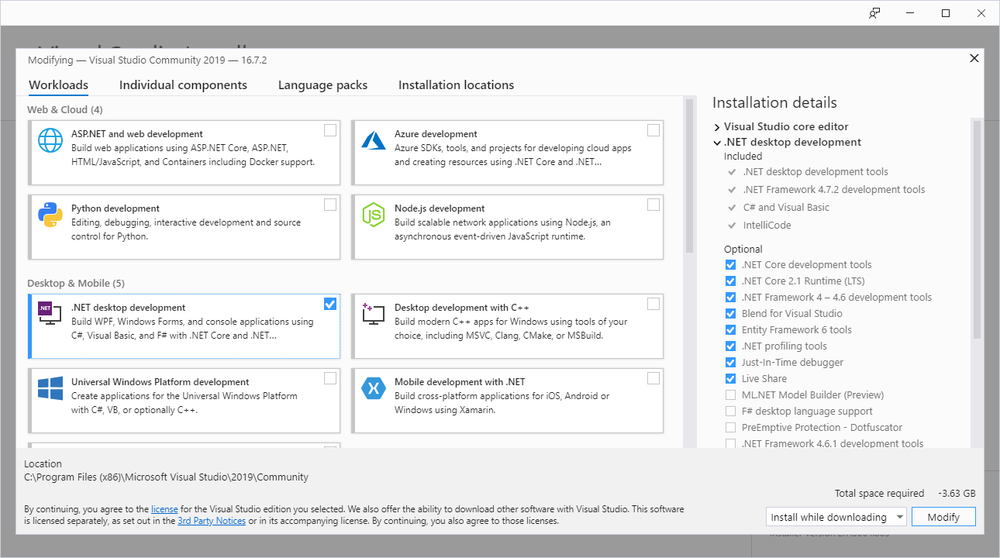
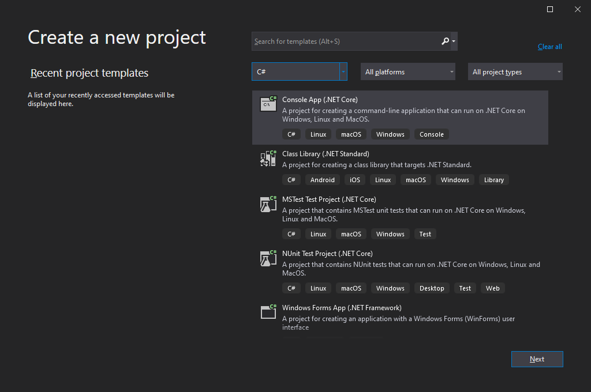
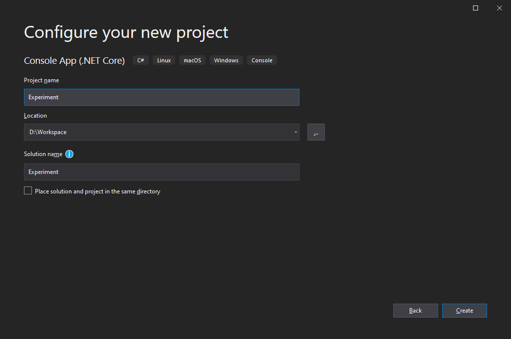
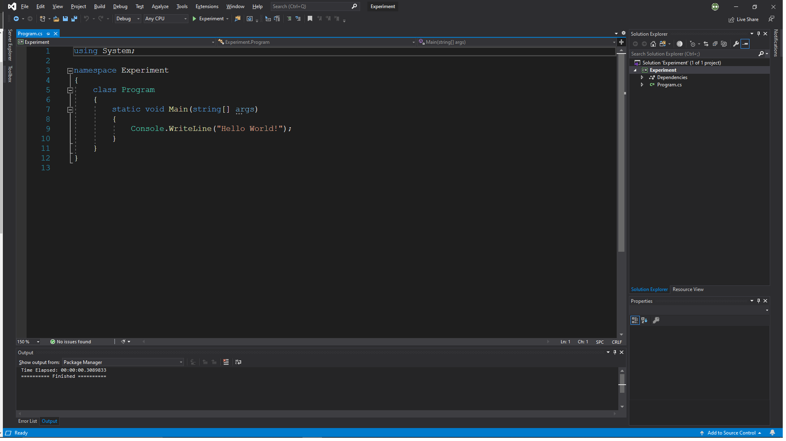

# **C#: 소개**
> *참조: [Microsoft Docs C# 언어 설명서 (한국어)](https://docs.microsoft.com/ko-kr/dotnet/csharp/)*

C# (한국어:씨샵) 프로그래밍 언어는 자바(Java) 언어를 대응하기 위해 마이크로소프트에서 개발한 객체지향 프로그래밍(object-oriented programming)이다. 자바와 상당한 유사점을 가지는 동시, C/C++ 언어와 전혀 이질감이 없도록 설계되었다. 또한 .NET (한국어: 닷넷) 프레임워크라는 방대한 데이터 라이브러리를 접속하고 사용할 수 있어 개발의 편리성을 제공하는 장점을 가진다.

## .NET

.NET은 마이크로소프트에서 개발한 오픈소스 소프트웨어 프레임워크이며, 이전에는 .NET 코어(.NET Core)라고 불렀다. C# 프로그램 개발 및 실행에 주로 사용되며 윈도우 OS, macOS, 그리고 리눅스 운영체제에서 사용할 수 있다.

프레임워크는 CoreFX*(FCL)* 그리고 CoreCLR*(CRL)*로 구성되어 있다. 아래의 표는 FCL과 CLR의 역할을 간략하게 설명한다:

| 구성요소                    | 설명                                                     |
|-------------------------------|-----------------------------------------------------------------|
| 프레임워크 클래스 라이브러리 (FCL) | .NET 프로그램을 개발하는데 필요한 표준 라이브러리를 제공한다. |
| 공통 언어 런타임 (CLR) | JIT 컴파일러를 통해 .NET 프로그램을 컴파일 및 실행한다.      |

<div style="background-color:white; border:solid 3px #808e95; text-align: center; border-radius:0.5em;"></div><center style="font-weight: bold;">그림 1.NET 공통 언어 기반 (CLI) <sub><i>출처: <a href="https://commons.wikimedia.org/wiki/File:Overview_of_the_Common_Language_Infrastructure.svg">위키백과</a></i></sub></center>

.NET은 국제표준기구 ISO와 ECMA에서 표준으로 채택된 공통 언어 기반(Common Language Infrasturcture; CLI)이 적용되어 있다. 해당 표준에 의하면 CLI는 운영체제 및 아키텍쳐가 다르더라도 크로스 플랫폼(cross-platform)을 지원해야 하며 여러 고급 프로그래밍 언어을 사용할 수 있어야 한다고 명시되어 있다.

### 어셈블리

C/C++ 프로그래밍 언어는 컴파일러(예를 들어 MSVC, Clang, GCC 등)가 소스 코드로부터 `.exe` 실행 파일 혹은 `.dll` 라이브러리 파일과 같은 컴퓨터가 읽을 수 있는 이진코드 기계어로 번역하였다.

> C/C++의 이진 파일을 사용하는데 더이상의 컴파일 작업이 필요하지 않는다: 그러므로 이를 *AOT(ahead-of-time) 컴파일 작업*이라고 부른다.

반면, .NET 컴파일러 플랫폼(일명 "로즐린"; Roslyn)은 소스 코드에서 이진코드가 아닌 공통 중간 언어(Common Intermediate Language; CIL) 파일을 생성한다. 여기서 CIL은 바이트코드(bytecode)를 가리키며, 컴퓨터가 읽을 수 있는 기계어는 아니지만 아키텍처 독립 언어로 크로스 플랫폼 지원이 가능한 핵심 요소이다.

> 해당 바이트코드 파일은 컴퓨터가 읽을 수 있는 기계어로 번역하기 위해서는 프로그램 실행 시 추가 컴파일 작업이 필요하다: 그러므로 바이트코드에서 이진코드 변경을 *런타임(runtime)* 혹은 *JIT(just-in-time) 컴파일 작업*이라고 부른다.

정리하자면, 어셈블리(assembly)는 C# 프로그래밍 언어에서 바이트코드 파일을 의미한다. C/C++ 언어와 같이 어셈블리에도 두 가지 종류로 나뉘어지며, 이는 각각 `.exe` 프로세스 어셈블리(process assembly)와 `.dll` 라이브러리 어셈블리이다. 하지만 어셈블리는 이진파일이 아니므로 C#은 .NET (정확히는 CoreCLR) 없이는 프로그램을 실행할 수 없다.

### .NET 프레임워크

.NET 프레임워크(.NET Framework)는 .NET의 이전 프레임워크이며 2020년 11월에 더이상 사용되지 않을 예정이다. .NET 프레임워크는 데스크탑 전용 윈도우 OS에서만 사용할 수 있다.

## 객체지향 프로그래밍

C#은 "객체"라는 데이터를 위주로 프로그램을 개발하는 객체지향 프로그래밍(object-oriented programming; OOP) 언어이다. 이에 대한 자세한 내용은 차후에 설명될 예정이지만, 최소한 객체와 클래스에 대한 개념을 이해하여야만 다음 장의 내용을 쉽게 이해할 수 있다.

### 객체

객체(object 혹은 instance)는 *필드(field)*와 *메소드(method)* 맴버들로 구성된 독립적인 데이터 단위이다. 객체의 맴버를 접근하기 위해서는 맴버 연산자(`.`)를 사용한다:

| 맴버   | 구문              | 설명                                                                                 |
|:----------:|---------------------|---------------------------------------------------------------------------------------------|
| 필드    | `object.field`      | 데이터 값을 저장하는 객체 맴버이다.                                                          |
| 메소드   | `object.method()`   | 데이터를 처리하거나 반환하는 객체 맴버이다.                                           |
| 프로퍼티 | `object.property()` | 필드 값을 간접적으로 반환하는 메소드를 지칭한다; 필드를 직접 접근하지 않으므로, 필드의 값이 의도치 않게 변경되는 것을 방지한다. |

### 클래스

클래스(class)는 객체를 생성하는 데 사용된다. 객체의 필드가 어떠한 값을 가지며 메소드는 어떻게 동작하는지 모두 클래스 내에 정의되어 있다. 정의된 맴버들은 클래스에서 바로 사용할 수 없으며 객체를 통해서만 사용할 수 있다. 여기서 클래스로부터 객체를 생성하는 과정을 *객체화(instantiation)*라고 부른다.

### `static` 한정자

`static` 한정자(modifier) 키워드를 가지는 맴버는 객체화가 필요없이 클래스에서 바로 접근하여 사용할 수 있다. 객체를 생성하지 않아도 메소드를 사용할 수 있는 점에서 매우 편리함을 제공하지만, `static` 한정자가 가지는 특성으로 인해 빈번한 사용은 결과적으로 코드를 복잡하게 만들 수 있다.

## 시작점

C/C++ 언어와 달리 중괄호 코드 블록(`{}`)가 많아 복잡해 보이겠지만, C#에서 모든 프로그램은 `static void Main()` 안에서부터 시작한다.

```csharp
using System;

namespace PROJECT
{
    class Program
    {
        static void Main(string[] args)
        {
            // 여기서부터 코드 입력...
        }
    }
}
```
아래의 대부분 예시 코드는 위와 같이 코드 전체를 보여주지 않고 설명하고자 하는 부분만 작성되어 있을거다. 하지만 대체로 모두 `static void Main()` 코드 블록 안에 있어야만 실행된다는 점을 명시하도록 한다. 

# **C#: 설치**

비록 .NET이 크로스 플랫폼일 지원하지만, 본 장에서는 윈도우 OS 기반을 위주로 C# 설치 및 준비 과정을 소개한다. 또한 가능하면 .NET 프레임워크가 아닌 .NET Core을 중점으로 진행할 예정이다.

통합 개발 환경(integrated development environment; IDE)은 코드 편집기 기능을 제공하며 컴파일러를 통해 실행 가능한 프로그램을 생성한다. 하지만 C#은 마이크로소프트에서 개발한 언어로 IDE 선택지는 하나밖에 존재하지 않는다.

## 비주얼 스튜디오
[비주얼 스튜디오](https://visualstudio.microsoft.com/downloads/)(Visual Studio)는 마이크로소프트에서 개발한 윈도우 OS의 대표적인 IDE이며 .NET을 제공한다. 비주얼 스튜디오는 총 세 가지의 에디션이 존재하며, 무료 버전인 커뮤니티 에디션으로도 충분하다. 통합 개발 환경인 만큼 다른 프로그래밍 언어도 함께 지원하므로 여러 종류의 구성요소를 제공한다. 그 중에서 C# 프로그래밍 언어를 위해 ".NET desktop development"를 선택한다.

<div style="background-color:white; border:solid 3px #808e95; text-align: center; border-radius:0.5em;"></div><center style="font-weight: bold;">그림 2. 비주얼 스튜디오 C# 프로그래밍을 위한 구성요소.</center>

만일 한국어 지원을 원한다면 "Language packs" 탭에서 한국어를 함께 선택하면 된다.

비주얼 스튜디오를 실행하면 아래와 같은 시작화면이 나타난다. 새로운 프로젝트를 생성하려면 오른쪽 하단의 "Create a new project" 버튼을 클릭한다

<div style="background-color:white; border:solid 3px #808e95; text-align: center; border-radius:0.5em;"></div><center style="font-weight: bold;">그림 3. 비주얼 스튜디오 시작화면.</center>

C#로 만들 수 있는 프로그램은 다양하여 비주얼 스튜디오에서 선택할 수 있는 프로젝트 종류도 여러 가지가 있다. C# 언어 프로젝트 생성을 위해서는 아래의 절차를 따른다:

1. 프로그래밍 언어를 C#로 선택하여 "Console App (.NET Core)"을 클릭한다.

<div style="background-color:white; border:solid 3px #808e95; text-align: center; border-radius:0.5em;"></div><center style="font-weight: bold;">그림 4. 비주얼 스튜디오 C# 프로젝트 생성 (1단계).</center>

2. 프로젝트 및 솔루션 이름을 선정한다. 여기서 프로젝트란, 소스 코드와 컴파일러 설정 등의 실질적인 코딩 내용을 관리하는 `.csproj` 확장자 파일이며, 솔루션은 여러 프로젝트 파일을 하나의 폴더처럼 담는 `.sln` 파일이다. 비주얼 스튜디오에서 프로젝트는 `.sln` 파일로 열기를 권장한다.

<div style="background-color:white; border:solid 3px #808e95; text-align: center; border-radius:0.5em;"></div><center style="font-weight: bold;">그림 4. 비주얼 스튜디오 C# 프로젝트 생성 (2단계).</center>

3. 비주얼 스튜디오에서 알아서 준비한 프로젝트를 그대로 사용한다.

<div style="background-color:white; border:solid 3px #808e95; text-align: center; border-radius:0.5em;"></div><center style="font-weight: bold;">그림 5. 비주얼 스튜디오 C# 프로젝트 생성 (3단계).</center>

위의 3단계 절차는 콘솔 어플리케이션 프로젝트를 생성하는 가장 간단한 방법이다. 만일 아무것도 없는 빈 프로젝트에서 생성하기를 원하면 *PRGMING_C* 문서의 설치 항목을 참조한다.

비주얼 스튜디오에서 C# 언어 프로그램을 실행하는 방법에는 두 가지가 존재한다: 디버그(debug) 모드(`F5`)와 일반 실행 모드(`Ctrl+F5`)이다. 프로그램에 문제가 발생하여 하나씩 짚어보아야 할 경우 디버깅 모드를 사용하지만, 그렇지 않은 경우에는 일반 실행 모드를 사용할 것을 권장한다.

# **C#: 기초**

각 프로그래밍 언어마다 준수되어야 할 규칙과 기반이 되는 데이터들이 존재한다. 이를 어길 시에는 프로그램에 오류가 발생하거나 정상적인 동작을 보장할 수 없다. 실질적인 프로그래밍에 있어, 본 장에서는 C# 프로그램 코딩에 기초적인 정보 제공을 목표로 한다.

## 문장 종단자
프로그래밍에서 문장(statement)이란, 실질적으로 무언가를 실행하는 코드를 의미한다. C# 언어에서는 모든 문장의 끝에는 항상 문장 종단자(statement terminator)가 위치해야 하며 세미콜론(`;`) 기호를 사용한다.

많은 프로그래밍 입문자가 가장 많이 저지르는 실수 중 하나로 문장 종단자를 잊어버리고 컴파일을 진행하는 것이다. 그러므로 C 기반 언어(C++과 C# 포함)에는 세미콜론을 넣는 것을 습관화해야 한다.

## 주석

주석(comment)은 프로그래밍에 있어 실행되지 않는 부분이며, 흔히 어떠한 정보를 간략히 스크립트 내에 입력하는데 사용된다. C# 언어에는 두 가지의 주석이 존재하며, 이들은 각각 "한줄 주석"과 "블록 주석"이라 부른다.

* **한줄 주석**
    : 코드 한 줄을 차지하는 주석이며, 두 개의 슬래시(`//`)로 표시된다.
* **블록 주석**
    : 코드 여러 줄을 차지하는 주석이며, 한 쌍의 슬래시와 별표(`/* */`)로 표시된다.

```csharp
/*
블록 주석:
코드 여러 줄을 차지하는 주석이다.
*/  
// 한줄 주석: 코드 한 줄을 차지하는 주석이다.
```

## 식별자
식별자(identifier)는 프로그래밍을 구성하는 데이터(일명 구성체; construct)를 구별하기 위해 사용되는 명칭이다. 다시 말해, 식별자는 개발자가 데이터에 직접 붙여준 이름이다. C# 언어에서 식별자를 선정하는데 아래의 규칙을 지켜야 한다.

* 오직 영문, 숫자, 밑줄(`_`)만 허용된다.
* 첫 문자는 숫자로 시작할 수 없다.
* 공백은 허용되지 않는다.

## 네임스페이스

네임스페이스(혹은 이름공간; namespace)은 식별자의 유일성을 보장하기 위한 데이터 분류 공간이다. 컴퓨터와 비교하면, 동일한 이름의 파일(데이터)을 서로 다른 폴더(네임스페이스)에 넣어 관리하는 것과 동일한 이치이다.

네임스페이스는 `namespace` 키워드를 통해 생성되며, 데이터는 코드 블록(`{}`) 내에 저장된다. 네임스페이스에 들어있는 데이터를 접근하기 위해서는 맴버 연산자(member access operator; `.`)를 사용한다. 그러나 네임스페이스 또한 구성체 중 하나이므로 유일한 식별자를 가져야 하며, 다른 구성체와 동일한 이름을 가져서는 안된다.

```csharp
namespace NAMESPCAE1
{
	class Program{
        static void Main(){
            // CALLING DATA IN DIFFERENT NAMESPACES
            NAMESPACE2.CLASS.field;
            NAMESPACE3.CLASS.method();
        }
    }
    
    // NESTED NAMESCOPE
    namespace NAMESPACE2
    {
        static class CLASS { public var field; }
    }
}

// INDEPENDENT NAMESCOPE
namespace NAMESPACE3
{
	static class CLASS { public void method() statement; }
}
```

### Global Namespace

Aka. "root namespace", global namespace represents calling the data not included in any namespace, thus root of the namespace. Global namespace can be identified by a leading `::` operator (aka. qualifier) with `global` keyword.

```c#
global::variable;
```

### `using` Declaration

Declaration with `using` keyword is used to simplify code by reducing repetitive typing of namespace upon using data.

```c#
// ACCESSING NAMESPACE
using System;
```

While `using` keyword is convenient, declaring too many namespace can lead to identity collision problem. Hence, C# supports aliasing namespace that is not available in C/C++.

Namespace aliasing can either reference namespace, or reference data type such as class, structure, and more. The difference between these two is formal can dive deeper into using qualifier (`::`), but latter cannot.

```c#
// NAMESPACE ALIASES: REFERENCING NAMESPACE
using scope1 = System;            // namespace "System"
scope1::Console.WriteLine("First Line");

// NAMESPACE ALIASES: REFERENCING TYPE
using scope2 = System.Console;    // class "System.Console"
scope2.WriteLine("Second Line");
```

## Input & Output

C# displays the results by writing on the console windows and has two different version of output:

| OUTPUT                | SYNTAX                      | DESCRIPTION                             |
|-----------------------|-----------------------------|-----------------------------------------|
| `Console.Write()`     | `Console.Write("Text")`     | Write function without line terminator. |
| `Console.WriteLine()` | `Console.WriteLine("Text")` | Write function with new line feature.   |

```c#
class Program{
    static void Main(){
        System.Console.Write("Hello");
        System.Console.Write("World!");
        System.Console.WriteLine("Spam");
        System.Console.WriteLine("Egg");
    }
}
```

```
HelloWorld!Spam
Egg
```

Meanwhile, there are three different of input which it reads the input data from the console:

| INPUT                | RETURN         | DESCRIPTION                                         |
|----------------------|----------------|-----------------------------------------------------|
| `Console.Read()`     | Integer        | Read function for a single character in ASCII.      |
| `Console.ReadLine()` | String         | Read function for a single line of text in string.  |
| `Console.ReadKey()`  | ConsoleKeyInfo | Read function for a single keyboard button pressed. |

```c#
using System;

class Program{
    static void Main(){
        Console.Write("Console.Read: ");
            int value1 = Console.Read();
            Console.WriteLine(">>> {0}\n", value1);
        
        Console.Write("Console.ReadLine: ");
            string value2 = Console.ReadLine();
            Console.WriteLine(">>> {0}\n", value2);
        
        Console.Write("Console.ReadKey: ");
            ConsoleKeyInfo value3 = Console.ReadKey();
            Console.WriteLine(">>> {0}", value3);
    }
}
```

```
Console.Read: Ko
>>> 75

Console.ReadLine: Hello World!
>>> Hello World!

Console.ReadKey:  
>>> Spacebar
```

### Placeholder

Placeholder is used in formatted string to place variable value to certain location of text.

```c#
int variable1 = 3;
char variable2 = 'G';
System.Console.Write("First: {0}, Second: {1}, Return to {0}.", variable1, variable2);
```

```
First 3, Second G, Return to 3.
```

### Escape Character

Escape character `\` is used to escape from sequence of character and execute certain operation within text-base data.

```c#
System.Console.Write("First Line\nSecond Line");
```

```
First Line
Second Line
```

| SYNTAX | DESCRIPTION    |
|--------|----------------|
| `\n`   | New line       |
| `\t`   | Horizontal tab |
| `\\`   | Backslash      |
| `\b`   | Backspace      |
| `\'`   | Single quote   |
| `\"`   | Double quote   |

## Data Type

Data type is one of the important factor which determines type and byte size of the data. A well-implemented data type can results memory and time efficiency when processing the script.

C# programming language have several number of pre-defined type identifier as follows:

| IDENTIFIER | DATA TYPE               | DESCRIPTION                                                                                          |
|------------|-------------------------|------------------------------------------------------------------------------------------------------|
| `int`      | Integer                 | 32-bits precision integer number.<br />Size: 4 bytes                                                 |
| `float`    | Floating point number   | Real number with decimal points<br />Size: 4 bytes (requires suffix `f` or `F`)                      |
| `double`   | Double-precision float  | Float with doubled precision and memory.<br />Size: 8 bytes (with or without suffix `d` or `D`)      |
| `decimal`  | Highest-precision float | Float with greater precision and memory<br/>Size: 16 bytes (requires suffix `m` or `M`)              |
| `char`     | Character: `''`         | A single character, e.g., `'A'` and `'?'`.<br />Size: 1 byte                                         |
| `string`   | String: `""`            | Series of characters under the namespace `std`.<br />Size: N/A (depends on overall character length) |
| `bool`     | Boolean                 | Non-zero represents `True` while zero is `False`.<br />Size: 1 byte                                  |
| `var`      | Automatic               | Data type is declared automatically.<br />Useful for declaring new variable with complex data type.  |
| `void`     | Void                    | Non-specific data type.<br />Size: 1 byte                                                            |

### `sizeof()` Operator

An operator that returns the allocating memory size of data type or variable in bytes.

```c#
sizeof(int);		// SIZE: 4 BYTE
sizeof(char);		// SIZE: 1 BYTE
```

## Variable

Variable is a container for the data which can be assigned using assignment operator `=`. There are three different common stages in variable: declaration, definition, and initialization.

* **Declaration**
  : declaration is declaring existence of the construct of such as variables, objects, and more. The declaring also includes specifying which data type the construct is.

  ```c#
  int variable;
  ```
  
* **Definition**
  : definition refers to block of codes on values and performance the construct has and is capable of. In case of variable which can acquire new data, the term *assignment* is more likely to use.

  ```c#
  variable = 3;
  ```

* **Initialization**
  : initialization is assigning the initial value to the construct, simply the *first* definition. Since the first definition is generally done on the same time when declaring the construct. Hence, initialization is commonly thought by people as *declaration + definition* which is not always true.

  ```c#
  int variable = 3;
  ```

Once the declaration sets data type to a variable, that variable can only take the value of that designated data type.

### Local & Global Variable

**Local variable** is a variable declared inside a code block, such as namespace, function, and class. Data stored in local variable is destroyed when exiting the code block, thus cannot be used outside. Local variable is allowed to have same variable name declared outside (technically, is borrowing the name as a different identity).

**Global variable** is not supported in C# programming language. Theoretically, it is a variable declared on a global scope of the script which is outside a class code block and accessible on any class within the script. However, `global` keyword is not to declare global variable but specify global namespace instead.

### Constant Variable

Constant variable is a special type of variable that cannot be changed after its initialization. The keyword `const` is used to declare it as a constant variable.

```c#
const int variable = 3;
```

### Static Variable

Static variable is a special local variable which maintain its value even when escaped and re-entered a function code block. The keyword `static` is used to declare it as a static variable.

```c#
static int variable = 3;
```

## Data Type Conversion

Data type conversion force-changes data type stored in a variable into other desired type. C# programming language has three different data type conversion methods available:

### Implicit Conversion

Implicit conversion automatically converts smaller size data to its compatible type of a larger size data by the compiler. No special syntax is needed and is safe from any data loss/corruption.

```c#
short A = 1;	// 2 BYTES INTEGER
int B = A;		// 4 BYTES INTEGER
```

### Explicit Conversion

Explicit conversion (aka. casting) is done when converting larger size data to smaller size data but with a risk of data loss/corruption. Conversion is done using parentheses and there's no guarantee the conversion would succeed as intended.

```c#
double A = 1.9;	// 8 BYTES FLOAT
int B = (int)A;	// 4 BYTES INTEGER - INCOMPATIBLE: only returns its integer value.
```

### Helper Class Conversion

Helper Class is a category of class that *helps* do something by providing functionalities. Class `System.Convert` is one of the helper class used for converting data type.

```c#
int    ivalue = System.Convert.ToInt32(Console.ReadLine());
bool   bvalue = System.Convert.ToBoolean(Console.ReadLine());
double dvalue = System.Convert.ToDouble(Console.ReadLine());
```

## Operator

Operator is the simplest form of data processing unit which can manipulate the value of operands. It operates simply by placing before, after, or between the operands.

### Arithmetic Operation

Arithmetic operator is mainly focused on processing numeric data type. Following is a list of arithmetic operator used by numeric data type:

| NAME                         | OPERATOR | DESCRIPTION                                                                                                                                                              |
|:----------------------------:|----------|--------------------------------------------------------------------------------------------------------------------------------------------------------------------------|
| Addition                     | `+`      | -                                                                                                                                                                        |
| Subtraction                  | `-`      | -                                                                                                                                                                        |
| Multiplication               | `*`      | -                                                                                                                                                                        |
| Division                     | `/`      | When both operands are integer: dividend is an integer without remainder.<br/>When at least one operand is real (float or double): dividend is a real (float or double). |
| Remainder (Modulus Division) | `%`      | Remainder only returns integer.                                                                                                                                          |

For easier readability of the arithmetic operator, you can place blank space between number and operator, and it doesn’t affect anything on output.

### Assignment Operation

Assignment operator is another operation used within numeric data type. Following is a list of assignment operator used by numeric data type:

| OPERATOR | EXAMPLE | EQUIVALENT |
|----------|---------|------------|
| `+=`     | `x+=1`  | `x=x+1`    |
| `-=`     | `x-=1`  | `x=x-1`    |
| `*=`     | `x*=1`  | `x=x*1`    |
| `/=`     | `x/=1`  | `x=x/1`    |
| `%=`     | `x%=1`  | `x=x%1`    |

Although not an assignment operator, a similar **increment and decrement** of the numerical value can be expressed as follow on C-based programming language:

| OPERATOR    | EXAMPLE | DESCRIPTION   |
|-------------|---------|---------------|
| `++` prefix | `x=y++` | `x=y; y=y+1;` |
| `++` suffix | `x=++y` | `y=y+1; x=y;` |
| `--` prefix | `x=y--` | `x=y; y=y-1;` |
| `--` suffix | `x=--y` | `y=y-1; x=y;` |

### Relational Operation

Relational operator is for checking whether the relational condition between two numeric values and returns Boolean value whether condition is true or false. Following is a list of relational operator:

| OPERATOR | DESCRIPTION              |
|----------|--------------------------|
| `<`      | Lesser than              |
| `<=`     | Lesser than or equal to  |
| `>`      | Greater than             |
| `>=`     | Greater than or equal to |
| `==`     | Equal to                 |
| `!=`     | Not equal to             |

### Logical Operation

Logical operator consist of AND, OR, and NOT logic. When doing so, think of `true` and `false` as binary 1 and 0, respectively. In wider sense, any non-zero number is deemed `true`.

| OPERATOR | LOGIC | DESCRIPTION                                             |
|----------|-------|---------------------------------------------------------|
| `&&`     | AND   | `true` when all the arguments are `true`, else `false`. |
| `        |       | `                                                       | OR | `true` when at least one argument is `true`, else `false`. |
| `!`      | NOT   | Change `true` to `false` and vice versa.                |

# **C++: 조건 및 루프**
조건문 및 반복문(혹은 루프문)은 프로그래밍에 가장 흔히 사용되는 코드 문장(statement) 중 하나이다. 여기서 문장이란, 실질적으로 무언가를 실행하는 코드를 의미한다. 본 장에서는 C# 프로그래밍의 조건에 따라 실행하는 조건문(conditional statement)과 반복적으로 실행하는 반복문(loop statement)을 소개한다.

## `if` 조건문
`if` 조건문은 조건이 참일 경우 코드를 실행한다. 조건이 `true`일 때 문장이 수행되지만 그렇지 않으면 무시된다.

```csharp
if (condition)
{
    statements;
}

// 간략화된 문장
if (condition) statement;
```

`if` 조건문 안에 또다른 `if` 조건문을 넣을 수 있으며, 이를 *네스티드(nested)* `if` 조건문이라고 부른다. 이러한 경우, 코드 블록(`{}`)을 사용하여 두 `if` 조건문의 경계를 명확히 구별하기를 권장한다.

```csharp
if (condition)
{
    if (condtion)
    { 
        statements;
    } 
}
```

### `else` 조건문
`else` 조건문은 단독으로 사용될 수 없으며 반드시 `if` 조건문 이후에 사용되어야 한다. 실행문에는 조건부가 `false`로 평가되었을 경우 호출되는 코드가 포함되어 있다.

```csharp
if (condition)
{
    statements;
}
else
{
    statements; 
}
```

### `else if` 조건문
`else if` 조건문은 `else`와 `if` 조건문의 조합으로 첫 번째 조건이 거짓일 경우, 첫 번째 조건과 다른 새로운 조건을 제시한다.

```csharp
if (condition)
{
    statements;
}
else if (condition)
{
    statements;
}
else
{
    statements;
}
```

하지만 우선 소개된 `else`-`if` 연쇄 조건문은 두 조건부가 함께 사용되는 점과 비교해 `else if` 조건문은 여전히 하나의 조건부에서 처리되므로, 이 둘은 구체적으로 서로 다른 조건문임을 명시해야 한다.

### 조건 연산자
조건문은 아래와 같이 조건 연산자(ternary operator; `?:`)를 사용하여 간략히 표현될 수 있다.

```csharp
condition ? true_return : false_return;
```

조건 연산자는 영어로 *ternary operator*로, 이는 세 가지 인수를 사용하는 것을 의미한다. 조건 연산자는 가독성을 감소시키므로 과용해서는 안되지만 변수 할당에는 유용하다.

## `switch` 조건문

`switch` 조건문은 건네받은 데이터를 `case` 키워드에서 제공하는 값과 일치하는지 비교하며, 참일 경우 코드를 실행한다. 참 조건 이후, 더 이상의 조건 평가를 방지하기 위해 모든 `case` 키워드에는 `break`라는 탈출문이 필요하다.

모든 경우에 조건이 부합하지 않을 시, `default` 키워드에 연동된 문장이 실행된다. `default` 경우는 반드시 필요하지 않지만, 만일을 대비해 사용하기를 권장한다.

```c#
switch (argument)
{
    case value1:
        statements;
        break;
    case value2:
        statements;
        break;
    default:
        statements;
        break;
}
```

`switch` 조건문은 복수의 경우가 하나의 실행문을 공유할 수 있다.

```c#
switch (argument) {
    case value1:
    default:
        statements;
        break;
    case value2:
    case value3:
        statements;
        break;
    case value4:
        statements;
        break;
}
```

### `break` 문
`break` 문(일명 탈출문)은 반복이 완료되기 전에 루프를 조기 종료하는데 사용된다. 루프 내부에서 탈출문을 마주치는 즉시 현재 루프에서 탈출하지만 그 바깥 루프로부터는 탈출하지 않는다.

### `continue` 문
`continue` 문은 반복문 내에서 나머지 실행문을 전부 건너뛰고 다시 조건 판정부분으로 돌아가게 한다. 이는 반복문을 종료하는 `break` 문과 달리 반복문의 루프를 유지한다.

## `while` 반복문
`while` 반복문은 조건이 유지되는 한 내부 코드를 반복적으로 실행한다. 조건이 `false`임이 판정되면 반복문을 종료한다.

```csharp
while (condition)
{
    statements;
}

// 간략화된 문장
while (condition) statement;
```

### `do`-`while` 반복문
`do`-`while` 반복문은 `while` 반복문과 유사한다. 그러나 후자는 조건을 먼저 확인하고 문장을 실행하였으면, 전자는 문장을 우선 실행하고 조건을 확인한다.

```csharp
do
{
    statements
} while (condition);
```

## `for` 반복문
`for` 반복문은 정의된 지역 변수가 조건에 만족하는 한 지속적으로 반복한다. 한 번 반복할 때마다 지역 변수에는 반복문에 명시된 대로 변화가 발생하며, 일반적으로 정수형 증감을 사용한다.

```csharp
for (variable; condition; increment) {
    statements;
}

// 간략화된 문장
for (variable; condition; increment) statement;
```

### Infinite `for` Loop

The `for` loop can run infinite loop using the following syntax:

```c#
for ( ; ; ) { 
	statements;
}
```
## `foreach` Loop

The `foreach` loop statement execute statements while in range. The range is generally refers to Collection such as array which its element can be sequenced one-by-one.

```c#
foreach (variable in range) {
	statements;
}

// SIMPLIFIED STATEMENT
foreach (variable in range) statement;
```

The Collection in C# will be introduced in *C#: COLLECTION* chapter.

# **C#: COLLECTION**

C# has a Collection that can store multiple data of the same type at once. While the most common and general collection is an array, there are various other collections available in .NET that are worth knowing.

## Array

Array is a collection used to store an indexed of item of same data type. Bracket `[]` is placed after the data type to declare an array.

```c#
// ARRAY DECLARATION
int[] arr;
```

Creating and defining size of an array is done by `new` keyword used for instantiation:

```c#
// INITIALIZATION
int[] arr = new int[size];
```

which creates array filled with element of `0` or `NULL` value. Elements can be assigned with value after initialization by accessing individually using bracket `[]`:

```c#
int[] arr = new int[size];

// ASSIGNMENT: ELEMENTWISE
arr[0] = value1;
arr[1] = value2;
```

To assign values on initialization instead, curly bracket `{}` is used to assign values to each element in sequence. Following is a three different methods of assignment with explanation:

```c#
// ASSIGNMENT 1
int[] arr = new int[size] {value1, value2, ... };

// ASSIGNMENT 2
int[] arr = new int[] {value1, value2, ... };

// ASSIGNMENT 3
int[] arr = {value1, value2, ... };
```

1. `// ASSIGNMENT 1`: values must be fulfilled on every elements in the array, else results compilation error.
2. `// ASSIGNMENT 2`: initial array size can dynamically designated based on the number of assigned value.
3. `// ASSIGNMENT 3`: more simplified version of "`// ASSIGNMENT 2`" method.

Calling array itself does not return a sequence of elements within; instead will return the information of array data. Only a single element at a time can be called.

```c#
int[] arr = new int[size] {value1, value2, ... };

System.Console.WriteLine(arr);
System.Console.WriteLine(arr[0]);
```

```
System.Int32[]
value1
```

### `new` Keyword

The `new` operator is used to create new instance of a type.

> While in C/C++ represented dynamic allocation, in C# is used on most of the classes to create instance.

### Multi-dimensional Array

Multi-dimensional array can be declared and initialized that holds values under subarrays which shares the same length:

```c#
// MULTI-DIMENSIONAL 1
int[ , ] arr = new int[3,2] { {value1, value2}, {value3, value4}, {value5, value6} };

// MULTI-DIMENSIONAL 2
int[ , ] arr = new int[ , ] { {value1, value2}, {value3, value4}, {value5, value6} };

// MULTI-DIMENSIONAL 3
int[ , ] arr = { {value1, value2}, {value3, value4}, {value5, value6} };
```

Since multi-dimensional array is created from a single declaration, array data is stored in a single block of memory.

### Jagged Array

Jagged array can have another arrays as its elements irrelevant to its size.

```c#
int[][] arr = new int[3][] {
    new int[] {3}, 
    new int[] {1, 4, 1}, 
    new int[] {5, 9}
};
```

Because the array contains already declared stored in separate memory location, jagged array implements more than single block of memory.

## Collection

*To better understand this section, it is recommended to read chapter "C#: GENERIC" beforehand.*

Collection is an advanced version of array that can shrink and extend size flexibly to accommodate any number of data, each of them having unique special features.

Collection is divided into two categories: generic and non-generic collection. While the term "generic" will be introduced on later chapter, brief explanation is its data type can be designated upon declaration using angled bracket (`<>`).

```c#
using System.Collections.Generic;

// DECLARATION OF GENERIC COLLECTION (EXAMPLE)
Collection<int> collectionName = new Collection<int>();
```

### Lists

List is a generic collection similar to array but its flexible sizing allows inserting and removing the elements more dynamic. This can be considered as C# version of `std::vector` class in C++ language.

```c#
using System.Collections.Generic;

// DECLARATION OF LIST COLLECTION (EMPTY)
List<int> LIST = new List<int>();
```

----

```c#
using System.Collections.Generic;

// INITIALIZATION OF LIST COLLECTION
List<int> LIST = new List <int>() {3, 1, 4, 1, 5};

System.Console.WriteLine(LIST[0]);
```

```
3
```

### Sorted List

Sorted list is a variation of the list generic collection where elements are paired in `{key, value}` format. Here, key is a unique element identifier used to access the element value instead of integer index.

Sorted list automatically sorts elements by the key.

```c#
using System.Collections.Generic;

// DECLARATION OF SORTED LIST COLLECTION (EMPTY)
SortedList<string, int> SLIST = new SortedList<string, int>();
```

----

```c#
using System.Collections.Generic;

// INITIALIZATION OF SORTED LIST COLLECTION
SortedList<string, int> SLIST = new SortedList<string, int>() { {"B", 3}, {"A", 1} };

System.Console.WriteLine(SLIST["B"]);
```

```
3
```

### Dictionary

Dictionary is a variation of the list generic collection where elements are paired in `{key, value}` format. Here, key is a unique element identifier used to access the element value instead of integer index.

Dictionary do not sorts elements by the key.

```c#
using System.Collections.Generic;

// DECLARATION OF DICTIONARY COLLECTION (EMPTY)
Dictionary<string, int> DICT = new Dictionary<string, int>();
```

----

```c#
using System.Collections.Generic;

// INITIALIZATION OF DICTIONARY COLLECTION
Dictionary<string, int> DICT = new Dictionary<string, int>() { {"B", 3}, {"A", 1} };

System.Console.WriteLine(DICT["B"]);
```

```
3
```

### BitArray

BitArray is another variation of list collection that stores bit data either 0 (`false`) and 1 (`true`). Because the data type is already defined as Boolean, BitArray collection is non-generic. The size of the BitArray cannot be changed after declaration.

```c#
using System.Collections;

// DECLARATION OF BIRARRAY COLLECTION
BitArray BITARR = new BitArray(4);
```

----

```c#
using System.Collections;

// INITIALIZATION OF BIRARRAY COLLECTION
bool[] arr = new bool[4] {false, true, false, true};
BitArray BITARR = new BitArray(arr);

System.Console.WriteLine(BITARR[0]);
```

```
False
```

### Stack

Stack is a LIFO (Last In First Out) memory-structured generic collection where last element to append (push) to the collection is to come out (pop) first. Stack collection cannot use bracket (`[]`) to access individual elements.

```c#
using System.Collections.Generic;

// DECLARATION OF STACK COLLECTION (EMPTY)
Stack<int> STACK = new Stack<int>();
```

----

```c#
using System.Collections.Generic;

// INITIALIZATION OF STACK COLLECTION
int[] arr = new bool[4] {1, 2, 3, 4};
Stack<int> STACK = new Stack<int>(arr);

System.Console.WriteLine(STACK.Pop());
System.Console.WriteLine(STACK.Pop());
```

```
4
3
```

### Queue

Queue is a FIFO (First In First Out) memory-structured generic collection where last element to append (push) to the collection is to come out (pop) first. Queue collection cannot use bracket (`[]`) to access individual elements.

```c#
using System.Collections.Generic;

// DECLARATION OF QUEUE COLLECTION (EMPTY)
Queue<int> QUEUE = new Queue<int>();
```

----

```c#
using System.Collections.Generic;

// INITIALIZATION OF QUEUE COLLECTION
int[] arr = new bool[4] {1, 2, 3, 4};
Queue<int> QUEUE = new Queue<int>(arr);

System.Console.WriteLine(STACK.Dequeue());
System.Console.WriteLine(STACK.Dequeue());
```

```
1
2
```

### HashSet

HashSet is a generic collection where elements are unique and does not allow duplicates. HashSet provides high-performance mathematical set operations, but the collection cannot use bracket (`[]`) to access individual elements.


```c#
using System.Collections.Generic;

// DECLARATION OF HASHSET COLLECTION (EMPTY)
HashSet<int> HSET = new HashSet<int>();
```

----

```c#
using System.Collections.Generic;

// INITIALIZATION OF HASHSET COLLECTION
int[] arr = new bool[6] {1, 2, 3, 4, 1, 3};
HashSet<int> HSET = new HashSet<int>(arr);

System.Console.WriteLine(HSET.Count);
```

```
4
```


# **C#: METHOD**

C# language is executed based around a single key method called `Main()`. Understanding the concept of method is important in C# languages, which can also be used to create and implement custom method to serve specific purpose.

## Method

Method one of the component comprising an object, and is a block of code responsible for processing passed data and presenting newly processed data once the method is called.

Method can be distinguished by its declaration with parenthesis after its name; `method()`. Its definition is stated inside a code block (`{}`), which is executed when called.

```c#
// METHOD DEFINITION
static double method(int arg1, double arg2)
{
    return arg1 + arg2;
}

method(1, 3.0);		// >> OUTPUT: 4.0
```

Because C# language paradigm is OOP means method do not requires forward declaration (aka. prototype) to call the method. However, defining a method inside another method (aka nested method) is invalid in C# language.

### `return` Statement

The `return` statement is a method-exclusive statement that outputs indicated data under the data type declared on the method. Once the `return` statement is executed, the method ends immediately despite there are codes still left inside.

If the method is a `void` data type, method can be returned by `return;` statement alone without any data to return.

### Parameter & Argument

Following are the difference between parameters and arguments that is referred significantly when discussing function.

**Parameter**
Parameter is a method-internal local variable: because parameters is a method-exclusive local variable, it cannot be called from outside.

| OPERATOR |    SYNTAX     | DESCRIPTION                                                  |
| :------: | :-----------: | ------------------------------------------------------------ |
|   `=`    | `arg = value` | Parameter `arg` is assigned `value` by default when no other value is passed. Must locate after normal parameter. |

**Argument**
Argument is a value or object being passed to the method parameter and those passed values and objects will be processed by the method code. However, argument is independent from parameter: change on parameter does not affect value or object passed as argument.

| OPERATOR |    SYNTAX    | DESCRIPTION                                                  |
| :------: | :----------: | ------------------------------------------------------------ |
|   `:`    | `arg: value` | Assign argument `value` to method parameter namely `arg`. Does not have to follow parameter order. |

Examples below show how function parameter and argument works:

```c#
using System;

class Program
{
    static void Main(string[] args)
    {
        Console.WriteLine(method(1, 3.0));                // >> OUTPUT: 4.0
        Console.WriteLine(method(1));                     // >> OUTPUT: 8.0
        Console.WriteLine(method(arg2: 3.0, arg1: 1));    // >> OUTPUT: 4.0
    }
    
    static double method(int arg1, double arg2 = 7.0)
    {
        return arg1 + arg2;
    }
}
```

There are three different method of passing arguments to parameters: call by value, reference and output.

* **By Value**

    Requiring no special syntax, call by value passes only the value of the argument. In other word, argument and parameter are separate identities. Hence, changes made on parameter does not affect variable passed as an argument.

    ```c#
    using System.Console;
    
    class Program
    {
        static void Main(string[] args)
        {
            int A = 1;
            int B = 3;
            
            Console.WriteLine(A, B);    // >> OUTPUT: 4 (1 + 3.0)
            Console.WriteLine(A, B);    // >> OUTPUT: 4 (1 + 3.0)
        }
        
        static int method(int arg1, int arg2)
        {
            arg1 += arg2;
            return arg1;
        }
    }
    ```

* **By Reference**

    Using `ref` keyword, call by reference passes the address of the variable of argument. In other word, argument and parameter are a single identity. Hence, changes made on parameter does affect variable passed as an argument.

    ```c#
    using System.Console;
    
    class Program
    {
        static void Main(string[] args)
        {
            int A = 1;
            int B = 3;
            
            Console.WriteLine(ref A, ref B);    // >> OUTPUT: 4 (1 + 3.0)
            Console.WriteLine(ref A, ref B);    // >> OUTPUT: 7 ((1 + 3.0) + 3.0)
        }
        
        static int method(ref int arg1, ref int arg2)
        {
            arg1 += arg2;
            return arg1;
        }
    }
    ```

    ---

    Using `in` keyword, call by reference passes the address of the variable of argument but the parameter is read-only and unmodifiable. Simply put, argument and parameter are a single constant identity. Hence, no changes can be made on parameter which eventually not affecting variable passed as an argument.

    ```c#
    using System.Console;
    
    class Program
    {
        static void Main(string[] args)
        {
            int A = 1;
            int B = 3;
            
            Console.WriteLine(in A, in B);    // COMPILATION ERROR: CANNOT EXECUTE "arg1 += arg2;" STATEMENT!
        }
        
        static int method(in int arg1, in int arg2)
        {
            arg1 += arg2;
            return arg1;
        }
    }
    ```

    ```
    Cannot assign to variable 'in int' because it is a readonly variable
    ```

    ----

    Using `out` keyword, call by reference passes the address of the variable of argument but only uninitialized argument is allowed. This is mainly used on method whose purpose is to initialized the variable called by reference, and must initialize the value before end of the method.

    ```c#
    using System.Console;
    
    class Program
    {
        static void Main(string[] args)
        {
            int A, B;    // UNINITIALIZED VARIABLE
            
            Console.WriteLine(out A, out B);              // >> OUTPUT: 4 (1 + 3.0)
            Console.WriteLine("A: {0}, B: {1}", A, B);    // >> OUTPUT: "A: 4, B: 3"
        }
        
        static int method(out int arg1, out int arg2)
        {
            arg1 = 1; arg2 = 3;
            arg1 += arg2;
            return arg1;
        }
    }
    ```

### Method Overloading

Multiple functions with the same name can exist as long as they are unique in arguments (such as number of arguments and its data type). This is called function overloading and these functions can have their own separate definition. Function data type does not overload functions.

```c#
using System;

class Program
{
	static void Main(string[] args)
    {
        Console.WriteLine(method(1, 3));        // >> OUTPUT: 4
        Consoel.WriteLine(method(1.0, 3.0));    // >> OUTPUT: -2.0
    }
    
    // DEFINITION OF OVERLOADED METHOD 1
    static double method(int arg1, int arg2)
    {
        return arg1 + arg2;
    }
    
    // DEFINITION OF OVERLOADED METHOD 2
    static double method(double arg1, double arg2)
    {
        return arg1 - arg2;
    }
}
```

## Entry Point

Entry point is the starting point where a program execution begins. In C# programming language, the entry point is `Main()` *static* method. A project must have one and only `Main()` static function within the project. Creating multiple `Main()` method or not having any `Main()` method will cause error on running the program.

```c#
class Program
{
    // ENTRY POINT: Main() METHOD WITH PARAMETER
    static void Main(string[] args)
    {
    	statements;
    }
}
```

Entry point `Main()` static method can have argument which is apparent when executed through command-line:

```
./app.exe option1 option2
```

| Arguments | Data      |
| --------- | --------- |
| `args[0]` | `option1` |
| `args[1]` | `option2` |

# **C#: OBJECT-ORIENTED PROGRAMMING**

Object-oriented programming (OOP) is a programming paradigm based on usage of objects to structure the program. This chapter is mainly focuses on object and class in detail which was briefly explained on the very beginning of the document *C#: INTRO*.

## Objects

Previous chapters have introduced variable (which can store data) and method (which can process data). Object, aka. instance, is a block of data which encapsulate these variables and methods as members of a single identity, called *member variable* (or *member field*) and *method* respectively.

Object also has a method called *property* whose purpose is to return field value generally restricted on directly access from external code.

The programming based around use of a custom objects is called *object-oriented programming*.

```c#
string x = "Hello World!";
System.Console.WriteLine(x.Length);
// Accessing "Length" field that stores number of characters.
```

### Encapsulation

Encapsulation is the core concept in object which...

1. combines variables and method into a single object
2. restrict direct access to these variables and methods to prevent accidental modification from external code. 

## Class

Class is used to create objects (aka. instance), hence can be deemed as a blueprint of the object. Classes are created using keyword `class` and inside defines variables and methods which becomes member variable and methods for the object. Act of creating an instance from a class is called *instantiation*.

```c#
// CREATING CLASS
class CLASS
{
    public int field1 = 1;
    public double field2 = 3.0;
    
    public double method(int arg)
    {
        return field1 + field2 - arg;
    }
}

// INSTANTIATION
CLASS instance = new CLASS();

// THEREFORE...
instance.field1;       // >> OUTPUT: 1
instance.field2;       // >> OUTPUT: 3.0
instance.method(2);    // >> OUTPUT: 2.0 (= 1 + 3.0 - 2)
```

### Constructor

Constructor is a special method automatically executed whenever instantiation has occurred and can define the number of arguments to pass to the instance. Name of a constructor must be same as the class name and does not require data type.

One of the common usage of constructor is initialization of member fields upon instantiation.

```c#
// CREATING CLASS
class CLASS
{
    // CONSTRUCTOR
    public CLASS(int arg1, double arg2)
    {
        field1 = arg1;
        field2 = arg2;
    }
    
    public int field1 = 1;
    public double field2 = 3.0;
    
    public double method(int arg)
    {
        return field1 + field2 - arg;
    }
}

// INSTANTIATION
CLASS instance = new CLASS(1, 3.0);
```

Constructor is an optional member method and can be defined when developer wants. However, when constructor that takes argument(s) is presented, parenthesis `()` is required upon instantiation. Multiple constructor is allowed per class as long as rule of function overloading is observed.

### Finalizer

Finalizer (aka. destructor) is a special method automatically executed whenever instance is released (every time object is destroyed either systematically by compiler or manually by developer). Name of a destructor must be same as the class name with tilde `~` prefix and does not require data type.

```c#
// CREATING CLASS
class CLASS
{
    // DESTRUCTOR
    ~CLASS()
    {
        statements
    }
    
    public int field1 = 1;
    public double field2 = 3.0;
    
    public double method(int arg)
    {
        return field1 + field2 - arg;
    }
}

// INSTANTIATION
CLASS instance = new CLASS(1, 3.0);
```

Destructor is an optional member method and can be defined when developer wants. Only one destructor is allowed per class and does not take any argument and modifier.

### `this` Keyword

The `this` keyword is used within a class to refer the current class itself.

```c#
// CREATING CLASS
class CLASS{
    private int field;
    
    public int method(){
    	return this.field;
    }
}
```

## Static Class

Class itself cannot use the its members directly and need to create instance to access them. However, declaring the class itself as static allows the class to access the members without needing any instantiation. Hence, it is impossible to create an instance from the static class.

```c#
// CREATING STATIC CLASS
static class CLASS
{
    public static int field1 = 1;
    public static double field2 = 3.0;
    
    public static double method(int arg)
    {
        return field1 + field2 - arg;
    }
}

// THEREFORE...
CLASS.field1;       // >> OUTPUT: 1
CLASS.field2;       // >> OUTUPT: 3.0
CLASS.method(2);    // >> OUTPUT: 2.0 (= 1 + 3.0 - 2)

// [ERROR] INSTANTIATION
CLASS instance = new CLASS();
```

```
Error	CS0723	Cannot declare a variable of static type 'CLASS'
Error	CS0712	Cannot create an instance of the static class 'CLASS'
```

Static class is generally used as a collection of member for specific purpose which does not (or should not) need instantiation; e.g., `Math`, `Array`, `String`, `DataTime`, `Console`, and more.

### Static Constructor

Static constructor is executed when any static member is called even when it is not instantiated.

```c#
// CREATING STATIC CLASS
static class CLASS
{
    // STATIC CONSTRUCTOR
    public static CLASS()
    {
        statements;
    }
    
    public static int field1 = 1;
    public static double field2 = 3.0;
    
    public static double method(int arg)
    {
        return field1 + field2 - arg;
    }
}
```

Static constructor is an optional member method and can be defined when developer wants. Only one static constructor is allowed per class and does not take any argument and modifier.

## Modifier

Modifier keywords are used to define characteristic of object members upon member declaration.

1. **Static** modifier (`static` keyword)
    : a modifier used to declare either static member which can be used without instantiation, or static class that only has static members.

    ```c#
    // STATIC MEMBER FIELD
    static int field = 3;
    
    // STATIC MEMBER METHOD
    static void method() { statements; }
    ```

2. **Constant** modifier (`const` keyword)
    : a static modifier used to declare constant member field; constant member only allows value assignment through initialization. This also means constant member must be initialized with value upon declaration.

    ```c#
    // CONSTANT (STATIC) MEMBER FIELD
    const int field = 3;
    ```

3. **Read-Only** modifier (`readonly` keyword)
    : a non-static modifier used to declare semi-constant member field; read-only member allows value assignment using both initialization and on constructor. This also means read-only member does not have to be initialized upon declaration.

    ```c#
    // READ-ONLY (NON-STATIC) MEMBER FIELD
    readonly int field;
    ```

4. **Sealed** modifier (`sealed` keyword)
    : a modifier used on base class or member of the base class to prevent derived class from inheriting.

    ```c#
    // SEALED MEMBER
    sealed int field;
    ```

5. **Virtual**-**Override** modifier pair (`virtual` and `override` keyword)
    : a modifier used for method overriding; `virtual` modifier allows base class method to be overridden, and `override` modifier on derived class overrides inherited virtual method from base class.

    ```c#
    // VIRTUAL METHOD
    virtual void method() { statements; }
    
    // OVERRIDDEN METHOD
    override void method() { statements; }
    ```

6. **Abstract** modifier (`abstract` keyword)
    : a virtual modifier specifically for method without any implementation (or definition); this modifier can be used on class as well to declare abstract class.

    ```c#
    // ABSTRACT METHOD
    abstract void method();
    ```

### Access Modifier

Access modifier is used to define characteristic of object members on access authorization. There are four different access modifiers available in C# classes: public, private, protected, and internal.

| A.MODIFIER | KEYWORD     | DESCRIPTION                                                  |
| ---------- | ----------- | ------------------------------------------------------------ |
| Public     | `public`    | Accessible from the code outside the class.                  |
| Private    | `private`   | Accessible only within the class.                            |
| Protected  | `protected` | Accessible from derived class but still restricted from outside the class; refer to inheritance. |
| Internal   | `internal`  | Accessible only within the assembly.                         |

## Inheritance

Inheritance is an act of base class providing member variables and methods to derived class. When the same name of members exists on both base class and derived class, members from base class are overridden by derived class's.

```c#
using System;

// CREATING BASE CLASS
class BASECLASS
{
    public BASECLASS() { Console.WriteLine("BASE CLASS: Constructor"); }
    ~BASECLASS() { Console.WriteLine("BASE CLASS: Destructor"); }
    
    public int field1 = 1;
    public double field2 = 3.0;
}

// CREATING DERIVED CLASS
class DERIVEDCLASS
    : BASECLASS
{
    public DERIVEDCLASS() { Console.WriteLine("DERIVED CLASS: Constructor\n"); }
    ~DERIVEDCLASS() { Console.WriteLine("\nDERIVED CLASS: Destructor"); }
    
    public double field2 = 7.0;
    public char field3 = 'A';
}

// INSTANTIATION
DERIVEDCLASS instance = new DERIVEDCLASS();
Console.WriteLine("{0}, {1}, {2}", instance.field1, instance.field2, instance.field3);
```

```
"BASE CLASS: Constructor"
"DERIVED CLASS: Constructor"

1, 7.0, A

"DERIVED CLASS: Destructor"
"BASE CLASS: Destructor"
```

Derived class in C# generally cannot inherit from multiple base classes; a derived class can inherit only a single base class. For multiple inheritance, refer to *interface*.

## Polymorphism

Overloading operator is another compile-time polymorphism which is customizing operator to function differently on certain classes or portion of the script. Just like function overloading, a single operator can have multiple implementation as long as the arguments are unique. Overloaded operators are exclusive to the class and won't be applied elsewhere.

The `operator` keyword is used to specify the operator for customization. Declaring and defining operator functionality follows syntax identical to member function.

Polymorphism means "having many forms", which in C# programming means having different functionality based on the situation and usage. Polymorphism is one of the important features in OOP and is categorized into two types:

* Compile-time Polymorphism
    : polymorphism achieved on compilation (aka. static polymorphism).
* Run-time Polymorphism
    : polymorphism achieved on run-time (aka. dynamic polymorphism).

One of the compile-time polymorphism has been introduced already; *method overloading* which functions differently according to passed arguments.

### Operator Overloading

Overloading operator is another compile-time polymorphism which is customizing operator to function differently on certain classes or portion of the script. Just like method overloading, a single operator can have multiple implementation as long as the arguments are unique. Overloaded operators are exclusive to the class and won't be applied elsewhere.

The `operator` keyword is used to specify the operator for customization. Declaring and defining operator functionality follows syntax identical to static method.

```c#
// CREATING CLASS
class CLASS
{
    // OPERATOR OVERLOADING
    public static int operator + (CLASS arg1, CLASS arg2)
    {
        return arg1.field + arg2.field;
    }
    
    public int field;
}
```

### Method Overriding

Overriding method is a run-time polymorphism where derived class redefine member inherited from the base class. The difference between overloading and overriding is, the formal *selects* functionality when the latter *redefines* functionality.

Virtual method is a special method specifically designed for method overriding, and is declared by `virtual` keyword. Declaration of the virtual method is only necessary in base class but not in derived class.

```c#
// CREATING BASE CLASS
class BASECLASS
{
    // VIRTUAL METHOD
    public virtual void polymorph() { statements1; }
};

// CREATING DERIVED CLASS
class DERIVEDCLASS1
    : BASECLASS
{
    // OVERRIDE METHOD
    public override void polymorph() { statements2; }
};
```

Virtual method with definition implemented on base class can either (1) use behavior directly from base class or (2) use behavior from derived class in case no function override has occurred. Meanwhile, virtual method without any definition implemented is called **abstract method**.

```c#
// ABSTRACT METHOD
public abstract void polymorph();
```

Because abstract method has no definition in base class, it is a virtual method that *must be* overridden when inherited to derived class. Failed to do so will cause a compilation error.

### Abstract Class

Abstract class is a special class declared using `abstract` keyword, designed not meant for class instantiation but as a base class purely to inherit members to derived class. Attempting to instantiate causes compilation error.

```c#
// CREATING ABSTRACT CLASS
abstract class CLASS
{
    public int field1 = 1;
    public double field2 = 3.0;
    
    // ABSTRACT METHOD
    public abstract void polymorph();
}

// [ERROR] INSTANTIATION
CLASS instance = new CLASS();
```

```
Error	CS0144	Cannot create an instance of the abstract class or interface 'CLASS'
```

Abstract class can have multiple members with different access modifier too. However, inherited non-abstract derived class *must* include actual implementation for the abstract member declared on the base class.

### Interface

Interface is a variation of abstract class where all its member are nonetheless `abstract` and `public` by default. There is no need to and is not allowed to specify the modifier. Interface can have methods and properties but cannot have member field.

```c#
// CREATING INTERFACE
class interface INTERFACE
{
    int property {get; set;}
    void polymorph();
}

// CREATING DERIVED CLASS
class DERIVEDCLASS
    : INTERFACE
{
    public DERIVEDCLASS(int arg) { property = arg; }
    public void polymorph()
    {
        statements;
    }
}
```

Unlike derived class inherited from abstract class which needs `override` modifier to corresponds to `virtual` or `abstract` modifier, interface does not need such modifiers when overriding method.

Multiple interface can inherit their members to a single derived class, using the following syntax:

```c#
class DERIVEDCLASS
    : INTERFACE1, INTERFACE2
{
    // ...
}
```

## Properties

Property is a member used to supports data hiding by dividing a single field into two separate portions: `getter`, and `setter`. The property looks similar to methods but properties do not have a pair of parenthesis, behaving just like member field.

| ACCESSOR | KEYWORD | DESCRIPTION                                     |
| -------- | ------- | ----------------------------------------------- |
| Getter   | `get`   | Member for getting the value from member field. |
| Setter   | `set`   | Member for setting the value to member field.   |

```c#
using System;

// CREATING CLASS
class CLASS
{
    private int field;
    
    // PROPERTY
    public int property
    {
        get => field;            // GETTER IMPLEMENTATION
        set => field = value;    // SETTER IMPLEMENTATION
        
        /* EQUIVALETN:
        get { return field; }
        set {field = value; }
        */
    }
}

// INSTANTIATION
CLASS instance = new CLASS();

instance.method = 1;
instance.method;        // >> OUTPUT: 1
```

The property syntax itself explains it cannot pass more than a single data as an argument. While there exists an argument means there is also a (auto-defined) parameter that should accept the passed argument, pre-declared as `value` keyword.

Separating code using property encapsulate sensitive code that shouldn't be modified by the user (such as `setter`), while providing constant access to the method via `getter` method despite any changes were made on `setter`.

### Auto-Implemented Property

Simplified version of property is available, called "auto-implemented property". However, custom statements cannot be implemented on this particular property.

```c#
// PROPERTY
public int property {get; set;}

/* EQUIVALENT:
string field;
public int property{
    get => field;
    set => field = value;
}
*/
```

## Indexer

Indexer member allows instance to be indexed just like array. Similar to property which uses both `getter` and `setter` accessors, indexer stores data in collection object declared in private member field.

```c#
using System;

// CREATING CLASS
class CLASS
{
    // COLLECTION FOR INDEXER
    private int[] arr = new int[2];
    
    // INDEXER
    public int this[int index]
    {
        get => arr[index];
        set => arr[index] = value;
    }
}

// INSTANTIATION
CLASS instance = new CLASS();

instance[0] = 1;        // >> OUTPUT: 1
instance[1] = 3;        // >> OUTPUT: 3
```

# **C#: USER-DEFINED DATA TYPE**

Commonly used value type such as `int`, `float`, `char`, and more are already defined in `iostream.h` header. Developer may create and use custom data type based on these pre-defined data types.

## Structure

Structure groups multiple member variables under a single structure tag, regardless of value type of member variable. 

```c#
// CREATING STRUCTURE
public struct STRUCTURE
{
    public int    field1;
    public double field2;
    
    public double method(int arg)
    {
        return field1 + field2 - arg;
    }
}

// VARIABLE DECLARATION
STRUCTURE variable;

variable.field1 = 1;
variable.field2 = 3.0;
System.Console.WriteLine(variable.method(2));    // >> OUTPUT: 2.0 (= 1 + 3.0 - 2)
```

----

```c#
// CREATING STRUCTURE w/ CONSTRUCTOR
public struct STRUCTURE
{
    public STRUCTURE(int arg1, double arg2)
    { field1 = arg1; field2 = arg2; }
    
    public int    field1;
    public double field2;
    
    public double method(int arg)
    {
        return field1 + field2 - arg;
    }
}

// VARIABLE INITIALIZATION
STRUCTURE variable = new STRUCTURE(1, 3.0);

System.Console.WriteLine(variable.method(2));    // >> OUTPUT: 2.0 (= 1 + 3.0 - 2)
```

Class and structure do share similarity but have distinct differences:

| CLASS                                      | STRUCTURE                                                    |
| ------------------------------------------ | ------------------------------------------------------------ |
| Allocated on heap memory (reference type). | Allocated on stack memory (value type; e.g. `int`, `double`). |
| Inheritance is allowed.                    | Inheritance is not allowed.                                  |
| May initialized member fields.             | May not initialize member fields.                            |

## Enumeration

Enumeration means "action of mentioning a number of things one by one", thus is a user-defined data type which can only be assigned with a single enumerators that has corresponding integer.

```cpp
// ENUMERATION DELCARATION
enum ENUMERATION {
    enumerator1,    // = 0
    enumerator2,    // = 1
    enumerator3     // = 2
};

// VARIABLE INITIALIZATION
ENUMERATION variable = ENUMERATION.enumerator1;

System.Console.WriteLine(variable);         // >> OUTPUT: enumerator1
System.Console.WriteLine((int)variable);    // >> OUTPUT: 0
```

As a default, integer 0 is assigned to the first enumerator which is incremented by one on next enumerator. While enumerator itself must be unique which cannot share name, same integer value can be assigned to different enumerators using assignment (`=`) operator.

```cpp
enum ENUMERATION {
    enumerator1 = 2,    // >> OUTPUT: 2
    enumerator2,        // >> OUTPUT: 3
    enumerator3 = 1,    // >> OUTPUT: 1
    enumerator4,        // >> OUTPUT: 2
    enumerator5	        // >> OUTPUT: 3
};
```

# **C#: GENERICS**

Generics (aka. template in C++) provides a format of code regardless of considering what data type it uses. Hence, generics are used to define multiple number of similar functions or classes in efficient way.

## Generic Methods

A generic for a method is created using the following syntax:

```c#
// GENERIC METHOD DECLARATION
static U method<T, U>(T arg1, U arg2)
{
    statements;
    return something;
}

// CALLING GENERIC METHOD (PARAMETERIZED METHOD)
method<int, double>(1, 3.0);
```

## Generic Classes

A generic for a class is created using the following syntax:

```c#
// GENERIC CLASS DECLARATION
class CLASS<T, U>
{
    public CLASS(T arg1, U arg2) { field1 = arg1,=; field2 = arg2; }
    ~CLASS() { }
    
    T field1;
    U field2;
    
    U method(T arg)
    {
        return field1 + field2 - arg;
    }
}

// CALLING GENERIC CLASS (PARAMETERIZED CLASS)
CLASS<int, double> instance = new CLASS(1, 3.0);
```

# **C#: EXCEPTION**

Exception is a problem encountered during a program execution (not during compilation). C# programming language offers keyword and blocks for controlling exceptions: `throw`, `try`, and `catch`. Through exception handling, stable program can be compiled and executed without any halt or crash.

## `try`/`catch` Blocks

Two code block pair, `try` block and `catch` block, is used to handle exception occurred during runtime. Following paragraphs explains what each code block is responsible for on exception handling.

The `try` block is a code block that attempts whether the code contains exception or not. If it encounters an exception inside the block, the remaining code won't be executed but skipped to corresponding exception `catch` block.

The `catch` block is a code block that contains code to be executed when exception occurred in `try` block. While there can only be one `try` block, multiple `catch` block can exist for different exceptions. If there is no `catch` block with corresponding exception, compilation error will occur (which is not an exception).

```c#
// TRY BLOCK
try
{
	statements;
}
catch(IndexOutOfRangeException e)
{
	// CATCH: ERROR FOR ACCESSING ELEMENT OUT OF RANGE
}
catch(DivideByZeroException e)
{
	// CATCH: ERROR FOR ATTEMPTING TO DIVIDE BY ZERO
}
```

For exception handler to catch every exception, place ellipsis `Exception` between parentheses.

```cpp
catch(Exception e)
{
	// CATCH: EVERY PARAMETER TYPE & EXCEPTION
}
```

## `throw` Keyword

The `throw` keyword is used to manually halt execution and "throws" expression to `catch` keyword. It throws the exception instance created from `System.Exception` reference type (aka. class), hence requires `new` operator and designate which exception to throw.

```c#
try
{
    statements;
    
    // THROW EXCEPTION: "INDEX OUT OF RANGE"
	throw new IndexOutOfRangeException("Error Message!");
}
catch(IndexOutOfRangeException e) { statements; }
catch(DivideByZeroException e)    { statements; }
```

### Re-throw Exception

Caught exception can be thrown again to another `try`/`catch` code block pair and let them handle the exception instead:

```c#
class Program
{
    static void Main(string[] args)
    {
        try { method(); }                // RECEIVED RE-THROWN EXCEPTION
        catch (Exception e) { System.Console.WriteLine(e.Message) }
    }
    
    static void method()
    {
        try { throw new IndexOutOfRangeException("Error Message!"); }
        catch(Exception e) { throw; }    // RE-THROW EXCEPTION: method() -> Main()
    }
}
```

```
Error Message!
```

## `finaly` Block

The optional `final` block is executed after the `catch` block no matter what exception has occurred, including when exception was caught.

```c#
try { statements; }

catch(IndexOutOfRangeException e) { statements; }
catch(DivideByZeroException e)    { statements; }

// POST-EXECUTION AFTER TRY/CATCH
finally
{
	statements;
}
```

# **C#: FILE MANAGEMENT**

C# programming language can read and write external file to save or import data. This chapter is mainly focused on accessing and modifying `.txt` extension text file.

Unlike other languages like C/C++ and Python, C# does not have to specify opening and closing of the file. This makes managing the file much easier since programmer just have to write the code that needs working by inserting inside the API alone.

## Reading Files

Below is one example of reading, in other word, extracting the whole file content to a variable. The core method is `System.IO.File.ReadAllText()`:

```c#
static void Main(){
    string output = System.IO.File.ReadAllText("./sample.txt");
    System.Console.WriteLine(output);
}
```

## Writing Files

Writing the file is can be done using `System.IO.File.WriteAllText()` method:

```c#
static void Main(){
    string input = "Hello World!";
    System.IO.File.WriteAllText("./sample.txt", input);
}
```

If such file does not exist, the method creates the file; when there is a file, it is overwritten.

### Creating File

Creating the file is also possible by using `System.IO.File.Create()` method:

```c#
static void Main(){
    System.IO.File.FileStream file = System.IO.File.Create("./sample.txt");
}
```