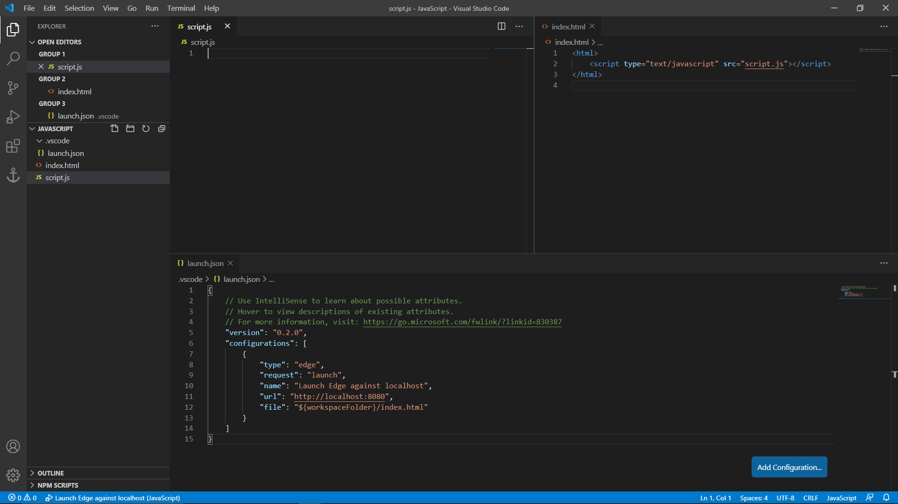

# **자바스크립트: 소개**

자바스크립트(JavaScript)는 절차형 웹프로그래밍 언어로 HTML & CSS 웹디자인 언어와 함께 사용되어, 상호작용 가능한 동적 웹페이지를 만드는데 기여한다. 현재 자바스크립트의 용도는 데이터 처리 및 어플리케이션 제작 등 범위가 넓어지고 있다.

## 인터프리트 언어

프로그래밍 언어를 실행하는 방법에는 크게 두 가지로 나뉘어진다: 컴파일 언어와 인터프리트 언어이다.

프로그래밍 언어의 소스 코드는 영문으로 작성되어 있어 컴퓨터가 실행하기 위해서는 이진코드와 같은 컴퓨터 언어로 번역을 해야 한다. 이러한 역할을 하는 것이 컴파일러(compiler)라고 하며, 대표적인 컴파일 언어로는 C/C++이 있다. 반면 인터프리터(interpreter)는 소스 코드를 컴퓨터 언어로 번역하지 않고 곧바로 실행하나, 컴파일 언어보다 실행 속도가 느리다는 치명적인 단점이 존재한다.

자바스크립트는 인터프리트 언어이며, 인터프리터가 있는 한 하나의 소스 코드를 서로 다른 시스템에서 동일하게 실행할 수 있는 장점을 가진다(일명 크로스 플랫폼; cross platform).

## HTML 웹프로그래밍 언어

HTML(Hypertext Markup Language) 선언형 웹디자인 프로그래밍 언어는 정적 웹사이트를 생성하는데 흔히 사용되는 언어이다. 여기서 정적 웹사이트(static website)란 모든 웹페이지 방문자들에게 동일한 콘텐츠를 보여주는 것을 의미한다. 즉, HTML 언어만으로는 웹사이트에 다양한 기능을 구현할 수가 없다.

하지만 자바스크립트를 배우기 전에 HTML을 공부하기 적극 추천한다: HTML은 매우 쉬운 언어이며, 자바스크립트만으로 웹페이지를 만들 수 있으나 상당히 불편하고 비효율적인 작업이다. HTML으로 우선적으로 디자인을 마치고 자바스크립트로 기능을 추가하는 방법이 가장 보편적이다.

아래는 HTML 언어의 사용 예시이다.

```html
<html>
    <!-- HTML 주석 -->
    <body style="text-align: center">
        <span class="example">Hello World!</span>
    </body>
</html>
```

### CSS 스크립팅 언어

CSS(Cascade Style Sheets) 스크립팅 언어는 HTML을 보조하는 언어로, HTML에 사용되는 구성요소(예를 들어 태크, 아이디, 클래스 등)의 디자인 내용만을 담고 있다. HTML을 공부하면 CSS 또한 함께 공부할 가치가 있는 매우 간단한 언어이다.

아래는 CSS 언어의 사용 예시이다.

```css
body {
    background-color: rgb(42, 45, 46);
    border: solid 3px black;
}

.example {
    font-family: 'Consola', monospace;
    color: white;
}
```

# **자바스크립트: 실행**

자바스크립트를 실행하기 위해서는 인터넷 브라우저만 있으면 된다: 마이크로소프트 엣지(Edge), 구글 크롬(Chrome), 모질라 파이어폭스(FireFox), 애플 사파리(Safari) 등 모두 자바스크립트를 실행할 수 있다.

하지만 `.js` 파일만으로 인터넷 브라우저로 자바스크립트를 실행할 수 없으며, 실행한다 하더라도 자바스크립트 파일의 내용을 텍스트로 보여줄 뿐이다. Node.js 프로그램을 사용하면 HTML 없이 자바스크립트를 실행시킬 수 있으나, "입문자를 위한 자바스크립트 설명"이란 본질과 멀어지게 된다. 그러므로 본 장에서는 브라우저를 활용한 간단한 자바스크립트 작업 환경을 구축하는 방법을 설명한다.

## 비주얼 스튜디오 코드
[비주얼 스튜디오 코드](https://code.visualstudio.com/download)(Visual Studio Code; VS Code)는 마이크로소프트에서 개발한 무료 소스 코드 편집기이다. 특히 마이크로소프트에서 타입스크립트(TypeScript)라는 자바스크립트의 상위호환 언어 사용을 적극적으로 권장하므로써 자바스크립트 개발 환경에도 같이 신경쓰고 있다.

VS Code에서 자바스크립트 작업 환경을 구축하기 위해서는 최소 세 가지의 파일이 필요하다: 자바스크립트, HTML, 그리고 JSON 파일이다.

### `script.js` 파일

자바스크립트 파일은 당연히 현재 배우고자 하는 자바스크립트 언어를 작성하는 파일이다. 자바스크립트 파일명은 `script.js`라고 가정한다.

### `index.html` 파일

HTML 파일을 통해 자바스크립트를 실행할 수 있는 런타임 환경을 제공한다. 자바스크립트 파일명이 `script.js`일 경우, 아래와 같이 HTML 파일을 생성하고 파일명은 간편하게 `index.html`로 지정한다.

```html
<html>
    <!-- 자바스크립트 불러오기 -->
    <script type="text/javascript" src="script.js"></script>
</html>
```

### `.vscode/launch.json` 파일

VS Code에서 자바스크립트를 실행하기 위해서는 확장도구가 필요하다: `F1` 키를 눌러 `Extensions: Install Extensions`을 입력한다. 선호하는 브라우저에 따라 왼쪽에 나타난 검색창에 다음과 같이 검색한다.

* 구글 크롬: `Debugger for Chrome`
* 모질라 파이어폭스: `Debugger for FireFox`
* 마이크로소프트 엣지: `Debugger for Microsoft Edge`

선택한 후, 초록색 `Install` 버튼을 눌러 설치한다. 이후 `F5` 버튼을 누르면 자바스크립트를 선택한 브라우저로 실행하는 옵션을 볼 수 있으며, 클릭할 시 자동적으로 `.vscode/launch.json` 파일이 생성된다.

해당 파일에 설정을 추가해야 한다: `"file": "${workspaceFolder}/index.html"`. 여기서 설정을 추가할 시 쉼표(`,`)를 잊지말고 넣어주어야 한다. 아래는 브라우저를 마이크로소프트 엣지로 선택하였을 때의 예시이다.

```json
    "version": "0.2.0",
    "configurations": [
        {
            "type": "edge",
            "request": "launch",
            "name": "Launch Edge against localhost",
            "url": "http://localhost:8080",
            "file": "${workspaceFolder}/index.html"
        }
    ]
}
```

종합적으로 아래와 같이 파일들이 준비되어야 한다.

<div style="background-color:white; border:solid 3px #808e95; text-align: center; border-radius:0.5em;"></div><center style="font-weight: bold;">그림 1. VS Code의 자바스크립트 작업 환경.</center>

현 상태에서 `F5` 버튼을 누르면 자바스크립트를 디벙깅 모드로 실행, 그리고 `CTRL+F5` 버튼을 누르면 디버깅 없이 실행된다. 여기서 디버깅 모드란, 코드를 단계별로 실행하여 데이터가 어떻게 변하는지 확인할 수 있도록 한다.

# **자바스크립트: 기초**

각 프로그래밍 언어마다 준수되어야 할 규칙과 기반이 되는 데이터들이 존재한다. 이를 어길 시에는 프로그램에 오류가 발생하거나 정상적인 동작을 보장할 수 없다.  실질적인 프로그래밍에 있어, 본 장에서는 자바스크립트 프로그램 코딩에 기초적인 정보 제공을 목표로 한다.

여기서 본 문서는 ECMAScript 2015, 일명 ES6 스크립트 언어 표준에서부터 소개된 자바스크립트 데이터 및 구문을 함께 설명한다.

## `<script>` 태그

HTML에서 자바스크립트를 사용하기 위해서는 `<script>` 태그가 반드시 필요하다. `<script>` 태그 안에 자바스크립트를 작성할 수 있으며, 혹은 외부 자바스크립트 파일을 불러올 수 있다.

```html
<!-- 자바스크립트 작성하기 -->
<script type="text/javascript">
	Write JavaScript Here... 
</script>

<!-- 자바스크립트 불러오기 -->
<script type="text/javascript" src="path/to/script.js"></script>
```

## 주석

주석(comment)은 프로그래밍에 있어 실행되지 않는 부분이며, 흔히 어떠한 정보를 간략히 스크립트 내에 입력하는데 사용된다. 자바스크립트에는 두 가지의 주석이 존재하며, 이들은 각각 "한줄 주석"과 "블록 주석"이라 부른다.

* **한줄 주석**
    : 코드 한 줄을 차지하는 주석이며, 두 개의 슬래시(`//`)로 표시된다.
* **블록 주석**
    : 코드 여러 줄을 차지하는 주석이며, 한 쌍의 슬래시와 별표(`/* */`)로 표시된다.

```js
/*
블록 주석:
코드 여러 줄을 차지하는 주석이다.
*/  
// 한줄 주석: 코드 한 줄을 차지하는 주석이다.
```

## 출력

자바스크립트는 두 가지 종류의 출력이 존재한다:

| 출력             | 예시                         | 설명                                                  |
|------------------ | ------------------------------ | ------------------------------------------------------------ |
| `document.write()` | `document.write("text")` | HTML에 직접 텍스트를 삽입한다; HTML 콘텐츠에 영향을 주기 때문에 권장되지 않는다. |
| `console.log()`    | `console.log("text")`    | 데이터를 터미널로 출력한다; 브라우저에서 `F12` 버튼을 눌러 "Console" 탭을 확인한다.                                  |

하나의 출력 함수에서 두 가지 이상의 데이터를 한꺼번에 출력하는 데 두 가지의 방법이 존재하며, 이들의 출력 방식은 약간 다르다.

1. 쉼표(`,`)를 사용하여 연속적으로 데이터를 나열할 수 있으나, 쉼표에는 항상 공백이 놓여진다.

    ```js
    console.log("Hello World!", 1);
    ```
    ```
    Hello World! 1
    ```

2. 더하기 기호(`+`)를 문자열 연결에 사용하면 사이에 공백이 생기지 않는다. 그러나 문자열 자료형이 아닌 데이터는 우선 문자열로 변환해야 한다.

    ```js
    console.log("Hello World!", 1);
    ```
    ```
    Hello World!1
    ```

## 팝업창

자바스크립트에는 HTML과 함께 사용할 수 있는 세 가지 종류의 팝업창(pop-up box)가 존재한다:

| 팝업창      | 예시                         | 설명                                                  |
| ----------- | ------------------------------ | ------------------------------------------------------------ |
| `alert()`   | `alert("설명")`            | `"설명"` 텍스트와 함께 OK 버튼이 있는 팝업창이다.        |
| `prompt()`  | `prompt("설명","데이터")` | A pop-up box with `"설명"` 텍스트와 함께 `데이터`가 기본값으로 입력된 입력창이 있는 팝업창이다. |
| `confirm()` | `confirm("설명")`          | A pop-up box with `"설명"` 텍스트와 함께 OK 및 Cancel 버튼이 있어 논리값 `True` 혹은 `False`를 반환한다. |

## 식별자

식별자(identifier)는 프로그래밍을 구성하는 데이터(일명 구성체; construct)를 구별하기 위해 사용되는 명칭이다. 다시 말해, 식별자는 개발자가 데이터에 직접 붙여준 이름이다. 자바스크립트 언어에서 식별자를 선정하는데 아래의 규칙을 지켜야 한다.

- 오직 영문, 숫자, 밑줄(`_`), 그리고 달러 표시(`$`)만 허용된다.
- 첫 문자는 숫자로 시작할 수 없다.
- 산술 및 논리 연산자, 특수 문자, 그리고 공백은 사용할 수 없다.
- 예약어 및 키워드는 식별자로 사용할 수 없다.

## 변수

변수(variable)는 할당 기호(`=`)를 사용하여 데이터를 할당할 수 있는 저장공간이다. ECMAScript 2015 이후부터, 자바스크립트에는 세 가지 종류의 변수가 존재한다.

| 변수 | 예시            | 설명                       |
| -------- | ------------------ | --------------------------------- |
| `var`    | `var x = value;`   | 전역 변수                  |
| `let`    | `let x = value;`   | 지역 변수 |
| `const`  | `const x = value;` | 변경불가 전역/지역 변수      |

한 번 선언된 변수는 이후 `var`, `let`, 혹은 `const` 키워드를 사용하지 않고 호출된다. 자바스크립트의 변수는 데이터 종류와 상관없이 새로운 데이터를 언제든지 할당받을 수 있다.

### 지역 변수 & 전역 변수

자바스크립트에는 전역 변수와 지역 변수라는 개념이 존재한다.

* **지역 변수(local variable)**는 함수(function)와 같은 코드 블록 내부에서 정의된 변수이다. 지역 변수에 저장된 데이터는 코드 블록 밖에서는 소멸되므로 외부에서 사용할 수 없다. 그러므로 지역 변수는 외부에서 정의된 변수의 이름을 가질 수 있다.

    ```js
    /* "let" 지역 변수 */
    let y = "Outer Scope";
    if (true) {
        let y = "Inner Scope";
        console.log(y);
    }
    console.log(y);
    ```
    ```
    Outer Scope
    Inner Scope
    ```
    
* **전역 변수(global variable)**는 스크립트 내에서 어떠한 코드 블록에도 속하지 않은 외부에 정의된 변수이다. 단, 변수의 충돌로 인한 예상치 못한 결과와 오류를 방지하기 위해 가급적 전역 변수의 사용은 피하도록 한다.

    ```js
    /* "var" 전역 변수 */
    var x = 123.456;
    console.log(x);
    
    x = "This is a string.";
    console.log(x);
    ```
    ```
    123.456
    This is a string
    ```

### 상수
상수(constant)는 한 번 데이터를 할당한 후 변경할 수 없는 특별한 변수이다. 상수는 어디서 선언되었는지에 따라 전역 변수인지 지역 변수인지 나뉘어진다: 만일 코드 블록 외에 선언되었으면 전역 변수가 되며, 코드 블록 내에 선언되었으면 지역 변수가 된다.

## **자료형**

파이썬은 기본적으로 세 가지의 데이터 유형이 존재하며, 이들은 숫자, 논리, 그리고 문자열 자료형(data type)으로 구분된다.

### 숫자 자료형

일반적으로 C/C++, 파이썬, 그리고 자바와 같은 프로그래밍 언어는 두 개 이상의 숫자 자료형을 가진다 (예를 들어 `int`, `float` 등). 하지만 자바스크립트는 `number` 자료형이란 오로지 하나의 숫자 자료형을 가지며, 이는 정수와 실수 모두 표현할 수 있다.

자바스크립트에는 다음과 같은 숫자 자료형의 산술 연산이 존재한다. 

| 이름  | 연산자 | 설명                      |
|-----|:---:|-------------------------|
| 덧셈  | `+` | -                       |
| 뺄셈  | `-` | -                       |
| 곱셈  | `*` | -                       |
| 나눗셈 | `/` | -                       |
| 나머지 | `%` | 나눗셈에서 몫을 제외한 나머지만 도출한다. |

할당 연산자(assignment operator)는 숫자 자료형에 사용되는 또다른 연산자이다. 이에 대한 설명은 아래의 도표를 참고한다.

| 연산자 | 예시  | 동일  |
|:--------:| -------- | ----------- |
| `+=`     | `x += 1` | `x = x + 1` |
| `-=`     | `x -= 1` | `x = x - 1` |
| `*=`     | `x *= 1` | `x = x * 1` |
| `/=`     | `x /= 1` | `x = x / 1` |
| `%=`     | `x %= 1` | `x = x % 1` |

비록 할당 연산자는 아니지만, 이와 유사한 증감 연산자(increment & decrement)는 C 기반 언어에서 다음과 같은 표현식을 의미한다.

| 연산자    | 예시   | 설명       |
| ----------- | --------- | ----------------- |
| `++` 접두사 | `x = y++` | `x = y; y = y+1;` |
| `++` 접미사 | `x = ++y` | `y = y+1; x = y;` |
| `--` 접두사 | `x = y--` | `x = y; y = y-1;` |
| `--` 접미사 | `x = --y` | `y = y-1; x = y;` |

### 논리 자료형
논리 자료형(Boolean data type)은 문장이 참인지 거짓인지 판별하는 논리 조건에 사용되는 데이터 유형이다.

| 값             | 이름            | 설명                          |
|:--------------:|:---------------:| ----------------------------- |
| `True`  | 논리적 참  | 논리가 참일 때 반환된다.  |
| `False` | 논리적 거짓 | 논리가 거짓일 때 반환된다. |

논리값은 숫자 자료형으로도 표현이 가능하다. 0이 아닌 양의 정수는 `True`로 표현되며, 반대로 `False`는 오로지 숫자 0으로만 표현된다.

비교 연산자는 두 개의 데이터 관계를 비교하는데 사용되며, 조건이 참인지 거짓인지 여부에 따라 해당하는 논리값을 반환한다.

| 미만 | 이하 | 동일 | 일치 | 상이 | 이상 | 초과 |
|:----:|:----:|:----:|:---:|:----:|:----:|:----:|
| `<`  | `<=` | `==` | `===` | `!=` | `>=` | `>`  |

여기서 `===` 연산자는 `==` 연산자보다 더욱 엄격하며, 값의 일치 여부와 자료형의 동일성도 함께 확인하다.

논리 연산자(logical operator)에는 논리곱, 논리합, 그리고 보수가 있다. 논리 연산자를 사용할 시, `true`와 `false` 논리값을 각각 이진수의 1과 0으로 간주하면 된다.

| 연산자 | 논리 | 설명                                                |
|:--------:| ----- | ---------------------------------------------------------- |
| `&&`     | 논리곱   | 모든 인수가 `true`이면 `true`이고, 그렇지 않으면 `false`이다.    |
| `||`     | 논리합    | 하나 이상의 인수가 `true`이면 `true`이고, 그렇지 않으면 `false`이다. |
| `!`      | 보수   | `true`를 `false`로 변경 혹은 `false`를 `true`로 변경한다.                   |

### 문자열 자료형
문자열 자료형(string data type)은 한 쌍의 작은 따옴표(`''`) 또는 큰 따옴표(`""`)로 구별되는 텍스트 데이터이다. 문자열 데이터에 따옴표를 넣을 시, 해당 따옴표 앞에 백슬래시(`\`)를 배치하여 문자열이 도중이 끊기는 문제를 방지한다.

```js
/* 문자열 작성의 부적절한 예시와 적절한 예시의 비교. */
console.log('Where's my "Cat in the Hat" book?');
console.log('Where\'s my "Cat in the Hat" book?');
```

```
Where
Where's my "Cat in the Hat" book?
```

문자열 데이터 줄바꿈은 탈출 문자 중 하나인 `\n`을 직접 삽입하여 구현할 수 있으며, 아래의 예시는 줄바꿈 사용 예시를 보여준다.

```js
console.log("Hello\nWorld!");
```

```
Hello
World!
```

이전 자바스크립트 구문은 데이터를 문자열에 넣기 위해 문자열을 나누어 더하기 기호(`+`)를 매번 넣어야 하는 불편함이 있었다. 하지만 ES6 이후부터 템플릿 리터럴(template literal)이 소개되면서 `${}` 연산자만으로 원하는 위치에 문자열을 나눌 필요없이 데이터 삽입이 가능해졌다.

```js
/* ES6 이전 */
let x_new = 6;
let x = "This is before ES" + x_new + "!";
console.log(x);

/* ES6 이후 */
let y_new = 6;
let y = `This is after ES${y_new}!`
```

### 탈출 문자
탈출 문자(escape character)는 백슬래시 기호(`\`)를 사용하며, 문자열로부터 탈출하여 텍스트 데이터 내에서 특정 연산을 수행하도록 한다. 아래는 탈출 문자 중에서 흔히 사용되는 줄바꿈(`\n`)이다.

| 구문 | 설명           |
|:----:| -------------- |
| `\n` | 줄바꿈       |
| `\t` | 탭 |
| `\\` | 백슬래시      |
| `\b` | 백스페이스      |
| `\'` | 작은 따옴표    |
| `\"` | 큰 따옴표      |

# **자바스크립트: 조건 및 루프**

조건문 및 반복문(혹은 루프문)은 프로그래밍에 가장 흔히 사용되는 코드 문장(statement) 중 하나이다. 여기서 문장이란, 실질적으로 무언가를 실행하는 코드를 의미한다. 본 장에서는 자바스크립트 프로그래밍의 조건에 따라 실행하는 조건문(conditional statement)과 반복적으로 실행하는 반복문(loop statement)을 소개한다.

## `if` 조건문
`if` 조건문은 조건이 참일 경우 코드를 실행한다. 조건이 `True`일 때 문장이 수행되지만 그렇지 않으면 무시된다.

```js
if (condition)
{
    statements;
}

// 간략화된 문장
if (condition) statement;
```

`if` 조건문 안에 또다른 `if` 조건문을 넣을 수 있으며, 이를 *네스티드(nested)* `if` 조건문이라고 부른다. 이러한 경우, 코드 블록(`{}`)을 사용하여 두 `if` 조건문의 경계를 명확히 구별하기를 권장한다.

```js
if (condition)
{
    if (condtion)
    { 
        statements;
    } 
}
```

### `else` 조건문
`else` 조건문은 단독으로 사용될 수 없으며 반드시 `if` 조건문 이후에 사용되어야 한다. 실행문에는 조건부가 `false`로 평가되었을 경우 호출되는 코드가 포함되어 있다.

```js
if (condition)
{
    statements;
}
else
{
    statements; 
}
```

### `else if` 조건문
`else if` 조건문은 `else`와 `if` 조건문의 조합으로 첫 번째 조건이 거짓일 경우, 첫 번째 조건과 다른 새로운 조건을 제시한다.

```js
if (condition)
{
    statements;
}
else if (condition)
{
    statements;
}
else
{
    statements;
}
```

하지만 우선 소개된 `else`-`if` 연쇄 조건문은 두 조건부가 함께 사용되는 점과 비교해 `else if` 조건문은 여전히 하나의 조건부에서 처리되므로, 이 둘은 구체적으로 서로 다른 조건문임을 명시해야 한다.

### 조건 연산자
조건문은 아래와 같이 조건 연산자(ternary operator; `?:`)를 사용하여 간략히 표현될 수 있다.

```js
condition ? true_return : false_return;
```

조건 연산자는 영어로 *ternary operator*로, 이는 세 가지 인수를 사용하는 것을 의미한다. 조건 연산자는 가독성을 감소시키므로 과용해서는 안되지만 변수 할당에는 유용하다.

## `switch` 조건문
`switch` 조건문은 건네받은 데이터를 `case` 키워드에서 제공하는 값과 일치하는지 비교하며, 참일 경우 코드를 실행한다. 참 조건 이후, 더 이상의 조건 평가를 방지하기 위해 모든 `case` 키워드에는 `break`라는 탈출문이 필요하다.

모든 경우에 조건이 부합하지 않을 시, `default` 키워드에 연동된 문장이 실행되며, `switch` 조건문에는 반드시 있어야 한다. 그러나 `case` 키워드와 달리 `break` 탈출문을 필요로 하지 않는다.

```js
switch ( argument ) {
    case value_1:
        statements;
        break;
    case value_2:
        statements;
        break;
    default:
        statements;
}
```

`switch` 조건문은 복수의 경우가 하나의 실행문을 공유할 수 있다.

```js
switch (argument)
{
    case value1:
    default:
        statements;
        break;
    case value2:
    case value3:
        statements;
        break;
    case value4:
        statements;
        break;
}
```

### `break` 문
`break` 문(일명 탈출문)은 반복이 완료되기 전에 루프를 조기 종료하는데 사용된다. 루프 내부에서 탈출문을 마주치는 즉시 현재 루프에서 탈출하지만 그 바깥 루프로부터는 탈출하지 않는다.

### `continue` 문
`continue` 문은 반복문 내에서 나머지 실행문을 전부 건너뛰고 다시 조건 판정부분으로 돌아가게 한다. 이는 반복문을 종료하는 `break` 문과 달리 반복문의 루프를 유지한다.

## `while` 반복문
`while` 반복문은 조건이 유지되는 한 내부 코드를 반복적으로 실행한다. 조건이 `false`임이 판정되면 반복문을 종료한다.

```js
while (condition)
{
    statements;
}

// 간략화된 문장
while (condition) statement;
```

### `do`-`while` 반복문
`do`-`while` 반복문은 `while` 반복문과 유사한다. 그러나 후자는 조건을 먼저 확인하고 문장을 실행하였으면, 전자는 문장을 우선 실행하고 조건을 확인한다.

```js
do
{
    statements
} while (condition);
```

## `for` 반복문
`for` 반복문은 정의된 지역 변수가 조건에 만족하는 한 지속적으로 반복한다. 한 번 반복할 때마다 지역 변수에는 반복문에 명시된 대로 변화가 발생하며, 일반적으로 정수형 증감을 사용한다.

```js
for (variable; condition; increment) {
    statements;
}

// 간략화된 문장
for (variable; condition; increment) statement;
```

### 범위형 `for` 반복문

ES6 표준부터 범위형 `for` 반복문 변형이 새로 소개되었으며, 조건 만족여부가 아닌 주어진 범위 내에서만 반복한다. 범위로 사용되는 데이터는 일반적으로 여러 데이터를 하나로 묶은 배열(array)을 사용한다.

`for-of` 형식의 반복문은 배열 요소들의 값을 하나씩 변수에 반환한다.

```js
for (let i of [1, 2, 3]) {
    console.log(i);
} 
```

```
1
2
3
```

한편, `for-in` 형식의 반복문은 배열 요소들의 값을 호출하는데 사용되는 이름을 하나씩 변수에 반환한다.

```js
for (let i in {a:1, b:2, c:3}) {
    console.log(i);
}
```

```
a
b
c
```

여기서 자바스크립트 언어의 배열은 차후 *자바스크립트: 이터러블* 장에서 구체적으로 설명한다.

# **자바스크립트: 이터러블**

자바스크립트는 여러 데이터를 하나의 변수에 저장하는 이터러블을 가진다. 위에서 언급된 바가 있는 배열과 문자열은 자바스크립트에 내장된 이터러블 중 하나이다. 본 장에서는 가장 흔히 사용되는 배열을 중점으로 설명할 것이다.

## 배열

배열(array)은 동일한 자료형의 데이터를 순번대로 담는 저장공간이다. 배열의 초기화는 대괄호(`[]`)를 사용하여 데이터를 순번에 맞게 배열 요소에 할당한다.

```js
/* 배열 선언 */
var arr = [value1, value2, value3];
```

배열은 `Array()` 생성자(constructor)와 괄호 안에 요소에 할당될 데이터를 입력하므로써 생성 및 초기화될 수 있다.

```js
/* 배열 선언: Array 생성자 사용 */
var arr = new Array(value1, value2, value3);
```

`Array()` 생성자에 단 하나의 정수만을 입력하여 크기만 존재하는 빈 배열을 생성할 수 있다. 하지만 자바스크립트의 배열은 항상 동적, 즉 크기가 언제든지 변경할 수 있어 무의미한 절차이다.

```js
/* 크기 3의 빈 배열 선언 */
var arr1 = new Array(3);

/* 크기 0의 빈 배열 선언 */
var arr2 = new Array();
var arr3 = [];
```

### 전개 연산자

전개 연산자(spread operator; `...`)는 배열의 접두부에 위치시켜, 하나의 배열을 출력하는 게 아닌 배열 내의 요소들을 전개하여 한꺼번에 출력한다.

```js
let arr = [value1, value2, value3];

console.log(arr);
console.log(...arr);
```

```
Array [value1, value2, value3]
value1, value2, value3
```

또한 전개 연산자는 나머지 데이터를 모두 할당받는 데에도 사용되며, 대표적인 예시로는 아래의 *베열 구조 분해*의 예시 코드를 참고한다.

### 배열 구조 분해

배열의 구조 분해(destructuring array)는 배열의 각 요소마다 변수에 할당하는 작업을 의미한다. 

```js
let arr = [value1, value2, value3, value4, value5];

/* 배열의 구조 분해 할당 */
let [variable1, , ...variable3] = arr;

// 그러므로...
console.log(variable1);
console.log(variable3);
```

```
value1
Array [value3, value4, value5]
```

## 연관 배열

자바스크립트는 배열의 값을 정수가 아닌 문자열로 호출하는 연관 배열을 공식적으로 지원하지 않는다. 방법은 존재하나 권장되지는 않으며, 오히려 객체를 사용할 것을 권고한다.

```js
var arr = [];

/* 비록 배열을 선언하였으나, 아래의 코드로 인해 배열이 아닌 일반 객체로 변환 */
arr['property1'] = value1;
arr['proprety2'] = value2;

// 그러므로 배열 정보나 함수를 더이상 사용할 수 없다!
console.log(arr.length)
```
```
0
```

# **자바스크립트: 함수**
개발자가 직접 함수를 제작하고 필요할 때마다 사용하여 효율성을 높일 수 있는데, 이러한 프로그래밍 기법을 *함수형 프로그래밍(functional programming)*이라고 한다. 본 장은 자바스크립트 언어에서 사용자 정의 함수의 생성 및 사용 방법에 대하여 소개한다.

## 함수
함수(function)는 독립적인 코드 블록으로써 데이터를 처리하며, 재사용이 가능하고 호출 시 처리된 데이터를 보여주어 유동적인 프로그램 코딩을 가능하게 한다.

함수는 이름 뒤에 소괄호가 있는 `function()` 형식으로 구별된다.

```js
/* ES6 이전 */
function functionName() {
	console.log(4)
}

/* ES6 이후 */
const functionName = () => {
    console.log(4);
}

// 함수 호출
functionName();
```

```
4
```

ES6 구문은 특히 한줄 함수를 생성하는데 매우 유용하게 사용된다.

```js
/* 한 줄만 사용하여 함수 정의 (ES6). */
const functionName = (arg) => console.log(arg);
functionName(value1);

/* 배열 요소 열거에 적용 (ES6). */
let arr = [1, 2, 3, 4];
arr.forEach((arg) => console.log(arg*2) );
```

### 매개변수 & 전달인자

다음은 함수에 대해 논의할 때 중요하게 언급되는 매개변수와 전달인자의 차이에 대하여 설명한다.

* **전달인자 (argument)**
    : 전달인자, 혹은 간략하게 "인자"는 함수로 전달되는 데이터이다.
* **매개변수 (parameter)**
    : 매개변수는 전달인자를 할당받는 함수 내의 지역 변수이다. 그러므로 매개변수는 함수 외부에서 호출이 불가능하다. 매개변수의 정의은 함수의 소괄호(`()`) 내에서 이루어진다.

매개변수와 전달인자는 개념적으로 다른 존재이지만, 동일한 데이터를 가지고 있는 관계로 흔히 두 용어는 혼용되어 사용하는 경우가 많다.

| 연산자 |    구문    | 설명                                                 |
| :------: | :----------: | ------------------------------------------------------------ |
|   `=`    | `arg=value` | 매개변수에 전달인자가 없으면 기본값 `value`가 대신 반환된다. 반드시 일반 매개변수 뒤에 위치해야 한다. |

아래의 예제는 함수의 매개변수와 전달인자가 어떻게 동작하는지 보여준다.

```js
/* ES6 이전 */
function functionName(arg1 = value1, arg2 = value2) {
    console.log(arg1 + arg2);
}

/* ES6 이후 */
const functionName = (arg1 = value1, arg2 = value2) => {
    console.log(arg1 + arg2);
}

// 함수 호출
functionName(2,3);
```

```
5
```

### 나머지 매개변수

나머지 매개변수(rest parameter)는 전개 연산자(`...`)를 가지는 매개변수로, 보다 더 많은 전달인자들을 배열로 받아낸다. 만일 추가 전달인자가 없으면 나머지 매개변수는 단순히 빈 배열인 상태가 된다.

```js
/* 나머지 매개변수를 가지는 함수 */
function functionName(arg, ...rest) {
	for(let variable of rest) {
    	statements;
    }
} 
```

### `return` 반환문

`return` 반환문은 함수로부터 데이터를 반환하는 함수 전용 문장이다. 반환문이 실행되면 코드가 남아 있음에도 불구하고 함수는 즉시 종료된다. 함수는 반환문을 반드시 필요로 하지 않으며, 이러한 경우에는 `undefined` 값이 반환되어 변수에 전달되거나 콘솔창에 출력되어 나타난다. 

```js
/* ES6 이전 */
function functionName(arg1 = value1, arg2 = value2) {
    return arg1 + arg2;
}

/* ES6 이후 */
const functionName = (arg1 = value1, arg2 = value2) => {
    return arg1 + arg2;
}

console.log(functionName(2,3));
```

```
5
```

# **자바스크립트: 객체**

## **Object**

Object in JavaScript is a group of unordered list of related data: every object can have its own exclusive properties and bounded-functions, called method. Accessing properties and methods are done by syntax of `object.property` and `object.method()` respectively.

```js
/* INTIALIZATION OF AN OBJECT. */
var objectName = {
    // Properties
	property1: value1,
    property2: value2,
    
    // Methods
    method1: ext_functionName,
    method2: function (param1) {
    	// statements for method.
    }
};


/* INITIALIZATION OF AN OBJECT (ES6). */
var property1 = value1;
var property2 = value2;

var objectName = {
    // Properties initialized from variable.
    property1,
    property2,
    property2 = value3;		// Overwrites previous value of "properties2".
    
    // Methods simplified.
    method1() {
        statements;
    }
};
```

Upon calling external function `ext_functionName()` do not requires parenthesis `()` but just the name.

There are two ways to access the properties of the object:

```js
objectName.property
objectName['property']
```

### Properties & Methods

Below is a difference between properties and methods:

* **Property**: a named value stored inside an object.
* **Method**: an object-dependent function which cannot be called without an object.

### Destructuring Object

Destructuring object means assigning each property value of the object to separate individual variables. However, the name of the variables should be same as the name of the properties.

```js
let objectName = {propertyName1 = value1, propertyName2 = value2};

// DESTRUCTURING ARRAY
let {propertyName1, propertyName2} = objectName;

// RESULT
console.log(propertyName1);
console.log(propertyName2);
```

```js
// DESTRUCTURING ARRAY: ALTERNATIVE 1
let {propertyName1, propertyName2} = {propertyName1 = value1, propertyName2 = value2};
```

```js
// DESTRUCTURING ARRAY: ALTERNATIVE 2
let propertyName1, propertyName2;
({propertyName1, propertyName2} = {propertyName1 = value1, propertyName2 = value2});
```

```
value1
value2
```

To change the variable name to something else, simply place a new variable name after colon of the property name.

```js
let objectName = {propertyName1 = value1, propertyName2 = value2};

// DESTRUCTURING ARRAY WITH NEW VARIABLE NAME
let {propertyName1: variableName1, propertyName2: variableName2} = objectName;

// RESULT
console.log(variableName1);
console.log(variableName2);
```

```
value1
value2
```


### Computed Property Names

Starting from ES6, the name of properties can be defined as a form of expression just like general expression used in JavaScript coding. The expression for the property name should be just inside a square bracket `[]`. 

```js
/* COMPUTED PROPERTY NAMES. */
let property1 = propertyName1;
let property2 = propertyName2;

let objectName = {
    [property1]: value1;
    [`computed_${property2}`]: value2;
};
```

### Sourcing Multiple Objects

Creating a new object by merging multiple sources of different objects using `Object.assign()`. Order of the sources in the method matters since the properties can overwrite the previous objects.

```js
// OBJECT SOURCE 1
let objectName1 = {
    property1: value11;
    property2: value12;
};

// OBJECT SOURCE 2
let objectName2 = {
    property2: value22;
    property3: value23;
};

// CREATE "objectName3" OBJECT SOURCING FROM "objectName1" AND "objectName2".
let objectName3 = Object.assign({property4: value34},objectName1,objectName2);
console.log(objectName3.property1);
console.log(objectName3.property2);		// "objectName1" overwritten by "objectName2".
console.log(objectName3.property3);
console.log(objectName3.property4);
```

```
value11
value22
value23
value34
```

...where `{}` represents pre-existing properties of `objectName3` and this too can be overwritten by either `objectName1` and `objectName2`.

Because this is creating a new object and not an assignment of existing object to the variable, changing the value of the properties does not affect the sourced objects.

```js
/* ASSIGNMENT OF OBJECT. */
let objectName1 = {
    property1: value1;
    property2: value2;
};

let objectName2 = objectName1;
objectName2.property = value3;

console.log(objectName1.property1);
console.log(objectName2.property1);


/* DUPLICATE USING OBJECT.ASSIGN() METHOD. */
let objectName1 = {
    property1: value1;
    property2: value2;
};

let objectName2 = Object.assign({},objectName1);
objectName2.property1 = value3;
// ALTERNATIVE: let objectName2 = Object.assign({}, objectName1, {property1: value3});

console.log(objectName1.property1);
console.log(objectName2.property1);
```

```
/* ASSIGNMENT OF OBJECT. */
value3
value3
/* DUPLICATE USING OBJECT.ASSIGN() METHOD. */
value1
value3
```

### Spread Operator in Object

Spread operator in object will spread its properties and its value in a format of iterator. Copying this iterator to other objects will eventually be same as cloning and even merging the objects as one.

```js
const objectName1 = {property1: value11, property2: value12};
const objectName2 = {property1: value21, property3: value23};

// SPREAD OPERATOR USED TO CLONE AND MERGE OBJECT(S) VIA ITERATOR(S).
const clonedObject = {...objectName1};
const mergedObject = {...objectName1, ...objectName2};

// clonedObject = {property1: value11, property2: value12};
// mergedObject = {property1: value21, property2: value12, property3: value23};
```

However, it is impossible to spread the object to show the list of properties and values using the print function such as `console.log()` since the iterator from an object is non-callable.


## Object Type

Object type is used to create multiple objects of the same kind, using constructor function. This concept is very similar to the concept of "class" in other programming language such as C++ and Python, but JavaScript too have "class" starting from ES6.

```js
/* DEFINITION of an object type by constructor function */
function className(param1, param2) {
    // Properties
	this.property1 = param1;
 	this.property2 = param2;
    
    // Methods
    this.method1 = ext_functionName;
    this.method2 = function (param3) {
    	// statements for method.
    }
}

/* DECLARATION of a new object using object type. */
var variableName = new className(argument1, argument2);
```

Upon calling external function `ext_functionName()` do not requires parenthesis `()` but just the name.

### `this` keyword

`this` keyword points to (represents) the current object.


## **Classes**

Class is used to create multiple objects of the same kind, using constructor method.

```js
// CLASS DEFINITION
class className {
	constructor(param1, param2){
        this.property1 = param1;
    	this.property2 = param2;
    }
    // PROTOTYPE METHOD: ACCESSABLE BY OBJECT OF THE CLASS.
    method1(param3) {
    	statements;
    }
    // STATIC METHOD: CANNOT BE ACCESSED BY OBJECT BUT REQUIRES CLASS ITSELF.
    static method2(objectParameter) {
    	statements;
    }
    // SETTER INTIALIZE AND COMPUTE THE VALUES FOR GETTER.
    set method3(param4) {
    	statement;
    }
    // GETTER RETURNS WHAT IS SET BY SETTER METHOD.
    get method3() {
    	return statement;
    }
}

// CLASS DECLARATION
const objectName = new className(value1, value2);
console.log(objectName.method1());			// PROTOTYPE METHOD.
console.log(className.method2(objectName));	// STATIC METHOD.
console.log(objectName.method3(value4));	// GETTER DOES NOT NEED PARENTHESIS.
```

There is an alternative way to declare new object in a single expression.

```js
// COMBINATION OF (UNNAMED) DEFINITION AND DECLARATION.
const objectName = class {
	constructor(param1, param2){
        this.property1 = param1;
    	this.property2 = param2;
    }
}
```

The difference between the object type is that it uses constructor method that is made into the class rather than using the function as constructor.

### 상속

Class inheritance is done using `extends` keyword and its properties' value and methods can be accessed using `super` keyword.

```js
// DEFINITION OF THE PARENT CLASS.
class parentClass {
	constructor(param1, param2) {
    	this.property1 = param1;
        this.property2 = param2;
    }
    method1() {
    	statements;
    }
}

// DEFITION OF THE CHILD CLASS INHERITED FROM PARENT CLASS.
class childClass extends parentClass {
    
    // SUPER USED IN CONSTRUCTOR OF THE CHILD CLASS CALLS THE PARAMETER FROM PARENT CLASS.
    constructor(param1, param2) {
    	super(param1, param2)
    }
    method2() {
    	statements;
    }
	method3() {
        // SUPER USED WITH ITS METHOD CALLS THE METHOD OF THE PARENT CLASS.
        super.method1();
    	statements;
    }
}
```

## List of Objects

### `Math` Object

`Math` is a pre-defined object useful for mathematical calculation.

| PROPERTY | EXAMPLE       | DESCRIPTION                                               |
| -------- | ------------- | --------------------------------------------------------- |
| `E`      | `Math.E`      | Euler's constant ($\varepsilon$).                         |
| `PI`     | `Math.PI`     | Constant Pi ($\pi$).                                      |
| `LN2`    | `Math.LN2`    | Natural log of the value 2 ($\ln 2$).                     |
| `LOG10E` | `Math.LOG10E` | The base 10 log of Euler's constant ($\log \varepsilon$). |

The object also provides methods for the calculation.

| METHOD     | EXAMPLE           | DESCRIPTION                       |
| ---------- | ----------------- | --------------------------------- |
| `abs()`    | `math.abs(-3)`    | Absolute value.                   |
| `sqrt()`   | `math.sqrt(36)`   | Square root.                      |
| `power()`  | `math.power(x,y)` | Value of `x` to the power of `y`. |
| `random()` | `math.random()`   | Random number between 0 and 1.    |

### `Map` Object

An object to hold key and its corresponding value, just like a [dictionary](PRGMING_Python.md#**PYTHON: ITERABLE OBJECT**) iterable object in Python.

```js
let mapObject = new Map([[key1, value1], [key2, value2]]);
```

Map can take any iterable that is comprised of an array. While the key is a symbol or a string, its value can be a function, object, or any primitive.

The object also provides methods as the following:

| METHOD      | EXAMPLE              | DESCRIPTION                                           |
| ----------- | -------------------- | ----------------------------------------------------- |
| `set()`     | `map.set(key,value)` | Append the key and value.                             |
| `get()`     | `map.get(key)`       | Acquire the corresponding value of the key.           |
| `has()`     | `map.has(key)`       | Return Boolean `true` if the specified key exist.     |
| `entries()` | `map.entries()`      | Return array `[key,value]` which iterates one-by-one. |

### `Set` Object

An object is unique in value where repeated value is removed, just like a set iterable object in Python.

```js
let setObject = new Set([value1, value2, value3, value1])
//  setObject = [value1, value2, value3];
```

The object also provides methods as the following:

| METHOD     | EXAMPLE             | DESCRIPTION                                         |
| ---------- | ------------------- | --------------------------------------------------- |
| `add()`    | `set.add(value)`    | Append the value.                                   |
| `delete()` | `set.delete(value)` | Delete the value.                                   |
| `has()`    | `set.has(value)`    | Return Boolean `true` if the specified value exist. |
| `value()`  | `set.value()`       | Return list of values which iterates one-by-one.    |

### `Promise` Object


```js
new Promise(function(param1, param2) {
		if(condition)
            param1(statement1); // EXECUTE STATEMENT1 ON TRUE.
    	else
            param2(statement2);	// EXECUTE STATEMENT2 ON FALSE.
	}       
);
```


### `Date` Object Type

`Date` object type can creates date-related objects which can be used for measuring time, checking date, calculating days and so forth.

```js
// Stores current date and time (non-realtime).
var dateName = new Date();
```

Passing value to its parameter can assign designated date to the variable. Following methods point to the same date but with three different approach: 

| ARGUMENT                  | EXAMPLE                                 |
| ------------------------- | --------------------------------------- |
| Milliseconds (since 1970) | `new Date(789971670000)`                |
| Date string               | `new Date("January 13, 1995 13:34:30")` |
| Y, M, D, H, M, S, MS      | `new Date(95,0,13,13,34,30,0)`          |

The object also provides methods for the calculation.

| METHOD          | EXAMPLE                  | DESCRIPTION                                               |
| --------------- | ------------------------ | --------------------------------------------------------- |
| `getFullYear()` | `dateName.getFullYear()` | Gets the year from stored date in `dateName`.             |
| `getMonth()`    | `dateName.getMonth()`    | Gets the month from stored date in `dateName`.            |
| `getDate()`     | `dateName.getDate()`     | Gets the day of the month from stored date in `dateName`. |
| `getHours()`    | `dateName.getHours()`    | Gets the hour from stored date in `dateName`.             |


# **자바스크립트: DOM**

This chapter is specifically for integration with HTML & CSS. Document object model (DOM) represents a document in a logical structure and its HTML counterpart is shown as the figure below:

<div style="background:white; border:solid 3px #808e95; text-align: center; border-radius:0.5em; padding:0.5em 0 0.5em 0;"></div>
<center style="font-weight:bold">Figure #. General DOM of the HTML.</center>

JavaScript has an ability to access and manipulate the DOM, thus can dynamically add, remove, and even modify the HTML elements. Every block of square which represents element in HTML is called **node** in DOM.

## **Node Relationship**

Each element such as `<html>`, `<head>`,  `<h1>` and et cetera is a node of the structure. Nodes have a relation with other nodes like a family: parent, child, and sibling.

| RELATIONSHIP | DESCRIPTION                                 |
| :----------: | ------------------------------------------- |
|    Parent    | Node that is directly enclosing it.         |
|    Child     | Node that is directly being enclosed by it. |
|   Sibling    | Nodes that share same parent.               |

## `document` Object

A pre-defined `document` object is used to access the nodes in DOM,. In other word, the object is a DOM counterpart of root user (superuser) in Unix-like operating system.

### Selecting Elements

Selecting which node of element to access can be done as follows:

| SYNTAX                                         | DESCRIPTION                                                  |
| ---------------------------------------------- | ------------------------------------------------------------ |
| `document.getElementById("idName")`            | Access the element ID of `idName`.                           |
| `document.getElementsByClassName("className")` | Acquire the list of element of the same `className` class in an array format. |
| `document.getElementsByTagName("tagName")`     | Acquire the list of element of the same `tagName` tag in an array format. |

Once accessed the element, you can use following properties to operates or select other elements of in relationship.

| PROPERTY          | EXAMPLE                | DESCRIPTION                                                  |
| ----------------- | ---------------------- | ------------------------------------------------------------ |
| `parentNode`      | `node.parentNode`      | Returns the parent node of an element.                       |
| `childNodes`      | `node.childNodes`      | Returns an array of an element's child nodes.                |
| `firstChild`      | `node.firstChild`      | Returns the first child node of an element.                  |
| `lasChild`        | `node.lastChild`       | Returns the last child node of an element.                   |
| `hasChildNodes`   | `node.hasChildNodes`   | Returns true if an element has any child nodes, otherwise false. |
| `nextSibling`     | `node.nextSibling`     | Returns the next node at the same tree level.                |
| `previousSibling` | `node.previousSibling` | Returns the previous node at the same tree level.            |

### Changing Elements

DOM sees each elements as an object; thus, the elements' attribute can be accessed like an object's.

```html
<!--SAMPLE HTML-->
<div>
    
    <span>Figure 1. This is an example image.</span>
</div>

<!--JAVASCRIPT-->
<script>
    /* ACQUIRING ELEMENT OF INTEREST. */
    var node = document.getElementById("sample").getChildNodes;
    
    /* CHANGING ELEMENT ATTRIBUTES. */
    node[0].src = "image_path2.png";
    node[0].style.width = "800px";
    node[0].style.height = "600px";
</script>
```

Animation is possible by changing elements' properties using  `setInterval` and `clearInterval`.

| METHOD            | EXAMPLE                          | DESCRIPTION                                          |
| ----------------- | -------------------------------- | ---------------------------------------------------- |
| `setInterval()`   | `setInterval(funcName,millisec)` | `funcName` is executed with delayed `millisec` time. |
| `clearInterval()` | `clearInterval(setInterval)`     | Disable `setInterval()` object.                      |

### Adding & Removing Elements

Adding element can be using methods below:

| METHOD             | EXAMPLE                             | DESCRIPTION                                                  |
| ------------------ | ----------------------------------- | ------------------------------------------------------------ |
| `createElement()`  | `document.createElement("tagName")` | Create a `tagName` element node not yet placed in anywhere.  |
| `createTextNode()` | `document.createTextNode("String")` | Create a `string` text node to be placed in other nodes.     |
| `appendChild()`    | `node.appendChild("newNodw")`       | Place `newNode` as its child node.                           |
| `insertBefore()`   | `node.insertBefore("node1,node2")`  | Place `node1` as a child node before already existing `node2` child. |
| `cloneNode()`      | `node.cloneNode()`                  | Clone a current node.                                        |

Removing element can be done using method below:

| METHOD          | EXAMPLE                       | DESCRIPTION                    |
| --------------- | ----------------------------- | ------------------------------ |
| `removeChild()` | `node.removeChild(childNode)` | Remove `childNode` child node. |

Replacing the element is also possible.

| METHOD           | EXAMPLE                          | DESCRIPTION                                  |
| ---------------- | -------------------------------- | -------------------------------------------- |
| `replaceChild()` | `node.replaceChild(node1,node2)` | Replace `node2` child to `node1` child node. |

```html
<!--SAMPLE HTML-->
<div>
    <p id="p1">First paragraph.</p>
    <p id="p2">Second paragraph.</p>
</div>

<!--JAVASCRIPT-->
<script>
    /* APPEND TEXT NODE TO NEWLY CREATED PARAGRAPH ELEMENT. */
    var textNode = document.createTextNode("New Text from JS.");
    var paraNode = document.createElement("p");
    paraNode.appendChild(textNode);
    
    /* APPEND PARAGRAPH ELEMENT TO DIV ELEMENT. */
    document.getElementsByTagName("div")[0].appendChild(paraNode);
</script>
```

## **Events**

JavaScript can executes code upon occurrence of events, such as click, keypress, and submit. Although events are recognized by the HTML & CSS, its function called **event handler** is defined in JavaScript.

There are several ways to execute events: one way is to inform the HTML source code what event to expect and define its handler in JavaScript.

```html
<!--SAMPLE HTML-->
<div>
    <!-- EVENT ON CLICKING. -->
    <button onclick="functionName()">CLICK</button>
</div>

<!--JAVASCRIPT-->
<script>
    /* EVENT HANDLER. */
    function functionName() {
        statements;
    }
</script>
```

More flexible and dynamic way to execute events without disturbing any HTML source code is by using DOM of JavaScript.

```html
<!--SAMPLE HTML-->
<div>
    <!-- EVENT WILL BE ADDED USING DOM. -->
    <button id="btn">CLICK</button>
</div>

<!--JAVASCRIPT-->
<script>
    /* EVENT HANDLER USING DOM. */
    var x = document.getElementById("btn");	// Searches for an element to add event.
    x.onclick = function () {				// a function without a name.
        statements;
    }
</script>
```

The `addEventListener()` method is another way to add event and its event handler using JavaScript's DOM. Beware, the name of the event is not identical from the method introduced on previous section.

| METHOD                  | EXAMPLE                                      | DESCRIPTION                                    |
| ----------------------- | -------------------------------------------- | ---------------------------------------------- |
| `addEventListener()`    | `elem.addEventListener("event",funcName)`    | Add `event` that does `funcName` in `elem`.    |
| `removeEventListener()` | `elem.removeEventListener("event,funcName")` | Remove `event` that does `funcName` in `elem`. |

```html
<!--SAMPLE HTML-->
<div>
    <!-- EVENT WILL BE ADDED USING addEventListener() METHOD. -->
    <button id="btn">CLICK</button>
</div>

<!--JAVASCRIPT-->
<script>
    /* EVENT HANDLER USING DOM. */
    var x = document.getElementById("btn");		// Searches for an element to add event.
    x.addEventListener("click", functionName);	// Add event and its handler.
    
    function functionName() {
        statements;
        
        /* REMOVE EVENT AFTER EVENT HANDLER IS EXECUTED; MAKE FUNCTION SINGLE-USE. */
        // Without the code below ables event handler to execute multiple times.
        x.removeEventListener("click", functionName);
    }
</script>
```

### Event Propagation

Event propagation defines priority order of the event handlers. For example, suppose there's an HTML source code as below:

```html
<div>
    <P>
        Hello World!
    </P>
</div>
```

When both elements have an event, which event handler should be executed first: `<div>` or `<p>`?

* **Capturing**
  : goes down the tree structure of DOM (`<div>` first, `<p>` later).
* **Bubbling**
  : goes up the tree structure of DOM (`<p>` first, `<div>` later).

Event propagation can be set using `addEventListener()` method in `useCapture` Boolean parameter (default value is `useCapture = false`, bubbling).

| METHOD               | EXAMPLE                                              | DESCRIPTION                                                  |
| -------------------- | ---------------------------------------------------- | ------------------------------------------------------------ |
| `addEventListener()` | `elem.addEventListener("event",funcName,useCapture)` | `useCapture` is a Boolean value: `true/false` for capture/bubble. |
